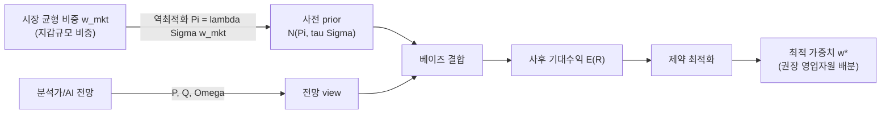

- 문서명: Black-Litterman 개념 (1) — 무엇이고 왜 BL인가
- 버전: v0.1
- 작성일: 2026-06-07
- 상태: Draft
- 작성주체: BL TF (테크니컬 라이터)
- 관련문서:
  - 📚 BL 개념 시리즈: **(1) 무엇이고 왜 BL인가** · [(2) 수학적 구조](./02-mathematical-structure.md) · [(3) 왜 조명받지 못했나·한계](./03-why-overlooked-and-limitations.md) · [(4) AI 결합·설명가능성](./04-ai-augmentation-and-explainability.md)
  - 권위 설계서(확정 수식·파라미터): [BL 모델 설계](../design/03-bl-model-design.md)
  - 프로젝트 개요: [기획 01 프로젝트 개요](../planning/01-project-overview.md) · 용어: [기획 04 용어집](../planning/04-glossary.md)

---

# Black-Litterman, 무엇이고 왜 BL인가

> **한 줄 요약**: Black-Litterman(BL)은 "시장 균형"을 안정적인 출발점(사전, prior)으로 두고 분석가의 "전망(view)"을 베이즈 규칙으로 살짝 얹어, 평균-분산 최적화(MVO)가 가진 *입력 민감성*과 *극단 쏠림*을 길들이는 포트폴리오 배분 프레임이다. 이 프로젝트는 그 틀을 **B2B 예금유치 마케팅의 영업자원 배분**에 그대로 이식한다.

이 문서는 금융공학을 모르는 독자(마케터·RM·신규 합류자)를 1차 대상으로 한다. 수식은 직관 수준으로만 제시하고, 엄밀한 유도·차원 정합은 [(2) 수학적 구조](./02-mathematical-structure.md)에서 다룬다. 프로젝트의 **확정 수식·파라미터의 권위 소스는 [BL 모델 설계서](../design/03-bl-model-design.md)** 이며, 본 시리즈는 그 배경과 직관을 설명한다.

---

## 1. 출발점: "한정된 자원을 어디에 얼마나 쓸까"

자산운용의 근본 질문은 *"한정된 자본을 여러 자산에 어떻게 나눌 것인가"* 다. 우리 문제도 똑같은 모양이다 — RM의 시간·방문, 우대금리·이벤트 예산이라는 **희소한 영업자원**을 수천 개 법인 고객사에 어떻게 배분할 것인가. 두 문제는 *제약 하의 최적 배분*이라는 점에서 **수학적으로 동형(同型)** 이다([기획 01 §1.2](../planning/01-project-overview.md)).

| 자산운용 | → | 본 프로젝트(마케팅) |
|---|---|---|
| 자산(asset) | → | 법인 고객사 |
| 기대수익률 | → | 예금유치·유지 가치 (CLV proxy) |
| 시장 균형 비중 $w_{mkt}$ | → | 고객 지갑(예금)규모 비중 |
| 투자자 전망(view) | → | AI 4축 신호 앙상블 |
| 최적 가중치 $w^{*}$ | → | 권장 영업자원 배분 |

그렇다면 "최적 배분"을 어떻게 계산하는가? 60여 년 전 Markowitz가 답을 내놓았다.

---

## 2. Markowitz 평균-분산 최적화(MVO)와 두 고질병

Markowitz(1952)의 **평균-분산 최적화(MVO)** 는 기대수익 $\mu$ 와 공분산 $\Sigma$ 만 있으면 위험 대비 수익이 최적인 가중치를 닫힌형으로 준다. 무제약 해는 다음과 같다.

$$
w^{*} = \frac{1}{\lambda}\,\Sigma^{-1}\mu .
$$

여기서 $\lambda$ 는 위험을 얼마나 꺼리는지를 나타내는 위험회피계수(클수록 보수적)다. 수학적으로 우아하지만, 실무 적용에서 **두 가지 고질병**이 드러났다.

1. **입력 민감성 (error maximization)** — 식에 $\Sigma^{-1}$ 가 곱해지므로, 추정 오차가 큰 기대수익 $\mu$ 의 미세한 변화가 가중치를 극적으로 흔든다. Best & Grauer(1991)는 한 자산의 기대수익(평균)을 아주 조금만 올려도 다수 종목의 최적 비중이 0으로 밀려날 수 있음을 해석적으로 보였다. Michaud(1989)는 MVO를 사실상 *추정오차를 극대화하는(estimation-error maximizing)* 절차로 비판했다.
2. **코너 해 (corner solution)** — 추정 $\mu$ 를 곧이곧대로 믿으면 소수 자산에 가중치가 몰리거나 극단적 음수(공매도)가 나온다. 마케팅 맥락에선 *"한두 개 법인에 모든 영업자원을 몰빵"* 하라는 비현실적 처방이 된다.

> 핵심: 문제는 $\Sigma$(공분산)가 아니라 **$\mu$(기대수익)의 추정 오차**다. 미래 수익을 정확히 추정하는 일은 본질적으로 어렵고, MVO는 그 오차를 *증폭* 한다.

---

## 3. BL의 해결책: 시장 균형을 사전으로, 전망을 베이즈로

Fischer Black과 Robert Litterman은 1990년 골드만삭스에서 이 문제를 정면으로 공략했다(공개 발표: Black & Litterman 1991, 1992). 발상의 전환은 두 단계다.

### 3.1 "기대수익을 추정하지 말고, 시장에 물어보라" — 역최적화

미래 수익을 직접 추정하는 대신, **시장이 이미 균형 상태라면 그 균형 비중이 함의하는 기대수익은 얼마인가**를 거꾸로 푼다. MVO의 1차 조건을 역으로 돌리면(역최적화, reverse optimization):

$$
\Pi = \lambda\,\Sigma\,w_{mkt}.
$$

$\Pi$ 는 "시장 균형 비중 $w_{mkt}$ 를 최적으로 만드는 내재 기대수익(implied equilibrium return)"이다. 이것을 직접 추정한 노이즈투성이 $\hat\mu$ 대신 **안정적인 출발점(사전, prior)** 으로 쓴다.

> 본 프로젝트에서 $w_{mkt}$ 는 **고객의 지갑(예금)규모 비중**이다. "현재 우리가 보유한 비중 $w_{current}$"가 아니라 **시장 전체에서 그 고객이 차지하는 잠재 규모**에 앵커한다는 점이 중요하다([설계 §4.1](../design/03-bl-model-design.md)).

### 3.2 "전망이 있으면 그만큼만 기울여라" — 베이즈 결합

이제 사전 $\Pi$ 에, 우리가 가진 **전망(view)** 을 더한다. 전망은 "어떤 자산이 균형보다 더/덜 좋다"는 의견과 그 **신뢰도**로 구성된다. BL은 이 둘을 베이즈 규칙으로 결합해 **사후 기대수익 $E[R]$** 을 만든다.

결합의 직관(He & Litterman 1999):

- 전망이 **없는** 자산은 자동으로 $\Pi$(균형값)에 머문다 → 극단 쏠림이 억제된다.
- 전망을 **확신할수록**(신뢰도 ↑) 그 자산만 균형에서 더 크게 벗어난다.
- 결국 사후수익은 *"균형 + (신뢰도에 비례한) 전망의 보정"* 이다.

이 한 장의 흐름이 BL이다.

기호 요약(엄밀한 정의는 [(2) 수학적 구조](./02-mathematical-structure.md)):

| 기호 | 의미 |
|---|---|
| $\Pi$ | 시장 균형이 함의하는 사전 기대수익 (앵커) |
| $\tau$ | 사전의 불확실성 스케일(작을수록 균형을 강하게 신뢰) |
| $P,\ Q$ | 어느 자산에 대한 전망인지($P$), 그 전망값($Q$) |
| $\Omega$ | 전망의 불확실성(클수록 전망을 덜 믿음) |
| $E[R]$ | 베이즈 결합으로 얻은 사후 기대수익 |
| $w^{*}$ | 사후수익으로 제약 하에서 푼 최적 가중치 |

---

## 4. 왜 "굳이" BL인가

순수 MVO를 쓰면 §2의 두 고질병이 그대로 마케팅 처방을 망친다 — 신호가 조금만 흔들려도 "이번 달 우선순위 고객"이 통째로 뒤바뀌고(입력 민감성), 한두 법인에 자원을 몰빵하라는 답(코너 해)이 나온다. 실제로 이 프로젝트의 과거 토이 버전이 바로 그 병폐(사후수익 폭주, 극단 가중)를 겪었고, 격상판이 이를 교정한다([설계 §10](../design/03-bl-model-design.md)).

BL을 택하는 이유는 세 가지다.

1. **안정성** — 시장 균형이라는 닻이 신호 노이즈를 흡수해, 입력이 조금 흔들려도 배분이 폭주하지 않는다.
2. **자연스러운 보수성** — 데이터가 빈약하거나 신호가 약한 고객은 자동으로 "균형(=지갑규모 비중)"으로 수렴한다. 근거 없이 특정 고객을 밀어붙이지 않는다.
3. **해석가능성** — 모든 산출이 "균형 vs 전망"으로 분해된다. *왜* 이 고객에 자원을 더 쓰라는지 설명할 수 있다(→ [(4) 설명가능성](./04-ai-augmentation-and-explainability.md)).

> **한계도 분명하다.** BL은 알파(초과성과)를 *보장* 하지 않는다. 좋은 전망이 없으면 비싼 계산 끝에 그냥 시장 균형 포트폴리오를 돌려줄 뿐이다. 그래서 *"전망(Q)을 어떻게 잘 만드느냐"* 가 전부이고, 바로 그 지점에서 **AI가 등장**한다(→ [(3) 한계](./03-why-overlooked-and-limitations.md) · [(4) AI 결합](./04-ai-augmentation-and-explainability.md)). 본 프로젝트의 모든 성능 기대치는 **미검증 가설**이며 walk-forward 백테스트로 검증 예정이다([설계 §12](../design/03-bl-model-design.md)).

---

## 5. 다음 읽을거리

- **[(2) 수학적 구조](./02-mathematical-structure.md)** — 역최적화·사전·전망·사후를 엄밀히. 사후식의 두 동치 표현과 차원 정합.
- **[(3) 왜 조명받지 못했나·한계](./03-why-overlooked-and-limitations.md)** — 우아함에도 BL이 널리 안 쓰인 이유와 실무 한계.
- **[(4) AI 결합·설명가능성](./04-ai-augmentation-and-explainability.md)** — AI가 전망·신뢰도를 자동 생성하는 이점, 그리고 BL이 "설명가능한 결합 레이어"인 이유.

---

## 참고문헌

- Markowitz, H. (1952). "Portfolio Selection." *The Journal of Finance*, 7(1), 77–91.
- Best, M. J. & Grauer, R. R. (1991). "On the Sensitivity of Mean-Variance-Efficient Portfolios to Changes in Asset Means: Some Analytical and Computational Results." *The Review of Financial Studies*, 4(2), 315–342.
- Michaud, R. O. (1989). "The Markowitz Optimization Enigma: Is Optimized Optimal?" *Financial Analysts Journal*, 45(1), 31–42.
- Black, F. & Litterman, R. (1991). "Asset Allocation: Combining Investor Views with Market Equilibrium." *The Journal of Fixed Income*, 1(2), 7–18.
- Black, F. & Litterman, R. (1992). "Global Portfolio Optimization." *Financial Analysts Journal*, 48(5), 28–43.
- He, G. & Litterman, R. (1999). "The Intuition Behind Black-Litterman Model Portfolios." *Goldman Sachs Investment Management Research* (SSRN 334304).
