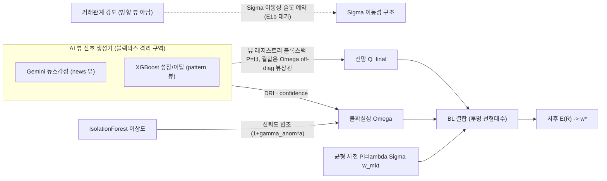
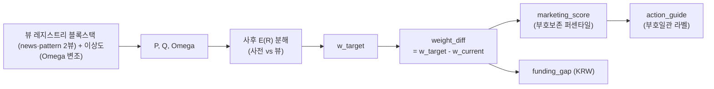

- 문서명: Black-Litterman 개념 (4) — AI 결합·설명가능성
- 버전: v0.1
- 작성일: 2026-06-07
- 상태: Draft
- 작성주체: BL TF (테크니컬 라이터)
- 관련문서:
  - 📚 BL 개념 시리즈: [(1) 무엇이고 왜 BL인가](./01-what-is-black-litterman.md) · [(2) 수학적 구조](./02-mathematical-structure.md) · [(3) 왜 조명받지 못했나·한계](./03-why-overlooked-and-limitations.md) · **(4) AI 결합·설명가능성**
  - 권위 설계서: [BL 모델 설계](../design/03-bl-model-design.md) · [데이터 파이프라인](../design/02-data-pipeline.md)

---

# AI와 결합한 Black-Litterman, 그리고 설명가능 모델로서의 위상

> **한 문장**: BL의 최대 병목은 수학(사후식)이 아니라 *"전망 $Q$ 와 신뢰도 $\Omega$ 를 누가, 어떻게, 재현 가능하게 채우느냐"* 라는 **입력 문제**다. AI는 이 입력을 자동·재현 가능하게 채우고, BL은 그 AI 신호를 **투명하게(설명가능하게) 결합**하는 레이어가 된다.

이 문서는 두 부분이다. **A부**는 AI와 BL을 결합했을 때의 이점·포텐셜, **B부**는 BL이 "설명가능한 모델"로서 갖는 위상이다. 둘은 사실 한 동전의 양면이다.

---

# A부. AI 결합의 이점·포텐셜

## A1. BL의 #1 병목은 "뷰·신뢰도의 수작업 명세"

원형 BL(Black & Litterman 1992)과 He & Litterman(1999)은 모형의 강점이 "시장균형 $\Pi$ 를 사전으로 삼아 투자자 뷰를 베이즈 결합"하는 데 있음을 보였지만, **뷰 자체($Q$)와 그 확신도($\Omega$)는 투자자가 외생적으로 입력**하는 것으로 남겨 뒀다. Idzorek(2007)이 "0~100% 직관적 confidence를 $\Omega$ 로 번역"하는 절차를 *별도 논문으로* 제시해야 했다는 사실 자체가, 뷰·신뢰도 명세가 BL의 실무 최대 마찰점임을 방증한다([(3)편 §3](./03-why-overlooked-and-limitations.md)).

**AI/ML/NLP는 이 수작업·주관 단계를 데이터 기반·재현 가능한 추정 파이프라인으로 대체한다.** 본 프로젝트의 구체화:

| 입력 | 무엇이 채우는가 |
|---|---|
| 전망값 $Q$ | **뷰 레지스트리 블록스택 (현 news·pattern 2뷰)** — news(Gemini 뉴스감성) · pattern(XGBoost 성장−이탈). 뷰별 단위정합 블록을 쌓아 $P=[I;I]$(블록스택)·$Q$=뷰별 블록 구성. 손가중 축결합($a=(0.412,0.412,0.176)$)은 E3a로 폐기 — 뷰 결합은 $\Omega$ off-diagonal(뷰상관 $R_{\text{view}}$)이 수행한다. relationship(거래관계 강도)은 방향 뷰가 아니라 현재상태=이동성이라 $\Sigma$ 이동성 슬롯으로 예약(E1b 대기) |
| 신뢰도 $\Omega$ | **데이터신뢰도(DRI) + 모델 confidence + 이상도(anomaly)** — $\Omega_{kk} \propto (P\tau\Sigma P^{\top})_{kk}\cdot 1/\mathrm{DRI}_i^2 \cdot (1-\mathrm{conf}_i)\cdot (1+\gamma_{\text{anom}} a_i)$ (단위정합 × 무차원 신뢰가중; anomaly는 IsolationForest 이상 크기 $a_i\in[0,1]$ 로 $\Omega$ 를 팽창, $\gamma_{\text{anom}}=2.0$; 정식 정의 설계 §5.4) |

## A2. "신호 → 뷰" 매핑은 이미 정립된 표준 패턴이다

ML 예측을 BL 뷰로 사상하는 패턴은 문헌에 정립돼 있다.

- **지도학습 수익 예측 → 절대뷰**: ML 예측을 뷰로 쓰면 forward-looking 뷰가 과거 평균 기반 naive 뷰보다 미래 분포에 더 잘 정렬된다는 보고(Computational Economics, 2024).
- **NLP 감성 → 뷰**: fine-tuned BERT 감성 점수를 Monte Carlo 가격경로의 가중퍼센타일로 변환해 수익뷰로 사상(Colasanto et al. 2022).
- **LLM 직접 생성**: LLM의 수익 예측과 예측 불확실성을 "뷰 + confidence($\Omega$)"로 동시 번역(Lee et al. 2025).

본 프로젝트의 매핑(표준화 신호 $\tilde s$ 에 회귀계수 $c$ 를 곱해 log-return 차원으로 사상, $Q = c\,\tilde s$; 뷰 레지스트리 블록스택으로 뷰별 블록을 쌓고 결합은 $\Omega$ off-diagonal 뷰상관이 수행)은 이 표준 패턴의 변형이며, **"B2B 예금유치"라는 비전통 자산군에 이식한 점**이 차별점이다. (한국 시장에서도 ML+BL 결합 선례가 있다 — 저위험 이상현상 연구, 2018.)

## A3. 공분산의 ML/통계적 수축이 입력 추정오차를 완화한다

Ledoit & Wolf(2004)는 "표본공분산은 평균-분산 최적화기를 교란하기 가장 쉬운 추정오차를 담고 있어 그대로 쓰면 안 된다"고 하고, 수축 추정량 $\delta F + (1-\delta)S$ 로 극단 계수를 중심으로 당긴다. 이는 BL의 $\Sigma$(이는 $\tau\Sigma$, $\Pi=\lambda\Sigma w_{mkt}$, 사후식에 모두 진입)에 직접 안정성을 주입한다. 특히 $T < N$ 영역에서 표본 $S$ 가 특이해지므로 수축은 사실상 필수다. 본 프로젝트의 "FULL 표본공분산 + Ledoit-Wolf 수축 + 고유값바닥 + 조건수 상한 + Cholesky solve"는 이 수축 철학을 PSD/조건수 게이트로 보강한 것이다([설계 §3](../design/03-bl-model-design.md)).

## A4. 스케일 — 수작업 뷰의 인지적 한계를 돌파

수작업 뷰 명세는 분석가가 손으로 다룰 수 있는 소수 자산·소수 뷰에 묶인다(문헌 사례 다수가 7개 종목·10개 ETF 수준). AI/NLP 파이프라인은 자산마다 동일 로직으로 신호를 산출하므로, 절대뷰가 자동으로 구성되어 **수천 자산으로 선형 확장**된다(본 프로젝트 T1은 수천 법인 규모).

> 단, 스케일이 커지면 $\Sigma$ 추정($T < N$)·조건수가 **새 병목**이 된다. 여기서 다시 수축·고유값바닥·팩터구조($\Sigma = B\Sigma_f B^{\top} + D$, 모수 $O(N^2)\to O(NK)$)가 결정적이다([설계 §3.4](../design/03-bl-model-design.md)). 문헌의 ML-BL 실증은 대개 소규모 유니버스이므로, **스케일은 "메커니즘적 이점"으로 제시하되 대규모 성능은 가설**로 둔다.

## A5. confidence 캘리브레이션 — 결합의 정직성을 좌우

$\Omega$ 는 사후가 균형에서 얼마나 이탈하는지를 직접 통제한다. 그런데 ML 모델의 raw confidence(softmax 확률 등)는 신뢰할 수 없을 수 있다 — Guo et al.(2017)은 현대 신경망이 **심하게 과신(overconfident)** 하며, 정확도는 그대로 두고 신뢰도만 재조정해야("confidence 0.9 = 실제 90% 적중") 함을 보였다. reliability diagram(예측 confidence vs 실현 적중률)으로 과신/과소신을 진단·보정해야 $\Omega$ 가 정직해진다.

본 프로젝트는 $\mathrm{conf}_i$ 를 검증셋 reliability 캘리브레이션 **실측값**으로 두고, $c_{cal}$ 로 무차원화한다([설계 §5.4·§9.3](../design/03-bl-model-design.md)).

> **핵심 안전장치**: 과신한 ML confidence를 그대로 $\Omega$ 에 넣으면 사후가 폭주하므로, 하한 $\Omega_{floor} = \eta\,(P\tau\Sigma P^{\top})_{kk}$ 가 *선택이 아니라 필수* 다.

## A6. 역방향 이점 — BL이 ML 신호를 "베이즈 정칙화"한다

결합은 단방향(ML → BL 뷰 공급)이 아니다. BL은 거꾸로 **ML 신호를 정칙화**한다. 뷰가 없거나 신뢰도가 낮은(=$\Omega$ 큰) 자산은 사후가 자동으로 균형 $\Pi$ 로 수렴해 코너 해·극단 가중을 억제한다. 즉 BL은 노이즈 많은 ML 예측에 **"시장균형 사전"이라는 수축 앵커**를 씌워, raw ML 예측을 그대로 MVO에 넣을 때의 입력 민감성·코너 해를 완화한다. 본 프로젝트 표기로는 $\Pi = \lambda\Sigma w_{mkt}$(지갑규모 앵커)가 뷰 레지스트리(news·pattern) 신호의 노이즈를 흡수하는 prior로 작동한다. *뷰 신호를 raw MVO가 아니라 BL을 거쳐 결합하는 이유가 바로 이것이다.*

---

# B부. 설명가능 모델로서 BL의 위상

> **헤드라인**: BL = **AI 신호의 해석가능 결합 레이어**. 블랙박스 ML을 "뷰 입력"에 격리하고, 결합·배분 단계는 *구조적으로 투명* 하게 유지한다.

## B1. 닫힌형 베이즈 업데이트 → 가산 분해 (intrinsic interpretability)

정칙형 사후식([(2)편 §3.1](./02-mathematical-structure.md))

$$
E[R] = M\big[(\tau\Sigma)^{-1}\Pi + P^{\top}\Omega^{-1}Q\big],\qquad M = \big[(\tau\Sigma)^{-1} + P^{\top}\Omega^{-1}P\big]^{-1}
$$

에서 괄호 안은 **사전 기여 $(\tau\Sigma)^{-1}\Pi$** 와 **뷰 기여 $P^{\top}\Omega^{-1}Q$** 의 단순 합이다. 따라서 자산 $i$ 별로 *"사후가 균형에서 얼마나, 어느 방향으로 끌려갔는가"* 를 두 항의 상대 크기로 **정량 분해**할 수 있다. 정밀도(역공분산)로 가중된 합이므로, 뷰를 확신할수록($\Omega$ 작을수록) 뷰항 기여가 커진다. 이 분해는 [설계 §9.2 뷰 기여도/민감도](../design/03-bl-model-design.md)의 "기여 분해"와 정확히 일치하며, 등록 뷰(news·pattern) 각각의 한계기여 $\partial E[R]/\partial Q_{v}$ 까지 보고 가능하다(블록스택이라 뷰별 블록 그래디언트로 분리).

> SHAP/LIME 같은 사후해석을 *덧붙이는* 대신, BL은 **모델 구조 자체에 기여귀속을 내장**한다(intrinsic interpretability).

## B2. 가중치 차원의 귀속 — He & Litterman(1999)

He & Litterman은 BL 최적해가 **"(스케일된) 시장균형 포트폴리오 + 뷰 포트폴리오들의 가중합"** 으로 분해되며, 어떤 뷰가 강세일수록·더 확신할수록 그 뷰 포트폴리오의 가중이 커짐을 보였다. 수익 분해(B1)가 **가중치(배분) 차원에서도 성립**한다는 뜻이다 — 즉 $w^{*}$ 의 균형-초과분을 "뷰별 기여"로 귀속할 수 있다. 본 프로젝트의 `weight_diff = w_target − w_current → 영업자원 재배분` 사슬이 바로 이 뷰-귀속 구조의 마케팅판이다.

## B3. 뷰($P, Q, \Omega$)가 명시적·감사가능

$P$ 는 어느 자산에 전망을 걸었는지, $Q$ 는 그 전망값, $\Omega$ 는 그 불확실성을 *모두 명시적으로* 노출한다. 본 프로젝트에서 $Q_{final}$ 은 뷰 레지스트리(news·pattern 2뷰) 블록스택이고 결합은 $\Omega$ off-diagonal(뷰상관)이 수행하며 $\Omega$ 는 DRI·confidence·이상도에서 산정되므로, **각 뷰의 입력·가중·신뢰도가 데이터 계보(컬럼 출처)까지 단일 소스로 추적**된다([데이터 파이프라인](../design/02-data-pipeline.md)이 계보 권위). 추상적 파라미터를 운영자가 이해·감사 가능한 양으로 바꾼다는 점에서 Idzorek(2007)의 정신을 따른다.

## B4. 블랙박스와의 대비 — 글래스박스 결합 레이어

딥러닝/강화학습이 상태 → 배분을 직접 사상하면 결정 논리가 불투명하다(별도 XAI 필요). 반면 BL 파이프라인은 ML을 **"뷰 생성기"로만** 쓰고, 결합 단계는 닫힌형 선형대수(투명한 옵티마이저)다.

| | 엔드투엔드 블랙박스(DL/RL 직접배분) | BL 결합 레이어(본 프로젝트) |
|---|---|---|
| 결정 논리 | 불투명, 사후해석 필요 | 닫힌형, 구조적 투명 |
| 신호의 역할 | 모델 내부에 융해 | 명시적 뷰($P,Q,\Omega$)로 격리 |
| 설명 방식 | SHAP/LIME 덧붙임 | 사전 vs 뷰 가산 분해(내장) |
| 감사 | 어려움 | "균형 vs 뷰" 재구성으로 도전 가능 |

즉 블랙박스성을 *"뷰 입력"에 격리* 하고 결합·배분은 감사가능하게 유지하는 아키텍처다.

## B5. 금융 XAI·모델리스크·규제 맥락

SR 11-7(연준 2011)은 모델리스크 거버넌스로 "개념적 건전성·검증·문서화·모니터링"을, EU AI Act(2024, Art.13)는 고위험 AI(신용평가 등)의 투명·해석가능 의무를 요구한다. 금융 ML의 블랙박스 문제에 대한 사후 설명 연구(Bracke et al. 2019, BoE; Bussmann et al. 2021)가 활발한 가운데, **BL의 분해가능성은 그런 사후해석을 덧붙일 필요 없이 구조에 기여귀속을 내장**하므로, 검증자·감사자가 "균형 vs 뷰" 비중과 뷰별 기여로 결과를 재구성·도전할 수 있어 거버넌스에 유리하다.

> 한정: 구조적 투명성은 "규제 충족의 충분조건"이 아니라 **유리한 출발점**이다. 검증·문서화·모니터링 전반은 별도로 요구된다.

## B6. 산출까지 이어지는 traceability 사슬

본 프로젝트는 근거를 **산출물까지 끊김 없이** 잇는다.

각 화살표가 결정적·감사가능 변환이므로, 특정 법인의 "적극 유치" 처방을 *"어느 뷰(news·pattern) 신호가 균형 대비 얼마나 끌어올렸는지"* 까지 역추적할 수 있다. [설계 §9.4 퇴화 진단](../design/03-bl-model-design.md)(방향-액션 일관성, 라벨 정합, weight_diff 스케일)이 이 traceability를 자동 검증한다.

---

## 정직성 — 과장 차단

- **설명가능 ≠ 정확/수익 보장**: 분해가능성은 투명성·감사가능성의 속성일 뿐, 검증되지 않은 성능 우위를 함의하지 않는다. 성능은 walk-forward 백테스트 후로 유보한다([설계 §12](../design/03-bl-model-design.md)).
- **시스템 전체의 설명가능성은 "뷰 생성기"의 설명가능성에 상한이 걸린다**: BL 결합층이 투명해도 뷰 자체(Gemini·XGBoost·IForest)가 블랙박스면 "$Q$ 가 *왜* 그 값인가"는 별도 XAI가 필요하다. BL을 "AI 전체를 설명가능하게 만든다"고 과대표현하지 않는다.
- **AI가 주관성을 "제거"하지 않는다**: 뷰상관 $\rho_{\text{view}}$(E3a로 손가중 축결합을 대체; 손잡이 `calibrate_view_corr`, E3b 자리)·스케일 상수 $c$·DRI 가중·$c_{cal}$·$\eta$ 등은 여전히 설계 선택이다. AI는 주관을 *제거* 가 아니라 **체계화·재현가능화·문서화** 한다.
- **제약 하 근사 귀속**: He-Litterman의 "가중합" 직관은 무제약 최적해에 대한 진술이다. 본 프로젝트는 $0 \le w \le w_{max}$·$\sum w = 1$·제외집합 등 제약 QP를 풀므로, 제약이 활성화되면 뷰-귀속은 부분적으로만 성립한다.

---

## 참고문헌

- Black, F. & Litterman, R. (1992). "Global Portfolio Optimization." *Financial Analysts Journal*, 48(5), 28–43.
- He, G. & Litterman, R. (1999). "The Intuition Behind Black-Litterman Model Portfolios." *Goldman Sachs Investment Management Research* (SSRN 334304).
- Idzorek, T. M. (2007). "A Step-by-Step Guide to the Black-Litterman Model." In *Forecasting Expected Returns in the Financial Markets*, Academic Press, 17–38.
- Ledoit, O. & Wolf, M. (2004). "Honey, I Shrunk the Sample Covariance Matrix." *The Journal of Portfolio Management*, 30(4), 110–119.
- Guo, C., Pleiss, G., Sun, Y. & Weinberger, K. Q. (2017). "On Calibration of Modern Neural Networks." *Proceedings of ICML* (PMLR 70), 1321–1330.
- Colasanto, F., Grilli, L., Santoro, D. & Villani, G. (2022). "BERT's sentiment score for portfolio optimization: a fine-tuned view in Black and Litterman model." *Neural Computing & Applications*, 34, 17507–17521.
- Lee, Y. et al. (2025). "LLM-Enhanced Black-Litterman Portfolio Optimization." arXiv:2504.14345.
- Bracke, P., Datta, A., Jung, C. & Sen, S. (2019). "Machine Learning Explainability in Finance." *Bank of England Staff Working Paper* No. 816.
- Bussmann, N., Giudici, P., Marinelli, D. & Papenbrock, J. (2021). "Explainable Machine Learning in Credit Risk Management." *Computational Economics*, 57, 203–216.
- Board of Governors of the Federal Reserve System (2011). *SR 11-7: Guidance on Model Risk Management*.
- European Parliament & Council (2024). *Regulation (EU) 2024/1689 (AI Act)*, Art. 13.
