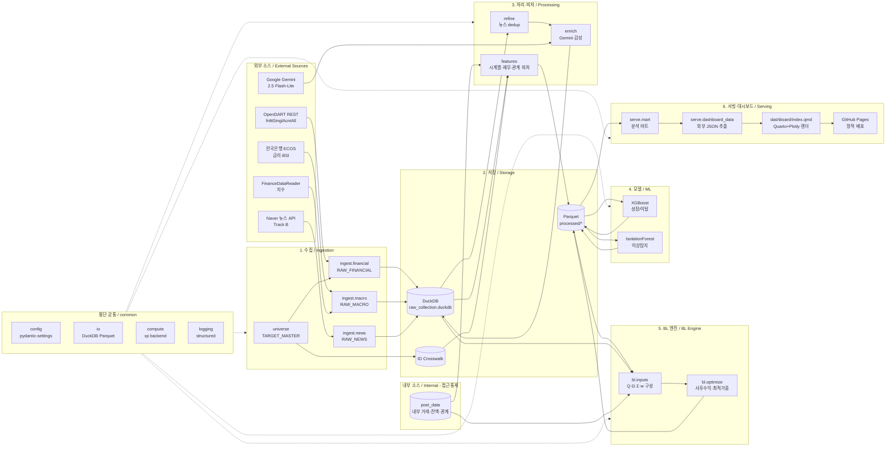
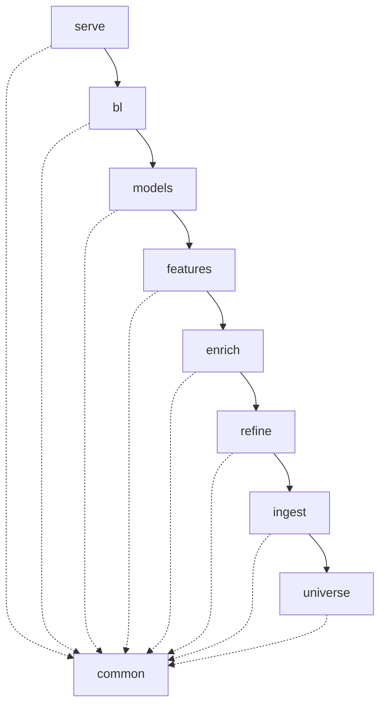
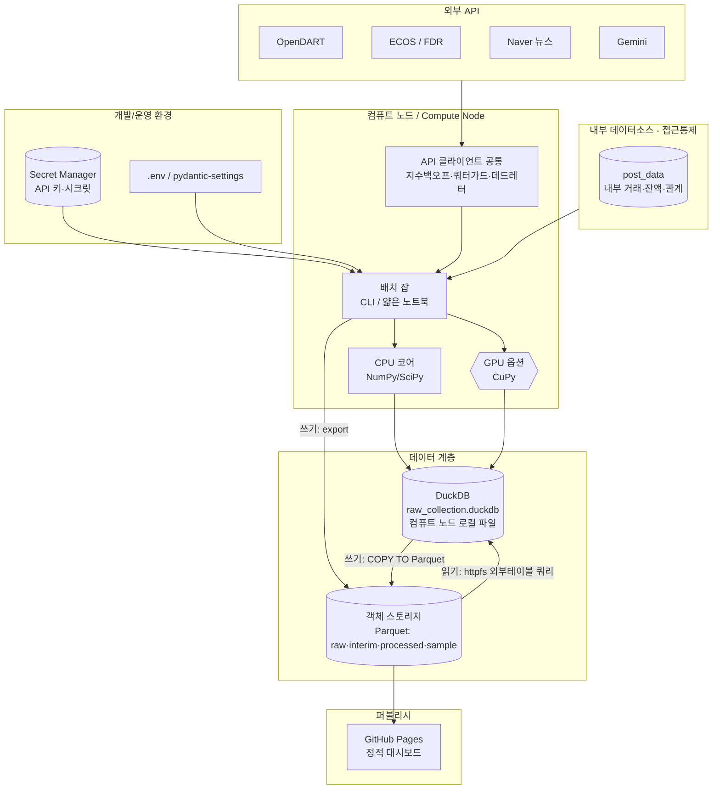
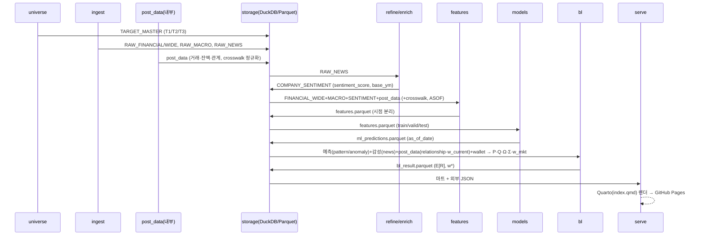
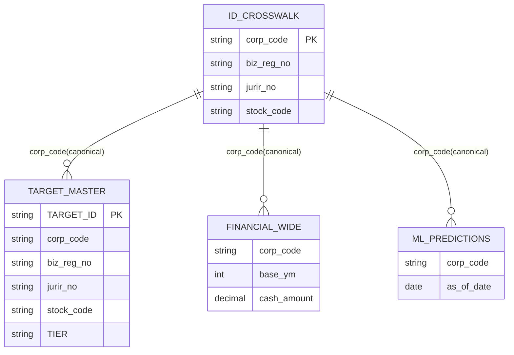

- 문서명: BL 시스템 아키텍처 설계서 (System Architecture Design)
- 버전: v0.3
- 작성일: 2026-06-07
- 상태: Draft
- 작성주체: BL 수석 데이터 사이언티스트 / 아키텍처 팀
- 관련문서:
  - [프로젝트 개요](../planning/01-project-overview.md)
  - [PRD](../planning/02-prd.md)
  - [용어집](../planning/04-glossary.md)
  - [데이터 파이프라인 설계](./02-data-pipeline.md)
  - [BL 모델 설계](./03-bl-model-design.md)
  - [연산(Compute) 설계](./04-compute-design.md)
  - [대시보드 설계](./05-dashboard-design.md)
  - [ADR-0001 연산 백엔드](./adr/ADR-0001-compute-backend.md) / [ADR-0002 저장 포맷](./adr/ADR-0002-storage-format.md) / [ADR-0003 식별자 매핑](./adr/ADR-0003-identifier-mapping.md) / [ADR-0004 누수 없는 학습](./adr/ADR-0004-leakage-free-training.md)

---

# 1. 개요와 범위

본 문서는 **BL**(AI 기반 BL(Black-Litterman) 법인 마케팅 최적화 시스템)의 **시스템 아키텍처**를 정의한다. BL은 블랙-리터만(Black-Litterman) 포트폴리오 이론을 (가칭) 소매금융기관의 B2B 예금유치 마케팅에 적용하여, 한정된 영업자원을 법인 고객 "포트폴리오"에 최적 배분하는 의사결정 지원 시스템이다.

핵심 사용자는 **법인 영업 마케터/RM(비기술직)**이며, 산출물은 "어느 법인 고객사에 어느 정도의 영업자원을 배분할 것인가"를 권고하는 최적 가중치(weight) 및 근거(스코어카드)다.

이 시스템은 원래 Google Drive + Colab 무료 플랜 기반 토이 프로젝트였으나, 본 아키텍처는 **클라우드(충분한 하드웨어 가정)로의 격상판**을 정의한다. 본 문서가 다루는 범위는 다음과 같다.

- 논리 아키텍처(레이어 구조와 의존방향)
- 컴포넌트별 책임/입출력 계약
- 물리/배포 아키텍처(클라우드 가정)
- 패키지/리포지토리 구조
- 기술스택 선택과 근거
- 설정/시크릿/로깅 횡단 관심사 전략

세부 절차/수식/스키마는 각 하위 설계문서([데이터 파이프라인](./02-data-pipeline.md), [BL 모델](./03-bl-model-design.md), [연산](./04-compute-design.md), [대시보드](./05-dashboard-design.md))로 위임한다. 본 문서는 그 "뼈대"와 "경계"를 확정한다.

## 1.1 핵심 은유 매핑 (아키텍처 전제)

시스템 전반의 데이터 모델과 컴포넌트는 다음 금융공학→마케팅 은유에 정렬되어야 한다. 특히 **"AI 모델 3종(신호 생산자)"과 "BL 뷰 4축(신호 소비 단위)"은 별개 개념**임에 유의한다(§1.3 참조).

| 금융공학 개념 | 마케팅 개념 | 본 시스템에서의 실체 |
|---|---|---|
| 자산(asset) | 법인 고객사 | `TARGET_MASTER.TARGET_ID` (corp_code 기반) |
| 기대수익률 | 예금유치/유지 가치(CLV proxy) | BL 사후 기대수익 $E[R]$ |
| 시장 균형 가중치 $w_{mkt}$ | 고객 예금(지갑) 규모 비중 | 재무보유 고객은 `FINANCIAL_WIDE.cash_amount` 기반, 비재무·T3 가상노드는 섹터중앙값 배수로 추정한 `wallet_size` 비중(상세 [03 BL §4.1](./03-bl-model-design.md)) |
| 투자자 전망(View, Q) | BL 뷰 4축 앙상블 | **AI 3종 모델 신호**(XGBoost 성장/이탈, IsolationForest 이상, Gemini 뉴스감성)에 **거래관계 피처**(post_data)를 더해 **4축(news/pattern/anomaly/relationship)**으로 결합한 $Q_{\text{final}}$ |
| 전망 불확실성 $\Omega$ | 신호 신뢰도 | 데이터신뢰도(DRI) + 모델 confidence ($\Omega\propto 1/\text{DRI}^2$) |

> `w_mkt` 실체는 본 문서에서 단정하지 않고 [03 BL §4.1](./03-bl-model-design.md)에 위임한다(`cash_amount`는 재무제표 보유 고객에만 적용, 비재무/가상노드는 섹터중앙값 배수 추정).

## 1.2 세분화 축

- **Tier(고객축):** T1 상장 외감 / T2 비상장 중소 / T3 가상 섹터 노드(`IS_VIRTUAL`)
- **Track(수집축):** A 매크로(한국은행 ECOS 금리·BSI, FinanceDataReader 지수) / B Naver 뉴스

## 1.3 "AI 3종 모델" vs "BL 뷰 4축" (개념 분리)

혼동을 막기 위해 두 개념을 명시적으로 분리한다.

- **AI 모델 3종(생산자):** `XGBoost`(성장/이탈 분류), `IsolationForest`(이상탐지), `Gemini`(뉴스 감성). 이들은 모델 학습/추론으로 **신호를 생산**한다(레이어 3·4).
- **BL 뷰 4축(소비 단위):** BL 엔진이 뷰값 $Q$를 구성할 때 결합하는 4개 축 — `news`(Gemini 감성), `pattern`(XGBoost 성장−이탈), `anomaly`(IsolationForest×자금흐름 방향), `relationship`(거래관계 강도: 계좌수·급여이체·주거래). **`relationship`은 모델 산출이 아니라 `post_data` 거래관계 피처에서 직접 유래**한다.
- 축 가중 $a=(0.35\,\text{news},\,0.35\,\text{pattern},\,0.15\,\text{anomaly},\,0.15\,\text{relationship})$, 합=1(상세 [03 BL §5.1](./03-bl-model-design.md)).

즉 AI 모델은 3종이지만 BL 뷰는 4축이며, 4번째 축(relationship)의 입력원은 내부 `post_data`다. 본 문서·§11은 일관되게 **"4축"**을 뷰 정의로 사용한다.

---

# 2. 아키텍처 목표와 품질속성

## 2.1 설계 목표

1. **모듈 경계의 명확화:** 노트북 중심의 단일 흐름(과거 01~11 노트북)을 **재사용 가능한 패키지 + 얇은 실행 노트북/CLI**로 분해한다. 각 레이어는 단일 책임을 가지며 단방향으로만 의존한다.
2. **재현성/결정성:** 동일 입력·동일 설정이면 동일 산출물이 나와야 한다. 과거 `OFFSET without ORDER BY`(비결정 페이지네이션, 추정 ~38% 누락)와 추론배치 min/max 정규화 누수를 구조적으로 제거한다.
3. **연산 백엔드 추상화:** GPU 유무에 따라 CuPy/NumPy를 디스패치하되 **동일 로직·동일 수치, 속도만 차이**가 나도록 한다([ADR-0001](./adr/ADR-0001-compute-backend.md)).
4. **누수 없는 학습:** 시점 기반 train/valid/test 분리와 walk-forward 백테스트를 아키텍처 차원에서 강제한다([ADR-0004](./adr/ADR-0004-leakage-free-training.md)).
5. **방법론 정합:** FULL 공분산 복원, $w_{mkt}$ 앵커, 단위 정합 등 BL 방법론 결함을 구조적으로 배제한다([BL 모델 설계](./03-bl-model-design.md)).
6. **데이터/표현 분리:** 대시보드의 데이터를 HTML에서 분리(외부 JSON/lazy-load)하여 빌드 산출물 크기 폭증(과거 44개 HTML, 709MB)을 방지한다.

## 2.2 품질속성 (Quality Attributes)

| 품질속성 | 목표/시나리오 | 아키텍처 전술 |
|---|---|---|
| **정확성(Correctness)** | look-ahead 누수 0건; 식별자 오조인으로 인한 tier=UNKNOWN 소실 0건 | 시점 분리 계약, ID crosswalk 테이블, pandera 검증 게이트 |
| **재현성(Reproducibility)** | 동일 설정 재실행 시 상대오차 $<10^{-8}$ 내 수치 동일(비트 단위 동일이 아님; 부동소수 누적순서·GPU/CPU 디스패치 차이 허용) | 시드 고정, 결정적 정렬, 학습기준 스케일러 저장/재사용, CPU/GPU 동치성 회귀테스트([03 BL §6.3](./03-bl-model-design.md)) |
| **이식성(Portability)** | GPU 노드/CPU 노드 간 코드 변경 없이 동작 | `xp` 배열 모듈 디스패치, 경로의 설정 외부화 |
| **확장성(Scalability)** | 수천 자산까지 수축 FULL 공분산 직접 처리; $N$이 매우 크면 팩터구조로 전환 | DuckDB OLAP + Parquet, 컴퓨트 노드 수직 확장(GPU), 그리고 $N\!\gg\!T$ 시 $\Sigma=B\Sigma_f B^{\top}+D$ 팩터구조로 모수 $O(N^2)\!\to\!O(NK)$ 축소([03 BL §3.4](./03-bl-model-design.md)) |
| **보안(Security)** | API 키/PII 평문 노출 0건 | 시크릿매니저/환경변수, 로그 마스킹, 공개 데모는 합성데이터만 |
| **관측성(Observability)** | 모든 스테이지의 입출력 row 수·시점·해시 추적 | 구조적 로깅(JSON), lineage 메타, 멱등 upsert 로그 |
| **유지보수성(Maintainability)** | 단일 책임 모듈, 단방향 의존 | 레이어드 아키텍처, 인터페이스 격리 |
| **테스트 용이성(Testability)** | 핵심 BL 수식·식별자 매핑 단위테스트 | 순수함수화, 의존성 주입, pytest 픽스처 |

> 확장성 주의: "수만 자산"은 FULL $N\times N$ 공분산(수억 원소)을 직접 처리한다는 의미가 아니라 **팩터구조 전제**다. 표본 시점 $T<N$에서 표본공분산은 특이(singular)하여 수축이 필수이며, $N$이 매우 크면 팩터모형으로 전환한다([03 BL §3.2/§3.4](./03-bl-model-design.md)).

## 2.3 아키텍처 원칙 (Constraints)

본 절은 횡단 제약의 **근거 단일 출처**다. 이후 절(§5/§7/§8 등)은 이를 재서술하지 않고 본 절을 참조한다.

- **pickle 폐기:** 버전 취약·임의코드 실행 위험으로 직렬화는 Parquet/DuckDB만 사용([ADR-0002](./adr/ADR-0002-storage-format.md)).
- **Colab/Drive 종속 제거:** 모든 경로는 `.env`/pydantic-settings 기반. 헤드리스 실행 가능.
- **No-Crawl 우선:** 안정적 API/공공데이터(OpenDART, ECOS, Naver 뉴스 API) 사용으로 IP 차단·법적 리스크 회피.
- **시크릿 평문 금지:** API 키/시크릿은 코드·설정파일에 평문 저장 금지, Secret Manager/환경변수로만 주입(상세 §8.2).
- **단방향 의존:** 상위 레이어는 하위 레이어만 참조한다(아래→위 참조 금지). `common`은 모든 레이어가 참조 가능한 유일한 공통 의존.

---

# 3. 논리 아키텍처

## 3.1 레이어 개요

BL은 6개 논리 레이어 + 1개 횡단 공통 레이어로 구성된다. 데이터는 좌에서 우로 단방향으로 흐른다. **내부 거래/잔액 소스 `post_data`**는 외부 API와 구분되는 접근통제 데이터소스로, `relationship` 축·`w_current`·`funding_gap`의 입력원이다.



> `post_data`는 외부 API(`EXT`)와 분리된 내부 접근통제 소스이며, 수집 시 `corp_code`(또는 `jurir_no`)를 crosswalk로 정규화해 결합한다([02 파이프라인 §1](./02-data-pipeline.md)). `relationship` 축(BL 4축)·`w_current`·`funding_gap`은 모두 `post_data`를 필수 입력으로 한다.

## 3.2 레이어별 책임 요약

| # | 레이어 | 책임 | 과거 노트북 대응 |
|---|---|---|---|
| 1 | **수집(Ingestion)** | 유니버스 정의(`TARGET_MASTER`), 외부 API에서 재무/매크로/뉴스 원천 적재 + 내부 `post_data` 적재(접근통제). 멱등 upsert, 결정적 정렬. | 01 재무, 02 track_A, 03 track_B, 04 track_C(격상판 제외: BigKinds 폐쇄적 API) |
| 2 | **저장(Storage)** | DuckDB(수집/OLAP) + Parquet(분석/교환). 이중적재 lineage(RAW_FINANCIAL+FINANCIAL_WIDE). **ID crosswalk** 관리. | (인프라) |
| 3 | **처리·피처(Processing)** | 뉴스 dedup, Gemini 감성 enrich, 시점 분리 피처(재무·매크로·감성·거래관계) 생성. | 05 뉴스정제, 06 gemini, 07 전처리 |
| 4 | **모델(ML)** | XGBoost 성장/이탈 분류, IsolationForest 이상탐지. 시점 분리 검증, 스케일러/모델 저장. | 08 모델학습 |
| 5 | **BL 엔진(BL Engine)** | 뷰 행렬 P·Q·Ω(4축), FULL 공분산 Σ, $w_{mkt}$ 구성 → 사후 기대수익·최적 가중. | 09 BL입력, 10 BL최적화 |
| 6 | **서빙·대시보드(Serving)** | 분석 마트 생성, 외부 JSON 추출, Quarto+Plotly 파라미터화 대시보드, GitHub Pages 정적 배포. | 11 / 11-1 대시보드 |
| × | **공통(common)** | 설정/IO/연산백엔드/로깅 등 횡단 관심사. 모든 레이어가 참조 가능. | (신규) |

## 3.3 의존 방향 (Dependency Rule)



- 실선: 데이터/호출 의존(상위→하위만 허용).
- 점선: 모든 레이어가 `common`(config/io/compute/logging)에 의존하나, `common`은 어떤 레이어에도 의존하지 않는다.
- **금지:** 하위 레이어가 상위 레이어를 import하는 것(예: `ingest`가 `bl`을 참조). 순환 의존 금지.

---

# 4. 컴포넌트별 책임·입출력

각 컴포넌트의 계약(입력→출력)을 명시한다. 테이블/식별자는 실제 프로젝트 스키마를 반영한다. **표준 식별자 canonical 명칭은 `biz_reg_no`이며, DART 원응답 필드명 `bizr_no`는 수집 시 `biz_reg_no`로 정규화한다**([02 파이프라인 §4](./02-data-pipeline.md)).

## 4.1 수집 레이어

| 컴포넌트 | 책임 | 주요 입력 | 주요 출력 | 핵심 식별자/키 |
|---|---|---|---|---|
| `universe` | T1/T2/T3 타겟 마스터 구성·복원. T3는 가상 섹터 노드. | DART corp_code 목록, ML/감성/재무 후보(FULL OUTER JOIN) | `TARGET_MASTER` | PK `TARGET_ID`; `biz_reg_no`, `jurir_no`, `stock_code`, `TIER`, `IS_VIRTUAL`, `SECTOR_CODE` |
| `ingest.financial` | OpenDART REST(`fnlttSinglAcntAll.json`) 재무 적재. status='000' & list 비어있지 않을 때만 적재. | corp_code, bsns_year, reprt_code=11011, fs_div=CFS/OFS | `RAW_FINANCIAL`, `FINANCIAL_WIDE` | `RAW_FINANCIAL` PK `(TARGET_ID, ACCOUNT_ID, PERIOD)`; `FINANCIAL_WIDE` 키 `(corp_code, base_ym)` (TIER는 속성; 비고 참조) |
| `ingest.macro` | ECOS 금리·BSI, FinanceDataReader 지수 적재(Track A). | METRIC_CODE, DATE 범위 | `RAW_MACRO` | PK `(METRIC_CODE, DATE)` |
| `ingest.news` | Naver(Track B) 뉴스 적재. | TARGET 검색키워드, 기간 | `RAW_NEWS` | PK `NEWS_HASH`; `TARGET_ID`, `SOURCE`, `PUB_DATE` |
| `ingest.post` | 내부 거래/잔액/관계(`post_data`) 적재(접근통제). 과거 `post_owned_set` PLACEHOLDER 대체. | 내부 DB/CSV(접근통제) | `post_data`, `POST_OWNED_CORPS` | `corp_code`(or `jurir_no`)→crosswalk 정규화; `bal`, `w_current`, `relationship_score`, `account_count`, `has_payroll`, `is_main_bank` |

> 비고 1: `FINANCIAL_WIDE.cash_amount`는 재무보유 고객의 BL 월렛 추정 입력으로, `ifrs-full_CashAndCashEquivalents` + 단기금융상품/정기예금 계정 합계, 없으면 `ifrs-full_CurrentAssets` fallback. 최종 `wallet_size`(비재무·T3 포함) 산정은 [03 BL §4.1](./03-bl-model-design.md)에 위임한다. 수집은 `BL_FULL_REBUILD`/`BL_ONLY_EMPTY` 플래그로 풀리빌드/증분 동작을 제어한다(§8.1).
> 비고 2: `FINANCIAL_WIDE` 키는 `(corp_code, base_ym)`로 한다([02 파이프라인 §3.1.3/§6.2](./02-data-pipeline.md)와 정합). `TIER`는 동일 `(corp_code, base_ym)`에 대해 분류 변경(예: 비상장→상장 승격) 시 중복행을 유발해 자산 dedup·$w_{mkt}$ 합=1 불변식과 충돌할 수 있으므로 **PK에서 제외하고 속성 컬럼으로 둔다**.

## 4.2 처리·피처 레이어

| 컴포넌트 | 책임 | 주요 입력 | 주요 출력 | 비고 |
|---|---|---|---|---|
| `refine` | 뉴스 dedup, Kiwi 키워드 추출. | `RAW_NEWS` | `NEWS_REFINED` | 도메인 특화 정제; 결정적 dedup |
| `enrich` | Gemini 2.5 Flash-Lite 뉴스 감성 + confidence 캘리브레이션. | `NEWS_REFINED` | `COMPANY_SENTIMENT` 키 `(TARGET_ID, base_ym)`; `sentiment_score`(원천), `event_cnt`, `risk_score`, `confidence` | 시점정합 `base_ym` 부착([02 §3.1.6](./02-data-pipeline.md)); confidence는 하드코딩 금지·검증셋 캘리브레이션. `sentiment_score`는 03의 `gemini_score`·05의 `news_sentiment`/`view_news`와 동일 계보(별칭) |
| `features` | 시점 분리 시계열·재무·매크로·감성·거래관계 피처. 학습기준 스케일러 저장. | `FINANCIAL_WIDE`, `RAW_MACRO`, `COMPANY_SENTIMENT`, `post_data`, crosswalk | `features.parquet` (asset × base_ym) | look-ahead 차단; `bal_future_3m`은 라벨 전용; `relationship_score`·`account_count`·`has_payroll`·`is_main_bank`(post_data) 포함 |

## 4.3 모델 레이어

| 컴포넌트 | 책임 | 입력 | 출력 | 검증 |
|---|---|---|---|---|
| `models.growth_churn` | XGBoost 성장/이탈 분류 → BL `pattern` 축 원천. | `features.parquet` (시점 train/valid/test) | `ml_predictions.parquet` (`growth_score_xgb`, churn_prob, as_of_date) | walk-forward, SHAP 설명 |
| `models.anomaly` | IsolationForest 이상탐지 → BL `anomaly` 축/사전필터. | `features.parquet` | `ml_predictions.parquet` (`anomaly_score_if`) | 시점 분리, 학습기준 스케일 |

> 2그룹(재무 유무) 모델링 전략을 보존한다. 모든 예측에 `as_of_date`/`base_ym`을 부착해 재무·매크로와 시점 정합을 보장한다. 이 모델들은 BL 4축 중 `pattern`·`anomaly`를 생산하고, `news`는 `enrich`(Gemini), `relationship`은 `post_data`에서 온다(§1.3).

## 4.4 BL 엔진 레이어

| 컴포넌트 | 책임 | 입력 | 출력 | 방법론 정합 |
|---|---|---|---|---|
| `bl.inputs` | P(뷰행렬)·Q(4축 뷰값)·Ω(불확실성)·Σ(FULL 공분산)·$w_{mkt}$·$w_{current}$ 구성. | ML 예측(pattern/anomaly), 감성(news), `post_data`(relationship·`w_current`), `FINANCIAL_WIDE`(wallet) | BL 입력 행렬 묶음 | Σ는 log-return 공분산 + Ledoit-Wolf 수축; $\Omega\propto 1/\text{DRI}^2$; $\Pi=\lambda\Sigma w_{mkt}$; 4축 결합 가중 $a=(0.35,0.35,0.15,0.15)$ |
| `bl.optimize` | 사후 기대수익 $E[R]$, 최적 가중 $w^*$ 산출. | BL 입력 행렬 | `bl_result.parquet` (`E[R]`, `w_star`) | 볼록 QP는 `cvxpy`(OSQP/ECOS) 기본, 비볼록 비율형(Sharpe/IR)은 `scipy.optimize`(SLSQP) 병행([03 BL §7.3](./03-bl-model-design.md)); 정상 범위 검증 |

BL 핵심 수식(정칙형, precision form; 상세는 [BL 모델 설계 §6.1](./03-bl-model-design.md)):

$$
E[R] = \left[(\tau\Sigma)^{-1} + P^{\top}\Omega^{-1}P\right]^{-1}\left[(\tau\Sigma)^{-1}\Pi + P^{\top}\Omega^{-1}Q\right]
$$

여기서 $\Pi = \lambda \Sigma\, w_{mkt}$ (지갑규모 앵커), $\Sigma$는 **FULL 공분산**(대각만 쓰던 과거 결함 복원). 구현은 직접 역행렬 대신 **Cholesky solve**를 사용한다(상세 [03 BL §6](./03-bl-model-design.md)).

## 4.5 서빙 레이어

서빙은 **데이터 추출(Python)과 렌더(Quarto)를 분리**한다. `serve.dashboard_data.py`는 마트에서 외부 JSON을 추출하고, 실제 렌더는 `dashboard/index.qmd`(Quarto)가 담당한다. 따라서 §3.1의 렌더 노드는 패키지 모듈이 아니라 Quarto 소스이며, §6 패키지 트리와 1:1 정합한다.

| 컴포넌트 | 책임 | 입력 | 출력 |
|---|---|---|---|
| `serve.mart` | 마케터용 분석 마트(자산별 스코어카드, 가중치, 근거) 생성. | `bl_result.parquet`, `ml_predictions`, 감성, `post_data` | `mart/*.parquet`, 외부 `*.json` |
| `serve.dashboard_data` | 마트→외부 JSON 추출(데이터/HTML 분리, lazy-load). Python 모듈. | `mart/*.parquet` | `mart/*.json` |
| `dashboard/index.qmd` (Quarto) | 파라미터화 단일 소스 렌더. 데이터는 외부 JSON lazy-load. | `mart/*.json` | 정적 HTML(데이터 분리) |
| (배포) | GitHub Pages 정적 배포(합성 샘플데이터만). | 빌드 산출물 | 공개 대시보드 |

---

# 5. 물리/배포 아키텍처

## 5.1 배포 토폴로지 (클라우드 가정)

과거 Colab/Drive 종속을 제거하고, 충분한 하드웨어를 가정한 클라우드 토폴로지로 격상한다. GPU는 옵션이며, 없을 경우 동일 로직을 CPU로 실행한다(수치 동일, 속도만 차이). 외부 API와 별도로 **내부 접근통제 데이터소스 `post_data`**를 명시한다.



## 5.2 노드/스토리지 역할

| 구성요소 | 역할 | 비고 |
|---|---|---|
| **컴퓨트 노드** | 수집~BL 최적화 배치 실행. CLI 또는 얇은 실행 노트북. | GPU 있으면 CuPy 선형대수 가속; 없으면 NumPy/SciPy. 단일 코드 디스패치. |
| **API 클라이언트 공통** | 외부 API(OpenDART/ECOS/Naver/Gemini) 호출 제어. | 지수백오프·쿼터가드·재시도, 실패는 `failed_companies` 데드레터로 격리(상세 [02 파이프라인 §1.1](./02-data-pipeline.md)). |
| **객체 스토리지** | Parquet 계층(raw/interim/processed/sample) 보관·교환. | 분석/교환 표준 포맷; 버전·파티셔닝 가능. |
| **DuckDB(파일 모드)** | 수집/적재/OLAP. ASOF JOIN, 멱등 upsert. | 단일 파일 `raw_collection.duckdb`는 **컴퓨트 노드 로컬**에 위치. 쓰기는 `DuckDB→Parquet export`(COPY TO), 읽기는 `httpfs`/외부테이블로 객체스토리지 Parquet을 직접 쿼리. 필요시 읽기전용 서버 모드. |
| **내부 소스(post_data)** | 내부 보유/거래 잔액·관계 적재(접근통제). | 외부 API와 분리; crosswalk 경유 결합. 공개 데모에는 미포함(합성으로 대체). |
| **Secret Manager** | OpenDART/ECOS/Naver/Gemini 키 관리. | 평문 노출 금지(§2.3); 환경변수로 주입, 로그 마스킹. |
| **GitHub Pages** | 합성 샘플데이터 기반 정적 대시보드 데모 배포. | 운영본은 접근통제; 공개 데모는 합성 데이터만. |

## 5.3 환경 분리

| 환경 | 데이터 | 내부 post_data 접근 | 시크릿 | 대시보드 |
|---|---|---|---|---|
| dev/local | `data/sample/`(합성) | 없음(합성 대체) | `.env`(로컬) | 로컬 렌더 |
| 운영(operational) | 실제 수집 데이터(접근통제) | 내부망 접근통제(권한 필요) | Secret Manager | 내부망/접근통제 |
| public demo | 합성 샘플데이터만 | 없음(합성 대체) | (외부 키 불필요) | GitHub Pages |

---

# 6. 패키지/리포지토리 구조

영문 경로/파일명, 한글 내용 규약을 따른다. `src/bl/` 하위 모듈 경계는 §3 레이어와 1:1 대응한다. (본 레이아웃이 임포트 경로·모듈 파일명의 **권위 소스**다: `import bl`, `from bl.engine import optimize`, 설정은 `bl.common.config:get_settings()`.)

```text
black-litterman/
  README.md
  pyproject.toml                 # 빌드·의존성·도구설정(ruff, mypy, pytest)
  .env.example                   # 설정 키 템플릿(시크릿 값 미포함)
  src/
    bl/
      __init__.py
      common/                    # 횡단 공통(모든 레이어가 참조)
        config.py                #  pydantic-settings 설정 로딩, get_settings()
        io.py                    #  DuckDB/Parquet 읽기·쓰기, 멱등 upsert
        compute.py               #  xp 백엔드 디스패치(cupy if gpu else numpy)
        logging.py               #  구조적 로깅(JSON), 키 마스킹
        identifiers.py           #  ID crosswalk(corp_code↔biz_reg_no↔jurir_no↔stock_code)
      universe/                  # TARGET_MASTER 구성
        master.py
      ingest/                    # 수집(API/내부→RAW_*)
        financial.py             #  OpenDART REST → RAW_FINANCIAL/FINANCIAL_WIDE
        macro.py                 #  ECOS·FDR → RAW_MACRO
        news.py                  #  Naver → RAW_NEWS
        post.py                  #  내부 post_data 적재(접근통제) → post_data/POST_OWNED_CORPS
      refine/                    # 뉴스 dedup·키워드
        news_dedup.py
      enrich/                    # Gemini 감성·confidence 캘리브레이션
        sentiment.py
      features/                  # 시점 분리 피처·스케일러
        builder.py
        scaler.py
      models/                    # ML
        growth_churn.py          #  XGBoost
        anomaly.py               #  IsolationForest
        validation.py            #  walk-forward, 시점 분리
      engine/                    # BL 엔진
        inputs.py                #  P·Q(4축)·Ω·Σ·w_mkt·w_current
        covariance.py            #  FULL 공분산 + Ledoit-Wolf
        optimize.py              #  사후수익·최적가중(cvxpy/SLSQP)
      serve/                     # 서빙·마트
        mart.py
        dashboard_data.py        #  외부 JSON 추출(데이터/HTML 분리)
  notebooks/                     # 얇은 실행 노트북(로직은 src 호출만)
    01_ingest.ipynb ... 11_dashboard.ipynb
  tests/                         # pytest
    test_identifiers.py          #  crosswalk 무결성
    test_bl_math.py              #  BL 수식 단위테스트
    test_leakage.py              #  시점 누수 회귀 테스트
    test_io.py
  data/                          # (git-ignored, sample만 추적)
    raw/                         #  원천 적재
    interim/                     #  중간 산출
    processed/                   #  분석용 Parquet
    sample/                      #  합성 샘플데이터(공개 데모용)
  dashboard/                     # Quarto 소스(파라미터화 단일 소스, 렌더 담당)
    index.qmd
    _quarto.yml
  docs/
    planning/                    # 01~04 기획·기술문서
    design/                      # 01~05 설계서
      adr/                       # ADR-0001 ~ ADR-0004
```

## 6.1 모듈 경계 규칙

- 임포트 경로는 `bl`(src 레이아웃), 연산 백엔드 모듈은 `bl.common.compute`, 설정은 `bl.common.config:get_settings()`로 한다(03 로드맵·04 연산설계와 통일). 모듈 경계는 §3 레이어와 1:1 대응한다.
- `common`은 도메인 로직을 포함하지 않는다(설정/IO/연산/로깅/식별자만).
- 각 도메인 모듈은 입력 테이블/Parquet을 `common.io`로 읽고, 산출을 `common.io`로 쓴다. **직접 파일 경로 하드코딩 금지**(설정 경유).
- 모든 수치 연산은 `common.compute.xp`를 통해 배열 모듈을 받는다(NumPy/CuPy 직접 import 지양).
- 노트북은 비즈니스 로직을 담지 않는다. `from bl.engine import optimize` 식으로 호출만 한다.
- 대시보드 렌더(`dashboard/index.qmd`)는 Python 패키지가 아니라 Quarto 소스이며, 데이터는 `serve.dashboard_data`가 추출한 외부 JSON을 lazy-load한다(§4.5).

---

# 7. 기술스택

| 레이어 | 선택 | 이유 | 관련 ADR |
|---|---|---|---|
| 언어 | Python 3.11+ | 타입힌트·생태계·과거 자산 호환 | — |
| 수집/OLAP 저장 | DuckDB | 임베디드 OLAP, ASOF JOIN, 멱등 upsert, Parquet 직접 쿼리 | [ADR-0002](./adr/ADR-0002-storage-format.md) |
| 분석/교환 저장 | Parquet | 컬럼지향, 압축, 언어중립 교환 | [ADR-0002](./adr/ADR-0002-storage-format.md) |
| 직렬화 | (pickle 폐기 → Parquet/DuckDB만, 근거 §2.3) | — | [ADR-0002](./adr/ADR-0002-storage-format.md) |
| 수치 연산(CPU) | NumPy + SciPy | 기준 백엔드, 안정적·이식성 | [ADR-0001](./adr/ADR-0001-compute-backend.md) |
| 수치 연산(GPU 옵션) | CuPy | NumPy 호환 API, 동일 수치·속도만 차이 | [ADR-0001](./adr/ADR-0001-compute-backend.md) |
| 최적화 | cvxpy(OSQP/ECOS) + scipy.optimize(SLSQP) | 볼록 QP는 cvxpy 기본, 비볼록 비율형(Sharpe/IR)은 SLSQP 병행 | [BL 설계 §7.3](./03-bl-model-design.md) |
| ML 분류 | XGBoost | 성장/이탈 분류, SHAP 설명 | [BL 설계](./03-bl-model-design.md) |
| 이상탐지 | scikit-learn IsolationForest | 비지도 이상탐지 | — |
| LLM 감성 | Google Gemini 2.5 Flash-Lite | 뉴스 감성, confidence 캘리브레이션 | — |
| 형태소/키워드 | Kiwi | 한국어 뉴스 키워드 추출 | — |
| 설정 | pydantic-settings + .env | 타입 검증 설정 외부화(`BL_` 프리픽스, §8.1) | — |
| 데이터 검증 | pandera / great_expectations 류 | 스키마·시점 누수 게이트 | [ADR-0004](./adr/ADR-0004-leakage-free-training.md) |
| 대시보드 | Quarto + Plotly | 파라미터화 단일 소스, 정적 배포 | [대시보드 설계](./05-dashboard-design.md) |
| 호스팅 | GitHub Pages | 무서버 정적 배포(합성데이터) | [대시보드 설계](./05-dashboard-design.md) |
| 테스트 | pytest | 단위/회귀 테스트 | — |
| 품질 | ruff + mypy + 구조적 로깅 | 린트·타입·관측성 | — |

---

# 8. 횡단 관심사: 설정 / 시크릿 / 로깅

## 8.1 설정 전략

- 모든 경로·파라미터는 `common.config`(pydantic-settings, `get_settings()`)로 단일화. `.env` 또는 환경변수로 주입. 환경변수 프리픽스는 **`BL_`로 통일**(03 로드맵·04 연산설계와 정합).
- 과거 Colab `/content/drive/MyDrive/BL/...` 절대경로를 **설정 키**로 대체:

| 설정 키 | settings 속성 | 의미 | 예시 |
|---|---|---|---|
| `BL_DATA_ROOT` | `data_root` | 데이터 루트 | `data/` 또는 객체스토리지 URI |
| `BL_ARTIFACTS_DIR` | `artifacts_dir` | 모델/스케일러/산출 아티팩트 | `${BL_DATA_ROOT}/artifacts` |
| `BL_DUCKDB_PATH` | `duckdb_path` | DuckDB 파일 | `${BL_DATA_ROOT}/raw_collection.duckdb` |
| `BL_COMPUTE_BACKEND` | `compute_backend` | `auto`/`cpu`/`gpu` | `auto` |
| `BL_FULL_REBUILD` | `full_rebuild` | 재무 풀리빌드 | `false` |
| `BL_ONLY_EMPTY` | `only_empty` | 증분 적재 | `true` |
| `BL_SEED` | `seed` | 재현성 시드 | `42` |
| `BL_ENV` | `env` | dev/operational/demo | `dev` |

- 설정은 타입 검증(pydantic)되며, 필수 시크릿 미설정 시 부팅 단계에서 명시적 실패(fail-fast).

## 8.2 시크릿 전략

- API 키(OpenDART `crtfc_key`, ECOS, Naver, Gemini)는 **코드/설정 파일에 평문 금지**(§2.3). Secret Manager 또는 환경변수로만 주입.
- 과거 ECOS API 키 평문 노출 결함을 회귀 방지 항목으로 명시한다.
- `.env.example`에는 키 이름만 두고 값은 비운다. `.env`는 git-ignore.

## 8.3 로깅 전략

- 구조적(JSON) 로깅. 각 스테이지마다 `stage`, `input_rows`, `output_rows`, `as_of`, `duration_ms`, `backend(cpu/gpu)` 필드를 남긴다.
- **키 마스킹:** `crtfc_key` 등 시크릿 토큰은 로그 출력 시 자동 마스킹.
- **PII 보호:** 운영 로그에 법인 식별 외 민감정보 미기록. 광범위 `bare except` 금지 → 명시적 예외 + 컨텍스트 로깅.
- **lineage 로그:** 이중적재(RAW_FINANCIAL→FINANCIAL_WIDE) 및 멱등 upsert 결과를 추적해 데이터 계보를 보장.
- **외부 호출 실패 격리:** API 클라이언트 공통의 지수백오프·쿼터가드 결과와 `failed_companies` 데드레터를 로깅한다(상세 [02 파이프라인 §1.1](./02-data-pipeline.md)).

---

# 9. 데이터 흐름과 설계문서 연결

## 9.1 엔드투엔드 데이터 흐름



## 9.2 식별자 매핑 (치명 교훈 반영)

과거 `biz_reg_no`(사업자등록번호)를 `jurir_no`(법인등록번호)와 잘못 조인해 추정 99.4% 데이터가 `tier=UNKNOWN`으로 소실된 사고를 구조적으로 차단한다. `common.identifiers`의 **명시적 crosswalk 테이블**이 모든 조인의 단일 진실원천이며, **canonical key는 `corp_code`**다. 직접 조인 금지, 모든 결합은 `corp_code`로 정규화한다.



> 식별자 표기 통일: 표준키는 `biz_reg_no`(canonical 명칭). DART 원응답 필드명 `bizr_no`는 **수집 시 `biz_reg_no`로 정규화**한다([02 파이프라인 §4.2.2](./02-data-pipeline.md)와 정합). 모든 crosswalk 결합 라벨은 `corp_code` 기준이다.

자세한 매핑 규칙·검증은 [ADR-0003](./adr/ADR-0003-identifier-mapping.md) 참조.

## 9.3 하위 설계문서로의 위임

| 본 문서가 정의 | 위임 대상 문서 |
|---|---|
| 레이어 경계·의존방향·패키지 레이아웃·임포트 경로·`BL_` 설정키 | (본 문서가 권위 소스) |
| 수집/적재 스키마·멱등 upsert·ASOF JOIN·`post_data`·외부API 백오프/데드레터 상세 | [02 데이터 파이프라인](./02-data-pipeline.md) |
| P·Q(4축)·Ω·Σ·$w_{mkt}$ 구성, FULL 공분산/팩터구조, 사후수익 수식·검증 | [03 BL 모델 설계](./03-bl-model-design.md) |
| `xp` 백엔드 디스패치, GPU/CPU 동치성(상대오차<1e-8), 선형대수 가속 | [04 연산 설계](./04-compute-design.md) |
| 파라미터화 Quarto, 데이터/HTML 분리, 빌드 크기 상한 | [05 대시보드 설계](./05-dashboard-design.md) |
| 핵심 의사결정 근거(연산 백엔드/저장/식별자/누수) | [ADR-0001~0004](./adr/ADR-0001-compute-backend.md) |

---

# 10. As-is 결함 → 아키텍처 대응 매트릭스

본 아키텍처가 과거 토이의 결함을 어디서 해결하는지 추적표로 명시한다.

| As-is 결함 | 대응 레이어/컴포넌트 | 전술 |
|---|---|---|
| train/test 미분리, in-sample 평가 | `models.validation` | 시점 분리 + walk-forward |
| `bal_future_3m` look-ahead 누수 | `features`, `tests/test_leakage.py` | 피처/라벨 시점 엄격 분리 |
| biz_reg_no↔jurir_no 오조인(99.4% 소실) | `common.identifiers` | ID crosswalk 단일 진실원천, corp_code canonical |
| OFFSET without ORDER BY(~38% 누락) | `ingest`, `common.io` | 결정적 키 정렬/단일 쿼리 |
| 추론배치 min/max 정규화 누수 | `features.scaler` | 학습기준 스케일러 저장/재사용 |
| confidence 하드코딩 | `enrich.sentiment` | 검증셋 캘리브레이션 |
| API 키 평문 노출 | `common.config`/`logging` | 시크릿매니저, 로그 마스킹 |
| 공분산 대각만 사용 | `bl.covariance` | FULL 공분산 + Ledoit-Wolf |
| Σ가 변동계수² | `bl.covariance` | log-return 공분산 재정의 |
| Π를 w_current에 앵커 | `bl.inputs` | $\Pi=\lambda\Sigma w_{mkt}$ |
| Q·Ω 단위 부정합 | `bl.inputs` | 뷰·불확실성·τΣ 단위 통일 |
| P 행렬 미사용 | `bl.inputs` | P 명시 구성(절대/상대뷰) |
| reg=1e-6 바닥 → E[R] 폭주 | `bl.covariance`/`optimize` | shrinkage·고유값바닥·조건수 관리, 정상범위 검증 |
| relationship 축/w_current 입력원 단절 | `ingest.post`/`features`/`bl.inputs` | `post_data` 명시 적재·결합 |
| 대시보드 44개 HTML·709MB | `serve.dashboard_data` | 단일소스 파라미터화, 데이터/HTML 분리 |
| Colab/Drive 종속 | `common.config` | 설정 기반 경로, 헤드리스 |
| PII 인라인 HTML | `serve`, 배포 정책 | 운영 접근통제, 공개는 합성데이터만 |
| 광범위 bare except | 전 레이어 | 명시적 예외 + 구조적 로깅 |

---

# 11. 보존할 강점

격상 과정에서 다음 강점은 그대로 계승한다.

- **BL 뷰 4축 앙상블**(news·pattern·anomaly·relationship) — AI 모델 3종 신호 + `post_data` 거래관계를 4축으로 결합(§1.3, [03 BL §5.1](./03-bl-model-design.md))
- $\Omega \propto 1/\text{DRI}^2$ (데이터 빈약 고객 뷰 불신, BL Ω 의미론 정합)
- DuckDB 네이티브 처리(ASOF JOIN, 멱등 upsert)
- 이중적재 lineage(`RAW_FINANCIAL` + `FINANCIAL_WIDE`)
- 도메인 특화 뉴스 처리(Kiwi 키워드, 결정적 뉴스 dedup)
- 2그룹(재무 유무) 모델링

---

# 12. 오픈 이슈

| # | 이슈 | 비고 |
|---|---|---|
| 1 | 보유 기업(`POST_OWNED_CORPS`)·`post_data` 실제 연결 | 현재 `post_owned_set` PLACEHOLDER. corp_code/jurir_no 매핑 확정 필요. 데이터플로우는 §3.1/§4.1(`ingest.post`)/§5.1에 반영 |
| 2 | `BL_INPUT_MASTER` 최종 스키마 확정 | 기본팩터 vs 설명변수 vs note 구분 — [02 파이프라인](./02-data-pipeline.md)에서 확정 |
| 3 | DuckDB 단일 파일 vs 읽기전용 서버 모드 | 동시성 요구에 따라 §5.2 재검토 |
| 4 | 합성 샘플데이터 생성 방식 | 공개 데모용 분포 보존 합성 — [05 대시보드](./05-dashboard-design.md) |
| 5 | $N\!\gg\!T$ 시 수축 FULL vs 팩터구조 전환 임계 | `cov.model = shrinkage \| factor` 플래그 전환 기준 — [03 BL §3.4](./03-bl-model-design.md) |

> 본 문서의 성능/정확도 관련 과거 수치(예: 데이터 소실율, HTML 크기)는 모두 토이 프로젝트 기준의 **추정/미검증** 값이며, 격상판에서 재측정 대상이다.