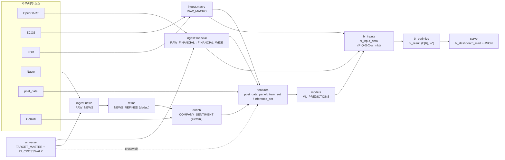
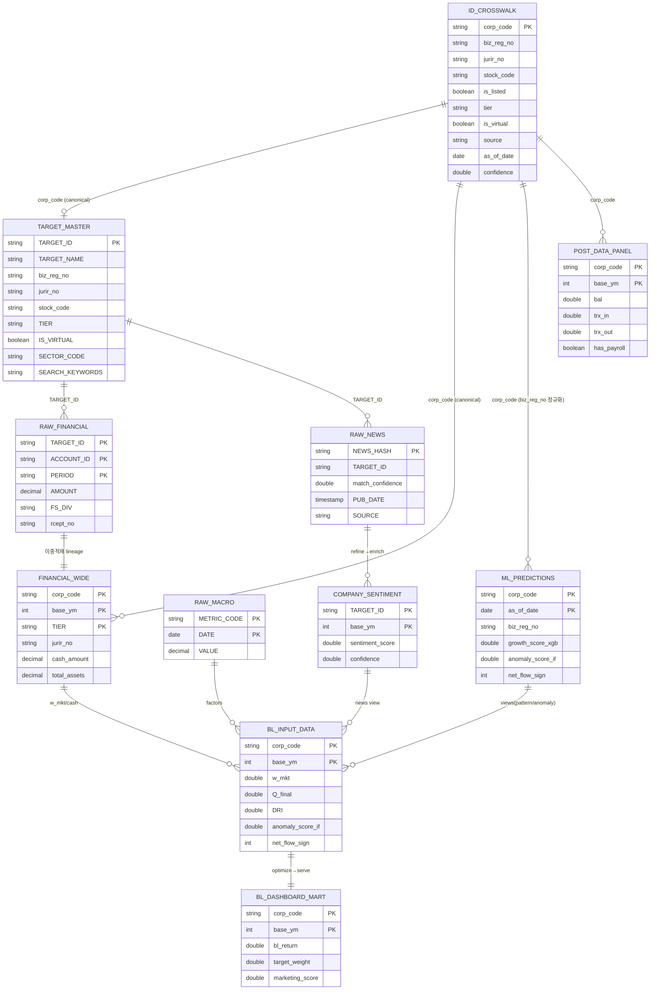
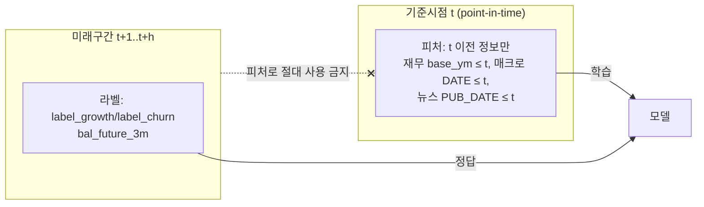
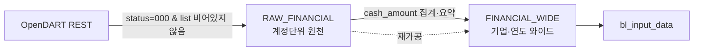

- 문서명: BL 데이터 파이프라인 설계서 (Data Pipeline Design)
- 버전: v0.3
- 작성일: 2026-06-07
- 상태: Draft
- 작성주체: 데이터사이언스팀
- 관련문서:
  - [01 시스템 아키텍처](./01-system-architecture.md)
  - [03 BL 모델 설계](./03-bl-model-design.md)
  - [04 연산(Compute) 설계](./04-compute-design.md)
  - [05 대시보드 설계](./05-dashboard-design.md)
  - [ADR-0001 연산 백엔드](./adr/ADR-0001-compute-backend.md)
  - [ADR-0002 저장 포맷](./adr/ADR-0002-storage-format.md)
  - [ADR-0003 식별자 매핑](./adr/ADR-0003-identifier-mapping.md)
  - [ADR-0004 누수 차단 학습](./adr/ADR-0004-leakage-free-training.md)
  - [기획 01 프로젝트 개요](../planning/01-project-overview.md) · [기획 02 PRD](../planning/02-prd.md) · [기획 04 용어집](../planning/04-glossary.md)

---

# BL 데이터 파이프라인 설계서

> 본 문서는 BL의 **데이터 계약(data contract)** 을 확정한다. 외부 소스에서 BL 입력 행렬까지 흐르는 모든 단계의 입력/출력 테이블, 스키마, 식별자 매핑, 시점 정합, 결정성·멱등성, 품질 게이트, 리니지를 정의한다. 모든 테이블·컬럼·식별자·파라미터는 실제 파이프라인(노트북 `01_collect`→`11_대시보드`, DuckDB `raw_collection.duckdb`, 산출물 `bl_input_details_T1_202510.csv`·`bl_dashboard_mart.csv`)을 반영하며, 과거 Colab 토이의 결함을 클라우드 격상판에서 **구조적으로 차단**하는 설계를 명시한다.
>
> 본 문서가 권위 소스(authoritative source)인 영역: 소스 인벤토리, ETL 단계 계약, DuckDB/Parquet 스키마(특히 `bl_input_data`·`bl_dashboard_mart` 컬럼명·별칭 매핑), ID crosswalk 규칙, 시점정합·누수방지 절차, 결정성·멱등성 규약, 데이터 품질 검증, 리니지. BL 수식 자체는 [03 BL 모델 설계](./03-bl-model-design.md)로 위임한다. 다운스트림 문서([05 대시보드](./05-dashboard-design.md))의 마트 컬럼명은 본 문서 §3.2.3을 단일 기준으로 따른다.

## 0. 요약 (TL;DR)

| 영역 | 과거(Colab 토이) | 격상판(본 설계) |
| --- | --- | --- |
| 식별자 결합 | `biz_reg_no`↔`jurir_no` 직접 오조인 → 추정 99.4% `tier=UNKNOWN` 소실 | **명시적 `ID_CROSSWALK`**, canonical key=`corp_code`, 직접조인 금지 + 커버리지 게이트 |
| 페이지네이션 | `OFFSET` without `ORDER BY` (추정 ~38% 누락) | **결정적 정렬키 + 단일 쿼리/keyset 페이지네이션** |
| 시점 정합 | `bal_future_3m`이 피처+라벨 동시 사용(look-ahead) | **피처/라벨 시점 분리, `bal_future_*` 피처 차단, ASOF JOIN** |
| 스케일링 | 추론배치 min/max 정규화(누수·비재현) | **train-fit 고정 스케일러**(JSON/Parquet 파라미터 저장) |
| 직렬화 | `.pkl` Drive 산란 | **DuckDB(운영) + Parquet(교환), pickle 폐기** |
| 멱등성 | 비멱등 INSERT, 중복/소실 혼재 | **`INSERT OR REPLACE` upsert + 원자적 교체(atomic rename)** |
| 검증 | 게이트 부재 | **pandera류 스키마·무결성·누수 감사 게이트(위반 시 빌드 실패)** |

핵심 원칙: **No-Crawl 우선**(안정 API/공공데이터만), **canonical key는 `corp_code`**, **모든 결합은 crosswalk 경유**, **모든 산출물은 결정적·멱등·시점정합**.

---

# 1. 소스 인벤토리 (Source Inventory)

BL은 5개 데이터 출처(OpenDART·ECOS·FinanceDataReader·Naver·내부 post_data)를 결합하고, 뉴스 감성은 Gemini로 enrich한다. 모든 외부 출처는 **공식 API/공공데이터**만 사용하며, 비공식 HTML 크롤링은 금지한다(IP 차단·법적 리스크·재현성 저하 회피, [01 아키텍처 §2.3](./01-system-architecture.md) No-Crawl 우선).

## 1.1 소스 요약 표

| 소스 | Track/용도 | 엔드포인트/접근 | 주기 | 핵심 식별자(적재 단위) | 쿼터/한도(추정·공개기준) | 산출 테이블 | No-Crawl |
| --- | --- | --- | --- | --- | --- | --- | --- |
| **OpenDART OpenAPI** | 재무(T1/T2) | `GET https://opendart.fss.or.kr/api/fnlttSinglAcntAll.json` (`corp_code`, `bsns_year`, `reprt_code=11011`, `fs_div=CFS/OFS`); 기업개황 `company.json`; 고유번호 `corpCode.xml` | 연 1회(사업연도) + 증분 | `corp_code`(PK), `biz_reg_no`·`jurir_no`·`stock_code`(crosswalk 보조) | 일 약 20,000건(키당, 정책 변동) | `RAW_FINANCIAL`, `FINANCIAL_WIDE`, `ID_CROSSWALK` 원천 | 예(공식 REST) |
| **한국은행 ECOS** | A 매크로(금리·BSI) | `GET https://ecos.bok.or.kr/api/StatisticSearch/...` (기준금리 `722Y001`, KTB3Y `817Y002`, BSI 등) | 월/일 | `(METRIC_CODE, DATE)`(PK) | 일 약 10,000건(키당, 정책 변동) | `RAW_MACRO` | 예(공식 API) |
| **FinanceDataReader** | A 매크로(지수·주가) | `fdr.DataReader('KS11'/stock_code, start, end)` (KOSPI/KOSDAQ 지수, 상장사 주가) | 일 | `stock_code`/지수심볼 + `DATE` | 라이브러리(공개 데이터, 별도 한도 없음) | `RAW_MACRO`(지수), 상장지표 | 예(라이브러리) |
| **Naver 뉴스 API** | B 뉴스 | `GET https://openapi.naver.com/v1/search/news.json` (헤더 `X-Naver-Client-Id/Secret`, `query`, `display`, `start`, `sort`) | 일/주 | `NEWS_HASH`(PK, 멱등), `TARGET_ID`(corp_code 귀속은 `SEARCH_KEYWORDS` 경유) | 일 약 25,000건(앱당, 정책 변동) | `RAW_NEWS`(`SOURCE='naver'`) | 예(공식 API) |
| **post_data(내부)** | 내부 보유/거래 | 내부 DB/CSV 적재(접근통제). 과거 `post_owned_set` PLACEHOLDER | 월/배치 | `corp_code`(or `jurir_no`) → crosswalk | 내부 | `POST_RAW`→`post_data_panel`, `POST_OWNED_CORPS` | 내부(크롤 무관) |
| **Google Gemini** | enrich(감성) | `2.5 Flash-Lite` 생성 API(뉴스 텍스트→감성·confidence) | 신규 뉴스 배치 | `NEWS_HASH`→`TARGET_ID` | 토큰·RPM 한도(요금제 변동) | `COMPANY_SENTIMENT` | N/A(LLM) |

> 비고
> - **재무 수집 전환**: 과거 `OpenDartReader.finstate_all`은 `status='013'`(데이터 없음) + 내부 예외로 실사용 불가 판정되어, **REST 직접 호출**(`fnlttSinglAcntAll.json`)로 전환했다. `status='000'`이고 `list`가 비어 있지 않을 때만 적재한다(빈 응답을 0으로 오해하는 결함 차단).
> - **뉴스 적재 단위·식별자**: 뉴스의 적재/멱등(dedup) 키는 **`NEWS_HASH`** 다(`TARGET_ID`가 아님). `TARGET_ID`는 `RAW_NEWS`에서 `TARGET_MASTER`로의 FK이며, **검색키워드 컬럼은 `SEARCH_KEYWORDS`**(별개)다. 검색키워드→`TARGET_ID`(=`corp_code`) 귀속 규칙·게이트는 §2.1 `ingest.news` 계약과 §7.1에 정의한다(동명 법인·노이즈 기사 오귀속 위험 통제).
> - **쿼터·한도(미검증 단정 금지)**: 위 쿼터 수치는 모두 **공개기준 추정값**이며 키 등급·정책 변경·계약에 따라 달라진다. 레이트리밋 설계는 실측 확정 전까지 보수적으로 운용하고, 정확 수치는 §10 오픈이슈(API 쿼터 실측 확정)로 둔다.
> - **시크릿**: OpenDART `crtfc_key`, ECOS 키, Naver `Client-Id/Secret`, Gemini 키는 모두 **환경변수/Secret Manager**로만 주입(평문 금지). 로그 출력 시 자동 마스킹([01 아키텍처 §8.2](./01-system-architecture.md)).
> - **레이트리밋·재시도**: 모든 API 클라이언트는 지수 백오프(exponential backoff)·최대 재시도·쿼터 가드를 둔다. 부분 실패는 데드레터 테이블 `DEAD_LETTER`로 분리 적재하여 silent drop을 금지한다(§7.3).
> - **public demo**: GitHub Pages 데모는 외부 키 없이 **합성 샘플데이터**만 사용한다.

## 1.2 소스→Tier/Track 매핑

| Tier | 정의 | 주력 소스 |
| --- | --- | --- |
| **T1** 상장·외감 | `stock_code` 보유, DART 재무 충실 | OpenDART(재무), FDR(주가/지수), Naver(뉴스) |
| **T2** 비상장·중소 | 재무 공시 제한적 | OpenDART(가용분), Naver(대안 신호 우선) |
| **T3** 가상 섹터 노드(`IS_VIRTUAL=True`) | 업종 대표 가상 자산 | ECOS/FDR(매크로·섹터), 집계 신호 |

| Track | 소스 | 적재 테이블 |
| --- | --- | --- |
| **A 매크로** | ECOS(기준금리·BSI), FDR(지수) | `RAW_MACRO` |
| **B 뉴스** | Naver 뉴스 API | `RAW_NEWS` (`SOURCE='naver'`) |

---

# 2. 단계별 ETL (Stage Contracts)

논리 파이프라인은 다음과 같다. 각 단계는 단일 책임을 가지며 상위→하위 단방향으로만 의존한다([01 아키텍처 §3.3](./01-system-architecture.md)).

```
universe → ingest → refine → enrich → features → models → bl_inputs → bl_optimize → serve
```



## 2.1 단계 계약 표 (입력 → 출력)

> 표기 주의: `features` 단계에서 **입력 `POST_RAW`(내부 원천)** 와 **출력 `post_data_panel`(자산×`base_ym` PIT 패널, 통합 산출)** 은 서로 다른 객체다. 과거 두 개념이 모두 `post_data`로 불려 순환처럼 보이던 모호성을 제거한다(§5.2 시점 그리드 정의 참조).

| # | 단계 | 책임 | 입력 | 출력 | 결정성/멱등 핵심 | 노트북 대응 |
| --- | --- | --- | --- | --- | --- | --- |
| 0 | **universe** | T1/T2/T3 타겟 마스터 구성·복원, crosswalk 채움. T3는 가상 섹터 노드. | DART `corpCode.xml`/`company.json`, ML·감성·재무 후보(FULL OUTER JOIN → `TMP_T1_CANDIDATES`) | `TARGET_MASTER`, `ID_CROSSWALK`, `TARGET_CALENDAR`(자산×`base_ym` 시점 그리드) | `corp_code` 정렬, `INSERT OR REPLACE` | TARGET_MASTER, 01, 09 |
| 1 | **ingest.financial** | OpenDART REST 재무 적재(이중적재). | `corp_code` 리스트, `bsns_year`, `reprt_code=11011`, `fs_div` | `RAW_FINANCIAL`(계정단위), `FINANCIAL_WIDE`(기업·연도 요약+`cash_amount`) | `(TARGET_ID,ACCOUNT_ID,PERIOD)` 키, `FULL_REBUILD`/`ONLY_EMPTY` 플래그, **재공시 정정 감지 재적재**(§6.3) | 01 |
| 1 | **ingest.macro** | ECOS·FDR 매크로/지수 적재(Track A). | `METRIC_CODE`, `DATE` 범위 | `RAW_MACRO` | `(METRIC_CODE,DATE)` 키, upsert | 02 |
| 1 | **ingest.news** | Naver(B) 뉴스 적재 + **키워드→`TARGET_ID`(corp_code) 귀속**. | `SEARCH_KEYWORDS`(TARGET별), 기간 | `RAW_NEWS`(+`match_confidence`) | `NEWS_HASH` 키(멱등), keyset 페이지네이션, **결정적 키워드 매칭 규칙**(§7.1 오귀속 게이트) | 03 |
| 2 | **refine** | 유사뉴스 dedup, Kiwi 키워드 추출. | `RAW_NEWS` | `NEWS_REFINED` | 결정적 dedup(해시+정렬키) | 05 |
| 3 | **enrich** | Gemini 2.5 Flash-Lite 감성 + confidence **캘리브레이션**. | `NEWS_REFINED` | `COMPANY_SENTIMENT`(`sentiment_score`, `event_cnt`, `confidence`) | confidence 하드코딩 금지, `NEWS_HASH` 멱등 | 06 |
| 4 | **features** | 시점분리 시계열·재무·매크로·감성 피처 + 라벨. crosswalk 경유 결합. | `FINANCIAL_WIDE`, `RAW_MACRO`, `COMPANY_SENTIMENT`, `POST_RAW`, `TARGET_CALENDAR`, `ID_CROSSWALK` | `post_data_panel`(통합 PIT 패널), `train_set.parquet`, `inference_set.parquet` | ASOF JOIN(좌변=`TARGET_CALENDAR`), `bal_future_*` 피처 차단, 고정 스케일러 | 07 |
| 5 | **models** | XGBoost(성장/이탈)·IsolationForest(이상). 시점분리 검증. | `train_set`/`inference_set` | `ML_PREDICTIONS`(`growth_score_xgb`, `prob_growth_raw`, `prob_churn_raw`, `anomaly_score_if`, `as_of_date`) | walk-forward, train-fit 스케일러 재사용 | 08 |
| 6 | **bl_inputs** | P·Q·Ω·Σ(FULL)·`w_mkt` 구성, 단위정합. `as_of_date`↔`base_ym` 시점 정합. | `ML_PREDICTIONS`, `COMPANY_SENTIMENT`, `FINANCIAL_WIDE`, `RAW_MACRO`, `post_data_panel`, crosswalk | `bl_input_data.parquet`(자산×`base_ym`) + `bl_sigma/bl_P/bl_omega.parquet` 사이드카 | 자산 dedup(법인=1자산), 단위통일, ASOF로 `ML_PREDICTIONS` base_ym 정합 | 09 |
| 7 | **bl_optimize** | 사후 $E[R]$, 최적가중 $w^*$ 산출. | `bl_input_data` | `bl_result.parquet`(`bl_return`, `target_weight`, `weight_diff`) | **cvxpy(볼록 QP)=전역최적 결정적**; **비볼록(최대 Sharpe/IR) SLSQP는 시드·초기값($x_0=w_{hybrid}$)·다중시작 시드 고정으로 결정성 확보**([03 BL §7.3](./03-bl-model-design.md)), 정상범위 검증 | 10 |
| 8 | **serve** | 마케터용 마트·외부 JSON 생성. | `bl_result`, `ML_PREDICTIONS`, `COMPANY_SENTIMENT`, `post_data_panel` | `bl_dashboard_mart.parquet`, `*.json` | HTML/데이터 분리, 라벨 단일소스, **별칭 매핑(§3.2.3)** | 11 / 11-1 |

> 비고: 과거 노트북 명칭은 `01_collect`, `02_track_A`, `03_track_B`, `04_track_C`(격상판 제외: BigKinds 폐쇄적 API), `05_유사뉴스_정제`, `06_gemini_처리`, `07_학습데이터_전처리`, `08_모델학습`, `09_BL_input_전처리`, `10_BL 모델 최적화`, `11_대시보드`에 대응한다. 격상판은 로직을 `src/bl/` 패키지로 이전하고 노트북은 얇은 호출자로만 둔다.

---

# 3. 데이터 스키마 (Data Schema)

저장은 **DuckDB(수집/적재/OLAP)** + **Parquet(분석/교환)** 이중구조다. pickle은 폐기한다([ADR-0002](./adr/ADR-0002-storage-format.md)). 명명 규약: 원천/가공 DuckDB 테이블은 대문자 스네이크(`RAW_*`, `FINANCIAL_WIDE`), 분석/서빙 Parquet은 소문자 스네이크(`train_set`, `bl_dashboard_mart`). 식별자는 영문 스네이크(`corp_code` 등).

> **식별자 컬럼명 통일**: 사업자등록번호는 전 테이블에서 `biz_reg_no`로 통일한다. DART 원천 표기 `bizr_no`는 `RAW_FINANCIAL`/`company.json` 적재 시점에만 일시 존재하며, 정규화 직후 `biz_reg_no`로 rename한다(§4.2.2). `TARGET_MASTER`의 마스터 컬럼도 `biz_reg_no`를 정식 명칭으로 사용한다.

## 3.1 DuckDB 테이블

### 3.1.1 `TARGET_MASTER` (마스터)

BL 유니버스의 메인 키 테이블. T1/T2/T3 전 타겟을 담는다.

| 컬럼 | 타입 | 키/제약 | 설명 |
| --- | --- | --- | --- |
| `TARGET_ID` | VARCHAR | **PK** | 표준 자산 키(=`corp_code`, T3는 내부 가상코드) |
| `TARGET_NAME` | VARCHAR | NOT NULL | 회사명(없으면 `corp_code` 대체) |
| `biz_reg_no` | VARCHAR(10) | 형식검증 | 사업자등록번호(국세청, 10자리). DART 원천 `bizr_no`를 정규화한 명칭 |
| `jurir_no` | VARCHAR(13) | 형식검증 | 법인등록번호(등기, 13자리) |
| `stock_code` | VARCHAR(6) | nullable | 상장 종목코드(T1만) |
| `TIER` | VARCHAR | ENUM(T1/T2/T3) | 고객축 |
| `IS_VIRTUAL` | BOOLEAN | default false | T3 가상 섹터 노드 여부 |
| `SECTOR_CODE` | VARCHAR | FK→섹터 | 업종/섹터 코드(예 `64121`=은행) |
| `induty_code` | VARCHAR | | DART 업종코드 |
| `adres`,`phn_no`,`fax_no`,`hm_url`,`est_dt` | VARCHAR | | 기업개황(`company.json`) |
| `SEARCH_KEYWORDS` | VARCHAR | | 뉴스 검색키워드(Track B). `TARGET_ID`와 별개 컬럼 |
| `LAST_COLLECTED`,`CREATED_AT` | TIMESTAMP | | 수집 메타 |

### 3.1.2 `RAW_FINANCIAL` (원천 재무, 이중적재 RAW측)

DART 계정 단위 원천. 보존 강점인 RAW+WIDE 이중적재 lineage의 RAW측.

| 컬럼 | 타입 | 키/제약 | 설명 |
| --- | --- | --- | --- |
| `TARGET_ID` | VARCHAR | **PK1**, FK→TARGET_MASTER | `corp_code` |
| `ACCOUNT_ID` | VARCHAR | **PK2** | IFRS 계정코드(예 `ifrs-full_CashAndCashEquivalents`) |
| `PERIOD` | VARCHAR(4) | **PK3** | 사업연도(예 `'2023'`) |
| `ACCOUNT_NM` | VARCHAR | | 계정명(한/영 혼재) |
| `AMOUNT` | DECIMAL(18,2) | | `thstrm_amount`(콤마 제거 후) |
| `FS_DIV` | VARCHAR | ENUM(CFS/OFS) | 연결/별도 |
| `rcept_no` | VARCHAR | | DART 접수번호(재공시·정정 감지용, §6.3) |
| `COLLECTED_AT` | TIMESTAMP | default now | |

### 3.1.3 `FINANCIAL_WIDE` (가공 재무 + 월렛)

기업·연도 단위 와이드 요약. `cash_amount`가 BL 월렛(지갑) 프록시다.

| 컬럼 | 타입 | 키/제약 | 설명 |
| --- | --- | --- | --- |
| `corp_code` | VARCHAR | **키1**, FK | 표준 키 |
| `base_ym` | INTEGER | **키2** | 사업연도 연말(`year*100+12`, 예 `202312`). 재무 패널은 12월만 유효 |
| `TIER` | VARCHAR | **키3** | T1/T2 |
| `jurir_no` | VARCHAR(13) | | 법인등록번호(추적용, 결합키 아님) |
| `revenue` | DECIMAL(18,2) | | 매출 |
| `operating_profit` | DECIMAL(18,2) | | 영업이익 |
| `net_income` | DECIMAL(18,2) | | 당기순이익 |
| `total_assets` | DECIMAL(18,2) | | 총자산 |
| `total_liabilities` | DECIMAL(18,2) | | 총부채 |
| `total_equity` | DECIMAL(18,2) | | 총자본 |
| `cash_amount` | DECIMAL(18,2) | | **월렛 프록시**: 현금성자산 + 단기금융상품/단기예금/정기예금 합, 없으면 유동자산 fallback |

> `cash_amount` 산정: `ifrs-full_CashAndCashEquivalents` + `ACCOUNT_NM` LIKE(단기금융상품/단기예금/정기예금/정기예적금) 합산(short_term_deposits). 둘 다 없으면 `ifrs-full_CurrentAssets` fallback. 이 컬럼이 $w_{mkt}$(지갑규모 비중)의 **재무보유 고객 원천**이다. **비재무(T2 일부/T3) 고객의 wallet_size는 섹터중앙값 배수로 추정**하며, 산정 규칙 전체는 [03 BL §4.1](./03-bl-model-design.md)이 권위 정의다(§3.2.2 `w_mkt` 비고 참조).

### 3.1.4 `RAW_MACRO` (거시지표, Track A)

| 컬럼 | 타입 | 키/제약 | 설명 |
| --- | --- | --- | --- |
| `METRIC_CODE` | VARCHAR | **PK1** | ECOS 통계표코드/지수심볼(예 `722Y001`, `KS11`) |
| `DATE` | DATE | **PK2** | 기준일자 |
| `METRIC_NAME` | VARCHAR | | 한/영 설명 |
| `VALUE` | DECIMAL(18,6) | | 값 |
| `FREQ` | VARCHAR | ENUM(D/M) | 주기 |
| `COLLECTED_AT` | TIMESTAMP | | |

### 3.1.5 `RAW_NEWS` (원천 뉴스, Track B)

| 컬럼 | 타입 | 키/제약 | 설명 |
| --- | --- | --- | --- |
| `NEWS_HASH` | VARCHAR | **PK** | 정규화 본문 해시(중복 차단·멱등 키) |
| `TARGET_ID` | VARCHAR | FK→TARGET_MASTER | `corp_code`. 검색키워드→corp_code 귀속 결과(매칭 경유) |
| `match_confidence` | DOUBLE | [0,1] | 키워드→`TARGET_ID` 귀속 신뢰도(동명·노이즈 통제, §7.1) |
| `TITLE`,`DESCRIPTION` | VARCHAR | | 제목/요약 |
| `PUB_DATE` | TIMESTAMP | | 발행시점(시점정합 핵심) |
| `SOURCE` | VARCHAR | ENUM(naver) | 뉴스 출처(Naver) |
| `URL` | VARCHAR | | 원문 링크 |
| `COLLECTED_AT` | TIMESTAMP | | |

> 과거 RAW_NEWS에 있던 `GEMINI_SCORE` 인라인 컬럼은 격상판에서 enrich 단계 산출(`COMPANY_SENTIMENT`)로 **분리**한다(원천/가공 책임 분리, 재적재 시 감성 재계산 격리).
>
> **뉴스→법인 귀속 규칙(ingest.news)**: `SEARCH_KEYWORDS`로 수집한 기사는 (1) 정확 상호·식별 토큰 매칭을 우선하고, (2) 동명 법인은 섹터·지역·식별 토큰 보조로 분리하며, (3) 매칭 신뢰도가 임계 미만이면 corp_code를 부여하지 않고 보류 큐로 라우팅한다. 신뢰도는 `match_confidence`로 보존하고, 오귀속 정밀도 점검은 §7.1에 게이트로 둔다(텍스트 매칭은 ID_CROSSWALK 식별자 키 규칙의 보호를 받지 못하므로 별도 통제).

### 3.1.6 `COMPANY_SENTIMENT` (가공 감성, enrich)

뉴스 감성의 **원천(canonical) 컬럼은 `sentiment_score`** 다. 다운스트림에서의 별칭(`gemini_score`, `news_sentiment`)은 §3.4 별칭 매핑표에서 고정한다.

| 컬럼 | 타입 | 키/제약 | 설명 |
| --- | --- | --- | --- |
| `TARGET_ID` | VARCHAR | **키1**, FK | `corp_code` |
| `base_ym` | INTEGER | **키2** | 집계 기준월 |
| `sentiment_score` | DOUBLE | [-1,1] | **canonical 뉴스감성**(Gemini 산출). `gemini_score`/`news_sentiment`의 원천 |
| `event_cnt` | INTEGER | | 기간 내 이벤트 수 |
| `event_type` | VARCHAR | ENUM(funding/M&A/litigation/regulatory/leadership/none 등) | 주요 이벤트 유형. enrich 단계가 본문에서 분류 추출 |
| `confidence` | DOUBLE | [0,1] | **검증셋 캘리브레이션**(하드코딩 금지). `sentiment_confidence`의 원천 |
| `news_window` | VARCHAR | | 집계 윈도우(예 최근3M/6M) |

> 컬럼 정리: 과거안의 `risk_score`는 산출식·소비처가 부재한 고아 컬럼이어서 **스키마에서 제거**했다(다운스트림 4축은 `sentiment_score`만 사용; [03 BL §5.1](./03-bl-model-design.md)). `event_type`은 위 ENUM 도메인으로 한정하고, enrich 단계가 본문 분류로 채운다(현재 ENUM 집합은 잠정안, §10).

### 3.1.7 `ML_PREDICTIONS` (가공 ML 예측, models)

XGBoost(성장/이탈)·IsolationForest(이상) 출력. 시점분리 검증을 통과한 출력만 적재.

| 컬럼 | 타입 | 키/제약 | 설명 |
| --- | --- | --- | --- |
| `corp_code` | VARCHAR | **키1**, FK | 표준 키 |
| `as_of_date` | DATE | **키2** | 예측 기준시점(시점정합 필수) |
| `biz_reg_no` | VARCHAR(10) | crosswalk 검증 | 사업자번호(추적·표시용, **결합키로 직접 사용 금지**) |
| `sector_code` | VARCHAR | | 섹터 |
| `growth_score_xgb` | DOUBLE | | XGBoost 성장 스코어 |
| `prob_growth_raw` | DOUBLE | [0,1] | 성장확률(원시) |
| `prob_churn_raw` | DOUBLE | [0,1] | 이탈확률(원시) |
| `anomaly_score_if` | DOUBLE | | **IsolationForest 이상점수(canonical)**. 다운스트림 표시명 `anomaly_score_raw`의 원천(§3.4) |
| `net_flow_sign` | TINYINT | ENUM(-1/0/+1) | `sign(trx_in − trx_out)` 사전계산. anomaly 축 방향성([03 BL §5.1](./03-bl-model-design.md)) |
| `confidence` | DOUBLE | [0,1] | 캘리브레이션 신뢰도 |
| `model_version` | VARCHAR | | 모델/스케일러 버전 |

> `biz_reg_no`는 과거 결함의 진원지다. **`ML_PREDICTIONS`는 적재 시 crosswalk로 `corp_code` 정규화**하며, `biz_reg_no`는 추적용으로만 보존하고 결합키로 직접 사용하지 않는다(§4).
>
> **시점키 변환 규약**: `ML_PREDICTIONS`는 일자 키 `as_of_date`(DATE)를 쓰고, 재무·감성·BL 패널은 월 키 `base_ym`(INTEGER)을 쓴다. `bl_inputs`(6) 단계는 `base_ym = year(as_of_date)*100 + month(as_of_date)`로 정규화한 뒤, `base_ym` 그리드에 대해 ASOF(`as_of_date ≤ 기준월말`)로 정합한다(미래 예측 누수 차단, §5.2).

## 3.2 Parquet 데이터셋 (분석/교환)

### 3.2.1 `train_set.parquet` / `inference_set.parquet` (features, post_data_panel 파생)

자산 × `base_ym` 패널. 학습용(`train_set`)과 추론용(`inference_set`)은 **동일 스키마·동일 고정 스케일러**를 사용하되 시점만 다르다([ADR-0004](./adr/ADR-0004-leakage-free-training.md)).

| 컬럼 | 타입 | 역할 | 설명 |
| --- | --- | --- | --- |
| `corp_code` | string | 키 | 표준 자산 키 |
| `base_ym` | int32 | 키/시점 | 기준월(point-in-time) |
| `tier` | string | 차원 | T1/T2/T3 |
| `sector_code` | string | 차원 | 섹터 |
| `has_financial` | bool | 피처/그룹 | 재무 유무(2그룹 모델링 분기) |
| `revenue`,`total_assets`,`net_income`,`cash_amount` | double | 피처 | 재무(시점 t 이전) |
| `size`,`margin`,`leverage`,`wallet_ratio` | double | 피처 | 재무 파생 |
| `rate_base`,`ktb3y`,`bsi` | double | 피처 | 매크로(ASOF, t 이전) |
| `sentiment_score`,`event_cnt` | double | 피처 | 감성(t 이전 윈도우) |
| `relationship_score`,`trx_activity_score`,`account_count`,`has_payroll`,`is_main_bank` | double/int/bool | 피처 | 거래관계(post_data_panel) |
| `trx_in`,`trx_out` | double | 피처 | 입출금 흐름(anomaly 방향성 산출) |
| `bal` | double | 피처 | 현 잔액(시점 t) |
| `r_log` | double | 파생 | 잔액 log-return(공분산 입력) |
| `label_growth`,`label_churn` | int8 | **라벨** | 미래구간(t+h)에서만 생성 |
| `bal_future_3m` | double | **라벨 전용·피처 금지** | look-ahead 차단 대상 |
| `split` | string | 메타 | ENUM(train/valid/test), as_of 시간순 |
| `scaler_version` | string | 메타 | 적용 고정 스케일러 버전(§5.3) |

> **금지 피처 목록(차단)**: `bal_future_*`, 라벨 파생 변수, 미래 시점 매크로/감성. features 단계의 누수 감사(§5.4)가 이 목록을 강제한다.

### 3.2.2 `bl_input_data.parquet` (bl_inputs)

BL 최적화 직전 입력 묶음. 자산별 단위정합 상태로 보관(실제 산출 `bl_input_details_T1_202510.csv` 스키마 반영). **4축 앙상블($Q_{final}$)의 모든 원천 신호를 한 행에 갖춘다**(news/pattern/anomaly/relationship).

| 컬럼 | 타입 | 역할 | 설명 |
| --- | --- | --- | --- |
| `corp_code` | string | **키** | 표준 자산 키(자산 dedup 후 1법인=1행) |
| `corp_name` | string | 표시 | 회사명 |
| `sector_code` | string | 차원 | 섹터 |
| `base_ym` | int32 | 시점 | 기준월(예 202510) |
| `bal` | double | 입력 | 현 지갑 잔액 |
| `Q_final` | double | 뷰값 $Q$ | 4축 앙상블(단위정합, [03 BL §5.2](./03-bl-model-design.md)) |
| `DRI` | double | $\Omega$ 원천 | 데이터신뢰도지수 |
| `w_current` | double | 비중 | 현재 자사 예금 잔액 비중 |
| `w_mkt` | double | **앵커** | 지갑규모 비중($\Pi$ 앵커) |
| `w_hybrid` | double | 초기값/턴오버 | `0.7 w_current + 0.3 w_mkt` (앵커 아님) |
| `prob_growth_raw`,`prob_churn_raw` | double | 뷰 원천 | **pattern 축**(`prob_growth_raw − prob_churn_raw`) |
| `gemini_score` | double | 뷰 원천 | **news 축**(= `COMPANY_SENTIMENT.sentiment_score` 별칭, §3.4) |
| `anomaly_score_if` | double | 뷰 원천 | **anomaly 축 크기**(= `ML_PREDICTIONS.anomaly_score_if`) |
| `net_flow_sign` | int8 | 뷰 원천 | **anomaly 축 방향** `sign(trx_in − trx_out)`. anomaly 기여 = `anomaly_score_if × net_flow_sign`([03 BL §5.1](./03-bl-model-design.md)) |
| `relationship_score`,`trx_activity_score`,`account_count`,`has_payroll`,`is_main_bank` | double/int/bool | 뷰/제약 | **relationship 축**·제약 |
| `confidence` | double | $\Omega$ 보정 | 캘리브레이션 신뢰도 |

> **4축→$Q_{final}$ 매핑(컬럼명 고정, [03 BL §5.1](./03-bl-model-design.md)와 동일)**: news=`gemini_score`, pattern=`prob_growth_raw − prob_churn_raw`, anomaly=`anomaly_score_if × net_flow_sign`, relationship=`relationship_score`. 네 축 모두 `bl_input_data`에서 재현 가능해야 BL 입력 계약이 충족된다.
>
> **$w_{mkt}$ 산정**: 재무보유 고객은 `FINANCIAL_WIDE.cash_amount` 유래(§3.1.3), **비재무(T2 일부/T3) 고객은 섹터중앙값 배수 추정**(혼합 규칙의 권위 정의는 [03 BL §4.1](./03-bl-model-design.md)). 두 경로 모두 자산 dedup 후 합=1로 정규화한다.
>
> $\Sigma$(FULL 공분산)·$P$·$\Omega$ 행렬은 행렬 형태로 별도 Parquet/사이드카(`bl_sigma.parquet`, `bl_P.parquet`, `bl_omega.parquet`)에 **자산 정렬키와 함께** 저장한다(pickle 금지). 정렬·차원 검증 규칙은 §3.5·§7.1, 구성 수식은 [03 BL §3·§5](./03-bl-model-design.md).

### 3.2.3 `bl_dashboard_mart.parquet` (serve)

대시보드·영업용 최종 마트(실제 산출 `bl_dashboard_mart.csv` 50여 컬럼 반영, 핵심 발췌). **본 표가 마트 컬럼명의 단일 권위 스키마**이며, [05 대시보드](./05-dashboard-design.md)의 스코어카드·데이터계약 표는 이 컬럼명을 그대로 따른다(별칭 매핑은 §3.4).

| 컬럼 | 타입 | 역할 | 설명 |
| --- | --- | --- | --- |
| `corp_code`,`target_id` | string | 키 | 표준 키(crosswalk 기준). 05의 `TARGET_ID` 표기는 `target_id`와 동치 |
| `biz_reg_no` | string | 표시·추적 | 사업자번호(결합 키 아님, 운영본만) |
| `corp_name`,`tier`,`region_main`,`sector_code`,`sector_name` | string | 차원 | |
| `current_bal`,`total_bal_post` | double | 잔액 | 현 잔액 |
| `total_assets`,`revenue`,`net_income`,`volatility_6m` | double | 재무 | |
| `has_financial` | bool | 그룹 | |
| `prob_growth_raw`,`prob_churn_raw`,`anomaly_score_raw`,`news_sentiment`,`sentiment_confidence` | double | 신호 | **4축 원천**(별칭: §3.4) |
| `pi`,`q`,`omega` | double | BL 사전·뷰·불확실성(자산별 요약) | 스코어카드용. `bl_input_data`/사이드카에서 자산별 스칼라 요약으로 산출 |
| `bl_return` | double | $E[R]$ | 사후 기대수익. 05의 `er`와 동치 |
| `current_weight`,`market_weight`,`target_weight`,`weight_diff` | double | 비중 | $w_{current}/w_{mkt}/w^*/\Delta$ |
| `marketing_score` | double | [0,100] | 영업 우선순위 |
| `action_guide` | string | 라벨 | 적극유치/유지/관망(단일 상수 모듈) |
| `funding_gap`,`gap_val`,`gap_raw` | double | KRW | 자금 격차 |
| `account_count`,`avg_trx_in`,`avg_trx_out`,`has_payroll`,`is_main_bank` | num/bool | 거래 | post_data_panel |
| `op_bl`,`op_ml`,`op_gemini`,`marketing_note` | string | 설명 | 근거/메모 |

> 스코어카드 $\Pi/Q/\Omega$ 표시는 `pi`/`q`/`omega` 컬럼(자산별 스칼라 요약)으로 마트에 포함한다. 자산×자산 행렬 전체가 필요한 경우(검증·내부 DS 화면)는 `bl_input_data` 사이드카(`bl_sigma/bl_P/bl_omega.parquet`)를 출처로 명시한다.
>
> 메타데이터(`bl_dashboard_metadata.json`)는 `base_ym`, `tier`, `total_records`, `data_sources`(`ML_PREDICTIONS`/`COMPANY_SENTIMENT`/`post_data_panel`), `optimization`(τ/λ/max_weight 등), `statistics`(action 카운트, 평균 score/return)를 포함한다. 대시보드는 데이터를 **외부 JSON으로 분리**해 lazy-load한다([05 대시보드](./05-dashboard-design.md)).

## 3.3 ER 관계 (erDiagram)



## 3.4 컬럼 별칭 매핑표 (단일 계보 고정)

동일 양(quantity)이 단계별로 다른 별칭을 가질 때, 아래 표를 **유일한 매핑 권위**로 둔다. serve 단계는 이 매핑에 따라 rename하며, 다른 문서(03/05)는 이 표의 `원천(canonical)` 컬럼을 기준으로 참조한다. 같은 행의 이름들은 **모두 동일 양**이다.

| 양(설명) | 원천(canonical) | `bl_input_data` 별칭 | `bl_dashboard_mart` 별칭 | 05 대시보드 표기 |
| --- | --- | --- | --- | --- |
| 뉴스감성(news 축) | `COMPANY_SENTIMENT.sentiment_score` | `gemini_score` | `news_sentiment` | `news_sentiment` |
| 감성 신뢰도 | `COMPANY_SENTIMENT.confidence` | `confidence` | `sentiment_confidence` | `sentiment_confidence` |
| 이상점수(anomaly 크기) | `ML_PREDICTIONS.anomaly_score_if` | `anomaly_score_if` | `anomaly_score_raw` | `anomaly_score_raw` |
| 자금흐름 방향 | `ML_PREDICTIONS.net_flow_sign` | `net_flow_sign` | (anomaly 부호에 반영) | — |
| 성장확률(pattern) | `ML_PREDICTIONS.prob_growth_raw` | `prob_growth_raw` | `prob_growth_raw` | `prob_growth_raw` |
| 이탈확률(pattern) | `ML_PREDICTIONS.prob_churn_raw` | `prob_churn_raw` | `prob_churn_raw` | `prob_churn_raw` |
| 사후 기대수익 $E[R]$ | `bl_result.bl_return` | — | `bl_return` | `bl_return`(과거 `er` 표기 폐기) |
| 현재/시장/목표 비중 | `bl_input_data` / `bl_result` | `w_current`/`w_mkt`/`target_weight` | `current_weight`/`market_weight`/`target_weight` | `current_weight`/`market_weight`/`target_weight` |
| 고객 키 | `corp_code` | `corp_code` | `corp_code`,`target_id` | `corp_code`/`target_id`(과거 `TARGET_ID` 단독표기 정합) |
| 사업자번호(표시·추적) | `biz_reg_no` | — | `biz_reg_no` | `biz_reg_no`(과거 `bizr_no` 표기 폐기) |

> 주: `anomaly_score_if`(IsolationForest 산출명)와 `anomaly_score_raw`(다운스트림 표시명)는 **같은 양**이다. serve 단계가 `anomaly_score_if → anomaly_score_raw`로 rename하며, [03 BL §5.1](./03-bl-model-design.md)의 `anomaly_score_raw`도 이 양을 가리킨다. 이름이 두 개인 것은 의도된 단계별 표시명 분리이며, silent join 실패를 막기 위해 본 표로 동치를 고정한다.

## 3.5 행렬 사이드카 정렬·차원 규약

$\Sigma$/$P$/$\Omega$ 사이드카는 잘못된 자산에 뷰가 적용되는 조용한 수치오류를 막기 위해 정렬·차원 계약을 강제한다.

| 사이드카 | 차원 | 정렬키(메타) | 검증 |
| --- | --- | --- | --- |
| `bl_sigma.parquet` | $N\times N$ | 행/열 모두 `corp_code` 오름차순 | $N$ = `bl_input_data` 행수, 정렬 일치 |
| `bl_P.parquet` | $K\times N$ | 열 = `corp_code` 오름차순, 행 = 뷰 인덱스 | 열순서 = `bl_input_data` 행순서 |
| `bl_omega.parquet` | $K\times K$(대각) | 행/열 = 뷰 인덱스 | $K$ = `bl_P` 행수 |

- 각 사이드카는 `asset_order`(corp_code 배열) 메타를 가지며, `bl_input_data`의 `corp_code` 정렬과 **바이트 동일**해야 한다(§6 결정성 정렬키 규약 연계).
- 차원·정렬 불일치는 **빌드 실패**다(§7.1).

---

# 4. 식별자 매핑 (ID Crosswalk)

## 4.1 문제: 과거 99.4% 소실의 진원지

과거 토이는 `biz_reg_no`(사업자번호)와 `jurir_no`(법인번호)를 **직접 등호 조인**했다. 두 식별자는 체계도 자릿수도 다른 별개 키(사업자번호 10자리 / 법인번호 13자리)인데 직접 묶은 결과, 추정 **99.4%가 `tier=UNKNOWN`으로 소실**되었다. 실제 산출 `bl_input_details_T1_202510.csv`의 `biz_reg_no` 컬럼에 13자리 값(예 `1101112248882`)이 들어 있는 것은, 사업자번호 칼럼에 법인번호류 값이 혼입된 흔적으로 동일 결함의 증거다.

## 4.2 결정: `ID_CROSSWALK` 단일 진실원천 + canonical key=`corp_code`

[ADR-0003](./adr/ADR-0003-identifier-mapping.md)에 따라 **명시적 매핑 테이블**을 둔다. 모든 출처 데이터는 적재 시 crosswalk를 경유해 `corp_code`로 정규화한 뒤 결합한다. **출처별 식별자 간 직접 조인은 금지**한다.

### 4.2.1 `ID_CROSSWALK` 스키마

| 컬럼 | 타입 | 제약 | 설명 |
| --- | --- | --- | --- |
| `corp_code` | VARCHAR(8) | **PK**, UNIQUE | DART 고유번호(canonical) |
| `biz_reg_no` | VARCHAR(10) | 형식·체크섬 | 사업자번호(10자리) |
| `jurir_no` | VARCHAR(13) | 형식 | 법인번호(13자리) |
| `stock_code` | VARCHAR(6) | nullable | 종목코드(상장사만) |
| `is_listed` | BOOLEAN | | 상장 여부 |
| `tier` | VARCHAR | ENUM | T1/T2/T3/UNKNOWN |
| `is_virtual` | BOOLEAN | | T3 가상 노드 |
| `source` | VARCHAR | | 매핑 출처(DART/내부/이름매칭후보) |
| `as_of_date` | DATE | | 매핑 시점 |
| `confidence` | DOUBLE | [0,1] | 매핑 신뢰도 |

### 4.2.2 식별자 교차표 (canonical=`corp_code`)

| 식별자 | 발급 | 형식 | 결합 규칙 |
| --- | --- | --- | --- |
| `corp_code` | 금감원 DART | 8자리(예 `00126380`) | **canonical key. 모든 결합의 기준.** |
| `biz_reg_no` | 국세청 | 10자리 `XXX-XX-XXXXX` | crosswalk로 `corp_code` 변환 후 결합. 직접조인 금지. DART 원천 `bizr_no`를 적재 직후 rename. |
| `jurir_no` | 법원(등기) | 13자리 `XXXXXX-XXXXXXX` | crosswalk로 `corp_code` 변환 후 결합. `biz_reg_no`와 동일시 절대 금지. |
| `stock_code` | KRX | 6자리(예 `005930`) | 상장사만. FDR 주가/지수 연동. 비상장 결측. |

### 4.2.3 정규화 쿼리 패턴 (직접조인 금지의 구현)

올바름(crosswalk 경유):

```sql
-- ML_PREDICTIONS(corp_code로 사전 정규화됨)를 FINANCIAL_WIDE(corp_code)와 결합
SELECT f.corp_code, f.base_ym, f.cash_amount, m.growth_score_xgb
FROM FINANCIAL_WIDE f
JOIN ID_CROSSWALK x         ON x.corp_code = f.corp_code
JOIN ML_PREDICTIONS m       ON m.corp_code = x.corp_code   -- 사전 정규화된 corp_code로만 조인
WHERE f.base_ym = 202510;
```

금지(이종 식별자 직접조인 — 과거 결함 재현):

```sql
-- ❌ 절대 금지: 사업자번호와 법인번호를 직접 묶음 → 99.4% 소실 재발
SELECT * FROM ML_PREDICTIONS m JOIN FINANCIAL_WIDE f ON m.biz_reg_no = f.jurir_no;
```

## 4.3 무결성·커버리지 게이트 (회귀 가드)

| 게이트 | 규칙 | 위반 시 |
| --- | --- | --- |
| 형식검증 | `biz_reg_no` 10자리, `jurir_no` 13자리, `corp_code` 8자리, 체크섬 | 적재 거부 + 데드레터 |
| 1:1 위반 | 중복 `corp_code`, 한 `biz_reg_no`↔다수 `corp_code` | 빌드 실패 + 리포트 |
| 커버리지(UNKNOWN) | crosswalk로 tier 부여된 비율; **`tier=UNKNOWN` 비율 ≤ 5%(잠정 합격선, 캘리브레이션 전)** | **임계 초과 시 빌드 실패**(99.4% 재발 가드) |
| silent drop 금지 | 미매핑은 버리지 않고 `tier=UNKNOWN` 명시 보존 | 추적·보정 큐로 라우팅 |
| 이름매칭 한정 | 상호 매칭은 후보 생성 보조만, 최종 키 금지 | 키 사용 시 차단 |

> **UNKNOWN 임계치 단일화**: G-식별자 게이트 합격선은 본 문서가 권위 소스로 **잠정 5%**(캘리브레이션 전 보수값)로 확정한다. 03 로드맵의 종전 `<1%`·PRD의 `예: 5%`는 모두 이 값으로 통일하며, 최종 임계는 초기 적재 후 실측으로 재확정한다(§10). [ADR-0003](./adr/ADR-0003-identifier-mapping.md).

---

# 5. 시점 정합·누수 방지 (Temporal Integrity)

[ADR-0004](./adr/ADR-0004-leakage-free-training.md)의 누수금지 표준을 데이터 계층에서 강제한다. 모델 출력이 곧 BL 입력이므로, 시점 누수는 자원배분 의사결정을 직접 오도한다.

## 5.1 피처/라벨 시점 분리



- **라벨**은 미래구간(t+h)에서만 생성. **피처**는 기준시점 t 이전 정보로만 생성(point-in-time).
- `bal_future_3m` 등 미래 잔액 변수는 **라벨 전용**이며 피처 사용을 차단한다(과거 동시 사용=look-ahead).
- 시점분리 split: `train < valid < test`를 `as_of` 시간순으로만 분리(랜덤 셔플 금지). walk-forward(rolling/expanding) 백테스트로 평가([03 BL §9](./03-bl-model-design.md)).

## 5.2 ASOF JOIN의 올바른 사용

서로 다른 주기(연단위 재무, 월/일단위 매크로·뉴스, 일자 ML 예측)를 기준시점에 맞출 때 **DuckDB ASOF JOIN**으로 "기준시점 이전 가장 최근 값"만 가져온다(미래값 차단).

**시점 그리드(좌변)**: ASOF의 좌변은 항상 `TARGET_CALENDAR`(자산×`base_ym` 시점 그리드, universe 단계 산출) 또는 그로부터 파생된 `post_data_panel`이다. 무엇이 기준 패널인지 단일화하여, 입력·출력이 같은 이름으로 섞이던 모호성을 제거한다(§2.1).

```sql
-- 각 (corp_code, base_ym) 기준 '그 시점 이전 최신' 매크로만 결합 (미래 금리 누수 차단)
-- base_ym은 INTEGER(YYYYMM). DuckDB의 '/'는 부동소수 나눗셈이므로 정수 나눗셈 '//' 사용.
SELECT g.corp_code, g.base_ym, m.VALUE AS rate_base
FROM TARGET_CALENDAR g
ASOF JOIN RAW_MACRO m
  ON m.METRIC_CODE = '722Y001'
 AND m.DATE <= last_day(make_date(g.base_ym // 100, g.base_ym % 100, 1))  -- 기준월 말일, 과거 방향만
ORDER BY g.corp_code, g.base_ym;
```

- `base_ym`(INTEGER, 예 `202312`)에서 연=`base_ym // 100`(정수 나눗셈), 월=`base_ym % 100`이다. **`/`(부동소수 나눗셈) 사용 금지**(`202312/100 = 2023.12`로 `make_date` year 인자 깨짐). 월말 비교가 필요하면 `last_day()`로 보정한다.
- ASOF는 반드시 `<=`(과거 방향)으로 둔다. `>=`(미래 방향)은 look-ahead이므로 금지.
- **ML 예측 정합**: `ML_PREDICTIONS.as_of_date`(DATE)는 `base_ym = year(as_of_date)*100 + month(as_of_date)`로 변환 후, `as_of_date ≤ 기준월말`인 최신 예측만 ASOF로 결합한다(§3.1.7).
- 재무는 공시 지연(lag)을 반영해 "사업연도 종료 + 공시까지의 지연"을 더한 가용시점(availability date)을 기준으로 결합한다(연말 재무를 그 연중 피처로 쓰는 누수 차단).

## 5.3 고정 스케일러 (재현·비재누수)

- 스케일러는 **train 구간에서만 fit**하고 파라미터(평균/표준편차/clip 범위 등)를 **JSON/Parquet로 저장**(pickle 금지, [ADR-0002](./adr/ADR-0002-storage-format.md)).
- valid/test/추론은 저장된 파라미터를 **그대로 적용**. 추론 시점 min/max 재계산 금지(과거 결함).
- `inference_set.parquet`는 `train_set`과 동일 스케일러를 참조한다(`scaler_version` 컬럼으로 추적).

## 5.4 누수 감사 (build gate)

| 점검 | 규칙 | 위반 시 |
| --- | --- | --- |
| 시점 겹침 | `max(train.as_of) < min(valid.as_of) < min(test.as_of)` | 빌드 실패 |
| 금지 피처 | `bal_future_*`·라벨파생·미래매크로가 피처셋에 없음 | 빌드 실패 |
| 스케일러 fit 범위 | 스케일러 fit이 train 구간으로 한정 | 빌드 실패 |
| ASOF 방향 | 모든 시점결합이 `<=` 방향 | 코드리뷰·테스트 차단 |
| ML 시점 정합 | `as_of_date→base_ym` 변환 후 `as_of_date ≤ 기준월말` 만 사용 | 빌드 실패 |

---

# 6. 결정적·멱등 처리 (Determinism & Idempotency)

동일 입력·동일 설정이면 동일 산출물이 나와야 한다([01 아키텍처 §2.1](./01-system-architecture.md)).

## 6.1 결정적 정렬 — `OFFSET` 비결정 제거

과거 `OFFSET` without `ORDER BY`는 결과 순서가 비결정이라 페이지 경계에서 행이 중복/누락(추정 ~38% 누락)되었다.

| 영역 | 규칙 |
| --- | --- |
| 페이지네이션 | `OFFSET`은 반드시 **유일·전순서 키**와 `ORDER BY`를 동반. 권장은 **keyset(seek) 페이지네이션**(`WHERE key > :last ORDER BY key LIMIT n`) |
| 정렬키 | 각 단계 산출은 결정적 정렬키로 정렬 후 저장(예 `ORDER BY corp_code, base_ym`). 사이드카 자산순서도 `corp_code` 오름차순으로 고정(§3.5) |
| 단일 쿼리 | 가능하면 페이지 루프 대신 단일 집합 쿼리로 전량 처리(DuckDB OLAP) |
| 외부 API 정렬 | Naver `sort`, DART 호출 순서 등 호출 순서를 `corp_code` 정렬로 고정 |
| 비볼록 솔버 | bl_optimize의 SLSQP 등 비볼록 경로는 시드·초기값($x_0=w_{hybrid}$)·다중시작 시드를 고정해 결정성 확보(§2.1, [03 BL §7.3](./03-bl-model-design.md)) |

올바름:

```sql
-- keyset 페이지네이션: 마지막 처리 키 이후만, 결정적 정렬
SELECT corp_code, base_ym FROM FINANCIAL_WIDE
WHERE (corp_code, base_ym) > (:last_corp, :last_ym)
ORDER BY corp_code, base_ym
LIMIT 1000;
```

금지:

```sql
-- ❌ ORDER BY 없는 OFFSET: 페이지 경계 비결정 → 중복/누락
SELECT * FROM RAW_NEWS LIMIT 1000 OFFSET 5000;
```

## 6.2 멱등 upsert

| 테이블 | 키 | upsert |
| --- | --- | --- |
| `RAW_FINANCIAL` | `(TARGET_ID,ACCOUNT_ID,PERIOD)` | `INSERT OR REPLACE` |
| `FINANCIAL_WIDE` | `(corp_code,base_ym,TIER)` | 키 삭제 후 재적재(교체) 또는 `INSERT OR REPLACE` |
| `RAW_MACRO` | `(METRIC_CODE,DATE)` | `INSERT OR REPLACE` |
| `RAW_NEWS` | `NEWS_HASH` | `INSERT OR IGNORE`(중복 본문 차단) |
| `TARGET_MASTER` | `TARGET_ID` | `INSERT OR REPLACE` |
| `DEAD_LETTER` | `(stage,key,ts)` | append-only |
| Parquet 산출 | 파일 단위 | 임시파일 쓰기 후 **원자적 교체(atomic rename)** |

- 재실행해도 동일 키는 1회 효과만 갖는다(중복 누적 방지).
- Parquet은 부분 쓰기 노출을 막기 위해 `*.tmp`로 쓴 뒤 rename.

## 6.3 Full vs Incremental

| 모드 | 플래그 | 동작 |
| --- | --- | --- |
| Full rebuild | `FULL_REBUILD=True` | `RAW_FINANCIAL`/`FINANCIAL_WIDE` 전체 DELETE 후 풀리빌드 |
| Incremental | `FULL_REBUILD=False` + `ONLY_EMPTY=True` | `(corp_code,base_ym,TIER)` 존재 시 스킵(증분) |
| Replace | `FULL_REBUILD=False` + `ONLY_EMPTY=False` | 해당 키 삭제 후 재적재(교체) |

설정 키는 `BL_FULL_REBUILD`/`BL_ONLY_EMPTY`로 외부화([01 아키텍처 §8.1](./01-system-architecture.md)). 증분 워터마크(`LAST_COLLECTED`)로 신규/변경분만 수집한다.

> **재공시/정정 감지(증분 보완)**: OpenDART 재무는 사업연도 종료 후에도 **재공시·정정**될 수 있어, `LAST_COLLECTED` 단순 증분은 정정 공시를 놓친다. 격상판은 (1) `rcept_no`/접수일자 변경 감지 시 해당 `(corp_code, bsns_year)`를 **강제 Replace**하고, (2) 사업연도 종료 후 정정창(예 N개월) 동안은 재무에 주기적 Replace 모드를 적용한다. 이 규약은 §2.1 `ingest.financial` 계약에 포함된다.

## 6.4 Parquet 스키마 진화 규약

- 컬럼 추가는 nullable 기본값으로 허용(하위호환). 타입 변경·컬럼 삭제는 **버전 디렉터리 분리**(`processed/v2/...`).
- 각 Parquet은 `schema_version` 메타 키를 가지며, 소비단계가 호환 버전을 검증.

---

# 7. 데이터 품질·검증 (Data Quality & Validation)

각 단계 산출은 **검증 게이트**를 통과해야 다음 단계로 흐른다(pandera/great_expectations류). 위반은 silent pass가 아니라 **빌드 실패**다.

## 7.1 검증 규칙 카탈로그

| 분류 | 규칙(예) | 적용 단계 |
| --- | --- | --- |
| 스키마 | 컬럼 존재·dtype·nullability(pandera schema) | 전 단계 |
| 결측 | `corp_code`/`base_ym` non-null, `cash_amount` 결측율 ≤ 임계 | ingest/features |
| 범위 | `prob_*`∈[0,1], `sentiment_score`∈[-1,1], `marketing_score`∈[0,100], `w_*`≥0 | enrich/models/bl/serve |
| 합계 | `Σ target_weight = 1`(허용오차 내), `Σ w_mkt = 1` | bl_optimize |
| 식별자 무결성 | crosswalk 형식·1:1·커버리지(UNKNOWN ≤ 5% 잠정) 게이트(§4.3) | universe/ingest |
| 뉴스 귀속 정밀도 | 키워드→`TARGET_ID` 매칭 표본 정밀도 ≥ 임계, `match_confidence` 분포 점검(오귀속 가드) | ingest.news |
| 시점 누수 | split 시점 겹침·금지피처·ASOF 방향·ML 시점정합(§5.4) | features/models |
| 4축 완전성 | `bl_input_data`에 news/pattern/anomaly/relationship 4축 원천 컬럼 모두 존재·non-null(`anomaly_score_if`·`net_flow_sign` 포함) | bl_inputs |
| 사이드카 정렬 | $\Sigma$/$P$/$\Omega$ 차원·`asset_order`가 `bl_input_data` 행순서와 바이트 일치(§3.5) | bl_inputs |
| 이상치 | `bal` 음수 금지, log-return 0-잔액 분리, `λ`/`κ(Σ)` 정상범위 | features/bl |
| 퇴화 진단 | `median|weight_diff|>1e-4`, score 분포 비퇴화, action 라벨 정합 | serve([03 BL §9.4](./03-bl-model-design.md)) |
| 백엔드 동치 | CPU/GPU 수치 상대오차 `<1e-8`(E[R]·w*·Σ 동일 적용) | bl(회귀테스트, [ADR-0001](./adr/ADR-0001-compute-backend.md)·[04 §골든테스트](./04-compute-design.md)) |

## 7.2 pandera 스키마 예시 (`bl_input_data`)

§3.2.2 실제 컬럼과 동기화하며, anomaly 4축 원천을 포함한다.

```python
import pandera as pa
from pandera import Column, Check

bl_input_schema = pa.DataFrameSchema({
    "corp_code":      Column(str, Check.str_length(8, 8), unique=True, nullable=False),
    # FINANCIAL_WIDE 재무 패널은 연말(12월)만 유효: base_ym % 100 == 12 강제.
    # (비재무 PIT 패널을 함께 검사할 땐 일반 YYYYMM 월 도메인 1..12로 완화 — §3.1.3/§3.1.6 참조)
    "base_ym":        Column(int, [Check.in_range(200001, 209912),
                                   Check(lambda s: (s % 100 == 12), error="재무 base_ym은 연말(12월)만 유효")],
                             nullable=False),
    "bal":            Column(float, Check.ge(0), nullable=False),
    # Q_final 단위정합: [03 BL §5.2]의 |Q|>3σ 클립과 동일 단위(표준화 후 σ 배수)이므로 [-3,3].
    "Q_final":        Column(float, Check.in_range(-3, 3)),
    "DRI":            Column(float, Check.in_range(0.1, 1.0)),   # 0.1 base + 가중합
    "w_mkt":          Column(float, Check.ge(0)),                # 앵커 비중
    "w_current":      Column(float, Check.ge(0)),
    "prob_growth_raw":Column(float, Check.in_range(0, 1)),       # pattern 축
    "prob_churn_raw": Column(float, Check.in_range(0, 1)),       # pattern 축
    "gemini_score":   Column(float, Check.in_range(-1, 1)),      # news 축(= sentiment_score)
    "anomaly_score_if":Column(float, nullable=False),            # anomaly 축 크기
    "net_flow_sign":  Column(int,   Check.isin([-1, 0, 1])),     # anomaly 축 방향
    "relationship_score": Column(float),                         # relationship 축
    "confidence":     Column(float, Check.in_range(0, 1)),
}, checks=[
    Check(lambda df: abs(df["w_mkt"].sum() - 1.0) < 1e-6, error="w_mkt 합≠1"),
])
```

> `Q_final` 범위 [-3,3]은 [03 BL §5.2](./03-bl-model-design.md)의 `|Q|>3σ` 클립과 **단위 정합**(표준화 신호의 σ 배수 단위)이라는 가정에 근거한다. 단위 정의가 캘리브레이션으로 변경되면 본 범위도 함께 갱신한다(§10).

## 7.3 데드레터·관측성

- 수집 실패(API 오류, status≠'000', 형식위반, 뉴스 매칭 미달)는 silent drop 없이 **`DEAD_LETTER` 테이블**(DuckDB)에 분리 적재한다. 운영 데드레터도 Parquet/DuckDB로 통일하며 CSV는 사용하지 않는다(결정적·Parquet 원칙 일관, [ADR-0002](./adr/ADR-0002-storage-format.md)).

| 컬럼 | 타입 | 설명 |
| --- | --- | --- |
| `stage` | VARCHAR | 실패 단계(예 `ingest.financial`) |
| `key` | VARCHAR | 실패 키(corp_code 등) |
| `error_code` | VARCHAR | 분류 코드(API_ERROR/STATUS_NOT_000/FORMAT/MATCH_LOW 등) |
| `payload` | JSON | 원응답/입력 일부(시크릿 마스킹) |
| `ts` | TIMESTAMP | 발생 시각 |

- 각 단계는 구조적 로그(`stage`, `input_rows`, `output_rows`, `as_of`, `backend`, `duration_ms`)와 검증 결과(pass/fail, 위반건수)를 남긴다([01 아키텍처 §8.3](./01-system-architecture.md)).

---

# 8. 리니지·재현성 (Lineage & Reproducibility)

## 8.1 이중적재 lineage

보존 강점인 `RAW_FINANCIAL`(계정단위 원천) → `FINANCIAL_WIDE`(가공 요약) 이중적재를 유지한다. RAW를 보존하므로 가공 로직 변경 시 **재가공만으로 복원** 가능하다(원천 재호출 불필요).



## 8.2 재현성 보장 요소

| 요소 | 방법 |
| --- | --- |
| 결정성 | 결정적 정렬키, 시드 고정(비볼록 솔버 다중시작 포함), keyset 페이지네이션(§6) |
| 고정 스케일러 | train-fit 파라미터 JSON/Parquet 저장·재사용(§5.3) |
| 버전 추적 | `model_version`/`scaler_version`/`schema_version`, crosswalk `as_of_date` |
| 원천 보존 | RAW 이중적재로 재가공 복원(§8.1) |
| 멱등 적재 | upsert + 원자적 교체(§6.2) |
| 백엔드 동치 | CPU/GPU 상대오차 `<1e-8` 회귀테스트(§7.1, [ADR-0001](./adr/ADR-0001-compute-backend.md)) |
| 리니지 메타 | 각 산출 Parquet에 `source_inputs`·`run_id`·`built_at` 메타 |

## 8.3 엔드투엔드 리니지 시퀀스

```mermaid
sequenceDiagram
  participant U as universe
  participant I as ingest
  participant S as DuckDB/Parquet
  participant R as refine/enrich
  participant F as features
  participant M as models
  participant B as bl_inputs/optimize
  participant V as serve

  U->>S: TARGET_MASTER + ID_CROSSWALK + TARGET_CALENDAR (corp_code canonical)
  I->>S: RAW_FINANCIAL→FINANCIAL_WIDE, RAW_MACRO, RAW_NEWS (멱등 upsert)
  S->>R: RAW_NEWS → NEWS_REFINED(dedup) → COMPANY_SENTIMENT(Gemini, 캘리브레이션)
  S->>F: ASOF JOIN(좌변=TARGET_CALENDAR; 재무·매크로·감성·post_data) via crosswalk → train_set/inference_set
  F->>M: 시점분리 split + 고정 스케일러 → ML_PREDICTIONS(as_of_date)
  M->>B: 뷰(P·Q·Ω 4축)·Σ(FULL)·w_mkt → bl_input_data(+사이드카) → bl_result(E[R], w*)
  B->>V: bl_dashboard_mart + 외부 JSON (라벨 단일소스, 별칭 매핑 §3.4)
```

---

# 9. 과거 결함 → 해결 대조표 (Defect ↔ Resolution)

| # | As-is 결함(과거 토이) | 영향 | 격상판 해결 | 본문 |
| --- | --- | --- | --- | --- |
| 1 | `biz_reg_no`↔`jurir_no` 직접 오조인 | 추정 99.4% `tier=UNKNOWN` 소실 | `ID_CROSSWALK` 단일 진실원천, canonical=`corp_code`, 직접조인 금지 + 커버리지 게이트(UNKNOWN ≤ 5% 잠정) | §4 |
| 2 | `OFFSET` without `ORDER BY` | 추정 ~38% 누락(비결정 페이지) | 결정적 정렬키 + keyset 페이지네이션 + 단일 쿼리 | §6.1 |
| 3 | `bal_future_3m` 피처+라벨 동시 사용 | look-ahead 누수, 성능 허수 | 피처/라벨 시점분리, `bal_future_*` 피처 차단, 누수 감사 게이트 | §5.1, §5.4 |
| 4 | 추론배치 min/max 정규화 | 스케일 누수·비재현 | train-fit 고정 스케일러(JSON/Parquet 저장) | §5.3 |
| 5 | confidence 하드코딩(0.85/0.65) | $\Omega$ 왜곡 | 검증셋 캘리브레이션 실측값 | §3.1.6, [03 BL §5.4](./03-bl-model-design.md) |
| 6 | 시점 미부착 ML 결과 | 재무·매크로와 시점 부정합 | `as_of_date`/`base_ym` 의무 부착 + 변환규약 + ASOF JOIN | §5.2, §3.1.7 |
| 7 | `.pkl` 직렬화 산란 | RCE·버전취약·비상호운용 | DuckDB+Parquet, 스케일러는 파라미터 저장 | §3, [ADR-0002](./adr/ADR-0002-storage-format.md) |
| 8 | 비멱등 INSERT, 중복/소실 | 재실행마다 상이 | 멱등 upsert + 원자적 교체 | §6.2 |
| 9 | `finstate_all` status 013 오판 | 빈 응답을 0으로 오해 | REST `fnlttSinglAcntAll`, status='000' & list 검증 | §1.1 |
| 10 | 자산 중복(중복 법인 다중행) | 합≠1, weight_diff 퇴화 | crosswalk 기반 자산 dedup(1법인=1자산) | §3.2.2, [03 BL §7.2](./03-bl-model-design.md) |
| 11 | RAW_NEWS 인라인 `GEMINI_SCORE` | 원천/가공 혼재, 재적재 시 오염 | enrich 분리(`COMPANY_SENTIMENT`) + 별칭 매핑 | §3.1.5, §3.4 |
| 12 | 검증 게이트 부재 | 결함 무점검 통과 | pandera류 스키마·무결성·누수·4축완전성 게이트(위반=빌드 실패) | §7 |
| 13 | silent drop(미매핑/실패 폐기) | 추적 불가 | `DEAD_LETTER` + `UNKNOWN` 명시 보존 | §4.3, §7.3 |
| 14 | bare except | 결함 은폐 | 명시 예외 + 구조적 로깅 | §7.3 |
| 15 | anomaly 신호 BL 입력 누락·명칭 혼용 | $Q_{final}$ 4축 불완전, silent join 실패 | `anomaly_score_if`+`net_flow_sign`을 `bl_input_data`에 포함, 별칭 매핑표로 동치 고정 | §3.2.2, §3.4, §7.1 |
| 16 | 뉴스 키워드 오귀속 무방비 | 동명 법인·노이즈 기사 오귀속 | 매칭 규칙 + `match_confidence` + 귀속 정밀도 게이트 | §3.1.5, §7.1 |

---

# 10. 오픈 이슈

| # | 이슈 | 비고 |
| --- | --- | --- |
| 1 | `POST_OWNED_CORPS` 실제 연결 | 현재 `post_owned_set` PLACEHOLDER. `corp_code`/`jurir_no` 매핑 확정 필요([01 아키텍처 §12](./01-system-architecture.md)) |
| 2 | `bl_input_data` 최종 스키마 확정 | 기본팩터 vs 설명변수 vs note 구분(§3.2.2 잠정안), `pi`/`q`/`omega` 자산별 요약 산출식 확정 |
| 3 | 재무 공시지연(availability date) 모델 | 사업연도 종료~공시 지연 보정 파라미터, 정정창 기간 N 확정(§5.2, §6.3) |
| 4 | 합성 샘플데이터 생성 | 분포 보존 합성(공개 데모용), PII 미포함([05 대시보드](./05-dashboard-design.md)) |
| 5 | crosswalk 초기 적재·갱신 주기 | DART 원천 기반 1차 적재 + `as_of_date` 갱신 운영([ADR-0003](./adr/ADR-0003-identifier-mapping.md)) |
| 6 | UNKNOWN 임계치 실측 확정 | 잠정 5%(§4.3) → 초기 적재 후 캘리브레이션으로 재확정. 03 로드맵·PRD와 동기화 |
| 7 | API 쿼터 실측 확정 | OpenDART/ECOS/Naver 실 한도·키 등급별 한도 실측, 레이트리밋 설계 반영(§1.1) |
| 8 | `event_type` ENUM 도메인 확정 | enrich 추출 규칙·허용값 집합 검증(§3.1.6) |
| 9 | `Q_final` 단위 정의 확정 | σ 배수 vs 절대 log-return 단위 확정 후 pandera 범위·[03 BL §5.2] 동기화(§7.2) |

> 주의(과장 금지): 본 문서의 과거 수치(데이터 소실율 99.4%, OFFSET 누락 ~38% 등)는 모두 토이 프로젝트 기준의 **추정/미검증** 값이며, 결함의 증거로 인용할 뿐 목표치가 아니다. §1.1의 API 쿼터, §4.3의 UNKNOWN 임계(5%) 등 모든 임계값·외부 한도는 캘리브레이션·실측 후 확정한다. 오늘 기준일=2026-06-07.