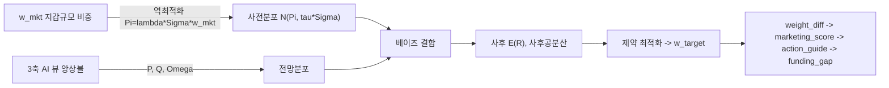
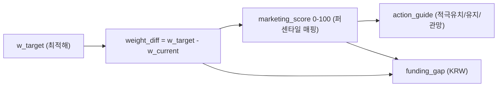
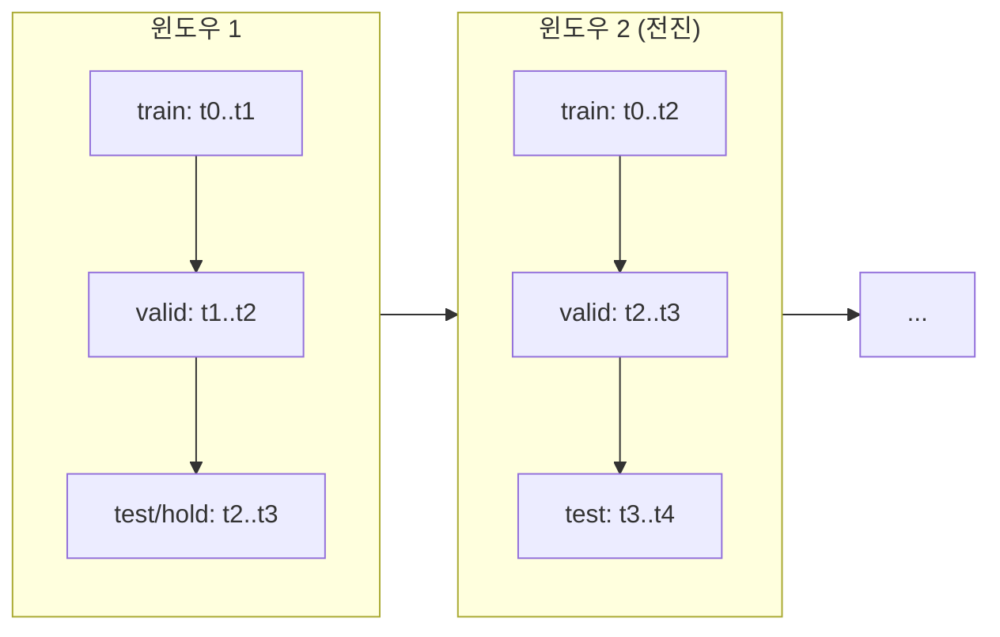

- **문서명**: BL 모델 설계서 (Black-Litterman Model Design)
- **버전**: v0.2
- **작성일**: 2026-06-07
- **상태**: Draft
- **작성주체**: 소매금융기관 데이터사이언스팀 — 수석 데이터 사이언티스트
- **관련문서**:
  - [01 시스템 아키텍처](./01-system-architecture.md)
  - [02 데이터 파이프라인](./02-data-pipeline.md)
  - [04 연산 설계(Compute)](./04-compute-design.md)
  - [05 대시보드 설계](./05-dashboard-design.md)
  - [ADR-0001 연산 백엔드](./adr/ADR-0001-compute-backend.md)
  - [ADR-0002 저장 포맷(DuckDB/Parquet)](./adr/ADR-0002-storage-format.md)
  - [ADR-0003 식별자 매핑](./adr/ADR-0003-identifier-mapping.md)
  - [ADR-0004 누수 차단 학습](./adr/ADR-0004-leakage-free-training.md)
  - [기획 01 프로젝트 개요](../planning/01-project-overview.md) · [기획 02 PRD](../planning/02-prd.md) · [기획 04 용어집](../planning/04-glossary.md)

---

# BL BL 모델 설계서

> 본 문서는 BL 시스템의 **수학적 심장부**다. Black-Litterman(이하 BL) 모형을 B2B 예금유치 마케팅에 재정식화하고, 과거 토이(Colab) 구현의 핵심 결함을 교정하여 클라우드 격상판에서 사용할 **확정 수식·파라미터·검증 절차**를 정의한다. 모든 식별자·테이블·파라미터는 실제 파이프라인(`09_BL_input` → `10_BL_optimize`, 산출물 `bl_input_details_T1_202510.csv`, `bl_weights_comparison_202510.csv`)을 반영한다.

## 0. 요약 (TL;DR)

| 항목 | 과거(토이) | 격상판(본 설계) |
| --- | --- | --- |
| 공분산 $\Sigma$ | 대각만(`np.diag`), "잔액 변동계수²" | **FULL 공분산 + Ledoit-Wolf 수축**, 수익률(잔액 log-return) 패널 기반 |
| 균형수익 $\Pi$ | $\lambda\,\Sigma_{\text{diag}}\,w_{\text{hybrid}}$ | $\Pi=\lambda\,\Sigma\,w_{\text{mkt}}$ (지갑규모 앵커) |
| 뷰 행렬 $P$ | 로드되나 미사용(`P=I` 암묵 가정) | **명시적 구성**(절대뷰=대각, 상대뷰=차분행) |
| 사후 $E[R]$ | 대각 근사 closed-form, $E[R]_{\max}=1.29$ 폭주 | **full 행렬** 사후식, 조건수 관리로 정상 범위 |
| 출력 | `weight_diff`≈$10^{-10}$ 퇴화, 방향-액션 불일치 | 정상 스케일 weight_diff → marketing_score → action_guide → funding_gap, 라벨 정합 |

핵심 메시지: **"동일 로직·동일 수치, GPU 유무는 속도만 차이"**(배열 백엔드 디스패치 `xp = cupy if gpu else numpy`). BL 수식은 백엔드와 무관하게 동일하다. 자세한 백엔드 규약은 [04 연산 설계](./04-compute-design.md)·[ADR-0001](./adr/ADR-0001-compute-backend.md) 참조.

---

## 1. 이론 배경: MVO → CAPM → BL

### 1.1 평균-분산 최적화(MVO)와 그 병폐

Markowitz의 평균-분산 최적화는 위험회피계수 $\lambda$ 하에서 다음을 푼다.

$$
\max_{w}\; \mu^{\top}w - \frac{\lambda}{2}\,w^{\top}\Sigma w \quad \text{s.t.}\quad \mathbf{1}^{\top}w = 1.
$$

예산제약($\mathbf{1}^{\top}w=1$)을 미부과한 **무제약 해**는 $w^{*}=\frac{1}{\lambda}\Sigma^{-1}\mu$ 이다. (등식제약 $\mathbf{1}^{\top}w=1$을 부과하면 라그랑주 보정항이 더해져 $w^{*}=\frac{1}{\lambda}\Sigma^{-1}\mu + \big(1-\frac{1}{\lambda}\mathbf{1}^{\top}\Sigma^{-1}\mu\big)\frac{\Sigma^{-1}\mathbf{1}}{\mathbf{1}^{\top}\Sigma^{-1}\mathbf{1}}$이 되며, 어느 경우든 $\Sigma^{-1}\mu$ 항이 그대로 남아 아래 입력 민감성 논점은 동일하게 성립한다.) 이 해의 두 가지 고질병:

1. **입력 민감성(Input Sensitivity)**: $\mu$의 미세한 변화가 $w^{*}$를 극적으로 흔든다. $\Sigma^{-1}$가 곱해지므로, 추정오차가 큰 기대수익률이 오차증폭기를 통과한다.
2. **코너 해(Corner Solution)**: 추정 $\mu$를 그대로 믿으면 소수 자산에 가중치가 몰리고(코너), 음수/극단 가중치가 발생한다. 마케팅 맥락에서는 "한두 개 법인에 모든 영업자원 몰빵"이라는 비현실적 처방으로 나타난다.

### 1.2 CAPM과 역최적화(Reverse Optimization)

CAPM 균형에서 시장 포트폴리오 $w_{\text{mkt}}$는 최적이다. 따라서 위 1차조건을 **역으로** 풀면, 시장이 암묵적으로 가정하는 기대수익률(내재균형수익률, implied equilibrium return)을 얻는다.

$$
\Pi = \lambda\,\Sigma\,w_{\text{mkt}}.
$$

이는 "균형 가중치를 만들어내는 기대수익률"이며, 직접 추정한 $\hat\mu$ 대신 **노이즈가 적은 사전(prior)** 으로 사용된다.

### 1.3 Black-Litterman: 베이즈적 결합

BL은 사전 $\Pi$(불확실성 $\tau\Sigma$)에 투자자 전망(View) $Q$(불확실성 $\Omega$)를 베이즈 결합하여 **사후 기대수익** $E[R]$을 만든다. 이로써 MVO의 병폐를 다음과 같이 완화한다.

- 뷰가 없는 자산은 자동으로 $\Pi$(균형값)로 수렴 → 코너 해·극단 가중치 억제.
- 뷰의 신뢰도($\Omega$)에 비례해서만 균형에서 이탈 → 입력 민감성 완화(수축 효과).
- $\Sigma$의 분산효과가 정상 반영(단, **full** 공분산일 때만; §3 핵심 교정).



---

## 2. 마케팅 재정식화 (금융공학 → 예금유치)

### 2.1 은유 매핑

| 금융공학 개념 | BL 마케팅 대응 | 데이터 출처(테이블/컬럼) |
| --- | --- | --- |
| 자산(asset) $i$ | 법인 고객사(Tier T1/T2, 또는 가상 섹터노드 T3) | `TARGET_MASTER.TARGET_ID`(=corp_code), `IS_VIRTUAL` |
| 가격/시가총액 | 예금(지갑) 잔액 규모 | `ml_master_data.bal`, `post_data.bal/term_deposit_bal/mmda_bal` |
| 시장 가중치 $w_{\text{mkt}}$ | 지갑규모(wallet_size) 비중 | `bl_input.w_mkt` |
| 현재 보유 $w_{\text{current}}$ | 현재 자사 예금 잔액 비중 | `bl_input.w_current` |
| 기대수익률 | 예금유치/유지 가치(CLV proxy) | 사후 $E[R]$ |
| 투자자 전망 $Q$ | 3축 AI 신호 앙상블 | `Q_final`(news/pattern/relationship) |
| 전망 불확실성 $\Omega$ | 데이터신뢰도(DRI)·모델 confidence·이상도(anomaly) | `DRI`, `confidence_*`, `gemini_confidence`, `anomaly_score_raw` |

### 2.2 "수익률(return)"의 정의 — 핵심 교정

과거 구현은 잔액 자체의 변동계수²를 분산으로 썼고(§3), 수익 단위가 불명확했다. 격상판은 **잔액 증가율(log-return)** 을 수익률로 명확히 정의한다. 법인 $i$의 월별 예금(지갑) 잔액을 $B_{i,t}$라 할 때:

$$
r_{i,t} = \ln\!\left(\frac{B_{i,t} + \varepsilon}{B_{i,t-1} + \varepsilon}\right),\qquad \varepsilon = \text{floor}(>0,\ \text{0-잔액 보호 상수}).
$$

- $\varepsilon$는 0-잔액(과거 `bal=0/10/70` 사례)에서의 $\ln 0$ 폭주를 방지한다. 잔액 0 또는 극소 계좌는 **수익률 패널에서 분리**(별도 신규유치 후보군)하여 공분산 추정 오염을 막는다.
- log-return은 (a) 가법적 시계열 누적이 가능하고 (b) 잔액 스케일과 무관(scale-free)하여 대형 카운터파티(예: 신한은행 92.5B)와 중소법인을 같은 분산 척도로 다룰 수 있다.
- **기대수익 $E[R]$ = 향후 잔액 증가의 기대 로그수익률**로 해석되며, 이것이 곧 CLV proxy(예금유치/유지 가치의 상대지표)다.
- 라벨/피처 시점 분리는 [ADR-0004](./adr/ADR-0004-leakage-free-training.md)를 따른다. 수익률 패널의 학습/검증 구간은 시점 분리하며, 미래 잔액(`bal_future_3m`)을 피처로 쓰지 않는다.

자산수익률 패널 $\mathbf{R}\in\mathbb{R}^{T\times N}$ (행=시점, 열=자산)이 §3 공분산의 단일 입력이다.

---

## 3. 공분산 $\Sigma$ 설계 (핵심 교정)

### 3.1 과거 결함

```text
# 과거(10_BL): 대각만 사용, 단위 불명
sigma_diag = volatility_6m ** 2     # [0, 6] 범위, return-vol 아님
S_diag = np.diag(S)                 # full S 무시
Pi = lambda * S_diag * w_hybrid     # 분산효과 소실
```

결과: 자산 간 공분산이 0으로 가정되어 **분산효과(diversification)가 통째로 소실**, $\tau\Sigma$가 극소가 되면 정밀도 $(\tau\Sigma)^{-1}$가 폭주하여 사후수익이 폭주했다(과거 결함 수치는 §10 대조표를 단일 출처로 인용).

### 3.2 격상판: FULL 표본공분산 + Ledoit-Wolf 수축

자산수익률 패널 $\mathbf{R}$로 표본공분산 $S$를 계산하고, Ledoit-Wolf 수축으로 조건수를 제어한다.

$$
S = \frac{1}{T-1}\sum_{t=1}^{T}(r_t - \bar r)(r_t - \bar r)^{\top},\qquad
\Sigma_{\text{shrunk}} = (1-\delta)\,S + \delta\,F.
$$

- $F$: 수축 타깃(shrinkage target). 1차안은 **constant-correlation 타깃**(평균상관 $\bar\rho$로 채운 행렬). 단순안은 대각타깃 $F=\bar\sigma^2 I$.
- $\delta\in[0,1]$: Ledoit-Wolf 최적 수축강도(closed-form, `sklearn.covariance.LedoitWolf`로 산출하거나 GPU에선 동일 공식 CuPy 구현).
- $T < N$(시점 < 자산수, T1 자산 수천 개 대비 월데이터 부족)에서 표본 $S$는 특이(singular)하므로 수축이 **필수**다.

### 3.3 PSD·조건수 보장

| 단계 | 처리 | 기준 |
| --- | --- | --- |
| 1. 수축 | Ledoit-Wolf $\delta$ 적용 | $\delta$ 자동 산정, 로그 기록 |
| 2. 대칭화 | $\Sigma \leftarrow \tfrac12(\Sigma+\Sigma^{\top})$ | 수치 비대칭 제거 |
| 3. 고유값 바닥 | $\lambda_{\min}(\Sigma) \ge \lambda_{\text{floor}}$ 로 클립 | $\lambda_{\text{floor}} = 10^{-8}\cdot\text{tr}(\Sigma)/N$ |
| 4. 조건수 점검 | $\kappa(\Sigma)=\lambda_{\max}/\lambda_{\min} \le \kappa_{\max}$ | $\kappa_{\max}=10^{6}$ 초과 시 수축↑ |
| 5. Cholesky 검증 | $\Sigma = LL^{\top}$ 성공 여부 | 실패 시 단계 3 재적용 |

과거의 `reg=1e-6` **하드 바닥**은 폐기한다(이것이 폭주의 원인). 정규화는 **데이터 기반 수축 + 고유값 바닥**으로 대체한다.

### 3.4 (옵션) 섹터/매크로 팩터 구조

$T \ll N$ 극단 상황에서는 팩터 모형으로 공분산을 구조화할 수 있다.

$$
\Sigma = B\,\Sigma_f\,B^{\top} + D,
$$

- $B\in\mathbb{R}^{N\times K}$: 자산-팩터 로딩(섹터 더미 `sector_code`, 매크로 민감도: ECOS 기준금리·KTB3Y·BSI, FDR 지수 — Track A).
- $\Sigma_f$: 팩터 공분산($K\times K$, $K \ll N$이라 안정 추정).
- $D$: 고유분산(대각, 잔차).

이 구조는 (1) 모수 수를 $O(N^2)\to O(NK)$로 줄여 안정성을 높이고, (2) "섹터 64121(은행)이 $w_{\text{mkt}}$의 75%를 점유"하는 집중 위험을 매크로 팩터로 분해해 해석 가능하게 한다. 기본은 §3.2 수축공분산, 팩터 구조는 설정 플래그(`cov.model = shrinkage | factor`)로 전환.

---

## 4. 앵커 $\Pi$ (무위 기본값, 구 "내재균형수익률")

> **앵커의 재정의(C3)**: 본 설계에서 $\Pi$는 '진짜 시장균형(equilibrium)'의 주장이 아니라, **뷰가 없거나 불신될 때 돌아갈 무위 기본값(do-nothing default)**으로 해석한다. 따라서 균형을 전제로 한 역최적화 $\lambda$ 캘리브레이션은 폐기하고, $\Pi$의 스케일은 뷰 $Q$에 맞춰 정규화한다(§4.2).

### 4.1 과거 결함 → 교정

과거: $\Pi = \lambda\,\Sigma_{\text{diag}}\,w_{\text{hybrid}}$ — 앵커가 $w_{\text{hybrid}}=0.7\,w_{\text{current}}+0.3\,w_{\text{mkt}}$(현상유지 혼합)였다. 이는 "현재 보유비중을 균형이라 가정"하는 순환논리로, BL의 시장균형 철학과 어긋난다.

격상판: **시장(지갑규모) 가중치 $w_{\text{mkt}}$에 앵커**한다.

$$
\boxed{\;\Pi = \lambda\,\Sigma\,w_{\text{mkt}}\;}
$$

- $\Sigma$는 §3의 **full** 수축공분산(대각 아님).
- $w_{\text{mkt}}$ = 지갑규모(wallet_size) 비중. wallet_size 산정 규칙(권위 정의):
  - **재무보유 고객(주로 T1/외감 T2)**: `FINANCIAL_WIDE.cash_amount`(현금성자산 + 단기금융상품/단기예금/정기예금 합, 없으면 유동자산 fallback — [02 §3.2.1](./02-data-pipeline.md) 정의)를 직접 사용.
  - **비재무 고객(재무 미보유 T2/가상섹터 T3)**: 섹터별 (cash_amount/매출) 중앙값 배수 × 해당 법인 매출로 추정한다. 즉 $\widehat{\text{wallet}}_i = \text{median}_{g(i)}\!\big(\tfrac{\text{cash\_amount}}{\text{revenue}}\big)\times \text{revenue}_i$. 매출도 없으면 섹터 중앙값으로 임퓨테이션.
  - **상한·캘리브레이션**: 추정 wallet_size는 섹터 95퍼센타일로 캡한다. 과거 `total_assets*0.15` 플랫 가정 및 `global_multiplier=2616.79` 같은 극단 매직스칼라는 폐기하고, 위 추정식의 배수·상한을 §9 검증으로 캘리브레이션한다(캘리브레이션 후 확정 클립값은 §11에 등재).
  - 단일 계보: 본 추정 규칙이 권위 정의이며, [02 §3.2.7 `bl_input_data.w_mkt`](./02-data-pipeline.md)·[기획 02 PRD FR-05](../planning/02-prd.md)의 `cash_amount` 기반 서술은 위 혼합 추정(재무=cash_amount, 비재무=섹터중앙값 배수)을 함의한다.
- $w_{\text{hybrid}}$는 **사전 앵커가 아니라 최적화 초기값($x_0$)·턴오버 기준**으로만 사용한다(§7).

### 4.2 앵커 스케일 $\lambda$ — 정규화 상수(위험회피계수 아님, C3)

$\Pi=\lambda\,\Sigma\,w_{\text{mkt}}$ 의 $\lambda$는 **위험회피계수가 아니라 $\Pi$의 스케일을 정하는 정규화 상수**다(추정 대상 아님). 근거:

1. 파이프라인 기본 최적화기는 최대 Sharpe(§7.1, 스케일 불변)이므로 $\lambda$는 최적화기에 들어가지 않고 **오직 $\Pi$ 대 $Q$의 상대 스케일**만 정한다.
2. 뷰 $Q$는 $\text{Var}(Q)=\tau\cdot\overline{\text{diag}\Sigma}$로 $\lambda$와 무관하게 단위정합되므로(§5.2), $\lambda$는 "앵커 대 뷰의 영향력"을 정하는 손잡이일 뿐이다.
3. 그 손잡이는 $\tau$도 이미 조절한다($W=\tau\Sigma(\tau\Sigma+\Omega)^{-1}$). $\lambda$와 $\tau$ 둘 다 데이터로 캘리브레이션하면 **식별 불가(identifiability)**가 된다.
4. 앵커는 §4.1처럼 '균형(equilibrium)'이 아니라 **무위 기본값(do-nothing default)**으로 재정의했으므로, 역최적화로 $\lambda$를 역산할 이론 근거가 없다. 실측에서도 합성/실데이터의 시장수익 부호 탓에 역산 $\lambda$가 음수→$[1,5]$ 하한으로 항상 클립되어 사실상 상수였다(앵커 사후기여 ~3%로 증발).

따라서 $\lambda$를 캘리브레이션하지 않고, $\Pi$를 **뷰 $Q$와 동일 스케일로 명시 정규화**한다.

$$
\boxed{\;\Pi = \lambda_{\text{fix}}\,\sqrt{\tau_{\text{ref}}\,\overline{\text{diag}\Sigma}}\;\frac{\Sigma\,w_{\text{mkt}}}{\operatorname{rms}(\Sigma\,w_{\text{mkt}})}\;}\qquad \Rightarrow\ \ \lVert\Pi\rVert=\lambda_{\text{fix}}\,\lVert Q(\tau_{\text{ref}})\rVert .
$$

- 방향은 시장균형 $\Sigma w_{\text{mkt}}$ 그대로(shape 보존), 스케일만 $\tau_{\text{ref}}$에서의 $Q$ 크기로 정규화한다.
- $\lambda_{\text{fix}}=\lVert\Pi\rVert/\lVert Q\rVert$ at $\tau_{\text{ref}}$ (무차원). **기본값 $\lambda_{\text{fix}}=0.25$**: demo 데이터에서 기본 $\tau=0.05$의 앵커 사후기여(precision-form §9.2)가 ~30%(권고 20–50%, 앵커가 증발도 지배도 아닌 카운터웨이트)가 되도록 동결(REPORT.md 측정표).
- $\tau_{\text{ref}}=0.05$는 정규화 기준으로 **고정**(런타임 $\tau$와 분리)하여 $\Pi$를 $\tau$ 무관으로 둔다 → 앵커↔뷰 균형은 §5.5처럼 **오직 $\tau$가 조절**한다(영업 공격성).
- (코드 `risk_aversion` 인자는 이 $\lambda_{\text{fix}}$의 테스트용 override이며 None이면 기본값 사용.)

---

## 5. 뷰 구성 $P,\,Q,\,\Omega$ (3축 AI 앙상블 + anomaly Ω 변조)

### 5.1 뷰 3축 신호와 컬럼 매핑 (anomaly는 Ω 신뢰도 요인)

본 절의 **뷰 3축(news/pattern/relationship) 정의가 canonical**이다. 이 3축은 BL 뷰값 $Q$(방향)를 구성하는 모델 입력 축이며, 대시보드의 노출 컬럼과는 1:1이 아니다(아래 매핑표 참조).

| 축 | 신호 | 출처 컬럼(원천) | 부호 의미 |
| --- | --- | --- | --- |
| news | Gemini 뉴스감성 | `COMPANY_SENTIMENT.sentiment_score` ∈[-1,1] (별칭: `gemini_score`, `news_sentiment`) | +호재/−악재 |
| pattern | XGBoost 성장−이탈 | `prob_growth_raw − prob_churn_raw` | +성장/−이탈 |
| relationship | 거래관계 강도 | `relationship_score`(계좌수·급여이체·주거래) | +결속 |

> **anomaly는 방향 뷰가 아니다(E2 교정).** IsolationForest의 `anomaly_score_raw` ∈[0,1]은 부호 없는 *이상 크기*(in-distribution 여부)다. 과거 격상판은 여기에 `sign(trx_in−trx_out)`을 곱해 4번째 방향 뷰로 썼으나, 이는 (i) pattern 축과 같은 자금흐름 부호를 공유해 대각 $\Omega$ 하에서 **중복 계상**되고, (ii) 일회성 급변(M&A 대금·세금환급 등)을 강한 +뷰로 **오독**한다. 올바른 처리는 이상 크기를 **DRI·confidence와 같은 신뢰도 신호**로 보아 $\Omega$를 팽창시키는 것이다(§5.4). 이상할수록 그 법인 뷰가 prior(앵커)로 후퇴하며, 빌려온 흐름 방향은 이미 pattern/relationship에 있으므로 정보 손실이 없다.

> 컬럼 계보(단일 출처): news 축의 원천은 [02 §3.2.3 `COMPANY_SENTIMENT.sentiment_score`](./02-data-pipeline.md)이며, `bl_input_data.gemini_score`·대시보드 마트의 `news_sentiment`/`view_news`는 모두 동일 값의 **별칭/파생**이다.

#### 모델 의견 카드 ↔ BL 입력 매핑

[05 대시보드 설계 §3](./05-dashboard-design.md)의 "모델 의견" 노출 컬럼(`view_growth`/`view_churn`/`view_anomaly`/`view_news`)은 **원시 모델 의견의 분해 표시용**으로, 본 문서의 BL 입력과 다음과 같이 대응한다(대시보드 카드는 모델 산출물을 그대로 보여주는 표시 계층이라 BL 뷰 3축과 1:1이 아니다).

| 대시보드 노출 컬럼 | BL 입력에서의 역할 | 대응 관계 |
| --- | --- | --- |
| `view_growth`, `view_churn` | 뷰 pattern 축 | 대시보드는 성장/이탈을 **분리 표시**, BL은 차분으로 결합(`pattern = view_growth − view_churn`) |
| `view_news` | 뷰 news 축 | 동일(=`sentiment_score` 별칭) |
| `view_anomaly` | **Ω 신뢰도 변조**(뷰 아님) | `anomaly_score_raw` ∈[0,1] 이상 크기. 뷰 $Q$에 기여하지 않고 $\Omega$를 팽창(§5.4). 표시 라벨은 "이상도(신뢰도 차감)" |
| (현행 대시보드 미노출) | 뷰 relationship 축 | 거래관계 강도. BL 뷰에는 기여하나 대시보드 카드에는 별도 컬럼 부재 — 노출 보강 대상 |

> cross-ref 액션: relationship 축은 현재 대시보드 "모델 의견 카드"에 노출 컬럼이 없으므로, (a) 대시보드 스코어카드에 `view_relationship`을 추가하거나 (b) relationship을 보조 패널로 분리 노출하도록 [05 §3](./05-dashboard-design.md)에 보강을 요청한다. 데이터 소비 계약(§12)은 본 매핑표를 기준으로 한다.

### 5.2 뷰값 $Q$ — 단위 정합이 핵심

각 축을 **수익률 단위(log-return)와 정합**하도록 스케일하고 가중 결합한다. 과거의 누적 $\times 0.1 / \times 0.05$ 매직 스케일은 $Q\sim 0.01$, $\Omega\sim 17$의 **단위 부정합**을 낳았다(과거 결함 수치의 단일 출처는 §10 대조표). 격상판은 "$Q$의 분산이 $\tau\Sigma$ 및 $\Omega$와 같은 수익률² 차원"이 되도록 정규화한다.

$$
Q_{\text{final}} = a_{\text{news}}\tilde s_{\text{news}} + a_{\text{pat}}\tilde s_{\text{pat}} + a_{\text{rel}}\tilde s_{\text{rel}},
$$

- 축 가중 $a$ = (0.412, 0.412, 0.176) — pattern·news를 주신호로. 합=1. (과거 4축 (0.35,0.35,0.15,0.15)에서 anomaly 제외 후 비율보존 재정규화; anomaly는 §5.4 $\Omega$ 요인으로 이전.)
- $\tilde s$: 각 축 신호를 **학습기준 고정 스케일러**(저장·재사용; 과거의 추론배치 min/max 정규화 누수 폐기)로 표준화(평균0·분산1)한 뒤, 수익률 단위로 보정하는 스케일 상수 $c$를 곱해 정합. $c$ 산정 절차는 아래 참조.

**Q 단위정합 스케일 상수 $c$ 산정 절차**: 표준화 신호는 무차원이므로 log-return 차원으로 사상하는 $c$가 필요하다. 검증셋에서 다음 중 하나로 추정한다(기본=방법 1).

1. **회귀 추정(기본)**: 검증 구간에서 표준화 결합신호 $\tilde s$를 설명변수, **다음 기간 실현 log-return** $r_{t+1}$을 종속변수로 한 단변량 OLS 회귀계수 $\hat\beta$를 $c$로 둔다($Q = \hat\beta\,\tilde s$). 즉 "표준화 신호 1단위가 실현 로그수익률에 미치는 평균 효과".
2. **분산 정합(대안)**: $\text{Var}(Q)$가 뷰 기준 분산 $\overline{(P\tau\Sigma P^\top)_{kk}}$와 같아지도록 $c=\sqrt{\overline{(P\tau\Sigma P^\top)_{kk}}/\text{Var}(\tilde s)}$로 스케일.

- $c$는 학습/검증 구간에서 추정·고정하여 추론 시 재사용한다(누수 차단, [ADR-0004](./adr/ADR-0004-leakage-free-training.md)). $c$의 민감도는 §9.2에 포함한다.
- $Q$의 부호·크기는 "향후 잔액 로그수익률에 대한 전망"으로 해석되어야 하며, $|Q|$가 비현실적으로 크면(예: $|Q|>3\sigma_{\text{mkt}}$) 클립.

### 5.3 선택행렬 $P$ — 절대뷰 + 상대뷰

과거는 $P$를 로드만 하고 미사용($P=I$ 암묵 가정)했다. 격상판은 $P\in\mathbb{R}^{K\times N}$를 **명시적으로 구성**한다($K$=뷰 개수).

- **절대뷰(absolute view)**: 자산 $i$에 대한 단독 전망. 해당 행은 $e_i^{\top}$(원-핫). 대부분의 AI 앙상블 뷰가 여기 해당하므로 절대뷰만 쓰면 $P$는 (자산부분집합에 대한) 항등 부분행렬이 된다.
- **상대뷰(relative view)**: "섹터 A가 섹터 B보다 우수" 류. 행 가중치 합=0, 예: 동일섹터 성장상위군 $+w$, 하위군 $-w$. 매크로/섹터 BSI 신호(Track A)를 상대뷰로 인코딩 가능.
- 뷰가 없는 자산은 $P$에 행이 없고, 사후수익이 자동으로 $\Pi$로 수렴(코너 억제).

$Q$의 각 원소는 $P$의 대응 행과 정합해야 한다(절대뷰면 단일자산 전망값, 상대뷰면 군간 차분 전망값).

### 5.4 불확실성 $\Omega$ — $\Omega\propto 1/\text{DRI}^2$ 유지 + 캘리브레이션 + 단위정합

$\Omega$는 **대각(diagonal)** 으로 둔다(뷰 간 독립 가정; BL 표준). 보존할 강점인 **데이터신뢰도(DRI) 기반 의미론**을 유지하되, 단위를 $\tau\Sigma$와 정합시킨다.

$$
\Omega_{kk} = \underbrace{(P\,\tau\Sigma\,P^{\top})_{kk}}_{\text{단위정합 기준}}\;\times\;\underbrace{\frac{1}{\text{DRI}_i^2}}_{\text{데이터빈약 패널티}}\;\times\;\underbrace{\frac{1-\text{conf}_i}{c_{\text{cal}}}}_{\text{모델 confidence}}\;\times\;\underbrace{(1+\gamma_{\text{anom}}\,a_i)}_{\text{이상도(in-dist) 신뢰}}.
$$

- **차원·정합 정리(중요)**: 식의 차원(수익률²)을 결정하는 것은 **기준항 $(P\tau\Sigma P^\top)_{kk}$뿐**이다. 뒤의 세 인자 $\frac{1}{\text{DRI}^2}$, $\frac{1-\text{conf}_i}{c_{\text{cal}}}$, $(1+\gamma_{\text{anom}}a_i)$는 모두 **무차원 신뢰도 가중**으로 설계하여(아래 $c_{\text{cal}}$ 정의로 $1-\text{conf}$를 무차원화, $a_i\in[0,1]$이라 이상도 인자도 무차원) 기준항의 단위를 보존한다. 따라서 본 식은 "Idzorek식 **단위정합 기준항** × **무차원 신뢰도 보정**"의 분리 구조이며, 순수 단위정합을 해치지 않는다. 이로써 과거의 "$Q\sim0.01$ vs $\Omega\sim17$" 부정합이 원천 해소된다(과거 수치 단일 출처: §10).
- **이상도(anomaly) 신뢰 인자 $(1+\gamma_{\text{anom}}\,a_i)$ — E2 교정**: $a_i=$`anomaly_score_raw`$\in[0,1]$는 IsolationForest의 부호 없는 *이상 크기*(in-distribution 여부)다. 이상할수록 그 법인은 미래 정상상태 예금행동을 가장 못 예측하는 사건(일회성 M&A 대금·세금환급 등)에 노출돼 있으므로, 뷰 신뢰를 낮춰야 한다 — 즉 DRI·confidence와 **형제인 신뢰도 신호**다. $a_i$가 클수록 $\Omega$↑ → 그 뷰가 prior(앵커)로 후퇴(= cold-start 후퇴와 동일 메커니즘). 곱수는 $a_i\in[0,1]$이라 $[1,\,1+\gamma_{\text{anom}}]$로 **유계**(수치 안전). 게인 기본 $\gamma_{\text{anom}}=2.0$(추정 대상 아닌 기본값; §9.3 reliability·`eval.calibrate.calibrate_gamma_anom`이 실현 적중률로 역산). 과거처럼 anomaly에 흐름부호를 곱해 4번째 방향 뷰로 쓰면 pattern 축과 흐름부호를 공유해 중복 계상되므로 폐기했다(§5.1).
- **DRI(Data Reliability Index)**: $\text{DRI}=0.3\,\text{has\_financial}+0.25\,\text{has\_news}+0.15\,\text{is\_listed}+0.2\,\text{trx\_activity}+0.1$. $\text{DRI}\in[0.1,1]$. 데이터가 빈약할수록 DRI↓ → $\Omega$↑ → 해당 뷰 불신(BL 의미론 정합). **이 설계는 격상판에서도 보존한다.** DRI 하한 0.1에서 $1/\text{DRI}^2$ 증폭은 최대 100배인데, 이는 "데이터가 거의 없는 뷰는 사실상 불신"이라는 **의도된 강한 페널티**다. 다만 기준항을 과도하게 압도하지 않도록 증폭 배수에 상한 클립 $1/\text{DRI}^2 \le M_{\text{DRI}}$(기본 $M_{\text{DRI}}=100$, DRI 하한과 정합)을 둔다.
- **confidence $\text{conf}_i$**: 과거의 하드코딩(0.85/0.65)을 폐기하고 **검증셋 reliability 캘리브레이션** 실측값 사용(§9.3). $\text{conf}_i\in[0,1]$이며 $1-\text{conf}_i$는 "오신뢰 정도"다.
- **캘리브레이션 상수 $c_{\text{cal}}$**: $1-\text{conf}_i$를 무차원 보정으로 정규화하는 상수. 검증셋 reliability diagram(§9.3)에서 표본 평균 오신뢰 $\overline{1-\text{conf}}$로 추정하여 $c_{\text{cal}} = \overline{1-\text{conf}}$로 두면, 보정항의 표본 평균이 1이 되어 기준 스케일을 보존한다(평균적 뷰는 보정 무효, 상대적으로 과신한 뷰만 $\Omega$↑). 기본값은 검증셋 추정(가설: 약 0.2~0.4), 안정성 위해 클립 $c_{\text{cal}}\in[0.05, 1]$. (캘리브레이션 전 확정값 아님 — §11 등재.)
- **하한 $\Omega_{\text{floor}}$ (과신 방지)**: $\Omega$가 비현실적으로 작으면(과신) 사후 폭주를 부르므로 단위 정합 기준에 연동한 하한을 적용한다. $\Omega_{\text{floor},kk} = \eta\cdot(P\tau\Sigma P^\top)_{kk}$, 기본 $\eta=0.05$(가설; 클립 $[0.01, 0.2]$, §9 민감도로 확정). 즉 어떤 뷰도 사전(균형)의 5%보다 더 확신할 수 없게 하여 폭주를 차단한다. 최종 $\Omega_{kk}\leftarrow \max(\Omega_{kk},\ \Omega_{\text{floor},kk})$.

### 5.5 $\tau$ 설정 — 앵커↔뷰 균형의 **유일한** 손잡이(영업 공격성)

$\tau$는 사전(무위 기본값)의 불확실성 스케일이다. 기본값 $\tau=0.05$를 유지한다. C3(§4.2)로 $\lambda$를 정규화 상수로 고정했으므로, **앵커 대 뷰의 균형은 이제 $\tau$ 하나로만 조절**된다(이중 손잡이 제거).

단위정합으로 $Q\propto\sqrt{\tau}$·$\Omega\propto\tau$ 라 $W=\tau\Sigma(\tau\Sigma+\Omega)^{-1}$ 는 $\tau$ 무관이고, $\Pi$는 $\tau_{\text{ref}}$로 고정되어 $\tau$ 무관이다. 따라서 $\tau$를 키우면 $Q$만 커져 **뷰가 앵커를 지배(공격적)**, 줄이면 **앵커가 do-nothing으로 당김(보수적)** — 단조 성립한다(demo 실측, REPORT.md §4).

| $\tau$ | 영업 해석 | 앵커 사후기여 | 뷰 기여 | $\overline{\lVert w^*-w_{\text{mkt}}\rVert}$ |
| --- | --- | --- | --- | --- |
| 0.025 | 보수적(현상유지 근방) | 38.7% | 61.3% | 0.0254 |
| 0.050 | 균형(기본) | 30.9% | 69.1% | 0.0284 |
| 0.100 | 공격적(뷰 추종) | 24.0% | 76.0% | 0.0310 |

> 정규화 이전(λ→1.0 클립)에는 $\overline{\lVert w^*-w_{\text{mkt}}\rVert}$ 가 0.0370→0.0372로 거의 불변 = $\tau$가 손잡이로 작동하지 않았다. C3 이후 의미 있게 단조 이동하여 $\tau$가 손잡이로 복원되었다. 민감도 분석(§9)으로 $\tau\in\{0.025, 0.05, 0.1\}$ 점검.

---

## 6. 사후분포 (full 행렬, 폭주 방지)

### 6.1 사후 기대수익

과거의 대각 근사 closed-form을 **폐기**하고, full 행렬 BL 사후식을 사용한다.

$$
\boxed{\;E[R] = \Big[(\tau\Sigma)^{-1} + P^{\top}\Omega^{-1}P\Big]^{-1}\Big[(\tau\Sigma)^{-1}\Pi + P^{\top}\Omega^{-1}Q\Big]\;}
$$

### 6.2 사후공분산

$$
M = \Big[(\tau\Sigma)^{-1} + P^{\top}\Omega^{-1}P\Big]^{-1},\qquad
\Sigma_{\text{post}} = \Sigma + M.
$$

최적화에는 $\Sigma_{\text{post}}$(사후 추정 불확실성 반영)를 사용한다(보수적). 빠른 모드에서는 $\Sigma$를 직접 써도 무방하나, 기본은 $\Sigma_{\text{post}}$.

> **$\Sigma_{\text{post}}$ 게이트 상속**: $M=[(\tau\Sigma)^{-1}+P^\top\Omega^{-1}P]^{-1}$는 PSD이고 $\Sigma_{\text{post}}=\Sigma+M$도 PSD이지만, 합산으로 조건수가 새로 $\kappa_{\max}$를 넘을 수 있고 cvxpy QP 솔버는 입력 행렬의 PSD/조건수에 민감하다. 따라서 $\Sigma_{\text{post}}$에도 §3.3의 **동일 PSD/조건수 게이트**(대칭화 → 고유값 바닥 $\lambda_{\text{floor}}$ → $\kappa(\Sigma_{\text{post}})\le\kappa_{\max}$ 점검 → Cholesky 검증)를 상속 적용한 뒤 최적화에 투입한다. 점검 결과는 §9.4 퇴화진단에 기록한다.

### 6.3 수치 안정화 — 폭주 방지

과거 사후수익 폭주($E[R]_{\max}=1.29$)는 (a) 대각 $\Sigma$의 극소 분산 → $(\tau\Sigma)^{-1}$ 폭주, (b) `reg=1e-6` 하드 바닥, (c) $Q$($\approx0.01$)·$\Omega$($\approx17$) 단위 부정합의 합작이었다(과거 결함 수치의 단일 출처는 §10 대조표). 폭주의 척도는 입력 전망 $Q$가 아니라 **사후** $E[R]_{\max}=1.29$를 $\Pi$ 평균 $\approx0.0103$과 비교한 약 **125배**다($1.29/0.0103\approx125$). 격상판 방어:

| 방어 | 방법 |
| --- | --- |
| 역행렬 회피 | $(\tau\Sigma)^{-1}\Pi$ 등은 직접 역행렬 대신 **선형해(Cholesky/`solve`)** 로 계산. GPU는 `cupy.linalg.solve` |
| 조건수 | §3.3 보장된 $\Sigma$(수축+고유값바닥) 사용, $\tau\Sigma$도 동일 보장 상속 |
| $\Omega$ 하한 | 과신($\Omega\to0$) 방지 하한 적용 |
| 사후 검증 | $E[R]$ 분포가 정상 범위($\lvert E[R]\rvert$ 대부분 $<5\sigma_{\text{mkt}}$) 인지 자동 점검, 이탈 시 빌드 실패 |
| 백엔드 동치 | CPU(NumPy/SciPy)·GPU(CuPy) 결과의 상대오차 $\text{rtol}<10^{-8}$ 회귀테스트($E[R]$·$w^*$·$\Sigma$ 전 산출물 동일 기준, [ADR-0001](./adr/ADR-0001-compute-backend.md)) |

---

## 7. 최적화

### 7.1 목적함수(설정 전환)

사후 $E[R]$·$\Sigma_{\text{post}}$로 다음 중 선택(설정 `opt.objective`).

| 목적 | 수식 | 용도 |
| --- | --- | --- |
| 최대 Sharpe | $\max_w \dfrac{E[R]^{\top}w}{\sqrt{w^{\top}\Sigma_{\text{post}}w}}$ | 기본(자원효율 극대) |
| 최소 분산 | $\min_w w^{\top}\Sigma_{\text{post}}w$ | 방어/리스크 우선 |
| Information Ratio | $\max_w \dfrac{E[R]^{\top}(w-w_b)}{\sqrt{(w-w_b)^{\top}\Sigma_{\text{post}}(w-w_b)}}$ | 벤치마크 $w_b=w_{\text{current}}$ 대비 초과 |
| 턴오버 패널티 | $\max_w\ E[R]^{\top}w - \tfrac{\lambda_{\text{opt}}}{2}w^{\top}\Sigma_{\text{post}}w - \gamma\lVert w - w_{\text{current}}\rVert_1$ | 영업역량 전환비용 반영 |

- 턴오버 패널티 $\gamma$는 "영업자원 재배분 비용"을 표현한다(과거 multi-objective의 turnover penalty×10, $\alpha=0.7$을 정규화·캘리브레이션).
- **위험회피 기호 구분(중요)**: mean_variance 효용함수의 위험회피계수 $\lambda_{\text{opt}}$(코드 `optimize_weights(risk_aversion=...)`, 기본 2.5)는 $\Pi$ 앵커 스케일 $\lambda_{\text{fix}}$(§4.2, **정규화 상수**, 위험회피 아님)와 **무관한 별개 파라미터**다. 둘은 의미·값·자리(목적함수 vs 입력구성)가 다르므로 동일시하지 않는다. 더욱이 파이프라인 기본 목적함수는 최대 Sharpe(스케일 불변)이므로 $\lambda_{\text{opt}}$는 기본 경로에서 **사용되지 않는다**(min_variance/mean_variance·턴오버 패널티 선택 시에만 관여).

### 7.2 제약

$$
\mathbf{1}^{\top}w = 1,\quad 0 \le w_i \le w_{\max},\quad w_i = 0\ \ \forall i\in \mathcal{E}.
$$

- $w_{\max}$: 자산당 상한(과거 0.10 유지·검토). 섹터 64121(은행) 집중 완화 위해 **섹터 상한** $\sum_{i\in g}w_i \le w_{\max}^{(g)}$ 추가 가능.
- 제외집합 $\mathcal{E}$: 금융 카운터파티(신한은행·국민은행·삼성증권 등 동종 금융기관 peer)·특정 섹터·중복 법인. 마케팅 대상이 아닌 자산을 명시 제외(과거 이들이 top-return으로 올라온 결함 차단).
- 중복 법인(`biz_reg_no` 다중행, 예 동양메이저/신한은행 지점) → ID crosswalk로 **자산 단위 사전 dedup**(법인=1자산). [ADR-0003](./adr/ADR-0003-identifier-mapping.md) 참조(직접조인 금지, 명시적 ID_CROSSWALK 경유). 과거 510→876→1610→397 폭발/소실 결함 차단.

### 7.3 cvxpy(convex) vs SLSQP

| 솔버 | 적용 | 비고 |
| --- | --- | --- |
| **cvxpy(OSQP/ECOS)** | 최소분산·턴오버패널티 등 **볼록 QP** | 권장 기본. 전역최적·안정 |
| **cvxpy + Schaible 동차화** | 최대 Sharpe·IR (long-only 단순체) | 비율형이지만 동차화로 **볼록 QP 전환** → 전역최적 |
| **scipy.optimize SLSQP** | **비볼록 추가제약**이 있을 때만(예: cardinality/최소보유, 비볼록 섹터제약) | $w_{\text{hybrid}}$ 초기값 + 다중시작. 과거 단일 사용 |
| GPU 선형대수 | CuPy(`solve`/Cholesky) | 목적·기울기 평가 가속 |

> **max-Sharpe/IR의 볼록 동차화(Schaible 변환)**: long-only 단순체($0\le w,\ \mathbf{1}^\top w=1$) 위의 최대 Sharpe는 비율형이지만, $y=\kappa w\ (\kappa>0)$ 치환으로 볼록 QP로 전환된다.
> $$\min_{y\ge 0}\ y^\top \Sigma_{\text{post}}\, y \quad \text{s.t.}\quad E[R]^\top y = 1,$$
> 해에서 $w^* = y^*/(\mathbf{1}^\top y^*)$로 복원한다. IR도 분모가 $(w-w_b)^\top\Sigma_{\text{post}}(w-w_b)$로 동일 2차형이므로 같은 동차화로 볼록 QP가 된다(벤치마크 $w_b$는 1차/제약에 반영). 따라서 기본 솔버는 **cvxpy 전역최적**이며, SLSQP는 동차화가 깨지는 **비볼록 추가제약**이 있을 때로 한정한다.

초기값 $x_0 = w_{\text{hybrid}}$(현상유지 근방에서 출발 → 안정 수렴·작은 턴오버). 과거 SLSQP가 MultiObj "Iteration limit", IR 음수 수렴(−0.1852)으로 "현상유지보다 겨우 나은" 해를 낸 문제는 (a) convex 재정식화(위 동차화) + (b) 정상 스케일 입력으로 해소한다.

---

## 8. 출력 변환 (퇴화·불일치 교정)

### 8.1 변환 파이프라인



### 8.2 정의

**weight_diff**: $\Delta_i = w^{\text{target}}_i - w^{\text{current}}_i$. 양수=확대, 음수=축소/방어.

> 과거 결함: $\Delta_i \approx 10^{-10}$ 퇴화(`bl_weights_comparison_202510.csv` 실측: `diff_Sharpe` 다수 $10^{-9}$~$10^{-10}$). 원인은 (a) $w_{\text{current}}$가 극소(중복분모로 잘게 쪼개짐), (b) 사후수익 폭주로 코너 해. 격상판은 자산 dedup + 정상 스케일 사후수익으로 $\Delta$가 의미있는 크기를 갖게 한다.

**marketing_score** (0–100): $\Delta$의 **부호 보존** 퍼센타일 매핑.

$$
\text{score}_i = \begin{cases}
50 + 50\cdot \dfrac{\Delta_i}{q_{+}} & \Delta_i \ge 0 \ \ (q_{+}=\text{p95 of }\Delta_{>0})\\[2mm]
50\cdot\Big(1 - \dfrac{|\Delta_i|}{|q_{-}|}\Big) & \Delta_i < 0 \ \ (q_{-}=\text{p5 of }\Delta_{<0})
\end{cases}
$$

클립 [0,100]. 퇴화 분포(과거: 거의 전부 100 또는 50)를 방지하기 위해 점수 분포의 분산이 임계 이상인지 검증(§9 퇴화진단).

**action_guide**: marketing_score와 weight_diff **부호가 일관**되도록 정의(과거 라벨-방향 불일치, 음수 weight_diff에 'Aggressive Buy' 부여, 라벨 문자열 불일치로 카운트 0 버그 교정).

| weight_diff | score | action_guide |
| --- | --- | --- |
| $\Delta>0$ & score≥80 | 상위 | 적극 유치 (Aggressive Buy) |
| $\Delta>0$ & 50≤score<80 | 중위 | 유치 확대 (Buy) |
| $\lvert\Delta\rvert\approx0$ | 중립 | 유지 (Hold) |
| $\Delta<0$ & score<50 | 하위 | 관망/방어 (Watch/Defend) |

라벨 문자열은 **단일 상수 모듈**에서 정의해 산출·집계 간 불일치를 원천 차단.

**funding_gap** (KRW): 권고 자금 재배분 규모.

$$
\text{funding\_gap}_i = \Delta_i \times \text{TOTAL\_AUM} \times f(\text{tier}_i),\qquad [\text{단위: KRW}]
$$

- **$f$의 의미**: "권고 재배분량 중 **이번 기에 즉시 집행할 비율**"(전환비용·영업역량 한계를 반영한 실행 게이트, 무차원). $\Delta_i\times\text{TOTAL\_AUM}$가 권고 재배분 규모(KRW), $f$가 즉시 집행분, 곱은 KRW로 단위가 닫힌다. TOTAL_AUM은 대상 유니버스 총 지갑규모(KRW).
- **티어 계수 $f$**: 영업 운영상 **티어(=섹터/규모 기반 고정 분류)별 상수**로 정의한다 — PRIME 0.10 / CORE 0.05 / WATCH 0.02. 티어는 marketing_score가 인코딩하는 $\Delta$와 **독립적인 운영 분류**(예: 규모·섹터·계약등급)로 부여하여, score 임계 계단형이 유발하던 (i) 경계 불연속(score=79.9↔80.0에서 gap 2배 도약)과 (ii) $\Delta$의 비선형 이중 가중을 제거한다.
  - (대안) score 연속 게이팅이 필요하면 $f$를 score의 연속 단조함수(예: 로지스틱)로 정의해 경계 도약을 없앤다. 본 설계 기본은 운영분류 고정값.
- **0/극소 잔액 가드**: **0/극소 잔액 계좌에는 'Aggressive Buy'+거액 gap 부여 금지**(과거 `bal=0`에 score 100 결함) — 신규유치 후보는 별도 트랙으로 라우팅하고 funding_gap을 보수적 캡.

---

## 9. 검증 / 백테스트

### 9.1 Walk-forward 백테스트



- 각 윈도우에서 (a) $\Sigma$·$\Pi$ 추정, (b) 뷰 생성(시점분리 모델), (c) 사후·최적화, (d) **다음 기간 실현 잔액수익**으로 평가. in-sample 평가 금지([ADR-0004](./adr/ADR-0004-leakage-free-training.md)).
- 평가지표: 실현 Sharpe/IR, 누적 예금유치 가치(CLV proxy 합), 상위분위 적중률(Precision@K), 턴오버 대비 효익.
- 비교군: 현상유지($w_{\text{current}}$), 균형($w_{\text{mkt}}$), 단순 BL(대각), 격상 BL(full).

### 9.2 뷰 기여도 / 민감도

- **기여 분해**: 사후수익을 사전항 $(\tau\Sigma)^{-1}\Pi$ 와 뷰항 $P^\top\Omega^{-1}Q$ 로 분해하여 자산별 "균형 vs 뷰" 비중 산출. 뷰 3축 각각의 한계기여($\partial E[R]/\partial Q_{\text{axis}}$) 보고.
- **민감도**: $\tau, \lambda, w_{\max}, \delta$(수축), $c$(Q 단위정합), $\eta$($\Omega$ 하한) 격자에서 $E[R]$·$w$·marketing_score 변화. 입력 미세변화에 해가 폭주하지 않는지(MVO 병폐 재발 여부) 확인.

### 9.3 캘리브레이션 점검

- confidence reliability diagram: 예측 confidence vs 실현 적중률. 과신/과소신 보정($c_{\text{cal}}$ 추정·$\Omega$ 반영; §5.4 정의).
- DRI 단조성: DRI 낮은 군의 뷰가 실제로 덜 정확한지(=$\Omega$↑가 정당한지) 검증.

### 9.4 퇴화 진단 체크리스트

| 점검 | 임계/기대 | 과거 실패 사례 |
| --- | --- | --- |
| `weight_diff` 스케일 | median $\lvert\Delta\rvert > 10^{-4}$ | $10^{-10}$ 퇴화 |
| 사후수익 범위 | $\lvert E[R]\rvert$ 대부분 $<5\sigma_{\text{mkt}}$ | $E[R]_{\max}=1.29$ 폭주 |
| marketing_score 분포 | 유효 분산, 100/50 양극 집중 아님 | 거의 전부 100 또는 50 |
| action_guide 라벨 정합 | 산출=집계 문자열 일치 | Buy/Monitor 카운트 0 버그 |
| 자산 유일성 | `biz_reg_no` dedup 후 $\sum w=1$ | 510→397 비조정, 합≠1 |
| 방향-액션 일관 | $\Delta<0$에 'Buy' 없음 | 음수 diff에 'Aggressive Buy' |
| $\Sigma$ PSD/조건수 | Cholesky 성공, $\kappa\le10^6$ | 대각·미점검 |
| $\Sigma_{\text{post}}$ PSD/조건수 | Cholesky 성공, $\kappa(\Sigma_{\text{post}})\le10^6$ (§6.2 게이트 상속) | 미점검 |
| $w_{\text{mkt}}$ 집중 | 단일 섹터 점유 $\le$ 상한 | 섹터64121 75% 점유 |
| 제외집합 적용 | 금융 peer 미포함 | 신한/국민/삼성증권 top |
| 0-잔액 처리 | 0/극소 계좌 'Buy'·거액 gap 금지 | `bal=0` score 100 |
| 백엔드 동치 | CPU/GPU 상대오차 $\text{rtol}<10^{-8}$ ($E[R]$·$w^*$·$\Sigma$ 모든 산출물) | 미검증 |

---

## 10. 과거 구현 5대 결함 ↔ 교정안 대조표

> 과거 토이의 결함 수치는 본 표를 **단일 출처**로 인용한다(다른 절은 본 표를 참조).

| # | 결함(과거 토이) | 영향 | 격상판 교정 | 본문 |
| --- | --- | --- | --- | --- |
| 1 | **공분산 대각만**(`np.diag(S)`), "잔액 변동계수²" | 분산효과 소실, $(\tau\Sigma)^{-1}$ 폭주 유발 | log-return 패널의 **FULL 공분산 + Ledoit-Wolf 수축**, PSD/조건수 보장 | §3 |
| 2 | **$\Pi$를 $w_{\text{hybrid}}$에 앵커** | 현상유지 순환논리, 균형 철학 위배 | $\Pi\propto\Sigma\,w_{\text{mkt}}$ (지갑규모 앵커=무위 기본값), $\lambda$는 Q 스케일 정규화 상수($\lambda_{\text{fix}}$, C3) | §4 |
| 3 | **$Q$($\approx0.01$)·$\Omega$($\approx17$) 단위 부정합, $P$ 미사용** | 뷰가 사실상 무력/과대, 닫힌식 가정 깨짐 | $\Omega$ 단위정합 $(P\tau\Sigma P^\top)\cdot\frac{1}{\text{DRI}^2}$, $P$ 명시 구성, confidence 실측 캘리브레이션 | §5 |
| 4 | **대각 근사 사후식 + `reg=1e-6` 하드 바닥** | 사후 $E[R]_{\max}=1.29$ 폭주(Π평균 $\approx0.0103$ 대비 약 125배) | **full 행렬 사후식** + Cholesky solve + 수축·고유값바닥, 정상범위 검증 | §6 |
| 5 | **출력 퇴화**($\Delta\approx10^{-10}$)·**방향-액션 불일치**·중복자산 미dedup | weight_diff 무의미, 'Aggressive Buy' 오발령, 합≠1 | 자산 dedup(ID crosswalk) + 부호보존 점수매핑 + 라벨 단일소스 + 0-잔액 가드 | §7–8 |

---

## 11. 파라미터 요약(확정 기본값)

미검증 캘리브레이션 대상은 **가설값**으로 표기하며, 확정값은 §9 검증 후 갱신한다.

| 파라미터 | 기호 | 기본값 | 산정/비고 |
| --- | --- | --- | --- |
| 사전 불확실성 스케일(앵커↔뷰 손잡이) | $\tau$ | 0.05 | **유일한 균형 손잡이**(영업 공격성). 민감도 {0.025,0.05,0.1}=보수/균형/공격(§5.5) |
| $\Pi$ 스케일 정규화 상수 | $\lambda_{\text{fix}}$ | **0.25**(고정) | 위험회피 아님·추정 아님. $\lVert\Pi\rVert=\lambda_{\text{fix}}\lVert Q(\tau_{\text{ref}})\rVert$, 앵커 사후기여 ~30%로 동결(§4.2, C3) |
| 효용 위험회피(최적화, mean_variance 전용) | $\lambda_{\text{opt}}$ | 2.5 | $\lambda_{\text{fix}}$와 **무관**. 기본 목적함수 Sharpe에선 미사용(§7.1) |
| 수축강도 | $\delta$ | Ledoit-Wolf 자동 | $T<N$ 시 필수 |
| 고유값 바닥 | $\lambda_{\text{floor}}$ | $10^{-8}\,\text{tr}\Sigma/N$ | 하드 reg 폐기. $\Sigma_{\text{post}}$에도 상속 |
| 조건수 상한 | $\kappa_{\max}$ | $10^6$ | 초과 시 수축↑. $\Sigma$·$\Sigma_{\text{post}}$ 공통 |
| 축 가중 | $a$ | (0.412,0.412,0.176) | news/pattern/relationship (뷰 3축; anomaly는 $\Omega$ 요인) |
| DRI 가중 | — | (0.3,0.25,0.15,0.2,0.1)+0.1 | fin/news/listed/trx + base. $\text{DRI}\in[0.1,1]$ |
| Q 단위정합 상수 | $c$ | 검증셋 회귀 추정 | 표준화 신호→log-return 사상(§5.2) |
| $\Omega$ confidence 정규화 | $c_{\text{cal}}$ | 검증셋 추정(가설 0.2~0.4) | $\overline{1-\text{conf}}$, 클립[0.05,1] (§9.3) |
| DRI 증폭 상한 | $M_{\text{DRI}}$ | 100 | $1/\text{DRI}^2$ 클립(§5.4) |
| $\Omega$ 하한 계수 | $\eta$ | 0.05 (가설) | $\Omega_{\text{floor},kk}=\eta(P\tau\Sigma P^\top)_{kk}$, 클립[0.01,0.2] |
| anomaly $\Omega$ 게인 | $\gamma_{\text{anom}}$ | 2.0 (가설) | $\Omega$ 곱수 $(1+\gamma_{\text{anom}}a),\ a=$`anomaly_score_raw`$\in[0,1]$; §5.4, `calibrate_gamma_anom` 역산 |
| 자산 상한 | $w_{\max}$ | 0.10 | 섹터 상한 병행 가능 |
| wallet 추정 상한 | — | 섹터 p95 (가설) | 비재무 추정 캡(§4.1), §9 캘리브레이션 |
| 턴오버 패널티 | $\gamma$ | 캘리브레이션 | $\ell_1(w-w_{current})$ |
| funding_gap 즉시집행 계수 | $f$ | 0.10/0.05/0.02 | PRIME/CORE/WATCH(티어=운영분류 고정값, §8.2) |
| 백엔드 동치 허용오차 | rtol | $10^{-8}$ | $E[R]$·$w^*$·$\Sigma$ 공통([ADR-0001](./adr/ADR-0001-compute-backend.md)) |

---

## 12. 의존·후속

- 입력 계약: [02 데이터 파이프라인](./02-data-pipeline.md)의 `bl_inputs` 단계가 `Σ`(패널)·`w_mkt`·`Q_final`·`DRI`·`P` 구성요소·confidence를 **Parquet/DuckDB**로 제공(pickle 폐기, [ADR-0002](./adr/ADR-0002-storage-format.md)). 식별자 정합·자산 dedup은 명시적 ID_CROSSWALK 경유([ADR-0003](./adr/ADR-0003-identifier-mapping.md), 직접조인 금지).
- 연산 백엔드(CPU/GPU 디스패치, full 행렬 가속)·수치 동치 회귀테스트(rtol=$10^{-8}$): [04 연산 설계](./04-compute-design.md), [ADR-0001](./adr/ADR-0001-compute-backend.md).
- 출력 소비: [05 대시보드 설계](./05-dashboard-design.md)가 marketing_score·action_guide·funding_gap을 외부 JSON으로 lazy-load(HTML 인라인 데이터 분리). 모델 의견 카드 ↔ BL 입력 매핑은 §5.1.
- 용어 정의: [기획 04 용어집](../planning/04-glossary.md).

> 주의(과장 금지): 본 문서의 성능 기대치(Sharpe/IR/Precision 등)는 walk-forward 백테스트로 **검증 예정**이며, 과거 토이의 수치(예: $E[R]_{\max}=1.29$, weight_diff $\sim10^{-10}$)는 **결함의 증거로서 인용**할 뿐 목표치가 아니다. 모든 임계값은 캘리브레이션 후 확정한다.
