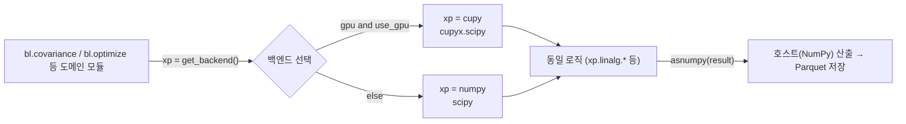
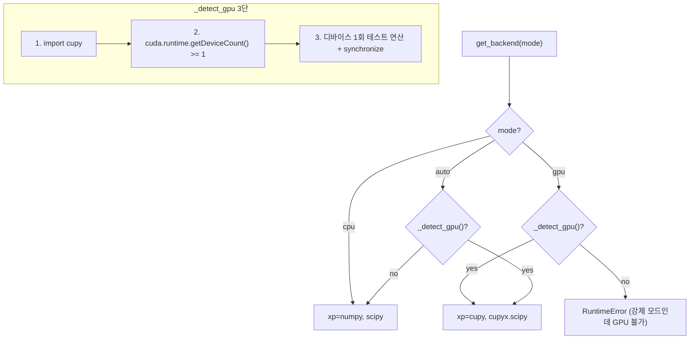
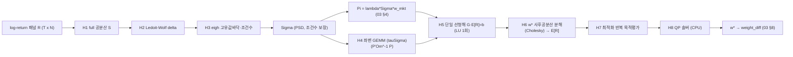

- 문서명: BL 연산(Compute) 설계서 — GPU/CPU 가속 백엔드 (Compute & Acceleration Design)
- 버전: v0.2
- 작성일: 2026-06-07
- 상태: Draft
- 작성주체: 데이터사이언스팀
- 관련문서:
  - [01 시스템 아키텍처](./01-system-architecture.md)
  - [02 데이터 파이프라인](./02-data-pipeline.md)
  - [03 BL 모델 설계](./03-bl-model-design.md)
  - [05 대시보드 설계](./05-dashboard-design.md)
  - [ADR-0001 연산 백엔드](./adr/ADR-0001-compute-backend.md)
  - [ADR-0002 저장 포맷](./adr/ADR-0002-storage-format.md)
  - [ADR-0003 식별자 매핑](./adr/ADR-0003-identifier-mapping.md)
  - [ADR-0004 누수 차단 학습](./adr/ADR-0004-leakage-free-training.md)
  - [기획 04 용어집](../planning/04-glossary.md)

---

# BL 연산(Compute) 설계서

> 본 문서는 BL의 **수치 연산 실행 계층(`common.compute`)** 을 정의한다. 핵심 계약은 단 하나다 — **"동일 로직·동일 수치, GPU 유무는 속도만 차이"**. 본 문서는 그 계약을 코드 수준에서 어떻게 보장하는지(배열 백엔드 디스패치 `xp = cupy if (gpu and use_gpu) else numpy`), 어디서 가속 이득이 큰지(공분산·역행렬 $O(N^3)$ 핫스팟), 메모리·정밀도·재현성을 어떻게 통제하는지를 명세한다. 의사결정 근거는 [ADR-0001](./adr/ADR-0001-compute-backend.md), 수식·파라미터는 [03 BL 모델 설계](./03-bl-model-design.md)에 위임한다.

## 0. 요약 (TL;DR)

| 항목 | 내용 |
| --- | --- |
| 백엔드 | CPU 기준 = NumPy + SciPy / GPU 옵션 = CuPy + cupyx.scipy (단일 코드 디스패치) |
| 디스패치 규칙 | `xp = cupy if (gpu_available and settings.use_gpu) else numpy` |
| 경계 함수 | `get_array_module(*arrays)` · `asarray(x)`(호스트→디바이스) · `asnumpy(x)`(디바이스→호스트) |
| 자동감지·폴백 | CUDA 런타임·CuPy import·디바이스 가용성 3단 체크. 실패 시 **무중단 CPU 폴백** |
| 기본 dtype | **float64**(BL 역행렬·조건수 안정성 우선). GPU에서도 float32로 정밀도를 깎지 않음 |
| 수치 일치 계약 | CPU/GPU 결과 상대오차 $<10^{-8}$(`rtol`, 모든 산출물 $\Sigma$·$E[R]$·$w^*$ 공통) 회귀테스트로 강제. 표준 사실관계(상대오차 $<10^{-8}$)를 권위로 채택하며, [ADR-0001](./adr/ADR-0001-compute-backend.md)의 예시값 `rtol=1e-6`은 본 격상판에서 $10^{-8}$로 **강화**한다(근거: §1.1·§8.4) |
| GPU 이득 구간 | full 공분산 $S$($O(N^2 T)$), eigh·사후 좌변 GEMM·단일 선형해($O(N^3)$), 최적화 반복 목적평가 |
| out-of-core | 디바이스 초과=GEMM 입력 블록화(결과 $S$는 호스트 in-core), 호스트도 초과=팩터구조 $\Sigma=B\Sigma_fB^\top+D$로 dense $S$ 미형성. 입력 패널은 DuckDB+Parquet 스트리밍([ADR-0002](./adr/ADR-0002-storage-format.md)). 상세 §5.3 |

격상 배경(요지): 과거 Colab 무료 플랜의 속도·메모리 제약 때문에 공분산을 **대각만**(`np.diag(S)`) 썼고, 이로 인해 분산효과가 소실되어 BL의 정체성이 무력화되었다([03 §3](./03-bl-model-design.md)). 클라우드 격상판은 이 제약을 제거하여 **FULL 공분산**을 정상화하고, 그 늘어난 연산비용을 GPU(있을 때)로 흡수한다.

---

## 1. 목표와 비목표

### 1.1 목표

1. **수치 동등성(numerical parity)**: 동일 입력·동일 설정에서 CPU 경로와 GPU 경로의 산출물($\Sigma$, $E[R]$, $w^*$)이 부동소수 허용오차 내 동일하다. 백엔드는 *성능* 차원이지 *결과* 차원이 아니다. **허용오차 단일 기준은 상대오차 $\text{rtol}<10^{-8}$**(표준 사실관계)이며, 모든 산출물에 동일하게 적용한다.

   > **rtol 단일화 주석**: [ADR-0001](./adr/ADR-0001-compute-backend.md)은 결정문·후속작업에 예시값 `rtol=1e-6`을 명시했으나, 본 격상판은 표준 사실관계(CPU/GPU 상대오차 $<10^{-8}$)와 [03 §7.4](./03-bl-model-design.md)·[02 파이프라인](./02-data-pipeline.md)에 맞춰 $10^{-8}$로 통일·강화한다(ADR-0001은 이 값으로 개정 예정). 다만 float64 누산순서 차이는 연산종류·행렬크기에 따라 분포가 다르므로, 회귀테스트는 연산종류별 `rtol`/`atol`을 분리 적용한다(§8.4 표). 단일 스칼라 비트동일이 아니라 **연산별 허용오차 내 동일**이 계약이다.
2. **단일 코드베이스**: 연산 로직은 한 번만 작성한다. `numpy`/`cupy`를 직접 import하지 않고 `xp` 추상화에만 의존한다(분기 유지보수 비용 최소화).
3. **무중단 폴백**: GPU가 없거나(비기술직 운영자의 CPU 노트북) CUDA 환경이 깨져도, 코드 변경 없이 CPU로 동일 결과를 재현한다.
4. **FULL 공분산 정상화 흡수**: 대각근사 제거로 늘어난 $O(N^3)$ 연산을 GPU 가속으로 실용 시간 내 처리한다.
5. **재현성·결정성**: 시드·BLAS 스레드·GPU 비결정 연산을 통제하여 "실행마다 결과가 달라지는" 비결정 문제([01 §2.2](./01-system-architecture.md))를 차단한다.

### 1.2 비목표

- 자동미분(autograd)·딥러닝 학습 그래프. 본 프로젝트 연산은 closed-form 선형대수 + convex QP라 불필요(PyTorch/JAX 기각 근거는 [ADR-0001](./adr/ADR-0001-compute-backend.md)).
- 멀티-GPU 분산학습. 단일 GPU 수직확장으로 충분(유니버스 수천~수만 자산).
- GPU에서 cvxpy QP 솔버 자체를 돌리는 것. QP는 CPU 솔버(OSQP/ECOS)로 풀되, **목적·기울기 평가의 선형대수**만 GPU 가속한다(§4.4).

---

## 2. 배열 백엔드 추상화

### 2.1 디스패치 원칙

모든 수치 연산 모듈(`bl.covariance`, `bl.inputs`, `bl.optimize`)은 NumPy/CuPy를 직접 import하지 않고 `common.compute`가 제공하는 **배열 모듈 `xp`** 와 **경계 함수**만 사용한다.



- **경계(boundary)는 명시적이다**: 입력은 `asarray`로 디바이스에 올리고, 산출(저장·로깅·cvxpy 전달 직전)은 `asnumpy`로 호스트로 내린다. 그 사이는 전부 `xp` 공간.
- DuckDB/Parquet I/O, 로깅, cvxpy 호출은 **항상 NumPy(호스트) 경계**에서 일어난다. GPU 배열을 그대로 직렬화·로그·솔버로 넘기지 않는다.

### 2.2 경계 함수 명세

| 함수 | 시그니처 | 책임 | 비고 |
| --- | --- | --- | --- |
| `get_backend()` | `() -> (xp, scimod, is_gpu)` | 설정·감지 결과로 `(numpy, scipy)` 또는 `(cupy, cupyx.scipy)` 반환 | 프로세스 1회 결정, 캐시 |
| `get_array_module(*xs)` | `(*ndarray) -> module` | 인자 배열이 속한 모듈 반환(`numpy.get_array_module` 호환) | 함수 내부 백엔드 추론 |
| `asarray(x, dtype=float64)` | `(arraylike) -> xp.ndarray` | 호스트/임의 입력 → 현재 백엔드 배열, dtype 강제 | float32 우발 유입 차단 |
| `asnumpy(x)` | `(xp.ndarray) -> numpy.ndarray` | 디바이스 → 호스트. NumPy면 그대로 통과 | 저장·로그·솔버 직전 |
| `to_cpu(x)` / `to_gpu(x)` | `(xp.ndarray) -> ...` 명시적 디바이스 이동 | CPU 전용 루틴(예: SciPy LedoitWolf) 폴백 시 | `to_cpu=asnumpy`, `to_gpu=asarray`의 **명시 별칭**([ADR-0001] 후속작업 이행, §2.4 정의) |

### 2.3 SciPy ↔ cupyx.scipy 대응표

GPU 경로는 `cupyx.scipy`로 1:1 매핑하고, CuPy 대응이 없는 루틴은 **호스트로 내려 동일 알고리즘**을 적용한다(가속 이득 없음을 명시 — [ADR-0001](./adr/ADR-0001-compute-backend.md) "GPU/CPU 매핑 명세" 후속작업 이행).

| 연산 | CPU (numpy/scipy) | GPU (cupy/cupyx) | 매핑 상태 |
| --- | --- | --- | --- |
| 행렬곱 | `np.matmul`/`@` | `cp.matmul`/`@` | 직접 매핑 (GPU 강이득) |
| Cholesky 분해 | `np.linalg.cholesky` / `scipy.linalg.cho_factor` | `cp.linalg.cholesky` | 직접 매핑 (GPU 강이득) |
| 삼각계 해 | `scipy.linalg.solve_triangular` | `cupyx.scipy.linalg.solve_triangular` | 직접 매핑 (§2.4 래퍼) |
| 일반 선형해 LU | `scipy.linalg.lu_factor`/`lu_solve` | `cupyx.scipy.linalg.lu_factor`/`lu_solve` | 직접 매핑 (사후식 비대칭 좌변 §4.2) |
| 대칭 선형해 | `scipy.linalg.cho_factor`/`cho_solve` | `cp.linalg.cholesky`+`solve_triangular` | PSD계(§7.1)용 |
| 고유값분해 | `np.linalg.eigh` | `cp.linalg.eigh` | 직접 매핑 (조건수·고유값바닥용) |
| 조건수 | `eigh` 고유값 비율 $\lambda_{\max}/\lambda_{\min}$ | `eigh` 고유값 비율 | **CPU/GPU 동일 알고리즘**(둘 다 eigh 재사용, §7.1 코드와 정합). `np.linalg.cond`(SVD 2-노름)는 수치경로가 달라 미사용 |
| 공분산 | `np.cov` | `cp.cov` | 직접 매핑 |
| **Ledoit-Wolf 수축** | `sklearn.covariance.LedoitWolf` | **CPU 폴백 또는 동일 공식 CuPy 구현** | §4.2 — sklearn 미대응 |
| convex QP | `cvxpy(OSQP/ECOS)` | (호스트에서) | GPU 미적용(§4.4) |
| SLSQP | `scipy.optimize.minimize(SLSQP)` | (호스트에서, 목적평가만 GPU) | 부분 |
| IsolationForest/XGBoost | sklearn / xgboost | (모델 자체는 별도) | 본 문서 범위 외 |

> 규약: `sklearn.covariance.LedoitWolf`는 GPU 대응이 없다. GPU 경로에서는 (a) 수축강도 $\delta$ 산정만 호스트로 내려 sklearn으로 계산하고 결과 스칼라 $\delta$를 디바이스로 올려 $\Sigma_{\text{shrunk}}=(1-\delta)S+\delta F$를 GPU에서 합성하거나, (b) Ledoit-Wolf closed-form 공식을 CuPy로 직접 구현한다. 두 경로 모두 **동일 $\delta$·동일 $\Sigma$** 를 산출해야 한다(수치 일치 계약).

### 2.4 코드 예시 — `common/compute.py` (백엔드 디스패치)

```python
# src/bl/common/compute.py
"""배열 백엔드 디스패치: 동일 로직·동일 수치, GPU 유무로 속도만 차이.
numpy/cupy를 도메인 코드에서 직접 import하지 말 것. 항상 이 모듈 경유."""
from __future__ import annotations
import logging
import os
from functools import lru_cache
import numpy as np
import scipy as sp

log = logging.getLogger(__name__)
DEFAULT_DTYPE = np.float64  # BL 역행렬/조건수 안정성: float64 고정 (ADR-0001)


def _detect_gpu() -> bool:
    """CUDA/CuPy 3단 가용성 체크. 어느 하나라도 실패하면 CPU 폴백.
    실제 디바이스 1회 연산+synchronize를 수행하므로 비싸다 → 호출 측에서 1회만 평가."""
    try:
        import cupy as cp                      # 1) import 가능?
        n = cp.cuda.runtime.getDeviceCount()    # 2) CUDA 런타임/드라이버 OK?
        if n < 1:
            return False
        # 3) 실제 디바이스에서 한 번 연산이 되는지 (드라이버/런타임 미스매치 조기 검출)
        _ = (cp.ones(8, dtype=DEFAULT_DTYPE) @ cp.ones(8, dtype=DEFAULT_DTYPE))
        cp.cuda.Stream.null.synchronize()
        return True
    except Exception as exc:  # bare except 금지: 명시적 사유 로깅 (01 §8.3)
        log.warning("GPU 비활성, CPU 폴백: %r", exc)
        return False


@lru_cache(maxsize=1)
def get_backend(mode: str | None = None):
    """(xp, scimod, is_gpu) 반환.
    mode 미지정 시 환경변수 BL_COMPUTE_BACKEND(auto|cpu|gpu, 기본 auto)에서 읽는다.
    주의(lru_cache): 환경변수를 바꾼 뒤에는 반드시 get_backend.cache_clear()를 호출해야
    재평가된다(§8.4 테스트가 이 경로를 탐)."""
    if mode is None:
        mode = os.getenv("BL_COMPUTE_BACKEND", "auto")
    if mode == "cpu":                              # cpu 강제: gpu 감지 비용 생략(early-return)
        return np, sp, False
    gpu_ok = _detect_gpu()                          # 비싼 감지는 1회만 평가
    if mode == "gpu" and not gpu_ok:                # 강제 gpu인데 불가 → fail-fast
        raise RuntimeError("BL_COMPUTE_BACKEND=gpu 인데 GPU 사용 불가 (강제 모드)")
    use_gpu = (mode == "gpu") or (mode == "auto" and gpu_ok)
    if use_gpu:
        import cupy as cp
        import cupyx.scipy as csp
        log.info("compute backend = GPU (CuPy), dtype=%s", DEFAULT_DTYPE)
        return cp, csp, True
    log.info("compute backend = CPU (NumPy/SciPy), dtype=%s", DEFAULT_DTYPE)
    return np, sp, False


def get_array_module(*arrays):
    """인자 배열이 속한 모듈(numpy 또는 cupy). cupy 미설치면 항상 numpy."""
    try:
        import cupy as cp
        return cp.get_array_module(*arrays)
    except Exception:
        return np


def asarray(x, dtype=DEFAULT_DTYPE):
    """현재 백엔드 배열로 변환 + dtype 강제(float32 우발 유입 차단)."""
    xp, _, _ = get_backend()
    return xp.asarray(x, dtype=dtype)


def asnumpy(x) -> np.ndarray:
    """디바이스→호스트. 저장/로그/cvxpy 전달 직전 경계에서 호출."""
    try:
        import cupy as cp
        if isinstance(x, cp.ndarray):
            return cp.asnumpy(x)
    except Exception:
        pass
    return np.asarray(x)


# 명시 별칭(ADR-0001 후속작업: to_cpu/to_gpu). 경계 의미를 코드에서 드러냄.
def to_cpu(x) -> np.ndarray:
    """디바이스→호스트 이동(=asnumpy). CPU 전용 루틴(예: sklearn LedoitWolf) 직전."""
    return asnumpy(x)


def to_gpu(x, dtype=DEFAULT_DTYPE):
    """호스트→현재 백엔드 디바이스 이동(=asarray). CPU에서는 no-op(numpy 유지)."""
    return asarray(x, dtype=dtype)


def solve_triangular(a, b, lower, xp, scimod):
    """삼각계 해 a·x=b. CPU=scipy.linalg.solve_triangular,
    GPU=cupyx.scipy.linalg.solve_triangular로 동일 알고리즘 디스패치.
    lower는 키워드로 통일(상삼각이면 lower=False)."""
    return scimod.linalg.solve_triangular(a, b, lower=lower)
```

도메인 코드는 다음처럼 백엔드 무관하게 작성된다.

```python
# src/bl/engine/covariance.py  (발췌)
from bl.common.compute import get_backend, asarray, asnumpy

def shrink_covariance(R_panel, lam_floor, kappa_max):  # 파라미터는 03 §11에서 주입
    # R_panel: (T, N) log-return 패널 (03 §2.2)
    xp, scimod, is_gpu = get_backend()
    R = asarray(R_panel)                       # 호스트→디바이스 경계
    T = R.shape[0]
    Rc = R - R.mean(axis=0, keepdims=True)
    S = (Rc.T @ Rc) / (T - 1)                   # full 표본공분산 (대각만 쓰던 결함 복원)
    delta, F = _ledoit_wolf_shrinkage(S, R, xp, is_gpu)   # §2.3 대응표 참조
    Sigma = (1.0 - delta) * S + delta * F
    Sigma = 0.5 * (Sigma + Sigma.T)            # 대칭화 (03 §3.3 단계 2)
    Sigma = _eig_floor(Sigma, xp, lam_floor, kappa_max)  # 고유값바닥·조건수 (03 §3.3 단계 3·4)
    return asnumpy(Sigma)                       # 디바이스→호스트 경계 → Parquet 저장
```

---

## 3. GPU 자동감지·폴백·결정성

### 3.1 3단 감지 플로우



- **`auto`(기본)**: 감지 성공 시 GPU, 실패 시 조용히(경고 로그만) CPU 폴백. 운영자가 GPU 유무를 신경 쓰지 않아도 동작.
- **`gpu`(강제)**: 감지 실패 시 **명시적 실패(fail-fast)**. "GPU를 쓰는 줄 알았는데 조용히 CPU로 돌아 느려진" 운영 사고를 방지.
- **`cpu`(강제)**: 재현성 검증·회귀테스트의 기준 경로. CuPy 설치 여부와 무관하게 NumPy.

설정 키는 [01 §8.1](./01-system-architecture.md)의 `BL_COMPUTE_BACKEND`(`auto`/`cpu`/`gpu`)로 단일화한다. `get_backend(mode=None)`은 인자 미지정 시 이 환경변수에서 `mode`를 읽으므로(§2.4), 도메인 코드는 인자 없이 `get_backend()`만 호출하면 환경설정이 반영된다. 환경변수를 런타임에 바꾼 직후에는 `lru_cache` 무효화(`get_backend.cache_clear()`)가 필요하다(§8.4).

### 3.2 폴백 시 결정성 보장

폴백은 "경로"만 바꾸고 "결과"를 바꾸지 않아야 한다.

| 위험 | 통제 |
| --- | --- |
| GPU 메모리 부족(OOM)으로 중도 실패 | OOM 포착 → 청크 축소 재시도(§5) → 그래도 실패 시 CPU 폴백, **동일 dtype·동일 알고리즘** 유지 |
| 폴백 전후 dtype 변화 | 항상 float64 고정. 폴백이 float32를 유발하지 않음 |
| 라이브러리 버전 미스매치(드라이버↔CUDA↔CuPy) | 3단계 "테스트 연산"에서 조기 검출 → 폴백. 버전 핀은 §9 |
| 폴백 사실 은폐 | 구조적 로그에 `backend=cpu(fallback)` 기록([01 §8.3] 로그 필드 `backend`) |

> 핵심 계약: CPU 폴백 결과와 정상 GPU 결과는 **수치 일치 계약(rtol $<10^{-8}$, §1.1)** 을 동일하게 만족한다. 폴백은 성능 저하일 뿐 정확도 저하가 아니다.

---

## 4. 연산 핫스팟 분석

자산 수 $N$(법인 고객사, ID crosswalk dedup 후 — [ADR-0003](./adr/ADR-0003-identifier-mapping.md)), 수익률 패널 시점 수 $T$, 뷰 수 $K$($K \le N$)를 기준으로 한다.

### 4.1 핫스팟 목록과 복잡도

| # | 연산 | 위치 | 복잡도 | dtype 메모리 | GPU 이득 |
| --- | --- | --- | --- | --- | --- |
| H1 | full 표본공분산 $S=\frac{1}{T-1}R_c^\top R_c$ | `bl.covariance` | $O(N^2 T)$ | $S$: $N^2$ | **큼**(대형 GEMM) |
| H2 | Ledoit-Wolf 수축 $\delta$ 산정 | `bl.covariance` | $O(N^2 T)$~$O(N^2)$ | $N^2$ | 중간(일부 CPU 폴백) |
| H3 | 고유값분해 eigh(고유값 바닥·조건수) | `bl.covariance` | $O(N^3)$ | $N^2$ | **큼** |
| H4 | 사후 좌변 GEMM $(\tau\Sigma)(P^\top\Omega^{-1}P)$, $P^\top\Omega^{-1}P$ | `bl.optimize` | $O(N^3)$ (대형 GEMM) | $N^2$ | **큼** |
| H5 | 사후식 단일 선형해 $G\,E[R]=b$, $G=I+(\tau\Sigma)(P^\top\Omega^{-1}P)$ (LU 1회) | `bl.optimize` | $O(N^3)$ 분해 + $O(N^2)$/rhs | $N^2$ | **큼** |
| H6 | $w^*$용 사후공분산·PSD계 분해(필요 시 Cholesky) | `bl.optimize` | $O(N^3)$ | $N^2$ | **큼** |
| H7 | 최적화 반복(목적·기울기 평가 내 $w^\top\Sigma_{\text{post}}w$) | `bl.optimize` | 반복당 $O(N^2)$ | $N^2$ | 중간 |
| H8 | QP 솔버(OSQP/ECOS) 자체 | `bl.optimize` | 솔버 의존 | 희소 | **없음**(CPU) |

핵심: **대형 행렬연산 구간(H3~H6: eigh·GEMM·단일 LU 분해)** 이 GPU 가속의 본진이다. 사후식은 §4.2 재정리로 $(\tau\Sigma)^{-1}$ 형성을 제거해 H5/H6가 역행렬 누적이 아니라 GEMM+분해 1회로 줄어든다. 과거 Colab에서 공분산을 대각만 쓴 것은 바로 이 $O(N^3)$ 비용을 회피하려던 타협이었고, 격상판은 GPU로 이를 정면 흡수한다.

### 4.2 사후식 코드 — 역행렬·밀집역행렬 모두 회피(좌곱 재정리 + 단일 선형해)

과거 폭주($E[R]_{\max}=1.29$)의 한 축은 직접 역행렬과 `reg=1e-6` 하드 바닥이었다([03 §6.3](./03-bl-model-design.md)). 격상판은 **직접 역행렬(`inv()`)을 금지**하고, 나아가 **$(\tau\Sigma)^{-1}$를 항등행렬에 적용해 밀집 역행렬을 명시 생성(materialize)하는 것조차 회피**한다. 핵심은 사후식을 $(\tau\Sigma)$를 양변에 곱한 **등가 선형계**로 재정리해, 단 한 번의 대칭 양정치 선형해로 푸는 것이다.

원식

$$A\,E[R]=b,\quad A=(\tau\Sigma)^{-1}+P^\top\Omega^{-1}P,\quad b=(\tau\Sigma)^{-1}\Pi+P^\top\Omega^{-1}Q$$

의 양변에 $\tau\Sigma$(대칭 PSD)를 좌곱하면 $A$에서 $(\tau\Sigma)^{-1}$ 항이 사라진다.

$$\boxed{\;\big(I+(\tau\Sigma)\,P^\top\Omega^{-1}P\big)\,E[R]=\Pi+(\tau\Sigma)\,P^\top\Omega^{-1}Q\;}$$

여기서 $(\tau\Sigma)P^\top\Omega^{-1}P$는 $(\tau\Sigma)\cdot(P^\top\Omega^{-1}P)$의 **두 GEMM**으로 얻고, 우변도 $\Pi$에 $(\tau\Sigma)(P^\top\Omega^{-1}Q)$를 더하는 한 번의 행렬·벡터곱이다. $(\tau\Sigma)^{-1}$를 형성할 필요가 전혀 없어 H5/H6가 분해 1회($O(N^3)$)가 아니라 **GEMM 위주**로 처리되고, 역행렬 오차 증폭도 제거된다. 좌변 계수 $G=I+(\tau\Sigma)(P^\top\Omega^{-1}P)$는 일반(비대칭)일 수 있어 `lu_factor`/`lu_solve`(또는 `xp.linalg.solve`)로 1회 푼다.

```python
# src/bl/engine/optimize.py  (사후 기대수익, 역행렬 명시 생성까지 회피)
from bl.common.compute import get_backend, asarray, asnumpy

def posterior_expected_return(Sigma, Pi, P, Q, Omega, tau):
    """E[R]를 (I + tauSigma · P'Om^{-1}P) E[R] = Pi + tauSigma · P'Om^{-1}Q 로 풀어
    (tauSigma)^{-1} 형성을 회피한다 (03 §6). 직접 역행렬·밀집 역행렬 모두 금지."""
    xp, scimod, is_gpu = get_backend()
    S = asarray(Sigma); Pi = asarray(Pi); P = asarray(P)
    Q = asarray(Q);    Om = asarray(Omega)                # 대각 (BL 표준)
    N = S.shape[0]
    tS = tau * S                                          # tauSigma (대칭 PSD)
    Om_inv_diag = 1.0 / xp.diag(Om)                       # Omega 대각 가정
    PtOmInv = P.T * Om_inv_diag                           # (N,K) = P' Om^{-1}, broadcasting
    M = PtOmInv @ P                                       # (N,N) = P' Om^{-1} P  (GEMM)
    G = xp.eye(N, dtype=S.dtype) + tS @ M                 # 좌변 계수 (GEMM, 역행렬 無)
    rhs = Pi + tS @ (PtOmInv @ Q)                         # 우변 (GEMM·MV, 역행렬 無)
    # 단일 선형해: G가 일반행렬일 수 있어 LU 1회. cupy/scipy 동일 알고리즘 디스패치.
    lu, piv = scimod.linalg.lu_factor(G)
    ER = scimod.linalg.lu_solve((lu, piv), rhs)
    return asnumpy(ER)                                    # 호스트 경계 → 저장
```

> **역행렬 정책(§7.2와 정합)**: 위 코드는 `inv()`도, `tS_inv_dot(eye)` 식의 밀집 역행렬 생성도 쓰지 않는다. $(\tau\Sigma)$를 곱해 항을 소거하는 재정리만으로 $(\tau\Sigma)^{-1}$ 자체가 사라진다. PSD가 보장되는 대칭계(예: $\Sigma$ 안정화 §7.1, $w^*$ 산출 시 사후공분산 분해)는 Cholesky+전후치환을 쓰고, 좌변 $G$처럼 비대칭이 될 수 있는 계만 LU를 쓴다. 둘 다 역행렬 명시 생성은 하지 않는다.
>
> `lu_factor`/`lu_solve`/`solve_triangular`은 CPU=`scipy.linalg.*`, GPU=`cupyx.scipy.linalg.*`로 디스패치한다(§2.3 대응표, §2.4 `solve_triangular` 래퍼 정의 참조). 두 경로 모두 **동일 분해·동일 전후치환** 순서를 따라 수치 일치(rtol $<10^{-8}$)를 보장한다.

### 4.3 데이터 흐름상 위치



### 4.4 최적화 반복(H7/H8) — GPU/CPU 역할분담

- convex QP(최소분산·턴오버패널티)는 **cvxpy(OSQP/ECOS)** 로 호스트에서 푼다([03 §7.3](./03-bl-model-design.md)). QP 솔버 자체는 GPU 가속 대상이 아니다(희소·반복형, CPU 솔버가 성숙).
- 비볼록 비율형(최대 Sharpe·IR)은 `scipy.optimize`(SLSQP)로 풀되, **목적·기울기 평가 안의 $w^\top\Sigma_{\text{post}}w$, $E[R]^\top w$** 는 $N$이 크면 GPU로 평가할 수 있다. 단, 반복 호출의 호스트↔디바이스 전송 오버헤드가 이득을 잠식하면 CPU 평가가 유리하다(§6 성능표의 손익분기 참고).
- **결정 규칙(가설)**: 손익분기 $N$은 환경(GPU 등급·PCIe 대역·CPU 코어수)에 따라 **약 수백 규모로 추정**되며, 그 이하에서는 최적화 단계가 CPU와 사실상 동일 속도일 것으로 본다. 이는 복잡도·전송오버헤드 기반 **미검증 추정**이며 §8 벤치마크로 확정한다(오픈이슈 #1·#4). GPU 이득은 H1·H3~H6의 **일괄 행렬연산**에서 주로 회수한다.

---

## 5. 메모리·배치 전략

### 5.1 메모리 규모 추정

공분산 계열 행렬은 $N \times N$ 밀집(dense)이다. dtype별 1개 행렬 메모리:

| $N$ | float64 ($8N^2$) | float32 ($4N^2$) | 동시 보유(가설: $S$,$\Sigma$,$\tau\Sigma$,$L$,$A$ ≈ 5장, float64) |
| --- | --- | --- | --- |
| 500 | 약 2.0 MB | 약 1.0 MB | 약 10 MB |
| 5,000 | 약 200 MB | 약 100 MB | 약 1.0 GB |
| 20,000 | 약 3.2 GB | 약 1.6 GB | 약 16 GB |

> 위 수치는 $8N^2$ 바이트 산식에 따른 **계산상 추정**이며 실측 아님(과장 금지 — [03 §12] 주의 규약 준수). $N=5{,}000$까지는 단일 GPU(예: 16~24GB급) 메모리로 in-core 처리가 현실적이고, $N \gtrsim 2$만이면 청크/팩터구조/out-of-core가 필요하다.

### 5.2 float32 / float64 트레이드오프

| 기준 | float64 (채택 기본) | float32 (조건부) |
| --- | --- | --- |
| 메모리 | 2배 | 1배 |
| GPU 처리량 | 소비자급 GPU에서 상대적으로 낮음 | 높음 |
| 역행렬·조건수 안정성 | 높음(BL $(\tau\Sigma)^{-1}$에 필수) | **위험**(조건수 큰 $\Sigma$에서 정밀도 손실 → $E[R]$ 왜곡) |
| 수치 일치 계약(CPU↔GPU) | 충족 용이 | 누적순서 차이로 위반 위험 |

결정: **기본 float64 고정**([ADR-0001]). float32는 "수치 일치 계약을 깨므로" BL 본계산에 쓰지 않는다. 다만 $N$이 매우 커서 float64 in-core가 불가능하고, *민감도 탐색·프리뷰* 같은 비확정 용도에 한해 설정 플래그(`BL_ALLOW_FP32_PREVIEW`, 기본 false)로 명시 허용하되, **확정 산출물은 항상 float64로 재계산**한다.

### 5.3 청크/스트리밍 — full 공분산 메모리 전략 (규모 3구간)

메모리 한계는 규모에 따라 **3구간**으로 나누어 다른 전략을 쓴다. 아래 블록 GEMM은 그중 **(b) 디바이스 메모리는 초과하나 호스트 메모리에는 들어가는 중간 규모**에 한정한다. $S$ 산출물 자체가 $N\times N$ 전체이므로, 진짜 호스트-out-of-core가 아니라 "디바이스 입력만 블록화"하는 전략임을 명시한다.

| 구간 | 조건 | 전략 |
| --- | --- | --- |
| (a) in-core | $S$가 디바이스 메모리에 들어감 | 단일 GEMM `Rc.T @ Rc`. 가속 최대 |
| (b) device-blocked | $S$는 호스트 메모리에는 들어가나 디바이스엔 초과 | GEMM **입력만 블록화**, 블록을 디바이스에 올려 계산 후 **호스트 $S$로 partial-write**(`cov_blocked`). 결과는 호스트 in-core |
| (c) host-out-of-core | $S$가 **호스트 메모리도** 초과 | dense $S$를 형성하지 않는다 → **팩터구조 $\Sigma=B\Sigma_f B^\top+D$**([03 §3.4])로만 처리(설정 `BL_COV_MODEL=factor`). 다운스트림 eigh/Cholesky도 팩터 경로로 분기 |

```python
# (b) 구간: GEMM 입력(블록)만 디바이스에 올리고 결과 S는 호스트(out_S)에 partial-write.
# host_S(out_S)는 numpy 메모리맵/배열. 진짜 host-out-of-core는 (c) 팩터구조로 위임.
def cov_blocked(Rc_host, block, xp, out_S):
    """Rc_host:(T,N) 호스트 패널, out_S:(N,N) 호스트 산출(메모리맵 가능)."""
    N = Rc_host.shape[1]; T = Rc_host.shape[0]
    for i in range(0, N, block):
        Bi = xp.asarray(Rc_host[:, i:i+block])           # 블록만 디바이스로
        for j in range(i, N, block):
            Bj = xp.asarray(Rc_host[:, j:j+block])
            Sij = (Bi.T @ Bj) / (T - 1)
            sij = asnumpy(Sij)                            # 디바이스→호스트 경계
            out_S[i:i+block, j:j+block] = sij             # partial-write
            if i != j:
                out_S[j:j+block, i:i+block] = sij.T       # 대칭
    return out_S
```

- 블록 크기는 가용 디바이스 메모리에서 역산한다(OOM 시 절반으로 축소 재시도, `BL_COV_BLOCK`).
- $T \ll N$이라 표본 $S$가 특이(singular)인 구조적 한계는 **Ledoit-Wolf 수축이 필수**로 해소하며([03 §3.2]), 호스트 메모리도 초과하는 극단 (c)는 위 표대로 **팩터구조**로만 처리해 $O(N^2)\to O(NK)$로 메모리 자체를 줄인다.

### 5.4 DuckDB out-of-core 입력

- 수익률 패널 $R$의 원천(잔액 시계열)은 호스트 메모리를 초과할 수 있다. **DuckDB가 Parquet을 직접 쿼리·집계**([ADR-0002])하여 필요한 자산·시점 구간만 스트리밍으로 내려받는다.
- 자산 dedup·정렬·시점필터는 SQL(결정적 `ORDER BY` — 과거 `OFFSET without ORDER BY` 결함 차단, [01 §10])에서 끝내고, 수치 코어에는 정렬·정제된 dense 패널만 전달한다.
- 산출물($\Sigma$, $E[R]$, $w^*$)은 `asnumpy` 후 Parquet/DuckDB로 저장(pickle 금지 — [ADR-0002]).

---

## 6. 성능 목표 (가설)

> **중요(과장 금지)**: 아래 표는 복잡도($O(N^3)$ 분해 + $O(N^2 T)$ GEMM)에 근거한 **설계 가설(planning target)** 이며 실측 벤치마크가 아니다([03 §12] 주의 규약 준수). 확정 수치는 §7 회귀·§8 재현성 환경에서 벤치마크 후 갱신한다. 가정: $T \approx 60$(월 단위 수년), float64, 단일 GPU(데이터센터급) vs 멀티코어 CPU, in-core.

| 시나리오 | 단계 | CPU 예상 | GPU 예상 | 예상 배수 |
| --- | --- | --- | --- | --- |
| $N=500$ | $\Sigma$(H1~H3) + 사후(H4~H6) | 1초 미만 | 1초 미만 | ~1배(전송 오버헤드로 이득 미미) |
| $N=500$ | 최적화(H7/H8) | 수초 | 수초 | ~1배(QP는 CPU) |
| $N=5{,}000$ | $\Sigma$(H1~H3) | 수~수십 초 | 수 초 | **수 배~10배대(가설)** |
| $N=5{,}000$ | 사후(H4~H6) | 수십 초 | 수 초 | **수 배~10배대(가설)** |
| $N=5{,}000$ | 최적화(H7/H8) | 수십 초 | 십수 초 | 중간(평가만 가속) |

해석:
- **$N=500$급**: GPU 이득이 거의 없다(작은 행렬은 호스트↔디바이스 전송·커널 런치 오버헤드가 연산보다 큼). CPU로 충분 → 운영자 노트북도 무리 없음.
- **$N=5{,}000$급**: $O(N^3)$ 비용이 본격화되어 GPU 가속의 실익이 가장 크다. **"속도만 차이"** 계약이 실질적 가치를 갖는 구간.
- 손익분기는 환경마다 다르므로 §8 벤치마크 하니스로 측정·캐시한다.

---

## 7. 수치 안정성

### 7.1 PSD·조건수 보장 — 백엔드 디스패치 (절차는 03 §3.3 위임)

공분산 안정화 **5단계 절차의 정의·수식·근거는 [03 §3.3](./03-bl-model-design.md)에 위임**한다(중복 하드코딩 방지). 본 절은 각 단계가 **어느 백엔드 루틴으로 디스패치되고 GPU 이득이 어디서 나는지**만 차등 제시한다. 파라미터 수치($\lambda_{\text{floor}}=10^{-8}\,\mathrm{tr}\Sigma/N$, $\kappa_{\max}=10^6$)는 [03 §11 파라미터표](./03-bl-model-design.md)를 **단일 출처(SoT)**로 참조하며 본 문서는 값을 재선언하지 않는다.

| 단계(03 §3.3) | 백엔드 디스패치 | GPU 이득 |
| --- | --- | --- |
| 1. 수축 합성 $\Sigma=(1-\delta)S+\delta F$ | $\delta$ 산정은 CPU 폴백 가능(§2.3), 합성은 `xp` 원소연산 | 작음 |
| 2. 대칭화 $\tfrac12(\Sigma+\Sigma^\top)$ | `xp` | 작음 |
| 3. 고유값 바닥 | `xp.linalg.eigh` | **큼**($O(N^3)$) |
| 4. 조건수 점검 $\kappa\le\kappa_{\max}$ | 3의 eigh 결과 **재사용**(CPU/GPU 동일 알고리즘) | 무(재사용) |
| 5. Cholesky 검증 | `xp.linalg.cholesky` | 중간 |

```python
def _eig_floor(Sigma, xp, lam_floor, kappa_max):  # lam_floor/kappa_max는 03 §11에서 주입
    w, V = xp.linalg.eigh(Sigma)              # H3 (대칭 → eigh). 조건수도 이 w로 산출(CPU/GPU 동일)
    w = xp.maximum(w, lam_floor)              # 단계3 고유값 바닥
    kappa = float(w.max() / w.min())          # 단계4 조건수 = 고유값 비율(np.linalg.cond 미사용)
    if kappa > kappa_max:                      # 03 §3.3 단계 4: 초과 시 수축↑ 신호
        log.warning("조건수 kappa=%.3e > %.0e: 수축강도 상향 필요", kappa, kappa_max)
    return (V * w) @ V.T                        # 재구성 (PSD 보장)
```

> $\lambda_{\text{floor}}$·$\kappa_{\max}$를 함수 인자로 **주입**받아 본 코드에 상수를 박지 않는다(03 §11 단일 출처와 동기화 누락 방지). 과거 `reg=1e-6` **하드 바닥은 폐기**한다([03 §3.3]·[01 §10]). 정규화는 데이터 기반 수축 + 고유값 바닥으로 대체.

### 7.2 선형해 정책 — 역행렬 명시 생성 금지

| 방법 | 사용 | 이유 |
| --- | --- | --- |
| **사후식 재정리 + 단일 선형해** | 사후 $E[R]$(§4.2) | $(\tau\Sigma)$ 좌곱으로 $(\tau\Sigma)^{-1}$ 자체를 소거 → 역행렬·밀집역행렬 모두 미형성. 좌변 비대칭 가능 → LU 1회 |
| **Cholesky + 전후치환(solve)** | PSD 대칭계(공분산 안정화 §7.1, $w^*$ 사후공분산 분해) | 역행렬 명시 생성 없이 풀어 수치오차·폭주를 줄임 |
| 직접 역행렬 `inv()` / `(τΣ)^{-1}·I` 밀집 생성 | **금지** | $O(N^3)$+불안정. inv 후 곱·밀집역행렬은 solve보다 오차 증폭(과거 결함과 동급) |

> **자기정합 확인**: §4.2 대표 코드는 위 정책을 준수한다. 이전 v0.1의 `A = tS_inv_dot(xp.eye(N)) + …`는 $(\tau\Sigma)^{-1}$를 항등행렬에 적용해 밀집 역행렬을 materialize했으므로 본 표의 '금지'와 모순이었고, v0.2에서 재정리식으로 제거했다.

### 7.3 float32 GPU 정밀도 주의

- GPU에서 무심코 float32가 유입되면(예: 외부 배열이 float32) 조건수가 큰 $\Sigma$에서 Cholesky가 실패하거나 $E[R]$이 왜곡된다. `asarray`가 **dtype을 float64로 강제**해 이를 차단한다(§2.4).
- TF32/텐서코어 등 **암묵적 저정밀 누산**은 비활성한다. TF32는 float32 행렬연산에만 적용되므로 **float64 본계산 경로에는 영향이 없다**(CuPy 기본). 다만 `BL_ALLOW_FP32_PREVIEW=true`(§5.2)로 float32를 허용하는 프리뷰 경로에서는 TF32가 활성화될 수 있다. 책임범위 규정:
  - **확정 산출물은 항상 float64로 재계산**하므로 TF32 영향이 최종 결과에 남지 않는다(fp32 프리뷰는 비확정·탐색용).
  - 프리뷰 경로에서도 TF32 누산을 끄려면 CuPy의 cuBLAS math mode를 기본(저정밀 비허용)으로 핀한다(예: `cupy.cuda.set_allocator` 무관, `os.environ["CUBLAS_TF32_OVERRIDE"]="0"` 또는 CuPy `accelerator`/`cublas` math-mode 설정으로 TF32 비활성). 혼합정밀 라이브러리 호출은 금지.

### 7.4 사후 폭주 자동 점검

[03 §9.4 퇴화 진단](./03-bl-model-design.md)의 임계를 연산 단계에서 게이트로 적용한다.

| 점검 | 임계 | 위반 시 |
| --- | --- | --- |
| $\Sigma$ PSD | Cholesky 성공 | 단계3 재적용, 실패 누적 시 빌드 실패 |
| 조건수 | $\kappa\le10^6$ | 수축강도 상향, 로그 경고 |
| 사후수익 범위 | $p_{99}(\lvert E[R]\rvert)<5\,\sigma_{\text{mkt}}$ (분위수 기준; $\sigma_{\text{mkt}}=\sqrt{\sigma_{\text{mkt}}^2}$, $\sigma_{\text{mkt}}^2=w_{\text{mkt}}^\top\Sigma\,w_{\text{mkt}}$ — [03 §4.2](./03-bl-model-design.md)) | 빌드 실패(과거 1.29 폭주 회귀 차단) |
| 백엔드 동치 | CPU↔GPU 상대오차 $<10^{-8}$(§1.1) | 회귀테스트 실패 |

> 게이트 계약 일치: 본문의 "대부분 $<5\sigma_{\text{mkt}}$"(03 §9.4의 분포적 서술)를 **분위수 기준 `p99(|E[R]|) < 5σ_mkt`**(또는 위반비율 1% 미만)으로 운용화한다. 전수(`all`) 강제는 정상적 꼬리값에서도 빌드를 깨뜨릴 수 있어 채택하지 않는다. $\sigma_{\text{mkt}}$는 **표준편차**이므로 분산 $\sigma_{\text{mkt}}^2=w_{\text{mkt}}^\top\Sigma w_{\text{mkt}}$의 제곱근을 쓴다(변수명에 차원을 드러냄, §8.4 코드 참조).

---

## 8. 재현성

### 8.1 시드·결정성

- 전역 시드를 설정에서 주입(`BL_SEED`, 기본 고정). NumPy `default_rng(seed)`, CuPy `cupy.random.seed(seed)`, sklearn/XGBoost `random_state`를 동일 시드로 일원화한다.
- BL 본계산(공분산·사후·QP)은 **결정적(deterministic)** 이라 시드와 무관하지만, IsolationForest·일부 솔버 초기화·다중시작 SLSQP는 시드에 의존하므로 통제 대상.

### 8.2 BLAS/스레드 통제

- CPU 경로의 BLAS 멀티스레드 누산순서는 미세 비결정성을 유발할 수 있다. 재현 검증 모드에서는 스레드 수를 고정/단일화한다(`OMP_NUM_THREADS`, `OPENBLAS_NUM_THREADS`, `MKL_NUM_THREADS`).
- 운영(성능) 모드에서는 멀티스레드 허용하되, **수치 일치 계약은 `rtol=1e-8` 허용오차 내**에서 성립함을 회귀테스트로 확인한다(비트 동일이 아니라 허용오차 내 동일).

### 8.3 GPU 비결정 연산 통제

- 일부 CUDA 커널(atomic 누산·일부 reduction)은 실행마다 부동소수 누산순서가 달라질 수 있다. BL 핵심 경로(GEMM·Cholesky·eigh·triangular solve)는 결정적 구현을 사용하고, 비결정 atomic 경로를 피한다.
- 검증 시 `cp.cuda.Stream.null.synchronize()`로 동기화하여 타이밍 의존 비결정을 배제한다.

### 8.4 수치 일치 회귀테스트 (골든 테스트)

**연산종류별 허용오차**(§1.1): 단일 스칼라 비트동일이 아니라, float64 누산순서 차이가 연산·행렬크기에 따라 다르므로 연산별 `rtol`/`atol`을 분리한다. 모든 값은 표준 사실관계(상대오차 $<10^{-8}$)를 상한으로 삼는다.

| 연산종류 | 권장 `rtol` | 권장 `atol` | 비고 |
| --- | --- | --- | --- |
| GEMM(행렬곱) | $10^{-8}$ | $0$ | 곱셈 누산, 가장 타이트 |
| eigh(고유값/벡터) | $10^{-8}$ | $10^{-12}$ | 고유벡터 부호·축퇴 시 atol 보강 |
| LU/Cholesky-solve($E[R]$) | $10^{-8}$ | $10^{-12}$ | 분해+전후치환 누적 |
| 최종 산출물 $\Sigma$·$E[R]$·$w^*$ | $10^{-8}$ | $10^{-12}$ | 계약 상한, 회귀 게이트 |

```python
# tests/test_bl_math.py  (발췌) — CPU/GPU 동치 + 골든값 (ADR-0001 후속작업)
import os
import numpy as np, pytest
from bl.engine.optimize import posterior_expected_return
from bl.common.compute import get_backend

def _has_gpu():
    # 환경변수에 의존하지 않고 auto 경로로 GPU 실재 여부만 확인
    os.environ.pop("BL_COMPUTE_BACKEND", None)
    get_backend.cache_clear()
    return get_backend()[2]

@pytest.mark.skipif(not _has_gpu(), reason="GPU 없음: CPU만 검증")
def test_cpu_gpu_parity(bl_fixture):
    Sigma, Pi, P, Q, Om, tau = bl_fixture
    # get_backend(mode=None)이 BL_COMPUTE_BACKEND를 읽으므로 인자 없이 호출.
    # 환경변수 변경 후에는 lru_cache 무효화(cache_clear) 필수.
    os.environ["BL_COMPUTE_BACKEND"] = "cpu"
    get_backend.cache_clear(); er_cpu = posterior_expected_return(Sigma, Pi, P, Q, Om, tau)
    os.environ["BL_COMPUTE_BACKEND"] = "gpu"
    get_backend.cache_clear(); er_gpu = posterior_expected_return(Sigma, Pi, P, Q, Om, tau)
    np.testing.assert_allclose(er_cpu, er_gpu, rtol=1e-8, atol=1e-12)  # 수치 일치 계약(§1.1)

def test_no_blowup(bl_fixture, w_mkt):
    er = posterior_expected_return(*bl_fixture)
    Sigma = bl_fixture[0]
    sigma2_mkt = float(w_mkt @ Sigma @ w_mkt)              # 분산 = w_mkt' Sigma w_mkt (03 §4.2)
    sigma_mkt = np.sqrt(sigma2_mkt)                        # 표준편차
    # 표(§7.4)와 동일 계약: 전수(all)가 아니라 분위수 기준(정상 꼬리값 허용)
    assert np.quantile(np.abs(er), 0.99) < 5 * sigma_mkt   # 1.29 폭주 회귀 차단
```

> 주의(`lru_cache`+환경변수): `get_backend`는 `@lru_cache`로 1회 캐시되므로, 테스트가 `BL_COMPUTE_BACKEND`를 바꾼 직후 반드시 `get_backend.cache_clear()`를 호출해야 새 백엔드가 반영된다. 위 테스트는 그 경로를 명시적으로 탄다.

---

## 9. 의존성 / 환경

### 9.1 패키지 (pyproject optional extra)

CPU 기본 의존은 항상 설치되고, GPU는 **선택적 extra**로 분리한다(GPU 미보장 환경 호환 — [ADR-0001]).

```toml
# pyproject.toml (발췌)
[project]
dependencies = [
  "numpy>=1.26", "scipy>=1.11",
  "cvxpy>=1.4", "osqp", "ecos",
  "scikit-learn>=1.4",     # LedoitWolf, IsolationForest
  "xgboost>=2.0",
  "duckdb>=0.10", "pyarrow>=15",
  "pydantic-settings>=2",
]

[project.optional-dependencies]
gpu = ["cupy-cuda12x>=13"]   # CUDA 12.x 빌드. 드라이버/런타임 핀 필요
dev = ["pytest", "ruff", "mypy", "pandera"]
```

- 설치: CPU만 `pip install post-bl`, GPU 노드 `pip install post-bl[gpu]`.
- **CUDA 버전 핀**: `cupy-cuda12x`는 CUDA 12.x 런타임/드라이버에 결합된다([ADR-0001] "CUDA 버전 핀" 후속작업). 환경의 CUDA 메이저 버전에 맞는 wheel(예: 11.x면 `cupy-cuda11x`)을 선택한다. 미스매치는 §3.1 3단 감지의 "테스트 연산"에서 폴백으로 흡수된다.

### 9.2 환경변수 / 설정 키

| 키 | 의미 | 기본 | 출처 |
| --- | --- | --- | --- |
| `BL_COMPUTE_BACKEND` | `auto`/`cpu`/`gpu` | `auto` | [01 §8.1] |
| `BL_SEED` | 전역 시드 | 고정값 | 본 문서 §8.1 |
| `BL_ALLOW_FP32_PREVIEW` | float32 프리뷰 허용 | `false` | 본 문서 §5.2 |
| `BL_COV_MODEL` | `shrinkage`/`factor` | `shrinkage` | [03 §3.4] |
| `BL_COV_BLOCK` | 공분산 블록 크기(out-of-core) | 메모리 역산 | 본 문서 §5.3 |
| `OMP_NUM_THREADS` 등 | BLAS 스레드(재현 검증 시 고정) | 환경 | 본 문서 §8.2 |
| `CUDA_VISIBLE_DEVICES` | 사용 GPU 선택 | 환경 | 표준 |

### 9.3 로깅 필드

구조적 로그에 연산 컨텍스트를 남긴다([01 §8.3] 확장).

```json
{"stage": "bl.optimize", "backend": "gpu", "dtype": "float64",
 "N": 5000, "T": 60, "K": 3200, "cov_model": "shrinkage",
 "shrink_delta": 0.142, "cond_number": 8.7e4,
 "duration_ms": 4123, "gpu_mem_peak_mb": 1180, "fallback": false}
```

---

## 10. 설계 결정 → 과거 결함 추적표

| 과거 결함(Colab 토이) | 연산 설계 대응 | 본문 |
| --- | --- | --- |
| 공분산 **대각만**(`np.diag(S)`) — 속도/메모리 타협 | full $S$ + GPU $O(N^3)$ 가속으로 정상화 | §4, §5 |
| `reg=1e-6` 하드 바닥 → $E[R]_{\max}=1.29$ 폭주 | 수축+고유값바닥+조건수 게이트, 직접역행렬·밀집역행렬 금지, p99 폭주 게이트 | §7 |
| 직접 역행렬 사용(inv 후 곱) | 사후식 $(\tau\Sigma)$ 좌곱 재정리로 $(\tau\Sigma)^{-1}$ 형성 제거 + 단일 선형해(LU/Cholesky solve) | §4.2, §7.2 |
| 실행마다 결과 변동(비결정) | 시드·BLAS 스레드·GPU 비결정 통제, 연산별 rtol $<10^{-8}$ 회귀 | §8 |
| Colab 속도제약 | CPU 기본 + GPU 선택 가속, 자동 폴백 | §3 |
| pickle 산출물 | 산출은 `asnumpy`→Parquet/DuckDB | §5.4, [ADR-0002] |
| bare except | 명시 예외 + 폴백 사유 로깅 | §2.4, §3.2 |

---

## 11. 오픈 이슈

| # | 이슈 | 비고 |
| --- | --- | --- |
| 1 | §6 성능 가설의 실측 벤치마크 | 단계별($N$=500/5,000) CPU/GPU 측정 후 표 갱신. 손익분기 $N$ 확정 |
| 2 | Ledoit-Wolf $\delta$ GPU 네이티브 구현 vs CPU 폴백 선택 | 자산수·정확도·전송비용 트레이드오프 측정 후 §2.3 매핑 확정 |
| 3 | 팩터구조 전환 임계 $N$ | `BL_COV_MODEL=factor` 자동 전환 기준([03 §3.4])과 연동 |
| 4 | SLSQP 목적평가 GPU 가속 손익분기 | §4.4 — 반복당 전송 오버헤드 측정 |

> 본 문서의 성능·메모리 수치는 모두 복잡도 기반 **설계 가설/추정**이며, 격상판 벤치마크에서 재측정·확정 대상이다(미검증 수치 단정 금지).