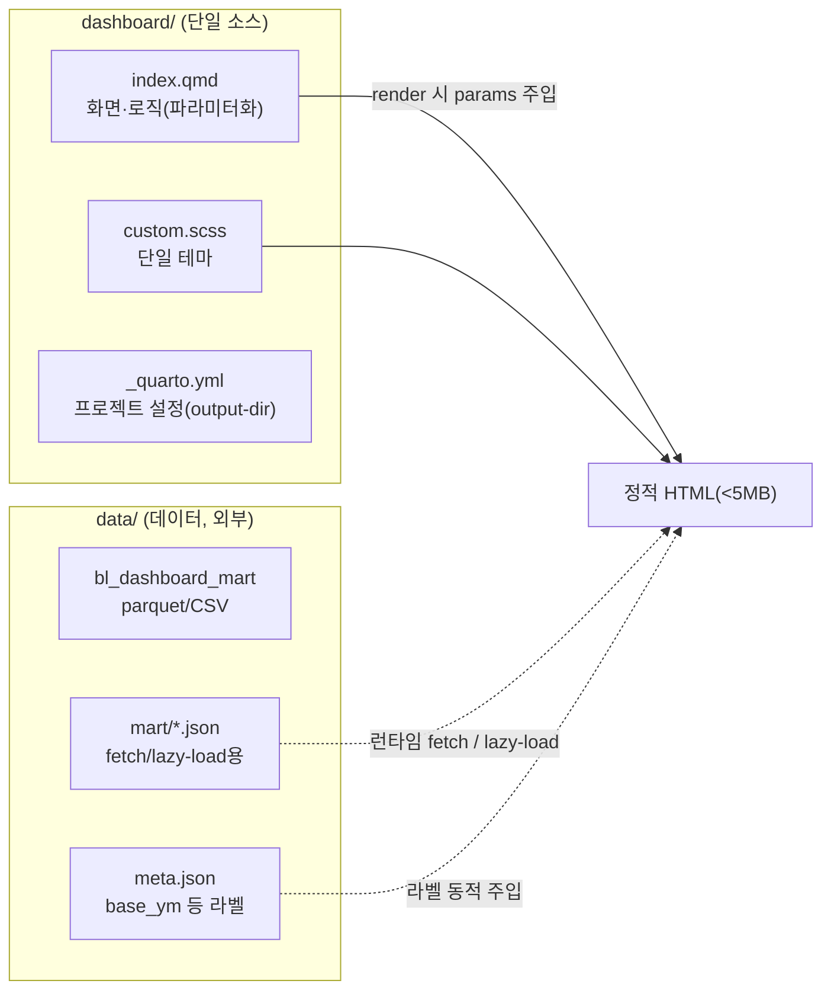
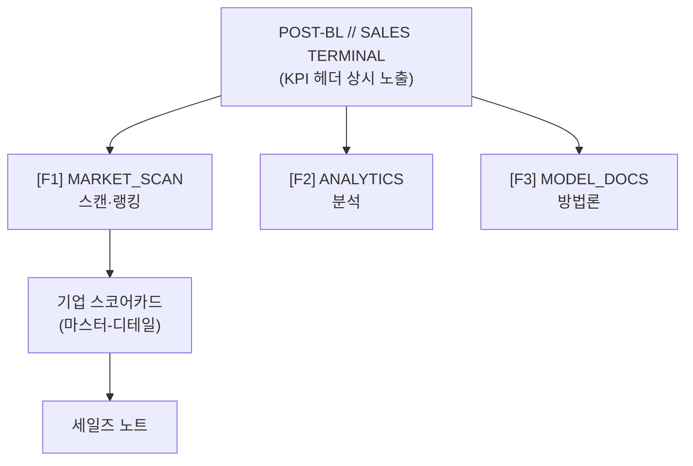
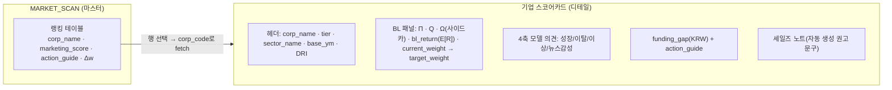
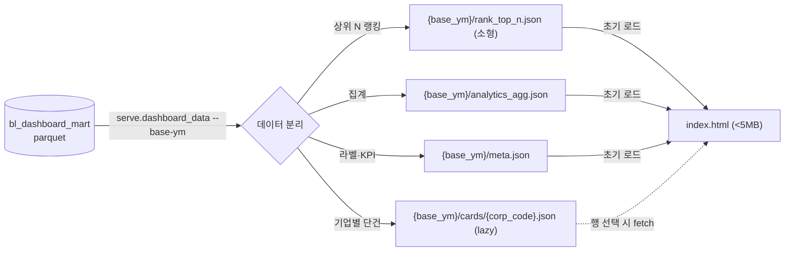
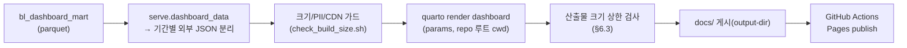

- 문서명: BL 대시보드·배포 설계서 (Dashboard & Deployment Design)
- 버전: v0.3
- 작성일: 2026-06-07
- 상태: Draft
- 작성주체: 데이터사이언스팀 (테크니컬 라이터)
- 관련문서:
  - [01 시스템 아키텍처](./01-system-architecture.md)
  - [02 데이터 파이프라인](./02-data-pipeline.md)
  - [03 BL 모델 설계](./03-bl-model-design.md)
  - [04 연산(Compute) 설계](./04-compute-design.md)
  - [ADR-0002 저장 포맷](./adr/ADR-0002-storage-format.md)
  - [ADR-0003 식별자 매핑](./adr/ADR-0003-identifier-mapping.md)
  - 기획: [01 프로젝트 개요](../planning/01-project-overview.md) · [02 PRD](../planning/02-prd.md) · [03 로드맵](../planning/03-roadmap.md) · [04 용어집](../planning/04-glossary.md)

---

# BL 대시보드·배포 설계서

> 본 문서는 BL 파이프라인의 **마지막 마일(last mile)**, 즉 `bl_dashboard_mart`(서빙 마트)를 **비기술직 법인 영업 마케터/RM**가 즉시 의사결정에 사용할 수 있는 "세일즈 터미널"로 변환·배포하는 설계를 **제안**한다. 과거 토이(Colab) 구현의 핵심 결함 — **44개 HTML 난립·709MB 빌드 산출물, 246MB 인라인 JSON, PII 평문 노출** — 을 구조적으로 제거하고, **파라미터화된 단일 Quarto 소스 + 외부 JSON lazy-load + 합성 데이터 GitHub Pages 데모**라는 격상판 표준을 제시한다.
>
> **데이터 계약의 권위 소스는 본 문서가 아니다.** 마트의 컬럼·타입·식별자는 [02 데이터 파이프라인 §3.2.3](./02-data-pipeline.md)(`bl_dashboard_mart`)이 단일 권위 스키마이며, 본 문서는 이를 **소비(consume)** 만 한다. BL 산출물(`marketing_score`/`action_guide`/`funding_gap` 등)의 정의는 [03 BL 모델 §8](./03-bl-model-design.md), 용어 정의는 [04 용어집 §6](../planning/04-glossary.md)에 종속한다. 라벨 문자열·색 의미·크기 상한 같은 "단일 진실(single source of truth)" 값은 각각 1곳(§1.3, §3.2, §6.3)에만 정의하고 나머지 절은 참조한다.

## 0. 요약 (TL;DR)

| 항목 | 과거(토이) | 격상판(본 설계) |
| --- | --- | --- |
| 소스 형태 | 44개 개별 HTML, 709MB | **단일 `index.qmd`** + `theme/period/data_path` 파라미터 |
| 테마 | HTML마다 인라인 CSS 산재 | **단일 `custom.scss`**(블룸버그 스타일 다크 터미널) |
| 데이터 결합 | 246MB **인라인 JSON**(HTML 내장) | 외부 `*.json` **fetch/lazy-load** + 상위 N 제한, 산출물 **< 5MB**(§6.3) |
| 저장 포맷 | pickle | **Parquet/CSV만**(pickle 폐기, [ADR-0002](./adr/ADR-0002-storage-format.md)) |
| 라벨 출처 | 하드코딩("2025년 10월" 등) | 메타데이터(`base_ym`)에서 **동적 주입**(§5.2) |
| PII | 실명·사업자번호 인라인 | 운영본 **접근통제**, 공개 데모 **합성 데이터만**(§8) |
| 배포 | 수동 업로드 | `quarto render` → **CI(GitHub Actions) → Pages**(§9) |

핵심 메시지: **"하나의 소스, 하나의 테마, 데이터는 바깥에."** 화면 로직(qmd)과 데이터(JSON/Parquet)와 스타일(scss)을 3분리하고, 데이터는 항상 외부에서 fetch/lazy-load 하여 빌드 산출물 크기를 상한(§6.3) 이내로 강제한다.

---

# 1. 목적과 사용자

## 1.1 목적

BL 대시보드는 BL 최적화 결과(`target_weight`, `bl_return`($E[R]$), `marketing_score`, `funding_gap`, `action_guide`)를 **마케터가 "오늘 누구에게 먼저 전화할지"를 즉시 판단**할 수 있는 시각·서사 형태로 제공한다. 대시보드는 모델을 설명하는 문서가 아니라 **영업 행동을 유발하는 도구**다. 컬럼명은 모두 [02 §3.2.3](./02-data-pipeline.md) 마트 스키마를 그대로 따른다.

| 목적 | 설계 함의 |
|---|---|
| 한정 영업자원의 우선순위 제시 | `marketing_score` 내림차순 랭킹·리밸런스 바차트가 1차 화면 |
| 권고의 "근거" 투명화 | 기업 스코어카드에 $\Pi$/$Q$/$\Omega$(BL 입력 사이드카, §5.4)·4축 모델의견·funding gap 동시 노출 |
| 비기술직 즉시 실행 | `action_guide`를 자연어 권고 문구로 변환(라벨 4종은 [03 §8.2](./03-bl-model-design.md) 단일 상수 모듈 인용) |
| 신뢰 가능한 의사결정 | 모든 수치에 기준시점(`base_ym`)·데이터 출처·DRI(데이터신뢰도) 병기 |

## 1.2 사용자(페르소나)와 권한

| 페르소나 | 기술 수준 | 주 사용 화면 | 핵심 질문 |
|---|---|---|---|
| 법인 영업 마케터/RM | 비기술직 | MARKET_SCAN(스캔·랭킹), 기업 스코어카드 | "오늘 어디부터 접촉?" |
| 영업팀장/지점장 | 비기술직 | ANALYTICS(분포·리밸런스), KPI 헤더 | "이번 분기 자원 배분 타당한가?" |
| 데이터사이언티스트(내부) | 기술직 | MODEL_DOCS(방법론), 민감도/검증 | "모델이 왜 이렇게 판단했나?" |

> 권한 모델은 §8 보안/PII에서 운영본(접근통제)과 공개 데모(합성 데이터)로 분리한다.

## 1.3 디자인 언어: 블룸버그 스타일 "세일즈 터미널" — 색·접근성 단일 정의

격상판은 과거 토이가 채택한 **블룸버그 터미널 스타일(다크 배경·고밀도 모노스페이스·기능키 라벨)** 의 시각적 정체성을 **유지·정제**한다. 친숙성과 "프로페셔널한 신뢰감"을 위해 그대로 계승하되, 색·타이포·간격은 **단일 `custom.scss`** 로 일원화한다. 아래 색 토큰·의미·접근성 규칙은 **본 문서의 단일 진실**이며, 다른 절(§4.2 등)은 이 표를 참조만 한다.

| 토큰 | 값(예시, scss 변수) | 의미 | 이중부호화(색 외 신호) |
|---|---|---|---|
| `$term-bg` | `#0b0e14` | 터미널 배경(딥 네이비/블랙) | — |
| `$term-fg` | `#d7dae0` | 기본 텍스트 | — |
| `$accent-up` | `#16c784` | 확대/유치 신호(green, $\Delta w \ge 0$) | **`▲` 아이콘 + `+` 부호 텍스트** 병기 |
| `$accent-down` | `#ea3943` | 축소/방어 신호(red, $\Delta w < 0$) | **`▼` 아이콘 + `−` 부호 텍스트** 병기 |
| `$accent-amber` | `#f0b90b` | 경고·이벤트·기능키 강조 | `!` 아이콘 |
| `$mono` | `"JetBrains Mono", monospace` | 수치·코드(로컬 폰트, §7.3) | — |

> **접근성(적록색맹 대응) — 필수.** 부호 정보는 **색에만 의존하지 않는다.** 모든 ±값(`weight_diff` 등)은 색과 **함께** `▲/▼` 아이콘과 `+/−` 부호 텍스트를 동시 표기하여, 색을 구분하지 못하는 사용자에게도 정보가 보존되게 한다(WCAG 1.4.1 "색에만 의존 금지"). 색의 의미 고정(up=green, down=red, amber=경고)은 `action_guide`/`weight_diff` 부호와 일관 매핑한다([03 §8.2](./03-bl-model-design.md)의 라벨-방향 정합 규칙을 시각에서도 보존).

---

# 2. 단일 소스 통합 (과거 44개 HTML → 1개 qmd)

## 2.1 문제 진단

과거 구현은 기간·티어·뷰별로 HTML을 **물리적으로 복제**하여 44개 파일, 합계 709MB가 되었다. 동일 차트 로직이 파일마다 인라인 복사되어 (a) 수정이 N곳에 전파되지 않고, (b) 데이터가 HTML에 인라인되어 크기가 폭증했다.

## 2.2 해결: 파라미터화된 단일 Quarto 프로젝트

화면은 **`dashboard/index.qmd` 단일 소스**로 통합하고, 변하는 것(테마/기간/데이터 경로)은 **Quarto 파라미터**로 외부화한다. 기간·티어별 산출물은 "파일 복제"가 아니라 "동일 소스에 파라미터를 바꿔 렌더"하여 생성한다.

> **실행 위치 고정(중요).** 모든 렌더 명령은 **repo 루트에서 `quarto render dashboard`(프로젝트 렌더)** 로 통일한다. 단일 `.qmd`를 직접 렌더하지 않는다(직접 렌더 시 `_quarto.yml`의 `output-dir`·리소스 경로가 다르게 동작). 프로젝트 렌더로 통일하면 `_quarto.yml`이 출력 경로를 결정하므로 명령줄의 `--output-dir`·경로 접두(`../`) 모순이 사라진다. `data_path` 파라미터는 **프로젝트 루트(repo 루트) 기준 상대경로**로 해석한다.

```yaml
# dashboard/_quarto.yml (프로젝트 설정 — 출력/리소스 경로의 단일 출처)
project:
  type: website
  output-dir: ../docs        # repo 루트 기준 docs/ 로 게시(Pages 루트)
  render:
    - index.qmd
```

```yaml
# dashboard/index.qmd (YAML 프런트매터)
---
title: "POST-BL // SALES TERMINAL"
format:
  html:
    theme:
      - cosmo
      - custom.scss            # 단일 테마(블룸버그 스타일)
    toc: false
    page-layout: full
    embed-resources: false     # 자원을 HTML에 인라인하지 않고 '외부 참조'로 남김
                               #  (주의) false는 인라인만 막을 뿐 참조가 CDN/로컬인지는
                               #  결정하지 않는다 → 데이터 비인라인은 §6, CDN 제거는 §7.3
    minimal: false
    anchor-sections: false     # Quarto 기본 외부 자원 비활성(로컬화, §7.3)
params:
  theme: "terminal-dark"       # 테마 스킨 선택
  period: "latest"             # base_ym 선택자: "latest" | "202510" | ...
  data_path: "data/sample/"    # repo 루트 기준 마트 산출물(JSON) 베이스 경로
  top_n: 200                   # 랭킹/테이블 상위 N 제한(크기 상한 방어)
  env: "demo"                  # "demo"(합성) | "ops"(운영, 접근통제)
---
```

렌더는 파라미터만 바꿔 호출한다(파일 복제 금지). **명령 cwd는 모두 repo 루트**다.

```bash
# (cwd = repo 루트) 운영본(최신 기간) — 출력 경로는 _quarto.yml이 결정
quarto render dashboard -P env:ops -P period:latest -P data_path:data/processed/

# (cwd = repo 루트) 공개 데모(합성, 특정 기간)
quarto render dashboard -P env:demo -P period:202510 -P data_path:data/sample/
```

> `data_path`는 §9.2 로컬 빌드·§9.3 CI 모두에서 **`data/sample/`**(repo 루트 기준) 한 형태로 통일한다(`../` 접두 금지). `period`의 기간 디렉터리 레이아웃은 §5.3에 정의한다.

## 2.3 단일 테마 `custom.scss`

테마는 **하나의 scss**로만 정의하고, qmd는 이를 참조만 한다. 블룸버그 스타일 토큰(§1.3)을 변수로 선언하고, 기능키 헤더·랭킹 테이블·스코어카드 컴포넌트 클래스를 한 곳에서 관리한다.

```scss
/*-- scss:defaults --*/
$term-bg:    #0b0e14;
$term-fg:    #d7dae0;
$accent-up:  #16c784;
$accent-down:#ea3943;
$accent-amber:#f0b90b;
$font-family-monospace: "JetBrains Mono", "D2Coding", monospace;

/*-- scss:rules --*/
body { background: $term-bg; color: $term-fg; font-family: $font-family-monospace; }
.fn-key { color: $term-bg; background: $accent-amber; padding: 0 .4rem; font-weight: 700; }
.score-up   { color: $accent-up; }   /* ▲ + 부호 텍스트와 병기(접근성, §1.3) */
.score-down { color: $accent-down; } /* ▼ − 부호 텍스트와 병기(접근성, §1.3) */
.kpi-tile { border: 1px solid rgba(215,218,224,.15); padding: .75rem 1rem; }
```

## 2.4 소스 3분리 구조



핵심 원칙: **로직(qmd)·스타일(scss)·데이터(json/parquet)는 절대 한 파일에 합치지 않는다.**

---

# 3. 정보구조 / 화면 설계

## 3.1 내비게이션(3대 영역)

상단 기능키 바(블룸버그 스타일)로 3개 영역을 전환한다.



| 영역 | 기능키 | 주 콘텐츠 | 주 사용자 |
|---|---|---|---|
| **MARKET_SCAN** | F1 | 전체 유니버스 스캔, `marketing_score` 랭킹 테이블, 티어/섹터 필터, 리밸런스 바차트 | 마케터/RM |
| **ANALYTICS** | F2 | 스코어 분포, `action_guide` 구성, funding gap 집계, 티어×섹터 히트맵 | 팀장/지점장 |
| **MODEL_DOCS** | F3 | BL 방법론 요약, $\Pi$/$Q$/$\Omega$ 해설, 검증/민감도, 데이터 출처·면책 | 내부 DS |

## 3.2 마스터-디테일: 기업 스코어카드 & 세일즈 노트

MARKET_SCAN의 랭킹(마스터)에서 한 행을 선택하면 우측/하단에 **기업 스코어카드(디테일)** 가 lazy-load 된다.



**기업 스코어카드 구성 요소** — 컬럼명은 [02 §3.2.3](./02-data-pipeline.md) 마트 스키마를 그대로 사용한다(본 문서는 컬럼을 새로 정의하지 않는다).

| 블록 | 표시 필드(마트 컬럼, [02 §3.2.3](./02-data-pipeline.md)) | 비고 |
|---|---|---|
| 헤더 | `corp_name`, `tier`(T1/T2/T3), `sector_name`(`sector_code`), `base_ym`, `DRI` | 식별 PII는 운영본만(§8) |
| BL 사후 | `bl_return`($E[R]$), `current_weight`, `market_weight`, `target_weight`, `weight_diff` | [03 BL 모델 §8](./03-bl-model-design.md) |
| BL 입력(Π/Q/Ω) | `Π`/`Q`/`Ω`는 마트가 아니라 **BL 입력 사이드카**에서 읽음(§5.4) | [02 §3.2.2](./02-data-pipeline.md)·[03 §5](./03-bl-model-design.md) |
| 4축 모델 의견 | `prob_growth_raw`, `prob_churn_raw`, `anomaly_score_raw`, `news_sentiment` + `sentiment_confidence` | XGBoost·IForest·Gemini |
| 액션 | `marketing_score`(0–100), `action_guide`, `funding_gap`(KRW) | 색·라벨 부호 정합(§1.3) |
| 세일즈 노트 | `marketing_note`(템플릿 기반 자연어 권고) | XSS 이스케이프(§8.3) |

> **DRI 출처 주의.** `DRI`는 [02 §3.2.2 `bl_input_data`](./02-data-pipeline.md)의 컬럼이며, 스코어카드 표시를 위해 serve 단계에서 마트/사이드카로 함께 직렬화한다. $\Pi$/$Q$/$\Omega$는 마트의 단건 컬럼이 아니라 BL 입력(`bl_input_data` + 행렬 사이드카 `bl_sigma`/`bl_P`/`bl_omega`, [02 §3.2.2](./02-data-pipeline.md))을 요약해 단건 카드 JSON으로 직렬화한 것이다(§5.4). 따라서 "대시보드의 유일한 데이터 입력은 마트"라는 원칙(§5.1)은 **표시용으로 마트 + 동일 serve 단계가 생성한 BL 입력 사이드카**로 확장된다.

**세일즈 노트(자동 권고 문구) 예시 — 라벨은 [03 §8.2](./03-bl-model-design.md) 단일 상수 모듈만 사용**

> [적극 유치 / Aggressive Buy] **{corp_name}**(T1, 제조)은 뉴스 감성 +0.62(이벤트: 증설 투자)와 성장 View 상위 5%가 결합되어 **`weight_diff` = +1.8%p**($\Delta w = w^{target}-w^{current}$)로 확대 권고. funding gap 약 ₩{funding_gap}. 기준시점 {base_ym}. **금리 우대 + 급여이체 전환** 제안 권장.

> 예시 노트의 "+1.8%p"는 임의 수치가 아니라 **`weight_diff`(=$\Delta w$) 그 값**이다(별개 개념 아님). 라벨 4종(적극 유치 / 유치 확대 / 유지 / 관망·방어)과 영문 페어(Aggressive Buy / Buy / Hold / Watch/Defend)는 **본 문서가 정의하지 않으며** [03 §8.2 표](./03-bl-model-design.md)를 1:1 인용한다.

---

# 4. KPI 및 시각화

## 4.1 KPI 헤더(상시 노출)

KPI는 **원시 행이 아니라 사전집계**(`meta.json` 또는 `analytics_agg.json`)에서 읽는다(§6.2 "집계 선계산"과 정합). 대시보드는 [02 §3.2.3](./02-data-pipeline.md) 마트만 입력으로 받으며, `FINANCIAL_WIDE` 같은 원천 테이블을 직접 참조하지 않는다.

| KPI | 정의 | 출처(사전집계) | 표시 |
|---|---|---|---|
| **TARGET AUM** | 대상 유니버스 총 지갑(예금) 규모 | `meta.json.target_aum_krw`(마트 생성 시 `FINANCIAL_WIDE.cash_amount` 집계로 사전계산, [02 §3.1.3](./02-data-pipeline.md)) | ₩ 표기, `base_ym` 병기 |
| **ACTIVE LEADS** | `action_guide` ∈ {적극 유치, 유치 확대} 건수 | `meta.json.active_leads`(사전집계 카운트). 전기 대비 Δ는 `active_leads_prev`(+비교 `base_ym`) 존재 시만 표시 | 건수 (+demo는 Δ 미표시 허용) |
| **REBALANCE Δ** | $\sum_i \lvert w^{target}_i - w^{current}_i\rvert / 2$ (턴오버; 분모 $1/2$는 매수·매도 중복 제거) | `meta.json.turnover` 또는 `analytics_agg.json`의 사전집계 turnover | % |
| **AVG SCORE** | `marketing_score` 평균/중앙값 | `analytics_agg.json`(사전집계) | 0–100 |

> KPI 라벨의 기간 문구는 **하드코딩하지 않고** `meta.json`의 `base_ym`에서 읽는다(§5.2). 전기 대비 Δ는 비교 기준값이 메타에 있을 때만 계산하며(§5.2 스키마), demo에서는 기본적으로 Δ 미표시로 둔다(운영본 전용).

## 4.2 핵심 시각화

부호=색 인코딩은 §1.3의 단일 색 정의를 따르며, **색 외 이중부호화(▲/▼·±기호)** 를 동시에 적용한다(접근성).

| 시각화 | 영역 | 인코딩 | 데이터(상위 N) |
|---|---|---|---|
| **리밸런스 바차트** | MARKET_SCAN | x=고객, y=`weight_diff`(±), 색=부호(§1.3) + ▲/▼ 라벨 | top_n 발산형 |
| **스코어 분포** | ANALYTICS | `marketing_score` 히스토그램 + 50/80 임계선 | 전체(사전집계) |
| **action_guide 구성** | ANALYTICS | 도넛/스택바(라벨별 카운트) | 전체(사전집계) |
| **funding gap 집계** | ANALYTICS | 티어별 누적 막대(KRW) | 티어 사전집계 |
| **티어×섹터 히트맵** | ANALYTICS | 평균 `marketing_score` 히트맵 | 사전집계 |
| **스코어카드 Π/Q/Ω** | 디테일 | 소형 다이버징 바(사전 vs 뷰 기여) | 단건 fetch(BL 입력 사이드카, §5.4) |

**리밸런스 바차트 — Plotly 발산형(부호=색) 스니펫**

```python
# serve.dashboard_data 가 생성한 외부 JSON을 qmd가 읽어 렌더
import plotly.graph_objects as go
colors = ["#16c784" if d >= 0 else "#ea3943" for d in df["weight_diff"]]
arrows = ["▲" if d >= 0 else "▼" for d in df["weight_diff"]]   # 색 외 이중부호화(§1.3)
fig = go.Figure(go.Bar(
    x=df["corp_name"], y=df["weight_diff"], marker_color=colors,
    customdata=df["corp_name"],          # 사용자문자열은 customdata로 전달(§8.3)
    text=arrows, textposition="outside",
    hovertemplate="%{customdata}<br>Δw=%{y:+.3%}<extra></extra>",  # 직접 삽입 금지
))
fig.update_layout(template="plotly_dark", paper_bgcolor="#0b0e14",
                  plot_bgcolor="#0b0e14", font_family="JetBrains Mono")
```

> 분포·랭킹은 [03 BL 모델 §9.4](./03-bl-model-design.md)의 **퇴화 진단**(거의 전부 100/50 집중 금지)을 시각으로도 노출하여, 분포 붕괴 시 즉시 눈에 띄게 한다.

---

# 5. 데이터 바인딩

## 5.1 데이터 계약: `bl_dashboard_mart` (권위 스키마는 02, parquet/CSV, pickle 금지)

대시보드의 **유일한 1차 데이터 입력**은 서빙 마트 `bl_dashboard_mart`다(표시용 BL 입력 사이드카는 §5.4). 저장은 **Parquet(우선) / CSV(교환)** 만 사용하며 **pickle은 폐기**한다([ADR-0002](./adr/ADR-0002-storage-format.md)).

> **컬럼 권위 소스는 [02 §3.2.3](./02-data-pipeline.md)이다.** 아래 표는 02의 스키마에서 대시보드가 **소비**하는 컬럼만 발췌한 것이며, 컬럼명·타입을 본 문서가 새로 정의하지 않는다(과거 v0.1의 `er`/`view_*`/`w_current`/`TARGET_ID`/`pi`·`q`·`omega` 표기는 02와 불일치하여 폐기).

| 컬럼(=02 스키마) | 타입 | 의미 | 비고 |
|---|---|---|---|
| `corp_code`, `target_id` | str | 표준 자산 키 | crosswalk 기준([ADR-0003](./adr/ADR-0003-identifier-mapping.md)) |
| `corp_name` | str | 표시명 | 운영=실명, 데모=합성명 |
| `tier` | str | T1/T2/T3 | 필터 축 |
| `sector_code`, `sector_name`, `region_main` | str | 섹터/지역 | 필터/히트맵 |
| `base_ym` | int | 기준시점(YYYYMM) | 라벨/시점정합 |
| `DRI` | float | 데이터신뢰도 | 신뢰 표시(원천 [02 §3.2.2](./02-data-pipeline.md)) |
| `bl_return` | float | $E[R]$ 사후 기대수익 | 스코어카드 |
| `current_weight`, `market_weight`, `target_weight`, `weight_diff` | float | $w_{current}/w_{mkt}/w^*/\Delta$ | 바차트·KPI |
| `marketing_score` | float | 0–100 우선순위 | 랭킹/분포 |
| `action_guide` | str | 권고 라벨(단일 상수, [03 §8.2](./03-bl-model-design.md)) | 색·문구 |
| `funding_gap` | float | KRW 권고 재배분 | gap 차트 |
| `prob_growth_raw`, `prob_churn_raw`, `anomaly_score_raw`, `news_sentiment` | float | 4축 신호 원천 | + `sentiment_confidence` |
| `marketing_note`, `op_bl`, `op_ml`, `op_gemini` | str | 근거/메모 | 세일즈 노트 입력 |

> 4축 신호 컬럼은 **마트가 정의하는 컬럼**이며 별도 표시명을 만들지 않는다. 화면 표기와 마트 컬럼의 매핑: 성장←`prob_growth_raw`, 이탈←`prob_churn_raw`, 이상←`anomaly_score_raw`, 뉴스감성←`news_sentiment`(신뢰도←`sentiment_confidence`).
>
> 식별 컬럼(`biz_reg_no`, `jurir_no`, `stock_code`)은 **운영 마트에만** 포함하고 공개 데모 마트에서는 제거/마스킹한다(§8). 식별자 명칭은 02·용어집과 일원화하여 **`biz_reg_no`**(과거 `bizr_no` 표기 폐기)로 통일한다. 식별자 오조인(과거 `biz_reg_no`↔`jurir_no` 오조인으로 99.4% 소실, [02 §4.1](./02-data-pipeline.md))은 마트 생성 단계 crosswalk로 차단되며, 대시보드는 이미 검증된 `corp_code`만 사용한다.

## 5.2 메타데이터에서 라벨 읽기 (하드코딩 금지)

기간 라벨·집계 KPI·총 AUM 등은 코드에 박지 않고 **`meta.json`** 에서 읽어 주입한다. 과거 "2025년 10월" 같은 문구가 HTML에 박혀 기간 변경 시 누락·불일치를 일으킨 결함을 차단한다.

```json
// data/sample/202510/meta.json  (serve.dashboard_data 산출, 02의 bl_dashboard_metadata.json 대응)
{
  "base_ym": 202510,
  "base_ym_label": "2025년 10월",
  "universe_size": 1843,
  "target_aum_krw": 8421000000000,
  "active_leads": 312,
  "active_leads_prev": 298,           // 전기 대비 Δ용(없으면 demo에서 Δ 미표시)
  "active_leads_base_ym_prev": 202507,
  "turnover": 0.214,                  // REBALANCE Δ 사전집계(Σ|Δw|/2)
  "env": "demo",
  "generated_at": "2026-06-07T09:00:00+09:00",
  "data_provenance": "synthetic(분포 근사, 원천 구조 모사: DART/ECOS/FinanceDataReader/Naver/Gemini)"
}
```

> `data_provenance`는 demo에서 **전체를 합성 라벨로 감싼다**(원천명을 실원천처럼 나열하지 않음). 지수 소스 **FinanceDataReader**를 포함하여 [02 파이프라인 §1.1](./02-data-pipeline.md)(Track A=ECOS+FDR)과 정합시킨다. `target_aum_krw`/`active_leads`/`turnover`는 모두 사전집계 값이다(§4.1).

```python
# qmd 내부: 라벨은 항상 meta에서 (period 해석 결과 디렉터리 기준)
import json, pathlib
meta = json.loads((resolve_period_dir(params) / "meta.json").read_text("utf-8"))
period_label = meta["base_ym_label"]   # 하드코딩 금지
```

## 5.3 period 파라미터 ↔ base_ym 해석 (기간 디렉터리 레이아웃)

`data_path` 하위는 **기간별 디렉터리**로 레이아웃한다. 단일 기간만 있을 때도 동일 구조를 사용해 `latest` 로직이 항상 동작하게 한다.

```text
data/sample/
  202507/  meta.json  rank_top_n.json  analytics_agg.json  cards/{corp_code}.json  bl_input/
  202510/  meta.json  rank_top_n.json  analytics_agg.json  cards/{corp_code}.json  bl_input/
```

`serve.dashboard_data`는 `--base-ym`(또는 다기간 `--periods`) 인자로 **기간별 폴더를 생성**한다(§6.1·§9.2). `params.period` 해석:

```python
def resolve_period_dir(params):
    base = pathlib.Path(params["data_path"])             # repo 루트 기준
    if params["period"] == "latest":
        dirs = [p for p in base.iterdir() if p.name.isdigit()]   # base_ym 디렉터리만
        return max(dirs, key=lambda p: int(p.name))             # 가장 큰 base_ym 선택
    return base / str(params["period"])                  # 명시값("202510")
```

선택 결과는 항상 `meta.json`으로 확정되어 화면 전체가 동일 기간을 참조한다(부분 불일치 차단).

## 5.4 BL 입력(Π/Q/Ω) 사이드카 — 마트 외 표시 데이터

스코어카드의 $\Pi$/$Q$/$\Omega$ 다이버징 바는 마트의 단건 컬럼이 아니라 **BL 입력**에서 온다. `bl_input_data`([02 §3.2.2](./02-data-pipeline.md): `Q_final`/`DRI`/`w_mkt` 등)와 행렬 사이드카(`bl_sigma.parquet`/`bl_P.parquet`/`bl_omega.parquet`)를 serve 단계가 자산별로 요약해 단건 카드 JSON(`cards/{corp_code}.json`)에 직렬화한다. 따라서:

- 마트(`bl_dashboard_mart`)는 [03 §8](./03-bl-model-design.md) 산출(`bl_return`/`marketing_score`/`action_guide`/`funding_gap` 등)만 반영한다.
- $\Pi$(=$\lambda\Sigma w_{mkt}$), $Q$(=`Q_final`), $\Omega$(=DRI·confidence 기반)는 **사이드카에서 읽는다**(마트에 `pi`/`q`/`omega` 컬럼을 신설하지 않는다).
- 카드 JSON 크기 상한(< 50KB, §6.3)을 지키도록 행렬 전체가 아닌 **해당 자산의 사전 기여·뷰값·불확실성 요약 스칼라**만 직렬화한다.

---

# 6. 데이터–HTML 분리 (246MB 인라인 JSON 금지)

## 6.1 원칙

빌드 산출물(HTML)에는 **데이터를 인라인하지 않는다.** 모든 데이터는 외부 `*.json`으로 분리하고, 화면이 필요 시점에 **fetch/lazy-load** 한다(이는 `embed-resources`와 무관하며, qmd가 외부 JSON을 명시적으로 fetch하도록 구현하는 것이다). 과거 246MB 인라인 JSON으로 단일 HTML이 브라우저에서 멈추던 결함을 원천 차단한다.



## 6.2 분리·축소 규칙

| 규칙 | 내용 |
|---|---|
| 상위 N 제한 | 초기 랭킹/바차트는 `top_n`(기본 200)만 직렬화. 전체는 검색/페이지로 |
| 단건 lazy-load | 스코어카드 상세는 `cards/{corp_code}.json` 으로 분할, 클릭 시 fetch |
| 집계 선계산 | 분포/히트맵/KPI는 원시 행이 아닌 **사전 집계(bin/카운트/turnover)** 만 전송(§4.1과 정합) |
| 수치 다운캐스트 | float64→float32, 소수 자리 반올림(표시 정밀도까지) |
| 필드 화이트리스트 | 화면이 쓰는 컬럼만 직렬화(내부 컬럼 누출 방지) |
| 캐시 무효화 | JSON 요청에 `?v={meta.generated_at}` 또는 콘텐츠 해시 쿼리스트링 부여(같은 파일명 갱신 시 브라우저 캐시 무력화) |
| gzip/압축 | Pages 응답 gzip, JSON 키 짧게 |
| 에러 폴백 | fetch 실패 시 빈 상태(empty state) + "재시도" UI 표시(무한 로딩·백지화 금지) |

## 6.3 산출물 크기 상한 (빌드 게이트 — 단일 진실)

빌드 산출물은 **상한을 강제**하고, 초과 시 CI를 실패시킨다. **아래 수치 상한은 본 문서의 단일 진실**이며, §0·§11 등은 이 표를 참조한다.

| 산출물 | 상한 | 초과 시 |
|---|---|---|
| `index.html`(데이터 제외) | < 2MB | 빌드 실패 |
| 초기 로드 JSON 합(`rank_top_n`+`analytics_agg`+`meta`) | < 3MB | top_n 축소 권고 |
| **HTML + 초기 JSON 합** | **< 5MB** | **CI fail** |
| 단건 카드 JSON | < 50KB | 필드 점검 |
| 전체 `docs/` 배포 | < 50MB | 데이터 분할/외부화 |

게이트는 `du`(디스크 블록 올림 오차)가 아니라 **실제 바이트(`wc -c`)** 로 검사하고, **명시 파일목록**만 합산하며, 표의 3단(2/3/5MB)·카드(50KB)·전체(50MB)를 **각각** 검사한다. PII grep도 같은 스크립트에 포함해 CI step 이름("size & PII gate")과 일치시킨다.

```bash
#!/usr/bin/env bash
# scripts/check_build_size.sh — 크기 + PII 게이트(§6.3 표를 단일 진실로 강제)
set -euo pipefail
DOCS=docs
bytes() { wc -c < "$1" 2>/dev/null || echo 0; }     # 실제 바이트(블록 올림 없음)
KB=1024; MB=$((1024*1024))

html=$(bytes "$DOCS/index.html")
period_dir=$(ls -d "$DOCS"/2* | sort | tail -1)      # latest 기간 디렉터리
init_json=0
for f in "$period_dir/rank_top_n.json" "$period_dir/analytics_agg.json" "$period_dir/meta.json"; do
  init_json=$(( init_json + $(bytes "$f") ))
done

# 1) index.html < 2MB
(( html < 2*MB ))            || { echo "FAIL index.html ${html}B >= 2MB"; exit 1; }
# 2) 초기 JSON 합 < 3MB
(( init_json < 3*MB ))       || { echo "FAIL initial JSON ${init_json}B >= 3MB"; exit 1; }
# 3) HTML + 초기 JSON < 5MB
(( html + init_json < 5*MB )) || { echo "FAIL HTML+JSON >= 5MB"; exit 1; }
# 4) 단건 카드 각 < 50KB
for c in "$period_dir"/cards/*.json; do
  (( $(bytes "$c") < 50*KB )) || { echo "FAIL card $c >= 50KB"; exit 1; }
done
# 5) 전체 docs/ < 50MB
total=$(find "$DOCS" -type f -printf '%s\n' | awk '{s+=$1} END{print s+0}')
(( total < 50*MB ))          || { echo "FAIL docs total ${total}B >= 50MB"; exit 1; }

# 6) PII 게이트: 데모 산출물에 식별 키/번호 패턴 없음
if grep -REn '"(biz_reg_no|jurir_no|stock_code)"' "$DOCS" >/dev/null; then
  echo "FAIL PII column key found in build"; exit 1; fi
if grep -REn '[0-9]{3}-[0-9]{2}-[0-9]{5}|[0-9]{6}-[0-9]{7}' "$DOCS" >/dev/null; then
  echo "FAIL PII number pattern (사업자/법인번호) found"; exit 1; fi
# 7) CDN URL 0건(로컬화 검증, §7.3)
if grep -REn 'https?://(cdn\.|unpkg|jsdelivr|fonts\.googleapis|cdnjs)' "$DOCS" >/dev/null; then
  echo "FAIL external CDN URL found (로컬 벤더링 위반)"; exit 1; fi
echo "size & PII & CDN gate: PASS"
```

---

# 7. 합성 샘플데이터 + GitHub Pages

## 7.1 합성 데이터 생성 원칙 (실 PII 금지)

공개 데모는 **실제 법인 PII를 절대 포함하지 않는다.** 합성 데이터는 운영 분포의 "모양"만 보존하고 식별 가능성을 제거한다.

| 원칙 | 내용 |
|---|---|
| 실명/실번호 금지 | `corp_name`은 합성 명칭(예: "가상제조-0042"), `biz_reg_no`/`jurir_no`/`stock_code` **제외** |
| 분포 보존 | `marketing_score`/`funding_gap`/`weight_diff`는 운영 분포 근사(시각 데모 가치 유지) |
| 관계 일관 | `action_guide`는 `weight_diff` 부호·`marketing_score`와 정합(라벨 규칙은 [03 §8.2](./03-bl-model-design.md) 동일 함수) |
| 재현성 | 고정 시드로 결정적 생성(`generate_sample.py --seed 20260607`) |
| 라벨링 | `meta.json.env="demo"`, `data_provenance`를 전체 "synthetic"으로 표기(§5.2) |

```python
# scripts/generate_sample.py (개요) — 컬럼명은 02 마트 스키마와 일치
rng = np.random.default_rng(20260607)
n = 1843
df = pd.DataFrame({
    "corp_code":   [f"SYN{ i:05d}" for i in range(n)],
    "corp_name":   [f"가상{sector}-{i:04d}" for i, sector in zip(range(n), sectors)],
    "tier":        rng.choice(["T1","T2","T3"], n, p=[.2,.6,.2]),
    "base_ym":     202510,
    "weight_diff": rng.normal(0, 0.01, n),     # 운영 분포 근사
})
# marketing_score/action_guide/funding_gap 은 BL 규칙(03 §8)과 동일 함수로 파생 → 합성도 라벨 정합
```

## 7.2 GitHub Pages 배포 구조

정적 산출물은 리포지토리의 **`docs/`** (또는 `gh-pages` 브랜치)에 둔다. 출력 경로는 `dashboard/_quarto.yml`의 `output-dir: ../docs`(§2.2)가 결정하며, 명령줄 `--output-dir`은 쓰지 않는다.

```text
repo/
  dashboard/                 # 단일 소스
    index.qmd  custom.scss  _quarto.yml
  data/sample/               # 합성 데이터(공개 가능, 기간별 디렉터리, §5.3)
    202510/  meta.json  rank_top_n.json  analytics_agg.json  cards/*.json  bl_input/
  docs/                      # Pages 게시 루트(빌드 산출물, 합성만)
    index.html
    202510/  *.json  cards/*.json     # 기간별 JSON(인라인 아님)
    assets/(vendored js/css/fonts)
  scripts/generate_sample.py  scripts/check_build_size.sh
  .github/workflows/pages.yml
```

## 7.3 오프라인 대응: CDN 제거·로컬 벤더링 (embed-resources와 분리)

오프라인/폐쇄망 가능 여부는 `embed-resources` 옵션이 아니라 **명시적 로컬 자원 지정**으로 달성한다. (`embed-resources:false`는 자원을 인라인하지 않고 외부 참조로 남길 뿐, 그 참조가 CDN인지 로컬인지는 결정하지 않으며 기본값으로 CDN을 가리킬 수 있다.) 따라서 아래처럼 **외부 CDN을 명시적으로 로컬화**한다.

| 자원 | 처리(로컬화 구체안) |
|---|---|
| Plotly.js | CDN 대신 `assets/vendor/plotly.min.js`를 `include-in-header`로 주입하거나, Python에서 `fig.write_html(..., include_plotlyjs="assets/vendor/plotly.min.js")` 사용 |
| 폰트(JetBrains Mono/D2Coding) | `assets/fonts/*.woff2` 로컬, `custom.scss`의 `@font-face`로 로컬 경로 임베드(Google Fonts CDN `<link>` 금지) |
| Bootstrap/MathJax 등 Quarto 외부 자원 | 사용 시 로컬 번들로 대체, 미사용 옵션은 비활성(`anchor-sections:false` 등, §2.2) |
| 아이콘/CSS | 로컬화, 외부 CDN `<link>`/`<script src>` 금지 |

> **검증.** 로컬화는 빌드 후 **CDN URL grep 0건**으로 확인한다(§6.3 게이트 step 7, §11). 데이터 비인라인(§6)과 CDN 제거(본 절)는 **별개 사안**이므로 한 옵션으로 묶지 않는다. 폰트·라이브러리 라이선스는 재배포 가능 여부를 확인하여 벤더링한다.

---

# 8. 보안 / PII

## 8.1 환경 분리(운영본 vs 공개 데모)

| 환경 | 데이터 | 식별 PII | 시크릿 | 호스팅 | 접근 |
|---|---|---|---|---|---|
| **ops(운영본)** | 실데이터 마트 | 포함(실명·번호) | 시크릿매니저/환경변수 | 사내(접근통제) | 인증·인가 필수 |
| **demo(공개)** | 합성만 | 없음 | 불필요 | GitHub Pages | 공개 |

`params.env`로 분기하며, `env=="demo"` 빌드는 식별 컬럼이 마트에 **존재하면 빌드를 실패**시키는 가드를 둔다(식별자 명칭은 02·용어집과 일원화: `biz_reg_no`).

```python
PII_COLS = {"biz_reg_no", "jurir_no", "stock_code"}
if params["env"] == "demo" and PII_COLS & set(df.columns):
    raise RuntimeError("DEMO 빌드에 PII 컬럼 존재 — 차단")
```

## 8.2 운영본 접근통제

- 운영 대시보드는 인증(SSO/사내계정) 뒤에서만 서빙하며, GitHub Pages(공개)에는 운영 데이터·산출물을 올리지 않는다.
- API 키·시크릿은 산출물(HTML/JSON)에 절대 포함하지 않는다(빌드 시 환경변수만 사용, 로그 마스킹은 [01 아키텍처 §8.2](./01-system-architecture.md)).

## 8.3 XSS 방지 (Python 기준 이스케이프)

세일즈 노트·기업명 등 데이터 유래 문자열을 HTML/JSON에 삽입할 때 반드시 이스케이프한다. 산출물은 **Python qmd가 생성**하므로 JS `JSON.stringify`가 아니라 Python `json.dumps`/`html.escape`를 기준으로 한다.

```python
import html, json

# (a) HTML 본문 삽입: 표시 텍스트는 사전 escape
safe_name = html.escape(row["corp_name"])     # < > & " ' 이스케이프

# (b) 외부 JSON 생성: </script> 시퀀스 무력화 (단순 치환이 아니라 유니코드 이스케이프)
def safe_json(obj) -> str:
    s = json.dumps(obj, ensure_ascii=True)    # 비ASCII는 \uXXXX
    return (s.replace("<", "\\u003c")         # '<' → <  ⇒ </script> 파싱 차단
             .replace(">", "\\u003e")
             .replace("&", "\\u0026"))
```

| 규칙 | 내용 |
|---|---|
| 출력 이스케이프 | 모든 데이터 유래 텍스트 `html.escape`(Python) |
| JSON 직렬화 | `json.dumps(ensure_ascii=True)` + `<`,`>`,`&` 유니코드 이스케이프(=`</script>` 무력화) |
| Plotly 텍스트 | 사용자문자열을 `hovertemplate`에 직접 넣지 말고 **`customdata`로 전달 후 표시**, 표시 텍스트는 사전 `html.escape`(§4.2 스니펫) |
| 콘텐츠 보안 | 인라인 스크립트 최소화 + 외부 자원 로컬화(§7.3)로 origin 축소. Pages는 헤더 제어가 제한적이므로 `<meta http-equiv="Content-Security-Policy" content="default-src 'self'">` 1줄을 qmd 헤더에 주입 권고 |

---

# 9. 빌드 / 배포 파이프라인

## 9.1 단계



## 9.2 로컬 빌드 (모든 명령 cwd = repo 루트)

```bash
# 1) 합성 데이터 생성(공개 데모)
python scripts/generate_sample.py --seed 20260607 --out data/sample/
# 2) 마트 → 기간별 외부 JSON 분리(상위 N·집계·카드 분할)
python -m bl.serve.dashboard_data --in data/sample/ --base-ym 202510 --top-n 200
# 3) 렌더(파라미터화 단일 소스, 프로젝트 렌더 — output-dir은 _quarto.yml이 결정)
quarto render dashboard -P env:demo -P period:202510 -P data_path:data/sample/
# 4) 게이트(크기+PII+CDN)
bash scripts/check_build_size.sh
```

## 9.3 CI: GitHub Actions → Pages

```yaml
# .github/workflows/pages.yml
name: build-and-publish-dashboard
on:
  push: { branches: [ main ], paths: [ "dashboard/**", "data/sample/**", "scripts/**" ] }
permissions: { contents: read, pages: write, id-token: write }
jobs:
  build:
    runs-on: ubuntu-latest
    steps:
      - uses: actions/checkout@v4
      - uses: quarto-dev/quarto-actions/setup@v2
      - uses: actions/setup-python@v5
        with: { python-version: "3.11" }
      - run: pip install -r requirements-dashboard.txt
      - run: python scripts/generate_sample.py --seed 20260607 --out data/sample/
      - run: python -m bl.serve.dashboard_data --in data/sample/ --base-ym 202510 --top-n 200
      # cwd=repo 루트, 프로젝트 렌더, data_path는 루트 기준(../ 접두 없음)
      - run: quarto render dashboard -P env:demo -P period:202510 -P data_path:data/sample/
      - name: size & PII gate
        run: bash scripts/check_build_size.sh   # 크기(§6.3)+PII+CDN → 실패 시 abort
      - uses: actions/upload-pages-artifact@v3
        with: { path: docs }
  deploy:
    needs: build
    runs-on: ubuntu-latest
    environment: { name: github-pages }
    steps:
      - uses: actions/deploy-pages@v4
```

> CI는 항상 **합성 데이터로만** 빌드한다(운영 데이터/시크릿 미주입). 크기·PII·CDN 게이트를 통과해야만 게시된다.

---

# 10. 과거 결함 → 해결 대조표 (결함 → 해결)

> 본 표는 **결함→해결의 1:1 대조**만 담는다(검증 가능 기준은 §11 체크리스트로 역할 분리).

| # | 과거 결함(토이/Colab) | 영향 | 격상판 해결 | 근거 |
|---|---|---|---|---|
| 1 | 44개 개별 HTML 난립, 709MB | 유지보수 불가·중복 | **단일 `index.qmd` + 파라미터(theme/period/data_path)** | §2 |
| 2 | HTML마다 인라인 CSS | 테마 불일치 | **단일 `custom.scss`** | §2.3 |
| 3 | 246MB 인라인 JSON(HTML 내장) | 브라우저 멈춤·크기폭증 | **외부 JSON + fetch/lazy-load + 상위 N**, 산출물 < 5MB | §6 |
| 4 | pickle 직렬화 | 보안·버전 취약 | **Parquet/CSV만** | §5.1·[ADR-0002](./adr/ADR-0002-storage-format.md) |
| 5 | 기간 라벨 하드코딩("2025년 10월") | 기간 변경 시 불일치 | **`meta.json`의 `base_ym`에서 동적 주입** | §5.2 |
| 6 | 실 PII(실명·사업자번호) 인라인·공개 | 정보유출 위험 | 운영본 **접근통제** + 공개 **합성 데이터만**, demo PII 가드 | §7.1·§8 |
| 7 | CDN 외부 의존 | 오프라인/폐쇄망 불가, 추적 | **명시적 로컬 벤더링·폰트 로컬화**(embed-resources와 분리) | §7.3 |
| 8 | 미이스케이프 문자열 | XSS 위험 | Python `html.escape` + `</script>` 유니코드 이스케이프 + Plotly customdata | §8.3 |
| 9 | 라벨-방향 색 불일치(음수 Δ에 'Buy') | 오독·오영업 | 색·라벨을 `weight_diff` 부호와 정합(라벨은 [03 §8.2](./03-bl-model-design.md) 단일 상수) + 색 외 이중부호화 | §1.3 |
| 10 | 수동 업로드 배포 | 재현성 없음 | **`quarto render dashboard` → CI(GitHub Actions) → Pages**, 빌드 게이트 | §9 |

---

# 11. 비기능 요구·검증 체크리스트 (검증 가능 기준)

> 각 항목은 **자동/스폿 검증 가능한 기준**이다. 수치 상한·라벨셋·색 의미의 정의는 각각 §6.3·[03 §8.2](./03-bl-model-design.md)·§1.3에 있으며, 여기서는 그 기준의 충족 여부만 점검한다.

- [ ] `index.html` < 2MB, 초기 JSON < 3MB, **HTML+초기 JSON < 5MB**, 카드 < 50KB, 전체 docs < 50MB (§6.3 `check_build_size.sh` 통과, 실제 바이트 기준)
- [ ] 외부 JSON이 HTML에 인라인되지 않고 런타임 fetch됨(HTML 내 데이터 grep 0건; `embed-resources`와 별개, §6)
- [ ] 모든 기간 라벨이 `meta.json.base_ym`에서 주입됨(하드코딩 grep 0건, §5.2)
- [ ] demo 빌드 산출물에 PII 컬럼 키(`biz_reg_no`/`jurir_no`/`stock_code`) 및 번호 패턴 0건(§6.3 게이트)
- [ ] 데이터 유래 문자열 전부 Python `html.escape`, JSON은 `</script>` 유니코드 이스케이프(§8.3)
- [ ] **CDN URL grep 0건**(폰트·Plotly·CSS 로컬 벤더링, §7.3·§6.3 step 7)
- [ ] `action_guide` 라벨이 [03 §8.2](./03-bl-model-design.md) 4종과 1:1 일치, 색·부호와 정합 + 색 외 ▲/▼·± 병기(접근성, §1.3)
- [ ] `marketing_score` 분포가 100/50 양극 집중이 아님(퇴화 진단 시각 노출, [03 §9.4](./03-bl-model-design.md))
- [ ] 스코어카드 lazy-load 단건 < 50KB, top_n 제한 동작, fetch 실패 시 폴백 UI 표시(§6.2)
- [ ] JSON 캐시버스팅(`?v={generated_at}`/해시) 적용으로 동일 파일명 갱신 시 신선도 보장(§6.2)
- [ ] 마트 컬럼명이 [02 §3.2.3](./02-data-pipeline.md) 권위 스키마와 일치(`bl_return`/`current_weight` 등), $\Pi$/$Q$/$\Omega$는 사이드카에서 읽음(§5.4)
- [ ] `quarto render dashboard` 파라미터만으로 기간/티어 산출물 재생성(파일 복제 0건, cwd=repo 루트)

---

> 본 설계는 [01 시스템 아키텍처](./01-system-architecture.md)의 **서빙·대시보드 레이어** 와 `serve.dashboard_data`(데이터/HTML 분리) 컴포넌트를 구체화하며, 입력 데이터 계약은 [02 §3.2.3](./02-data-pipeline.md)(`bl_dashboard_mart` 권위 스키마)과 [03 BL 모델 §8](./03-bl-model-design.md)의 산출(`marketing_score`·`action_guide`·`funding_gap`), [04 용어집 §6](../planning/04-glossary.md)의 자산 정의에 종속한다. 모든 수치(분포·크기 상한·KPI)는 합성/검증 데이터 기준의 **가설값**이며, 미검증 운영 수치는 단정하지 않는다(작성 기준일 2026-06-07).
