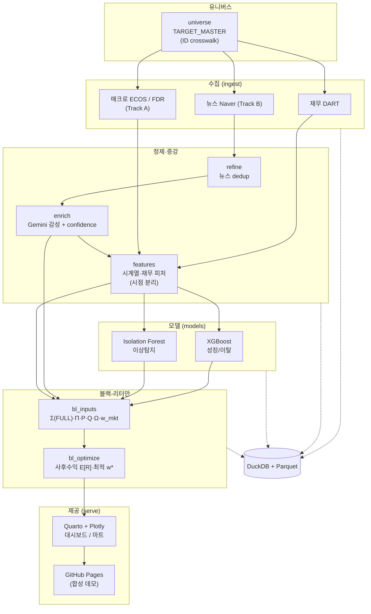

- 문서명: 프로젝트 개요 및 비전 (Project Overview & Vision)
- 버전: v0.3
- 작성일: 2026-06-07
- 상태: Draft
- 작성주체: 수석 데이터 사이언티스트 / 테크니컬 라이터
- 관련문서: [PRD](02-prd.md) · [로드맵](03-roadmap.md) · [용어집](04-glossary.md) · [시스템 아키텍처](../design/01-system-architecture.md) · [데이터 파이프라인](../design/02-data-pipeline.md) · [BL 모델 설계](../design/03-bl-model-design.md) · [연산 설계](../design/04-compute-design.md) · [대시보드 설계](../design/05-dashboard-design.md)

---

# BL: AI 기반 BL(Black-Litterman) 법인 마케팅 최적화 시스템

> **한 줄 정의**: 블랙-리터만(Black-Litterman) 포트폴리오 최적화 이론을 B2B 예금유치 마케팅에 적용하여, 한정된 영업자원을 법인 고객 "포트폴리오"에 최적 배분하는 의사결정 지원 시스템.

이 문서는 경영진과 실무자(마케터/RM, 데이터팀)가 함께 읽는 최상위 문서다. 배경과 문제정의, 비전, 솔루션의 핵심 아이디어, 토이→프로덕션 격상 동기, 범위, 이해관계자, 성공지표, 상위 아키텍처, 핵심 리스크를 한눈에 담는다. 세부 설계는 각 설계서로 분기한다.

---

## 1. 배경 및 문제정의

### 1.1 사업 환경 — 법인예금 이탈 위기

소매금융기관의 법인(B2B) 예금은 소수의 대형 거래처에 집중되어 있고, 금리 민감도가 높아 시중은행·증권사 파킹통장·MMF로의 자금 이동에 취약하다(내부 관찰 기반 가설; 정량 집중도(예: 상위 N사 비중)·금리탄력성은 격상판 데이터로 실측 예정). 한 곳의 대형 법인이 예치금을 인출하면 전체 잔액에 즉각적인 충격이 발생한다. 즉, **법인예금 포트폴리오는 "소수 자산에 집중된 고변동 포트폴리오"** 의 성격을 가진다(가설).

현장의 구조적 문제는 다음과 같다.

| 문제 | 현상 | 결과 |
|---|---|---|
| 예금 이탈 위기 | 금리 상승기·경쟁사 프로모션 시 대형 법인 자금 이동 | 잔액 급감, 조달비용 압박 |
| 데이터 파편화 | 재무(DART), 매크로(ECOS), 뉴스(Naver), 내부 거래 데이터가 각기 다른 사일로에 산재 | 고객 360도 뷰 부재, 신호 통합 불가 |
| 경험 의존 영업 | RM 개인의 감(感)과 관계에 의존, 자원 배분이 비정형·비재현적 | 우선순위 오판, 한정된 영업력의 비효율 배분 |
| 사후 대응 | 이탈 "발생 후" 인지 | 방어 골든타임 상실 |

### 1.2 의사결정 문제의 본질

영업자원(RM의 시간, 방문, 우대금리·이벤트 예산)은 **희소 자원**이다. 수천 개의 법인 고객사에 이 자원을 "어떻게 나눌 것인가"는 본질적으로 **제약 하의 최적 배분 문제**다. 이는 자산운용에서 한정된 자본을 여러 자산에 배분하는 **포트폴리오 최적화 문제와 수학적으로 동형(同型)** 이다.

전통적 평균-분산 최적화(Markowitz)는 기대수익률 추정 오차에 극도로 민감해 코너 해(특정 고객에 100% 쏠림)를 내는 한계가 있다. **블랙-리터만(Black-Litterman, BL)** 은 시장 균형(여기서는 "지갑 규모 기반 비중")을 사전(prior)으로 두고, 분석가의 전망(View)을 베이지안으로 결합하여 **안정적이고 해석 가능한 배분**을 도출한다. 본 프로젝트는 이 BL의 강점을 마케팅 자원 배분에 그대로 이식한다.

---

## 2. 비전 및 미션

### 2.1 비전 (Vision)

> **경험과 감(感)에 의존하던 법인 영업을, 데이터와 포트폴리오 이론에 기반한 재현 가능한 의사결정으로 전환한다.**

### 2.2 미션 (Mission)

- 파편화된 재무·매크로·뉴스 데이터를 단일 고객 뷰로 통합한다.
- 4축 신호 앙상블(뉴스감성·성장/이탈 패턴·이상탐지·거래관계 강도)을 BL의 "투자자 전망(View)"으로 정량화한다.
- 한정된 영업자원의 **최적 배분안(고객별 권장 가중치)** 을 비기술직 마케터/RM이 즉시 이해하고 실행할 수 있게 제공한다.
- 모든 산출을 **검증 가능·재현 가능·시점 정합**하게 만든다(데이터 누수 없는 학습, 멱등 파이프라인).

### 2.3 설계 원칙

1. **비기술직 우선(Non-tech first)**: 최종 산출물은 "이 고객에 자원을 더/덜 쓰라"는 의사결정 언어로 전달한다.
2. **재현성(Reproducibility)**: 설정 외부화, 멱등 적재, 고정 스케일러/시드, lineage 추적.
3. **누수 금지(No leakage)**: 미래 정보가 학습·평가에 새지 않도록 시점을 엄격히 분리한다.
4. **동일 로직·속도만 차이(Same logic, different speed)**: GPU(CuPy)/CPU(NumPy)는 수치 결과가 동일하고 속도만 다르다.
5. **방법론 정직성(Honesty)**: 미검증 수치를 단정하지 않는다. 성능은 가설로 명시한다.

---

## 3. 솔루션 개요 — BL의 마케팅 재해석

### 3.1 핵심 아이디어

법인 고객사를 "자산(asset)"으로 본다. 각 고객의 예금유치/유지 가치를 "기대수익률"로, 고객의 지갑(예금) 규모를 "시장 균형 비중"으로 둔다. 그 위에 **4축 신호 앙상블(news · pattern · anomaly · relationship)** 을 "투자자 전망(View)"으로 얹고, 각 전망의 신뢰도를 "전망 불확실성(Ω)"으로 둔다. BL 공식이 이를 결합해 **사후 기대수익(posterior)** 과 **최적 가중치(권장 자원 배분)** 를 산출한다.

블랙-리터만 사후 기대수익은 다음과 같이 정의된다(정칙형, precision form).

$$
E[R] = \left[ (\tau\Sigma)^{-1} + P^{\top}\Omega^{-1}P \right]^{-1} \left[ (\tau\Sigma)^{-1}\Pi + P^{\top}\Omega^{-1}Q \right]
$$

여기서 시장 균형 내재수익(implied equilibrium return)은 **지갑 규모 기반 비중** $w_{mkt}$ 에 앵커한다(현재 보유비중 $w_{current}$ 가 아님 — §9.2 R10 교정 사항).

$$
\Pi = \lambda \, \Sigma \, w_{mkt}
$$

- $\Sigma$: 고객 잔액증가율(log-return) 기반 **FULL 공분산** (Ledoit-Wolf 수축 적용)
- $\Pi$: 시장 균형 내재수익 ($w_{mkt}$ 앵커)
- $P$: 전망-자산 매핑 행렬(절대뷰/상대뷰), $Q$: 전망 벡터, $\Omega$: 전망 불확실성(대각)
- $\tau$: 사전 신뢰도 스케일(기본 0.05, 민감도 {0.025, 0.05, 0.1}), $\lambda$: 위험회피 계수(캘리브레이션, 시작 2.5, 클립 [1, 5])

**수치 안정성**: FULL 공분산은 고유값 바닥($\lambda_{floor}=10^{-8}\cdot\mathrm{tr}\Sigma/N$)과 조건수 상한($\kappa_{max}=10^6$)으로 PSD/안정성을 보장하고, 역행렬을 직접 구하는 대신 **Cholesky solve**를 사용하여 과거 토이판의 사후수익 폭주($E[R]_{max}=1.29$, 대각 극소분산 + `reg=1e-6` 하드 바닥이 원인)를 차단한다. 하드 바닥 정규화는 폐기하고 데이터 기반 수축 + 고유값 바닥으로 대체한다(상세 [BL 모델 설계 §3, §6](../design/03-bl-model-design.md)).

사후수익을 받아 자원 제약(예산·집중도·최소 배분 등) 하에서 **최적 가중치 $w^{*}$** 를 QP(convex quadratic program)로 푼다.

### 3.2 은유 매핑 표 (금융공학 → 마케팅)

| 금융공학 개념 | 기호 | 마케팅 재해석 | 본 프로젝트 구현 |
|---|---|---|---|
| 자산(asset) | $i$ | 법인 고객사 | TARGET_MASTER의 고객 노드 (corp_code 기준) |
| 기대수익률 | $E[R]$ | 예금유치/유지 가치 (CLV proxy) | 사후 기대수익 (BL posterior) |
| 시장 균형 가중치 | $w_{mkt}$ | 고객 예금(지갑) 규모 기반 비중 | 잔액 규모 정규화 비중 |
| 균형 내재수익 | $\Pi$ | 균형비중 $w_{mkt}$ 를 역산해 얻은 사전(prior) 기준선 (시장균형이 함의하는 기준 기대수익) | $\Pi = \lambda\Sigma w_{mkt}$ |
| 공분산 | $\Sigma$ | 고객 간 잔액 동조성/리스크 | 잔액증가율 log-return FULL 공분산 + Ledoit-Wolf |
| 투자자 전망 | $Q$ | 4축 신호 앙상블(news · pattern · anomaly · relationship) | XGBoost(성장/이탈), IsolationForest(이상), Gemini(뉴스감성), 거래관계 점수 |
| 전망 매핑 | $P$ | 어느 고객(들)에 대한 전망인가 | 절대뷰/상대뷰 행렬 |
| 전망 불확실성 | $\Omega$ | 신호를 얼마나 믿는가 | 데이터신뢰도(DRI) + 모델 confidence, $\Omega \propto 1/DRI^2$ |
| 최적 가중치 | $w^{*}$ | **권장 영업자원 배분** | cvxpy QP 해 (제약 하 최적화) |

### 3.3 뷰의 원천: 4축 신호 앙상블 (투자자 전망 Q의 구성)

투자자 전망 $Q$ 는 4개 축을 가중 합성한 `Q_final`로 구성된다. 축 가중은 $a=(0.35\,\text{news}, 0.35\,\text{pattern}, 0.15\,\text{anomaly}, 0.15\,\text{relationship})$, 합=1이다. 이 중 3개 축(news·pattern·anomaly)은 AI 모델 출력에서, relationship 축은 거래 메타데이터에서 파생되는 점수다(과거에 "AI 3종 신호"로 불린 것은 이 AI 모델 3종만 가리킨 표현이며, BL 입력 관점에서는 relationship을 포함한 4축이 정확하다).

| 축 | 출처/모델 | 의미 | BL 매핑 | 가중 |
|---|---|---|---|---|
| news | Gemini 2.5 Flash-Lite(뉴스감성) | 법인 관련 뉴스의 긍/부정 | 절대/상대뷰 $Q$ 기여 | 0.35 |
| pattern | XGBoost 분류 | 향후 잔액 성장(−)이탈 확률 차 | 절대뷰 $Q$ 기여 (부호 = 성장/이탈) | 0.35 |
| anomaly | Isolation Forest × 자금흐름 방향 | 방향성 이상 신호 | 절대뷰 $Q$ 기여 (부호 = 자금흐름 방향, $\text{anomaly\_score} \times \mathrm{sign}(trx\_in - trx\_out)$) | 0.15 |
| relationship | 거래관계 강도(파생 점수) | 계좌수·급여이체·주거래 등 결속도 | 절대뷰 $Q$ 기여 (+결속) | 0.15 |

- **출처 컬럼 계보**: news 축의 원천 점수는 `gemini_score`(=감성 enrich 산출 테이블 `COMPANY_SENTIMENT.sentiment_score`의 별칭/파생; 대시보드 마트에서는 `news_sentiment`/`view_news`로 표기)이며, relationship 축은 `relationship_score`(계좌수·급여이체·주거래)다. 단일 계보 정의는 [데이터 파이프라인](../design/02-data-pipeline.md)을 권위 소스로 한다.
- **공통 메커니즘 — confidence → Ω**: 위 4축은 모두 $Q$(전망 값) 기여 항이다. 각 신호의 신뢰도는 별도로 데이터신뢰도(DRI)와 모델 confidence를 통해 **전망 불확실성 $\Omega$** 로 반영된다($\Omega \propto 1/DRI^2$, 캘리브레이션된 confidence). 즉 anomaly score 자체는 $Q$ 축이며, "Ω 조정"은 anomaly와 무관한 공통 confidence/DRI 경로다. 상세는 [BL 모델 설계 §5](../design/03-bl-model-design.md).

세분화 축은 다음과 같다.

- **Tier(고객축)**: T1 상장 외감 / T2 비상장 중소 / T3 가상 섹터 노드(IS_VIRTUAL=true)
- **Track(수집축)**: A 매크로(한국은행 ECOS 금리·BSI, FinanceDataReader 지수) / B Naver 뉴스

---

## 4. 토이 → 프로덕션 격상

### 4.1 격상 동기

본 프로젝트는 원래 **Google Drive + Colab 무료 플랜** 기반의 토이 프로젝트였다. Colab의 런타임 제약(메모리·속도·세션 만료)과 Drive 경로 종속으로 인해 방법론과 엔지니어링 양면에서 타협이 누적되었다. 가장 치명적인 타협은 **속도를 위해 공분산을 대각(diagonal)만 사용** 하여 BL의 핵심인 "분산효과(고객 간 상관)"가 완전히 소실되고, 그 결과(대각 극소분산 + `reg=1e-6` 하드 바닥)로 **사후수익이 폭주($E[R]_{max}=1.29$)** 한 것이다. 이제 **클라우드(충분한 하드웨어 가정)** 로 격상하여, 속도 때문에 희생된 정확성을 복원하고 운영 가능한 형태로 재구축한다.

### 4.2 무엇이 달라지는가

| 영역 | As-is (토이) | To-be (프로덕션) |
|---|---|---|
| 실행 환경 | Colab 무료 + Google Drive | 클라우드, 헤드리스 실행, 설정(.env/pydantic-settings) 기반 경로 |
| 공분산 | 대각만 사용 (`np.diag(S)`) → 분산효과 소실, 사후수익 폭주($E[R]_{max}=1.29$) | **FULL 공분산** + Ledoit-Wolf 수축, 고유값 바닥($\lambda_{floor}=10^{-8}\,\mathrm{tr}\Sigma/N$)·조건수 상한($\kappa_{max}=10^6$)으로 PSD/안정성 보장, 역행렬 대신 **Cholesky solve**로 폭주 차단 |
| 연산 백엔드 | NumPy 단일, 속도 제약 | NumPy/SciPy(CPU) ↔ CuPy(GPU) 디스패치, **동일 수치·속도만 차이** (`xp = cupy if gpu else numpy`) |
| 저장 포맷 | pickle, CSV 산재 | DuckDB(수집/OLAP) + Parquet(분석/교환), **pickle 폐기**(임의코드실행 위험) |
| 최적화 | 수작업/단순 해 | cvxpy(OSQP/ECOS), 제약 많을 때 scipy SLSQP 병행 |
| 시크릿 | API 키 평문 노출(ECOS) | 환경변수/시크릿매니저, 로그 마스킹 |
| 코드 구조 | 노트북 13개 중심 | 재사용 모듈/패키지(`src/bl/`) + 얇은 실행 노트북/CLI |
| 데이터/배포 | Drive 산출물, PII 인라인 HTML | **합성 샘플데이터** + **GitHub Pages 정적 대시보드 데모** |
| 검증 | in-sample 평가 | 시점 분리 train/valid/test + walk-forward 백테스트 |

### 4.3 GPU/CPU 정책

GPU 유무는 **연산자원 활용(속도)만** 좌우한다. 배열 모듈을 추상화하여 단일 코드가 백엔드를 디스패치한다. GPU가 있으면 CuPy로 FULL 공분산·선형대수를 가속하고, 없으면 NumPy/SciPy로 동일한 로직·동일한 수치를 (느리지만) 그대로 산출한다. **수치 동치성은 회귀 테스트(상대오차 < 1e-8)로 보장한다.** 자세한 내용은 [연산 설계](../design/04-compute-design.md) 및 [ADR-0001 연산 백엔드](../design/adr/ADR-0001-compute-backend.md) 참조.

---

## 5. 범위 (Scope)

### 5.1 In Scope

- 고객 유니버스 정의(TARGET_MASTER)와 **명시적 ID crosswalk**(corp_code · biz_reg_no · jurir_no · stock_code 매핑)
- 재무(DART) / 매크로(ECOS) / 뉴스(Naver) 수집·적재(DuckDB) 및 뉴스 dedup·정제
- Gemini 뉴스 감성 enrich + confidence 캘리브레이션
- 시점 분리된 피처/라벨 생성, XGBoost·Isolation Forest 학습(누수 차단)
- BL 입력 구성($\Sigma, \Pi, P, Q, \Omega, w_{mkt}, \tau, \lambda$)과 BL 최적화(사후수익·최적 가중치)
- 합성 샘플데이터 생성 + Quarto/Plotly 대시보드, GitHub Pages 정적 배포(데모)
- 설계 문서·ADR·테스트·데이터 검증 체계

### 5.2 Out of Scope (현 단계)

- 실시간(스트리밍) 추론 및 온라인 학습 — 현재는 배치 주기 운영
- 자사 내부 거래원장/코어뱅킹 직접 연동 — 본 데모는 합성 샘플로 대체
- 실제 PII가 포함된 운영 대시보드의 공개 배포 (운영본은 접근통제, 공개 데모는 합성데이터만)
- 개인(B2C) 고객 세그먼트 — 본 프로젝트는 B2B 법인 한정
- 자동 영업 액션 실행(우대금리 자동 적용 등) — 본 시스템은 "의사결정 지원"까지
- KPI의 인과적 효과 측정용 정식 A/B 실험 설계 — 로드맵 후속 단계

---

## 6. 이해관계자 및 페르소나

| 페르소나 | 역할 | 핵심 니즈 | 본 시스템에서 보는 것 |
|---|---|---|---|
| **법인 영업 마케터** | 캠페인·이벤트 기획 집행 | 한정 예산을 어느 세그먼트/고객에 쓸지 | 권장 가중치 $w^{*}$ 기반 우선순위 리스트, 신호 근거 |
| **RM (관계관리자)** | 대형 법인 직접 관리 | 누구를 먼저 만나야 하나, 이탈 징후는 | 고객별 이탈/성장 신호, 뉴스 알림, 액션 권고 |
| **데이터팀 / DS** | 파이프라인·모델 운영 | 재현성·누수 차단·검증 | 멱등 파이프라인, walk-forward 백테스트, lineage |
| **경영진** | 자원배분 승인·성과 책임 | ROI·리스크·전략 정합 | KPI 대시보드(가설 기반 명시), 포트폴리오 집중도 |
| **컴플라이언스/보안** | PII·시크릿 관리 | 정보보호·감사 | 마스킹 로그, 접근통제, 합성데이터 공개 정책 |

비기술직(마케터·RM·경영진)이 1차 사용자이므로, 모든 산출물은 금융공학 용어가 아니라 **"이 고객에 자원을 더/덜 쓰라"** 는 의사결정 언어로 번역되어 제공된다.

---

## 7. 성공지표 (KPI)

> **중요**: 아래 목표치는 모두 **현재 미검증 가설(hypothesis)** 이다. 토이 단계에서 산출된 수치는 데이터 누수·in-sample 평가 등으로 신뢰할 수 없으며, 격상판에서 **시점 분리 검증과 walk-forward 백테스트로 실측**한 뒤에야 확정한다. 단정적으로 사용하지 말 것.

| KPI | 정의 | 측정 방법 | 목표(가설, 미검증) |
|---|---|---|---|
| 신호 적중률 | 이탈/성장 예측의 적중 비율 | 시점 분리 test셋 + walk-forward | 가설 — 베이스라인 대비 향상(수치 미확정) |
| 마케팅 ROI | 투입 영업자원 대비 유치/유지 가치 증분 | 배분안 적용군 vs 대조군 비교(향후 실험) | 가설 — 양(+)의 증분 |
| 이탈 방어율 | 사전 경보 고객 중 실제 방어된 비율 | 경보→액션→결과 추적 | 가설 — 골든타임 확보로 개선 |
| 자금유치 규모 | 권장 배분 적용 시 순유입 잔액 | 잔액 시계열 모니터링 | 가설 — 집중 리스크 분산 + 순증 |
| 포트폴리오 집중도 | 상위 고객 가중치 쏠림(HHI 등) | $w^{*}$ 분포 분석 | 가설 — BL로 코너해 완화 |
| 운영 건전성 | 파이프라인 재현성·누수 부재·수치 동치성 | 정량 합격선(아래) 전건 통과 | 100% 통과 (엔지니어링 목표) |

운영 건전성(재현성·누수 부재·수치 동치성)은 가설이 아니라 **반드시 달성해야 하는 엔지니어링 목표**이며, "무엇의 100%"인지를 다음 정량 합격선으로 정의한다.

- 백엔드 수치 동치성: CPU(NumPy) ↔ GPU(CuPy) **상대오차 < 1e-8** 회귀테스트 전건 통과
- 가중치 정합: dedup 후 자산 무중복, **$\sum w^{*} = 1 \pm 10^{-6}$**
- 페이지네이션: `OFFSET` 비결정 누락 **0건**(결정적 정렬 재현성 테스트)
- 누수 가드: `bal_future_3m` 피처 사용 0, in-sample 평가 금지 린트, 시점분리 단위테스트 전건 통과
- 저장: pickle 산출물 0개, ID 오조인으로 인한 tier=UNKNOWN < 1%

근거 ADR: [ADR-0001 연산 백엔드](../design/adr/ADR-0001-compute-backend.md), [ADR-0004 누수 없는 학습](../design/adr/ADR-0004-leakage-free-training.md).

---

## 8. 상위 아키텍처 한눈에

저장은 DuckDB(수집/적재/OLAP)와 Parquet(분석/교환)로 일원화하고 pickle은 폐기한다. 코드는 `src/bl/` 레이아웃의 재사용 패키지로 재구성한다(`import bl`). 노트북 번호 대응(핵심 11계열): 01 재무, 02 Track A, 03 Track B, 04 Track C(격상판 제외: BigKinds 폐쇄적 API), 05 뉴스정제, 06 Gemini, 07 전처리, 08 모델학습, 09 BL입력, 10 BL최적화, 11/11-1 대시보드. 이 외에 유니버스·보정 노트북 2개(TARGET_MASTER, 학습_전_데이터보정)가 별도로 있어 과거 노트북은 총 13개다(번호 체계 보존, 매핑 상세는 [로드맵 §과거 노트북↔모듈 매핑](03-roadmap.md)). 상세 아키텍처는 [시스템 아키텍처](../design/01-system-architecture.md) 참조.

---

## 9. 핵심 리스크 요약 (해결 대상)

토이 단계 분석에서 식별된 치명 이슈를, 격상판에서 "해결 대상"으로 명시한다. 각 항목은 설계서/ADR에서 구체적 대응을 다룬다.

### 9.1 정확성·타당성

| # | 리스크 (As-is 결함) | 해결 방향 (To-be) | 참조 |
|---|---|---|---|
| R1 | 학습데이터로 그대로 평가(train/test 분리·CV 없음) | 시점기반 train/valid/test 분리 + walk-forward 백테스트, in-sample 금지 | [ADR-0004](../design/adr/ADR-0004-leakage-free-training.md) |
| R2 | `bal_future_3m`(미래 잔액)이 라벨이자 피처(look-ahead 누수) | 피처/라벨 시점 엄격 분리, 미래정보 차단 | [ADR-0004](../design/adr/ADR-0004-leakage-free-training.md) |
| R3 | biz_reg_no(사업자번호)를 jurir_no(법인번호)로 오조인 → 99.4% tier=UNKNOWN 소실 | 명시적 ID crosswalk(매핑 테이블) | [ADR-0003](../design/adr/ADR-0003-identifier-mapping.md) |
| R4 | `OFFSET` without `ORDER BY`(비결정 페이지네이션, ~38% 누락) | 결정적 키 정렬 또는 단일 쿼리 | [데이터 파이프라인](../design/02-data-pipeline.md) |
| R5 | 추론배치 min/max로 [-1,1] 정규화(누수·실행마다 비교불가) | 학습기준 고정 스케일러 저장/재사용 | [ADR-0004](../design/adr/ADR-0004-leakage-free-training.md) |
| R6 | confidence 하드코딩(0.85/0.65 등) | 검증셋 기반 실측 캘리브레이션(reliability) | [BL 모델 설계](../design/03-bl-model-design.md) |
| R7 | API 키 평문 노출(ECOS) | 시크릿은 환경변수/시크릿매니저, 로그 마스킹 | [시스템 아키텍처](../design/01-system-architecture.md) |

### 9.2 BL 방법론

| # | 리스크 | 해결 방향 | 참조 |
|---|---|---|---|
| R8 | 공분산 대각만 사용 → 분산효과 소실 | **FULL 공분산** + Ledoit-Wolf 수축으로 조건수 관리 | [ADR-0001](../design/adr/ADR-0001-compute-backend.md), [BL 모델 설계](../design/03-bl-model-design.md) |
| R9 | $\Sigma$가 "잔액 변동계수²" | 잔액증가율(log-return) 공분산으로 재정의 | [BL 모델 설계](../design/03-bl-model-design.md) |
| R10 | $\Pi$를 $w_{hybrid}(=0.7\,w_{current}+0.3\,w_{mkt})$ 에 앵커(현상유지 순환논리) | $w_{mkt}$(지갑규모)에 앵커, $\Pi=\lambda\Sigma w_{mkt}$ | [BL 모델 설계](../design/03-bl-model-design.md) |
| R11 | $Q(\sim0.01)$와 $\Omega(\sim17)$ 단위 부정합 | 뷰·불확실성·$\tau\Sigma$ 단위 통일, 스케일 정합 | [BL 모델 설계](../design/03-bl-model-design.md) |
| R12 | $P$ 행렬 미사용 | $P$ 명시적 구성(절대뷰/상대뷰), $Q$와 정합 | [BL 모델 설계](../design/03-bl-model-design.md) |
| R13 | `reg=1e-6` 하드 바닥 → 사후수익 폭주($E[R]_{max}=1.29$, 미검증) | 하드 바닥 폐기, 수축+고유값 바닥+조건수 상한+Cholesky solve로 정상 범위 검증 | [BL 모델 설계 §3, §6](../design/03-bl-model-design.md) |

### 9.3 엔지니어링

| # | 리스크 | 해결 방향 | 참조 |
|---|---|---|---|
| R14 | 대시보드 버전 난립(44개 HTML, 709MB; 246MB 인라인 JSON) | 단일소스 파라미터화, 데이터를 HTML에서 분리(외부 JSON/lazy-load), 빌드 산출물 크기 상한 | [대시보드 설계](../design/05-dashboard-design.md) |
| R15 | Colab/Drive 경로·pickle 종속 | 설정 외부화 기반 경로·헤드리스 실행, 저장은 DuckDB+Parquet로 표준화 | [시스템 아키텍처](../design/01-system-architecture.md), [ADR-0002](../design/adr/ADR-0002-storage-format.md) |
| R16 | PII 인라인 HTML | 운영본 접근통제, 공개 데모는 합성 샘플데이터만 | [대시보드 설계](../design/05-dashboard-design.md) |
| R17 | 광범위 bare except | 명시적 예외처리·구조적 로깅 | [시스템 아키텍처](../design/01-system-architecture.md) |

### 9.4 보존할 강점 (계승)

격상 과정에서 토이 단계의 다음 강점은 보존·강화한다.

- 4축 뷰 앙상블(news · pattern · anomaly · relationship), 축 가중 $a=(0.35, 0.35, 0.15, 0.15)$
- $\Omega \propto 1/DRI^2$: 데이터 빈약 고객의 뷰를 불신하는 BL Ω 의미론 정합
- DuckDB 네이티브 처리(ASOF JOIN · 멱등 upsert)
- 이중적재 lineage(RAW_FINANCIAL + FINANCIAL_WIDE)
- 도메인 특화 뉴스 처리(Kiwi 키워드 · 결정적 뉴스 dedup)
- 재무 유무 2그룹 모델링

---

## 부록 A. 다음 읽을 문서

- 제품 요구사항·기능 명세: [PRD](02-prd.md)
- 단계별 일정·마일스톤: [로드맵](03-roadmap.md)
- 용어 정의(금융공학↔마케팅 매핑 상세): [용어집](04-glossary.md)
- 방법론 깊이: [BL 모델 설계](../design/03-bl-model-design.md)