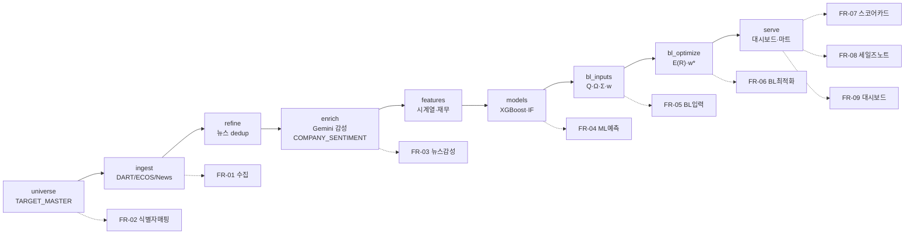
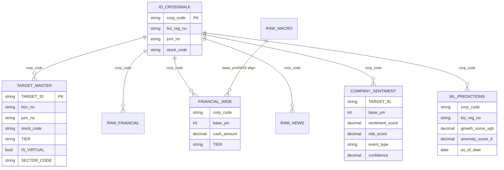

- 문서명: BL 요구사항 정의서(PRD, Product Requirements Document)
- 버전: v0.3
- 작성일: 2026-06-07
- 상태: Draft
- 작성주체: BL 프로젝트팀 (수석 데이터 사이언티스트 / 소매금융기관)
- 관련문서:
  - [01-project-overview.md](./01-project-overview.md)
  - [03-roadmap.md](./03-roadmap.md)
  - [04-glossary.md](./04-glossary.md)
  - [../design/01-system-architecture.md](../design/01-system-architecture.md)
  - [../design/02-data-pipeline.md](../design/02-data-pipeline.md)
  - [../design/03-bl-model-design.md](../design/03-bl-model-design.md)
  - [../design/04-compute-design.md](../design/04-compute-design.md)
  - [../design/05-dashboard-design.md](../design/05-dashboard-design.md)
  - [../design/adr/ADR-0002-storage-format.md](../design/adr/ADR-0002-storage-format.md)
  - [../design/adr/ADR-0003-identifier-mapping.md](../design/adr/ADR-0003-identifier-mapping.md)
  - [../design/adr/ADR-0004-leakage-free-training.md](../design/adr/ADR-0004-leakage-free-training.md)

---

# BL 요구사항 정의서 (PRD)

## 1. 목적 및 배경 요약

### 1.1 목적
본 문서는 **BL — AI 기반 BL(Black-Litterman) 법인 마케팅 최적화 시스템**의 제품 요구사항을 정의한다. 마케터/RM(Relationship Manager, 비기술직 법인 영업 담당)이 한정된 영업자원(방문·제안·금리우대·컨설팅)을 법인 고객 "포트폴리오"에 어떻게 배분할지를 데이터 기반으로 의사결정하도록 지원하는 것이 목표다.

핵심 은유는 금융공학의 포트폴리오 최적화를 B2B 예금유치 마케팅에 옮긴 것이다.

| 금융공학 개념 | 마케팅 재해석 | 본 시스템 구현체 |
|---|---|---|
| 자산(asset) | 법인 고객사 | `TARGET_MASTER` 행(TARGET_ID = `corp_code`) |
| 기대수익률 | 예금유치/유지 가치(CLV proxy) | 잔액증가율 기반 사후수익 $E[R]$ |
| 시장 균형 가중치 $w_{mkt}$ | 고객 예금(지갑) 규모 비중 | 재무보유 고객 `FINANCIAL_WIDE.cash_amount` + 비재무 고객 섹터중앙값 추정 |
| 투자자 전망(View, $Q$) | AI 3종 신호 | XGBoost·IsolationForest·Gemini |
| 전망 불확실성 $\Omega$ | 신뢰할 수 없으면 무시 | DRI + 모델 confidence |

> $w_{mkt}$ 산정 규칙은 BL 모델 설계서 §4.1을 권위 정의로 삼는다: 재무보유 고객은 `FINANCIAL_WIDE.cash_amount`(현금성자산+단기예금 합산) 기반 가용현금, 비재무 고객(T2 일부/T3)은 섹터중앙값 배수로 추정한다(과거 `total_assets*0.15` 플랫 가정·극단 매직스칼라는 캘리브레이션·상한으로 폐기). 단일 컬럼만으로 정의하지 않는다.

### 1.2 배경
핀테크 확산과 시중은행의 공격적 영업으로 법인 예금 이탈 압력이 커지고 있다. 현행 영업은 (1) 고객 데이터가 파편화되어 있고, (2) 담당자 경험(gut feeling)에 의존해 자원 배분이 비효율적이며, (3) 어느 고객에 얼마만큼 집중해야 하는지에 대한 정량적 근거가 부족하다. BL은 "경험에서 데이터 과학으로"의 전환을 통해, 자원 배분 문제를 BL 포트폴리오 최적화 문제로 정식화한다.

### 1.3 격상 맥락 (As-is → To-be)
본 프로젝트는 원래 Google Drive + Colab 무료 플랜 위에서 동작하던 토이 프로젝트였다. 이번 격상판은 **클라우드(충분한 하드웨어 가정)** 로 이전하면서 다음을 정상화한다.

| 구분 | As-is (토이) | To-be (격상판) |
|---|---|---|
| 공분산 | 대각만 사용(`np.diag(S)`) → 분산효과 소실 | **FULL 공분산** + Ledoit-Wolf 수축 |
| 가속 | Colab 단일 환경 | GPU(CuPy)/CPU(NumPy·SciPy) 백엔드 디스패치, **동일 수치·속도만 차이** |
| 경로/시크릿 | Drive 경로·평문 API 키 | `.env`/pydantic-settings, 시크릿매니저, 로그 마스킹 |
| 저장 | pickle | DuckDB + Parquet (**pickle 폐기**) |
| 검증 | 학습데이터로 평가(in-sample) | 시점 분리 + walk-forward 백테스트 |
| 배포 | 44개 HTML(709MB), 인라인 JSON | 단일소스 파라미터화, 데이터 분리, GitHub Pages 정적 배포 |

자세한 배경·범위는 [01-project-overview.md](./01-project-overview.md)를, 일정은 [03-roadmap.md](./03-roadmap.md)를 참고한다.

---

## 2. 사용자 스토리

주 사용자는 법인 영업 마케터/RM(비기술직)이며, 보조 사용자로 데이터 사이언티스트(모델 운영자)와 영업 관리자(팀장)가 있다.

### 2.1 마케터/RM 관점

| ID | 사용자 스토리 | 가치 |
|---|---|---|
| US-01 | **마케터로서** 이번 분기에 어떤 법인을 우선 공략해야 하는지 우선순위 리스트를 보고 싶다. **그래야** 제한된 방문·제안 횟수를 가장 효과적으로 쓸 수 있다. | 자원 배분 |
| US-02 | **RM으로서** 한 기업의 스코어카드(성장·이탈·이상·뉴스감성)를 한 화면에서 보고 싶다. **그래야** 미팅 전에 그 기업의 상태를 빠르게 파악할 수 있다. | 사전 준비 |
| US-03 | **마케터로서** "왜 이 기업이 추천되었는가"를 자연어 세일즈노트로 받고 싶다. **그래야** 모델을 신뢰하고, 고객에게 설명할 논리를 갖출 수 있다. | 설명가능성·신뢰 |
| US-04 | **RM으로서** 추천된 기업에 대해 어떤 상품(금리우대/유동성지원/주거래화)을 제안해야 할지 가이드를 받고 싶다. **그래야** 티어별로 맞는 액션을 취할 수 있다. | 액션 연결 |
| US-05 | **마케터로서** 최근 부정적 뉴스나 이상 징후가 있는 기업을 경보로 받고 싶다. **그래야** 이탈 위험 고객을 선제적으로 방어할 수 있다. | 이탈 방어 |
| US-06 | **영업 관리자로서** 우리 팀의 추천 포트폴리오가 섹터/티어에 어떻게 분산되어 있는지 보고 싶다. **그래야** 특정 섹터 쏠림(코너 해)을 점검할 수 있다. | 리스크 관리 |
| US-07 | **RM으로서** 데이터가 빈약한 기업은 추천 신뢰도가 낮다는 표시를 보고 싶다. **그래야** 근거 없는 추천에 자원을 낭비하지 않는다. | 신뢰도 인지 |
| US-08 | **마케터로서** 자사 기존 보유 고객과 신규 타겟을 구분해 보고 싶다. **그래야** 방어 영업과 신규 유치 영업을 분리해 계획할 수 있다. | 세그먼트 분리 |

### 2.2 운영자/관리자 관점

| ID | 사용자 스토리 | 가치 |
|---|---|---|
| US-09 | **데이터 사이언티스트로서** 파이프라인을 헤드리스 CLI로 멱등 재실행하고 싶다. **그래야** 데이터가 갱신될 때마다 동일 결과를 재현할 수 있다. | 재현성 |
| US-10 | **운영자로서** 어떤 식별자가 어떻게 매핑되었는지 crosswalk를 검증하고 싶다. **그래야** 과거의 99.4% 소실 같은 조인 오류를 막을 수 있다. | 데이터 무결성 |
| US-11 | **운영자로서** 모델이 사용한 confidence가 검증셋 기반 실측값임을 확인하고 싶다. **그래야** 하드코딩된 가짜 신뢰도를 BL에 넣지 않는다. | 캘리브레이션 |
| US-12 | **운영자로서** 파이프라인 단계별 행수·소요·실패 메트릭을 한눈에 보고 부분실패 지점을 진단하고 싶다. **그래야** 어느 단계가 데이터를 떨어뜨렸는지 추적하고 재시작할 수 있다. | 관측성 |
| US-13 | **운영자로서** 적재 전 스키마·값 위반 레코드를 격리·확인하고 싶다. **그래야** 오염된 데이터가 마트·BL 입력으로 흘러드는 것을 차단한다. | 데이터 품질 |
| US-14 | **운영자로서** 각 소스의 신선도(최신 수집시점)와 SLA 위반을 경보로 받고 싶다. **그래야** 오래된 재무·뉴스로 의사결정이 왜곡되는 것을 막는다. | 데이터 신선도 |

---

## 3. 기능 요구사항 (FR)

우선순위는 MoSCoW(Must / Should / Could / Won't-this-release)로 표기한다. 각 FR은 ID·우선순위·수용기준(Acceptance Criteria, AC)을 포함한다.

> **수식·파라미터 단일 출처 규약:** BL 수식·확정 파라미터의 정의는 [BL 모델 설계서 03](../design/03-bl-model-design.md)을 권위 소스로 한다(용어집 §9 표기 단일성 규약과 동기화). 본 PRD는 검증 가능한 합격선으로 수치를 인용하되, 정의가 충돌할 경우 03을 우선한다.

### 3.0 파이프라인-기능 매핑

### 3.1 데이터 수집 (FR-01)

| ID | 우선순위 | 요구사항 |
|---|---|---|
| **FR-01** | **Must** | 외부 공공 API를 통해 재무(DART), 매크로(한국은행 ECOS·FinanceDataReader), 뉴스(Naver)를 멱등(idempotent) 수집하여 DuckDB(`raw_collection.duckdb`)에 적재한다. |

세부 항목:

| 하위 ID | 트랙 | 내용 |
|---|---|---|
| FR-01.1 | (재무) | DART REST `fnlttSinglAcntAll.json` 직접 호출로 `RAW_FINANCIAL` 적재. `status='000'` 이고 `list`가 비어있지 않을 때만 적재. CFS 우선, 없으면 OFS fallback. |
| FR-01.2 | (재무) | `RAW_FINANCIAL` → `FINANCIAL_WIDE` 요약(현금성자산 + 단기예금/정기예금 계정 합산 → `cash_amount`). 이중적재 lineage(RAW + WIDE) 보존. |
| FR-01.3 | Track A | ECOS 기준금리·BSI, FinanceDataReader 지수 → `RAW_MACRO`(PK `(METRIC_CODE, DATE)`). |
| FR-01.4 | Track B | Naver 뉴스 API → `RAW_NEWS`(원천만, PK `NEWS_HASH`). |

> **원천/가공 분리:** `RAW_NEWS`는 원천 뉴스(`NEWS_HASH` PK)만 담는다. 감성 점수 등 가공 산출물은 enrich 단계의 `COMPANY_SENTIMENT`로 분리한다(FR-03). 과거의 `RAW_NEWS.GEMINI_SCORE` 인라인 컬럼은 폐기한다.

**수용기준(AC):**
- [ ] 동일 입력으로 2회 실행 시 행 수·해시가 동일하다(멱등 upsert).
- [ ] **OFFSET without ORDER BY 금지**: 모든 페이지네이션은 결정적 키(corp_code 등)로 `ORDER BY` 하거나 단일 쿼리로 수행한다(과거 ~38% 누락 결함 재발 방지).
- [ ] DART status가 `000`이 아닌 응답은 적재하지 않고 구조적 로그에 기록한다.
- [ ] 공공 API 쿼터 초과 시 지수 백오프 후 부분 성공/실패 리스트(`failed_companies` 형태)를 산출한다.
- [ ] API 키는 로그·산출물에 평문 노출되지 않는다(마스킹).

### 3.2 식별자 매핑 (FR-02)

| ID | 우선순위 | 요구사항 |
|---|---|---|
| **FR-02** | **Must** | 4종 식별자 `corp_code`(DART, canonical), `biz_reg_no`(사업자등록번호), `jurir_no`(법인등록번호), `stock_code`(상장코드)에 대한 명시적 **ID crosswalk(`ID_CROSSWALK`)** 를 구축하고 모든 조인은 이 crosswalk를 경유한다(출처별 직접 조인 금지). |

**배경(필수):** 과거 토이에서 `biz_reg_no`(사업자번호)를 `jurir_no`(법인번호)와 잘못 조인하여 **99.4% 데이터가 tier=UNKNOWN 으로 소실**된 치명 버그가 있었다. 상세 결정은 [ADR-0003-identifier-mapping.md](../design/adr/ADR-0003-identifier-mapping.md) 참고.

**수용기준(AC):**
- [ ] crosswalk 테이블이 `(corp_code ↔ biz_reg_no ↔ jurir_no ↔ stock_code)`를 1:1 또는 명시적 다중매핑으로 보유하며, canonical key는 `corp_code`다.
- [ ] `biz_reg_no`와 `jurir_no`를 직접 조인하는 코드 경로가 0건이다(정적 검사/테스트로 보증). 모든 결합은 `corp_code`로만 수행한다.
- [ ] 매핑 후 `TIER`(T1/T2/T3) 분류율이 측정·로깅되며, `UNKNOWN` 비율이 임계치 초과 시 빌드 실패다. **임계치는 [02-data-pipeline.md §4.3](../design/02-data-pipeline.md)에서 확정하는 값을 단일 출처로 따른다(잠정 < 1%, 캘리브레이션 후 확정).**
- [ ] 매핑 불가 레코드는 누락(silent drop)하지 않고 `tier=UNKNOWN`으로 명시 보존해 격리 테이블/데드레터로 추적 가능하다.

### 3.3 뉴스 감성 (FR-03)

| ID | 우선순위 | 요구사항 |
|---|---|---|
| **FR-03** | **Must** | 정제된 뉴스에 대해 Google Gemini(2.5 Flash-Lite)로 기업별 뉴스 감성/리스크 점수와 **confidence**를 산출하여 가공 감성 테이블 **`COMPANY_SENTIMENT`**(enrich 산출)에 적재한다. |

| 하위 ID | 내용 |
|---|---|
| FR-03.1 | refine 단계: 유사뉴스 dedup(Kiwi 키워드)으로 중복 제거. `RAW_NEWS`(원천)는 변경하지 않는다. |
| FR-03.2 | enrich 단계: Gemini 감성 점수 $\in[-1,1]$ 와 confidence $\in[0,1]$ 를 산출해 `COMPANY_SENTIMENT`에 적재(키 `(TARGET_ID, base_ym)`, `TARGET_ID = corp_code`). |
| FR-03.3 | confidence는 검증셋 기반 캘리브레이션(reliability)을 통과한 값만 BL Ω에 사용. **하드코딩(0.85/0.65 등) 금지.** |

> **원천/가공 분리(ADR-0003·02 §3.1.5/§3.1.6 동기화):** 원천은 `RAW_NEWS`(`NEWS_HASH` PK)만, 가공 감성은 `COMPANY_SENTIMENT`(`sentiment_score`/`risk_score`/`event_type`/`confidence`, 키 `(TARGET_ID, base_ym)`)로 둔다. 과거 `RAW_NEWS.GEMINI_SCORE` 인라인 패턴(원천/가공 혼재)은 요구사항에서 폐기한다.

**수용기준(AC):**
- [ ] 동일 뉴스(같은 `NEWS_HASH`)는 1회만 감성 처리된다(dedup·캐시).
- [ ] 감성 점수와 confidence가 `COMPANY_SENTIMENT`에 기업×기준시점 단위(키 `(TARGET_ID, base_ym)`)로 집계 저장되고, `RAW_NEWS`에는 가공 컬럼이 적재되지 않는다.
- [ ] confidence 캘리브레이션 곡선(reliability diagram)이 산출물로 남는다.
- [ ] LLM 호출 실패 시 bare except가 아닌 명시적 예외처리로 결측 표시한다.

### 3.4 ML 예측 (FR-04)

| ID | 우선순위 | 요구사항 |
|---|---|---|
| **FR-04** | **Must** | XGBoost(성장/이탈 분류)와 scikit-learn IsolationForest(이상탐지)를 **시점 분리 검증**으로 학습/평가하여 기업별 스코어를 `ML_PREDICTIONS`에 산출한다. |

| 하위 ID | 내용 |
|---|---|
| FR-04.1 | XGBoost 성장/이탈 확률(`growth_score_xgb` 등), IsolationForest 이상점수(`anomaly_score_if`). |
| FR-04.2 | 시점 기반 train/valid/test 분리 + walk-forward 백테스트. **in-sample 평가 금지.** |
| FR-04.3 | 라벨/피처 시점 엄격 분리 — 미래 잔액(`bal_future_3m`)을 피처로 사용 금지(look-ahead 누수 차단). |
| FR-04.4 | 학습 시 고정한 스케일러를 저장/재사용. **추론배치 min/max [-1,1] 정규화 금지**(누수·실행간 비교불가 방지). |
| FR-04.5 | 재무 유무 2그룹 모델링 강점 보존. SHAP 등 피처 기여도 산출(세일즈노트 근거). |

관련 결정은 [ADR-0004-leakage-free-training.md](../design/adr/ADR-0004-leakage-free-training.md), 상세 설계는 [../design/03-bl-model-design.md](../design/03-bl-model-design.md).

**수용기준(AC):**
- [ ] 모든 평가 지표는 test 구간이 train 구간보다 미래임을 보장한 walk-forward로 산출된다.
- [ ] 라벨 시점 $t+1$ 의 정보가 피처 시점 $t$ 에 유입되지 않음을 누수 테스트로 검증한다.
- [ ] 스케일러는 직렬화되어 추론에서 동일 객체로 로드된다(min/max 재계산 0건).
- [ ] `ML_PREDICTIONS` 모든 행에 `as_of_date`/`base_ym` 시점이 일관되게 부여되고, `corp_code`로 정규화된다(결합은 `corp_code`만, `biz_reg_no`는 추적용).
- [ ] 성능 수치는 "추정/미검증"이 아닌 검증셋 실측값으로만 보고한다(과장 금지).

### 3.5 BL 입력 구성 (FR-05)

| ID | 우선순위 | 요구사항 |
|---|---|---|
| **FR-05** | **Must** | BL 입력 행렬(공분산 $\Sigma$, 시장가중 $w_{mkt}$, 균형수익 $\Pi$, 뷰행렬 $P$, 뷰 $Q$, 불확실성 $\Omega$)을 단위 정합하게 구성한다. |

| 하위 ID | 내용 |
|---|---|
| FR-05.1 | $\Sigma$ 는 **잔액증가율(log-return)** 의 **FULL 공분산** + Ledoit-Wolf 수축으로 산출(대각만 사용 금지). 고유값바닥 $\lambda_{\text{floor}}=10^{-8}\cdot\mathrm{tr}\Sigma/N$ 와 조건수 상한 $\kappa_{\max}=10^{6}$ 적용(`reg=1e-6` 하드 바닥 폐기). 0·극소 잔액 계좌는 수익률 패널에서 분리 처리(BL설계 §2.2). |
| FR-05.2 | $w_{mkt}$ 는 고객 예금(지갑) 규모 기반 비중: 재무보유 고객은 `FINANCIAL_WIDE.cash_amount`, 비재무 고객은 섹터중앙값 배수 추정(BL설계 §4.1을 권위 정의로 따름). |
| FR-05.3 | $\Pi$ 는 $w_{mkt}$ 에 앵커: $\Pi = \lambda \Sigma w_{mkt}$ ($w_{hybrid}$ 앵커 금지). $\lambda$ 는 캘리브레이션(시작 2.5, 클립 $[1,5]$). |
| FR-05.4 | $P$ 행렬을 절대뷰/상대뷰로 명시 구성하고 $Q$ 와 정합. 뷰 3축 가중 $a=(0.412\,\text{news},\,0.412\,\text{pattern},\,0.176\,\text{relationship})$, 합=1(과거 4축에서 anomaly 제외 후 비율보존 재정규화). anomaly는 뷰가 아니라 $\Omega$ 신뢰도 변조 요인(FR-05.5). |
| FR-05.5 | $\Omega$ 는 $\Omega \propto 1/\mathrm{DRI}^2$ (데이터신뢰도)·모델 confidence·anomaly 변조 $(1+\gamma_{\text{anom}}\,a)$ 를 결합($a=$`anomaly_score_raw`$\in[0,1]$ 이상 크기, $\gamma_{\text{anom}}=2.0$). anomaly↑ → $\Omega$↑ → 해당 기업 뷰가 사전(앵커)으로 후퇴(콜드스타트). 뷰·$\Omega$·$\tau\Sigma$ 단위 통일. $\tau=0.05$(민감도 $\{0.025, 0.05, 0.1\}$). |

**사후수익 식(정칙형 / precision form, BL설계 §6.1과 동일):**
$$
E[R] = \Big[(\tau\Sigma)^{-1} + P^{\top}\Omega^{-1}P\Big]^{-1}\Big[(\tau\Sigma)^{-1}\Pi + P^{\top}\Omega^{-1}Q\Big]
$$

> 구현은 **직접 역행렬을 금지하고 Cholesky/`solve` 선형해**로 계산한다(BL설계 §6.3). 사후공분산은 $M=\big[(\tau\Sigma)^{-1}+P^{\top}\Omega^{-1}P\big]^{-1}$, $\Sigma_{\text{post}}=\Sigma+M$ 이며 기본 최적화 입력은 $\Sigma_{\text{post}}$ 다.
>
> 시장균형 등가형 $E[R]=\Pi+\tau\Sigma P^{\top}(P\tau\Sigma P^{\top}+\Omega)^{-1}(Q-P\Pi)$ 는 $\Omega$ 가역 시 대수적으로 동등하나, 본 시스템은 **정칙형 + Cholesky를 표준 구현**으로 못박는다(표기·구현 단일 출처).

**수용기준(AC):**
- [ ] $\Sigma$ 는 대칭·양의 준정부호이며 조건수 $\kappa(\Sigma)\le 10^{6}$, 고유값바닥 $\lambda_{\text{floor}}=10^{-8}\cdot\mathrm{tr}\Sigma/N$ 가 적용된다(수축 후).
- [ ] $Q$ 와 $\Omega$ 의 단위가 동일 스케일(수익률² 차원)임을 정합성 테스트로 검증한다(과거 $Q\approx0.01$ vs $\Omega\approx17$ 부정합 재발 방지).
- [ ] $\Pi$ 가 $w_{mkt}$ 로부터 역산($\Pi=\lambda\Sigma w_{mkt}$)되고, $\lambda\in[1,5]$ 클립이 적용됨을 검증한다.
- [ ] 뷰 3축 가중 합 = 1 이며 기본값 $(0.412, 0.412, 0.176)$(news/pattern/relationship)가 적용된다. anomaly는 뷰가 아니라 $\Omega$ 신뢰도 변조 요인 $(1+\gamma_{\text{anom}}\,a),\ \gamma_{\text{anom}}=2.0$ 으로 적용됨을 검증한다.
- [ ] $\tau$ 민감도 $\{0.025, 0.05, 0.1\}$ 결과가 보고된다(기본 $\tau=0.05$).
- [ ] 데이터가 빈약한 기업(낮은 DRI)은 큰 $\Omega$ 로 인해 뷰 영향이 작음을 수치로 확인한다.
- [ ] 0·극소 잔액(bal=0) 계좌가 수익률 패널에서 분리되어 가짜 만점(score 100) 결함이 재발하지 않음을 확인한다.

### 3.6 BL 최적화 (FR-06)

| ID | 우선순위 | 요구사항 |
|---|---|---|
| **FR-06** | **Must** | 사후수익 $E[R]$ 와 $\Sigma_{\text{post}}$ 로부터 제약(예산·비음·티어/섹터 상한)을 만족하는 최적가중 $w^{*}$ 를 산출한다. |

| 하위 ID | 내용 |
|---|---|
| FR-06.1 | convex QP는 cvxpy(OSQP/ECOS), 제약이 많거나 비표준이면 scipy.optimize(SLSQP) 병행. |
| FR-06.2 | 배열 백엔드 디스패치(GPU=CuPy / CPU=NumPy·SciPy), **동일 로직·동일 수치**(`xp = cupy if gpu else numpy`, float64). |
| FR-06.3 | shrinkage·조건수 관리로 사후수익 폭주 해소(과거 `reg=1e-6` 하드 바닥 → $E[R]$ max 1.29 결함 제거). |

**확정 파라미터(BL설계 §11 단일 출처):** $w_{\max}=0.10$, $\tau=0.05$(민감도 $\{0.025,0.05,0.1\}$), $\lambda$ 클립 $[1,5]$, $\lambda_{\text{floor}}=10^{-8}\cdot\mathrm{tr}\Sigma/N$, $\kappa_{\max}=10^{6}$, 뷰 3축 가중 $(0.412,0.412,0.176)$, anomaly $\Omega$ 게인 $\gamma_{\text{anom}}=2.0$.

**수용기준(AC):**
- [ ] $w^{*}$ 는 $\sum w=1$, $w\ge 0$, 자산별 상한 $w_i\le w_{\max}=0.10$, 정의된 티어/섹터 상한 제약을 모두 만족한다.
- [ ] **ID crosswalk dedup 후 자산 유일성**이 보장되고 $\sum w = 1$(허용오차 내)이 성립한다(과거 510→397 중복 미dedup·합≠1 결함 가드).
- [ ] **금융 peer/중복법인 제외집합 $\mathcal{E}$**(BL설계 §7.2)가 적용되고 누락 0건임을 확인한다.
- [ ] 0·극소 잔액 계좌는 신규유치 트랙으로 분리되고, 거액 funding_gap + Aggressive Buy 동시 권고가 캡으로 차단된다(방향-액션 일치, BL설계 §9.4 퇴화진단 체크리스트 동기화).
- [ ] $E[R]$ 가 정상 범위($|E[R]|$ 대부분 $<5\sigma_{\text{mkt}}$) 내임을 검증(폭주 없음).
- [ ] GPU/CPU 백엔드 산출 $E[R]$·$w^{*}$·$\Sigma$ 가 상대오차 **rtol $< 10^{-8}$**(`np.testing.assert_allclose(rtol=1e-8)`) 내에서 동일하다.
- [ ] 단일 섹터 극단 쏠림(코너 해)이 제약·BL 수축으로 완화됨을 확인한다.

### 3.7 스코어카드 (FR-07)

| ID | 우선순위 | 요구사항 |
|---|---|---|
| **FR-07** | **Should** | 기업별 스코어카드를 생성한다: 모델 의견(news·pattern·relationship 뷰 3축 + anomaly는 $\Omega$ 신뢰도 변조 요인, 표시 라벨 "이상도(신뢰도 차감)"), DRI, 사후수익 $E[R]$, 권장가중 $w^{*}$, 티어/섹터, 자사 보유 여부. |

**수용기준(AC):**
- [ ] 한 화면에서 한 기업의 모델 의견 신호(뷰 3축 + anomaly 신뢰도 차감)·신뢰도·권장액션 입력값이 보인다.
- [ ] 각 점수에 "기준시점(base_ym)"과 데이터 출처가 표기된다.
- [ ] DRI가 낮은 기업은 명시적 "낮은 신뢰도" 배지로 구분된다(US-07).

### 3.8 세일즈노트 (FR-08)

| ID | 우선순위 | 요구사항 |
|---|---|---|
| **FR-08** | **Should** | 추천 근거를 자연어 세일즈노트로 생성한다("왜 이 기업인가" + 권장 상품/액션). SHAP 기여도와 뉴스 근거를 결합. |

**수용기준(AC):**
- [ ] 노트에 추천 상위 근거(피처 기여, 뉴스 이벤트)가 최소 2~3개 인용된다.
- [ ] 티어별 액션(T1 금리우대·운용컨설팅 / T2 단기유동성·주거래화 / T3 간편뱅킹·세무지원)이 제시된다.
- [ ] 미검증 수치를 단정하지 않으며 추정값은 추정으로 표기한다.

### 3.9 대시보드 (FR-09)

| ID | 우선순위 | 요구사항 |
|---|---|---|
| **FR-09** | **Should** | Quarto + Plotly 단일소스 파라미터화 대시보드를 빌드해 GitHub Pages에 정적 배포한다(합성 샘플데이터). |

| 하위 ID | 내용 |
|---|---|
| FR-09.1 | 효율적 투자선/포트폴리오 배분, 섹터·티어 분산, 기업 스코어카드, 경보 리스트 구성. |
| FR-09.2 | **데이터를 HTML에서 분리**(외부 JSON/lazy-load), 빌드 산출물 크기 상한 적용. |
| FR-09.3 | 공개 데모는 **합성(synthetic) 데이터만**, PII 인라인 금지. |

**수용기준(AC):**
- [ ] 단일 파라미터화 소스에서 빌드되며 버전 난립(다수 HTML 사본)이 없다.
- [ ] 단일 페이지 인라인 데이터가 없고 외부 JSON으로 분리된다.
- [ ] 빌드 산출물 총 크기가 정의된 상한 이하다(과거 709MB 회귀 방지).
- [ ] 공개 배포물에 실제 PII가 포함되지 않는다.

### 3.10 우선순위 요약

| 우선순위 | FR |
|---|---|
| Must | FR-01, FR-02, FR-03, FR-04, FR-05, FR-06 |
| Should | FR-07, FR-08, FR-09 |
| Could | 자사 보유고객(`post_owned`) 실데이터 연동, 다국면 시나리오 비교 |
| Won't (this release) | 실시간 스트리밍 수집, 운영 PII 대시보드 공개 배포, 자동 영업 액션 실행(사람 검토 없는 자동화) |

> Could 항목 정리: 과거 우선순위표에 있던 `GEMINI_OPINION`(LLM 전문가의견 → BL 제약 변환)은 본 PRD·표준 사실관계에 정의가 없어 미정의 용어 노출을 피하고자 범위에서 제거한다. 재도입 시 FR-03(감성)과의 차이와 흘러갈 FR/제약(예: FR-06 제약 변환)을 §3.8 또는 §6.1 가정에 1줄 정의로 먼저 추가한다.

---

## 4. 비기능 요구사항 (NFR)

| ID | 범주 | 우선순위 | 요구사항 | 수용기준 |
|---|---|---|---|---|
| NFR-01 | 성능(GPU) | Must | GPU(CuPy) 환경에서 전체 유니버스(수천 자산) FULL 공분산 산출 + BL 최적화 1회 배치가 목표 시간 내 완료 | **측정 시나리오 고정:** T1+T2 $N\approx3{,}000$, `cov.model=shrinkage`(Ledoit-Wolf), $\Sigma_{\text{post}}$ 사용, 솔버 OSQP, 단일 GPU 기준 end-to-end `bl_inputs`+`bl_optimize` 1배치 ≤ **수 분**(예: 5분, **목표·미검증**) |
| NFR-02 | 성능(CPU) | Must | GPU 부재 시 NumPy/SciPy로 **동일 수치** 산출(속도만 차이) | 동일 입력에서 GPU/CPU 결과 상대오차 **rtol $< 10^{-8}$**(`assert_allclose(rtol=1e-8)`), 동일 시나리오 CPU 배치 ≤ **수십 분**(예: 30분, **목표·미검증**) |
| NFR-03 | 재현성 | Must | 헤드리스 CLI 멱등 실행, 시드 고정, 스케일러/모델 직렬화 | 동일 입력·동일 코드 2회 실행 결과 비트 단위 또는 허용오차 내 동일 |
| NFR-04 | 데이터 신선도 | Should | 재무 연 1회(사업연도), 매크로 월/일, 뉴스 일 단위 갱신 가능 | 각 소스의 `COLLECTED_AT`/`as_of_date`로 최신성 추적, 신선도 SLA 위반 시 경보(US-14) |
| NFR-05 | 보안/PII | Must | 시크릿은 환경변수/시크릿매니저, 로그 마스킹, 공개물은 합성데이터만 | 평문 키 0건, 공개 산출물 PII 0건, 운영본 접근통제 |
| NFR-06 | 가용성 | Should | 배치형 시스템(상시 서버 불요), 정적 대시보드는 가용성 의존도 낮음 | 부분 실패 시에도 성공분으로 마트/대시보드 갱신, 재시작으로 복구 |
| NFR-07 | 유지보수성 | Must | 모듈/패키지 + 얇은 실행 노트북·CLI, 타입힌트, 구조적 로깅, pytest | 핵심 모듈 단위테스트 통과, bare except 0건, lint/type 검사 통과 |
| NFR-08 | 데이터 품질 | Must | pandera/great_expectations류 스키마·값 검증 | 적재 전 스키마 검증 통과, 위반 레코드 격리·로깅(US-13) |
| NFR-09 | 관측성 | Should | 파이프라인 단계별 행수·소요·실패 메트릭 로깅 | 단계별 lineage·메트릭이 산출물로 남고 추적 가능(US-12) |
| NFR-10 | 이식성 | Should | Colab/Drive 종속 제거, 설정 기반 경로 | Drive 경로 하드코딩 0건, `.env`로 경로 주입 |

> 성능 목표 수치(NFR-01/02)는 "충분한 하드웨어 가정" 하의 **목표치(추정·미검증)** 이며 실측 후 [03-roadmap.md](./03-roadmap.md)에서 갱신한다. GPU/CPU 차이는 속도에 한정되고 수치 결과는 모든 산출물($E[R]$·$w^{*}$·$\Sigma$)에 동일 **rtol $< 10^{-8}$** 가 적용되어야 한다(상세: [../design/04-compute-design.md](../design/04-compute-design.md), [../design/adr/ADR-0001-compute-backend.md](../design/adr/ADR-0001-compute-backend.md)).

---

## 5. 데이터 요구사항

### 5.1 소스·주기·식별자·품질

| 소스 | 트랙/단계 | 갱신주기 | 주 식별자 | 적재 테이블 | 품질기준 |
|---|---|---|---|---|---|
| DART 재무 (`fnlttSinglAcntAll.json`) | 재무 ingest | 연 1회(사업연도) | `corp_code` | `RAW_FINANCIAL`, `FINANCIAL_WIDE` | status=000만 적재, CFS→OFS fallback, 금액 DECIMAL 정규화 |
| 한국은행 ECOS (금리·BSI) | Track A | 월/일 | `METRIC_CODE`+`DATE` | `RAW_MACRO` | PK 중복 없음, 결측 보간 규칙 명시 |
| FinanceDataReader (지수) | Track A | 일 | `METRIC_CODE`+`DATE` | `RAW_MACRO` | 영업일 정렬, 결측 일자 처리 |
| Naver 뉴스 API | Track B | 일 | `NEWS_HASH` | `RAW_NEWS`(원천) | dedup, `PUB_DATE` 파싱 검증 |
| (파생) Gemini 감성 | enrich | 뉴스 갱신 시 | `(TARGET_ID, base_ym)` | `COMPANY_SENTIMENT`(가공) | 점수 $\in[-1,1]$, confidence 캘리브레이션 통과 |
| (파생) ML 스코어 | models | 배치 시 | `corp_code`(→crosswalk) | `ML_PREDICTIONS` | `as_of_date` 부여, 시점 분리 검증, 결합키=`corp_code` |
| (마스터) 기업 유니버스 | universe | 분기/필요시 | `TARGET_ID`(=`corp_code`) 및 4종 ID | `TARGET_MASTER` | TIER 분류율·UNKNOWN 임계 준수 |

### 5.2 핵심 식별자 정의

| 식별자 | 의미 | 비고 |
|---|---|---|
| `TARGET_ID` | `TARGET_MASTER` 주키 | **= `corp_code`**(canonical). 본문·다이어그램·파생 테이블의 기업 단위 기준키 |
| `corp_code` | DART 고유 기업코드 | canonical key. 재무 수집·내부 조인·dedup 주키 |
| `biz_reg_no` | 사업자등록번호 | `TARGET_MASTER.bizr_no`·`ML_PREDICTIONS.biz_reg_no` 와 매핑. **추적·표시용이며 결합은 `corp_code`(crosswalk)로만**. jurir_no와 혼동 금지 |
| `jurir_no` | 법인등록번호 | 법인 단위 식별. biz_reg_no와 1:1 미보장, 직접 동일시 금지 |
| `stock_code` | 상장코드 | T1(상장) 식별 |

### 5.3 세분화 축

| 축 | 코드 | 정의 |
|---|---|---|
| Tier(고객축) | T1 | 상장 외감 법인 |
| | T2 | 비상장 중소 법인 |
| | T3 | 가상 섹터 노드(`IS_VIRTUAL`) |
| Track(수집축) | A | 매크로(ECOS 금리·BSI, FDR 지수) |
| | B | Naver 뉴스 |

### 5.4 핵심 엔티티 관계

모든 결합은 `ID_CROSSWALK`(canonical key=`corp_code`)를 허브로 경유한다. 출처별 직접 조인은 금지한다(FR-02·[ADR-0003](../design/adr/ADR-0003-identifier-mapping.md)).

> `TARGET_ID = corp_code`(canonical). `ML_PREDICTIONS.biz_reg_no`는 **추적·표시용**이며 결합은 `corp_code`(crosswalk 정규화)로만 한다([02-data-pipeline.md §3.1.7](../design/02-data-pipeline.md)와 동일 규약). `COMPANY_SENTIMENT`는 enrich 산출 가공 감성 테이블로, 키 `(TARGET_ID, base_ym)`로 news view를 BL 입력에 공급한다.
>
> 데이터 파이프라인 상세는 [../design/02-data-pipeline.md](../design/02-data-pipeline.md), 저장 포맷 결정은 [../design/adr/ADR-0002-storage-format.md](../design/adr/ADR-0002-storage-format.md) 참고.

---

## 6. 제약 및 가정

### 6.1 가정
| ID | 가정 |
|---|---|
| A-01 | **클라우드(충분한 하드웨어)** 환경을 전제한다. GPU 유무는 연산자원 활용(속도) 차이일 뿐 로직·수치는 동일하다(rtol $< 10^{-8}$). |
| A-02 | 공개 데모/포트폴리오는 **합성(synthetic) 샘플데이터**로 구성하며 GitHub Pages에 정적 배포한다. |
| A-03 | 자사 내부 보유고객(`post_owned`) 데이터는 본 릴리스에서 PLACEHOLDER로 두고, 실데이터 연동은 Could 범위로 한다. |
| A-04 | 시점 기준은 사업연도/`base_ym`을 기본 축으로 매크로·뉴스·ML 시점을 정합한다. |

### 6.2 제약
| ID | 제약 |
|---|---|
| C-01 | **No-Crawl 원칙**: 웹 크롤링을 배제하고 안정적 공공 API/공식 데이터셋만 사용한다(IP 차단·법적 리스크 회피). |
| C-02 | **공공 API 쿼터**: DART/ECOS/Naver의 호출 한도를 준수한다(레이트 리밋·백오프, 부분 실패 허용). |
| C-03 | **pickle 금지**: 직렬화는 DuckDB/Parquet/안전한 모델 포맷만 사용(버전취약·임의코드실행 위험). |
| C-04 | **시크릿 외부화**: API 키 평문 노출 금지(환경변수/시크릿매니저, 로그 마스킹). |
| C-05 | **Colab/Drive 종속 금지**: 모든 경로는 `.env`/pydantic-settings로 주입한다. |
| C-06 | 성능·정확도 수치는 검증 전 단정하지 않는다(과장 금지, 미검증은 추정으로 명시). |

---

## 7. 수용기준 / 완료정의 (DoD)

### 7.1 기능 DoD
- [ ] FR-01~FR-06(Must)의 모든 AC를 충족한다.
- [ ] FR-07~FR-09(Should)가 합성데이터 기준으로 동작하고 GitHub Pages에 배포된다.
- [ ] 파이프라인 전 단계(universe→…→serve)가 단일 CLI로 멱등 재현된다.

### 7.2 데이터/모델 DoD
- [ ] ID crosswalk 적용 후 UNKNOWN 티어 비율이 [02 §4.3](../design/02-data-pipeline.md) 확정 임계(잠정 < 1%) 이하다(과거 99.4% 소실 결함 부재).
- [ ] 모든 평가가 walk-forward(시점 분리)로 산출되고 look-ahead 누수 테스트를 통과한다.
- [ ] confidence가 검증셋 기반 캘리브레이션 값이며 하드코딩이 없다.
- [ ] $\Sigma$ 가 FULL + 수축이고($\kappa\le10^{6}$, $\lambda_{\text{floor}}=10^{-8}\cdot\mathrm{tr}\Sigma/N$), $Q$/$\Omega$/$\tau\Sigma$ 단위가 정합하며, $E[R]$ 폭주가 없다.
- [ ] $\Pi=\lambda\Sigma w_{mkt}$ 앵커가 적용되고($\lambda\in[1,5]$), $w_{\max}=0.10$ 상한이 준수된다.
- [ ] crosswalk dedup 후 자산 유일성·$\sum w=1$, 제외집합 적용 누락 0건, 0-잔액 분리가 검증된다.

### 7.3 엔지니어링/품질 DoD
- [ ] GPU/CPU 백엔드 결과 동치($E[R]$·$w^{*}$·$\Sigma$ 상대오차 **rtol $< 10^{-8}$**)를 회귀 테스트(`assert_allclose(rtol=1e-8)`)로 보증한다.
- [ ] pytest 통과, 타입힌트·구조적 로깅 적용, bare except 0건.
- [ ] 데이터 검증(pandera/great_expectations류) 통과, 위반 격리.
- [ ] 시크릿 평문 0건, 공개 산출물 PII 0건, 대시보드 산출물 크기 상한 준수.
- [ ] 모든 산출물이 DuckDB/Parquet 기반이며 pickle 0건.

---

## 8. 명시적 비목표 (Non-Goals)

| ID | 비목표 | 사유 |
|---|---|---|
| NG-01 | 실시간/스트리밍 수집 | 본 시스템은 배치형 의사결정 지원. 실시간은 본 릴리스 범위 밖. |
| NG-02 | 사람 검토 없는 자동 영업 액션 실행 | BL은 의사결정 지원이며 최종 영업 판단은 RM이 수행. |
| NG-03 | 실제 주식/금융자산 운용 | "포트폴리오"는 마케팅 자원 배분의 은유. 실제 투자 집행 아님. |
| NG-04 | 운영 PII 데이터의 공개 배포 | 공개물은 합성데이터만. 운영본은 접근통제 하 별도 운용. |
| NG-05 | 웹 크롤링 기반 데이터 확장 | No-Crawl 원칙(C-01)에 따라 비목표. |
| NG-06 | 범용 신용평가/부도예측 제품화 | ML 스코어는 BL 뷰 입력 용도. 독립 신용평가 제품이 아님. |
| NG-07 | 멀티테넌트 SaaS/사용자 인증 플랫폼 | 단일 조직 내부 의사결정 도구로 한정. |

---

## 부록 A. 용어
주요 용어(BL, $w_{mkt}$, $\Pi$, $\Omega$, DRI, CLV, crosswalk, walk-forward 등)는 [04-glossary.md](./04-glossary.md)를 참조한다.

## 부록 B. 추적성 매트릭스

| 사용자 스토리 | 충족 FR | 관련 NFR |
|---|---|---|
| US-01 | FR-06, FR-09 | NFR-01 |
| US-02 | FR-07 | — |
| US-03 | FR-08, FR-04(SHAP) | — |
| US-04 | FR-08 | — |
| US-05 | FR-03, FR-04, FR-07 | NFR-04 |
| US-06 | FR-06, FR-09 | — |
| US-07 | FR-05(DRI/Ω), FR-07 | — |
| US-08 | FR-02, (Could) post_owned | — |
| US-09 | FR-01 | NFR-03, NFR-10 |
| US-10 | FR-02 | NFR-08 |
| US-11 | FR-03, FR-04 | NFR-03 |
| US-12 | FR-01 | NFR-09 |
| US-13 | FR-01 | NFR-08 |
| US-14 | FR-01 | NFR-04 |

> NFR 도출 추적: 성능(NFR-01/02)은 US-01의 분기 우선순위 산출(배치 적시성)에서, 보안/PII(NFR-05)는 NG-04·A-02 공개 배포 정책에서, 유지보수성(NFR-07)·이식성(NFR-10)은 US-09 멱등 재현 운영에서 도출된다.