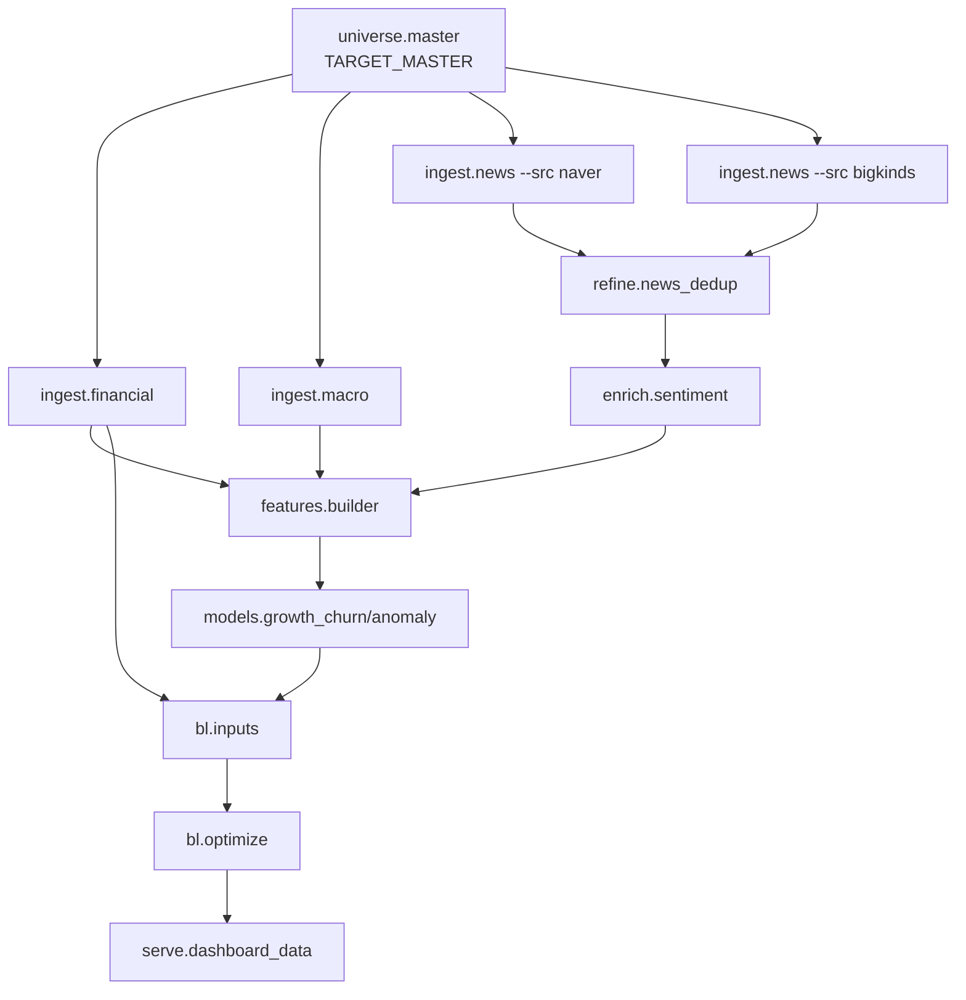
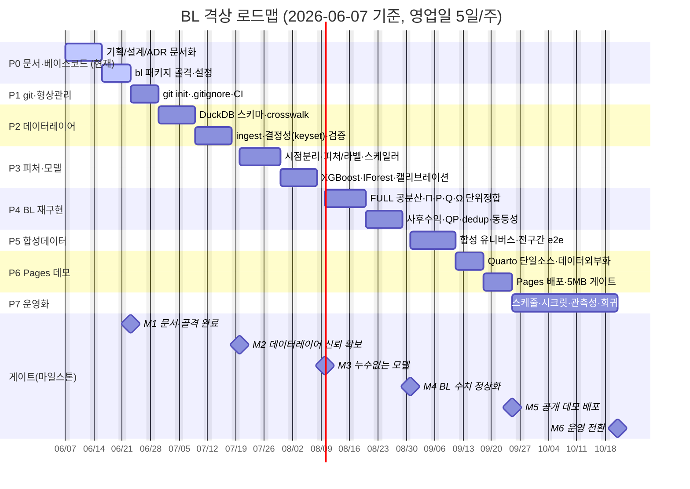

- **문서명**: BL 로드맵 · 마일스톤 · 마이그레이션 계획 (Roadmap & Migration Plan)
- **버전**: v0.2
- **작성일**: 2026-06-07
- **상태**: Draft
- **작성주체**: 수석 데이터 사이언티스트 / 테크니컬 라이터 (BL TF)
- **관련문서**: [01-project-overview.md](01-project-overview.md) · [02-prd.md](02-prd.md) · [04-glossary.md](04-glossary.md) · [../design/01-system-architecture.md](../design/01-system-architecture.md) · [../design/02-data-pipeline.md](../design/02-data-pipeline.md) · [../design/03-bl-model-design.md](../design/03-bl-model-design.md) · [../design/04-compute-design.md](../design/04-compute-design.md) · [../design/05-dashboard-design.md](../design/05-dashboard-design.md) · [../design/adr/ADR-0001-compute-backend.md](../design/adr/ADR-0001-compute-backend.md) · [../design/adr/ADR-0002-storage-format.md](../design/adr/ADR-0002-storage-format.md) · [../design/adr/ADR-0003-identifier-mapping.md](../design/adr/ADR-0003-identifier-mapping.md) · [../design/adr/ADR-0004-leakage-free-training.md](../design/adr/ADR-0004-leakage-free-training.md)

---

# BL 로드맵 · 마일스톤 · 마이그레이션 계획

> 본 문서는 "AI 기반 BL(Black-Litterman) 법인 마케팅 최적화 시스템"을 과거 토이(Google Drive + Colab 무료 플랜) 형태에서 **클라우드 격상판**으로 재구축하기 위한 단계별 로드맵, 마일스톤, 코드/데이터 마이그레이션 계획, 워크스트림별 작업분해, 리스크 관리표, 타임라인을 정의한다.
>
> **명명 규약(중요)**: 본 로드맵의 파이썬 패키지/임포트 경로·설정 키는 설계 권위 소스인 [01-system-architecture.md §6](../design/01-system-architecture.md) 및 [04-compute-design.md](../design/04-compute-design.md)와 1:1로 일치한다. 즉 소스 레이아웃은 `src/bl/`(언더스코어), 임포트는 `import bl`, 설정 진입점은 `bl.common.config:get_settings()`, 배열 디스패치는 `bl/common/compute.py`, 환경변수 프리픽스는 `BL_*`이다. (CLI 명령어 토큰은 사용자 노출용 별칭일 수 있으나, 모든 **모듈 경로·import**는 `bl`로 통일한다.)

## 0. 현재 위치 (Status as of 2026-06-07)

- **현 단계**: **Phase 0 (문서·베이스코드)** 진행 중. 아직 **git 저장소 미개설** 상태다.
- **방침**: "git을 먼저 만들지 않는다." 표준 브리프에 따라 **(1) 문서화 → (2) 베이스코드(패키지 골격) 구축**을 먼저 끝낸 뒤 **git init** 으로 형상관리에 진입한다. 이렇게 하면 첫 커밋이 "빈 노트북 더미"가 아니라 일관된 설계·골격 위에서 시작되고, 과거 토이의 산출물(709MB 대시보드, 246MB 인라인 JSON, pickle 등)을 그대로 끌고 들어가는 사고를 원천 차단한다.
- **격상의 본질(재확인)**: 알고리즘을 바꾸는 프로젝트가 아니라 **엔지니어링·방법론 정합성을 정상화**하는 프로젝트다. 단, 하드웨어 제약이 사라지면서 **공분산을 대각(diagonal) → FULL 공분산으로 복원**하는 것이 수치적으로 가장 의미 있는 변화다. GPU 유무는 **속도 차이일 뿐 로직·수치는 동일**(배열 백엔드 디스패치 `xp = cupy if gpu else numpy`).

```mermaid
flowchart LR
  A[문서화\nPhase 0] --> B[베이스코드 골격\nPhase 0]
  B --> C[git init\nPhase 1]
  C --> D[데이터레이어 이관\nDuckDB+Parquet\nPhase 2]
  D --> E[모델/BL 재구현\nPhase 3-4]
  E --> F[샘플(합성) 데이터\nPhase 5]
  F --> G[GitHub Pages 데모\nPhase 6]
  G --> H[운영화\nPhase 7]
  classDef now fill:#ffe9b3,stroke:#c98a00,color:#000;
  class A,B now;
```

---

## 1. 격상 전략 개요

격상은 "한 번에 다 바꾸기"가 아니라 **레이어별(수평) 게이트 통과 후 합성 end-to-end** 로 진행한다. 즉 데이터레이어(P2) → 모델(P3) → BL(P4)를 각각 품질 게이트로 닫은 뒤, **합성 유니버스(P5)로 전구간을 처음 한 번 관통(첫 end-to-end)** 시키고, P6 데모로 공개한다. 다만 레이어를 닫는 도중에도 **조기 위험을 노출**하기 위해 P2~P4 각 Phase 안에서 **T1·단일 기준월(`202510`) 단일 슬라이스**를 우선 산출하여 레이어 경계마다 작은 스모크를 돌린다(아래 §1.3).

> 용어 정정: 이전 버전(v0.1)은 "수직 슬라이스를 먼저 만들고 Phase 6 데모가 첫 end-to-end"라고 서술했으나, 실제 Phase/Gantt 구조는 레이어별(수평)이며 P6 데모는 **P5 합성데이터 기반(공개용)** 이라 "실데이터 T1 수직 슬라이스"가 아니다. 본 버전은 전략 서사를 실행계획과 일치시킨다: **수평 레이어 게이트 + 합성 e2e(P5)**, 그 안에서 **T1·202510 단일 슬라이스 조기 스모크**(§1.3)로 수직 검증을 보조한다.

### 1.1 전략 8단계 (브리프 격상 흐름과 1:1 대응)

| # | 전략 단계 | 본 로드맵의 Phase | 핵심 의도 |
|---|-----------|-------------------|-----------|
| 1 | 문서화 | Phase 0 | 기획/설계/ADR 확정 → 모든 후속 코드가 단일 사실관계를 참조 |
| 2 | 베이스코드 구축 | Phase 0 | `src/bl/` 패키지 골격·설정(`pydantic-settings`)·배열 디스패치(`common/compute.py`)·로깅 스캐폴드 |
| 3 | git init | Phase 1 | 골격이 선 뒤 형상관리 진입(브랜치 전략·CI·`.gitignore`로 대용량/시크릿 차단) |
| 4 | 데이터레이어 이관 | Phase 2 | DuckDB(수집/OLAP) + Parquet(교환), **pickle 폐기**, ID crosswalk 정립 |
| 5 | 모델/BL 재구현 | Phase 3~4 | 시점분리 학습(누수 제거) + FULL 공분산 BL, 단위 정합 |
| 6 | 샘플(합성) 데이터 | Phase 5 | PII 없는 합성 유니버스로 공개 가능한 재현 경로 확보(첫 end-to-end 관통) |
| 7 | GitHub Pages 데모 | Phase 6 | Quarto+Plotly 단일소스, 데이터/HTML 분리, 정적 배포 |
| 8 | 운영화 | Phase 7 | 실데이터 파이프라인 스케줄링, 접근통제, 관측성, 회귀 백테스트 |

### 1.2 진행 원칙

- **방법론 결함 우선**: 누수(look-ahead)·조인키 오류·비결정 페이지네이션은 "동작"이 아니라 "신뢰"의 문제이므로 코드 이관과 **동시에** 차단한다. 잘못된 결과를 빨리 내는 것보다 늦더라도 옳은 결과를 낸다.
- **수치 동등성 게이트**: CPU(NumPy/SciPy) ↔ GPU(CuPy) 경로는 동일 입력에 대해 **상대오차 `rtol < 1e-8`** 내에서 일치해야 머지한다. 단일 정의는 [§2.1 G-동등성](#21-게이트품질-통과-조건-요약)에 두며 본문 다른 위치는 이를 참조한다([ADR-0001](../design/adr/ADR-0001-compute-backend.md), [04-compute-design.md](../design/04-compute-design.md)).
- **합성 우선 공개, 실데이터는 내부**: 공개 데모/Pages는 합성 샘플만. 실데이터/PII는 접근통제된 운영 환경에서만.
- **작은 빌드 산출물**: 대시보드 빌드물에 데이터 인라인 금지(외부 JSON + lazy-load), 산출물 크기 상한을 CI 게이트로 강제한다. **HTML+초기 JSON 합 < 5MB(CI fail), `index.html`(데이터 제외) < 2MB, 전체 `docs/` 배포 < 50MB**([05-dashboard-design.md §6.3](../design/05-dashboard-design.md)).

### 1.3 조기 end-to-end 스모크 (T1·202510 단일 슬라이스)

레이어를 다 닫기 전에 통합 위험을 노출하기 위해, P2~P4 각 Phase에 **하위 마일스톤: "T1 상장 외감 · 기준월 `202510` 단일 슬라이스 우선"** 을 둔다.

- P2 종료 직전: T1·202510 유니버스에 대해 crosswalk·적재·결정성 스모크.
- P3 종료 직전: 동일 슬라이스로 시점분리 split + 단일 모델 학습/추론 스모크(누수 가드 포함).
- P4 종료 직전: 동일 슬라이스로 FULL 공분산 BL 1회 통과(폭주 없음·∑w=1 확인) → **첫 통합 스모크**.
- 합성 전구간 관통(첫 정식 end-to-end)은 **P5**에서 수행하며, 공개 데모는 **P6**이다.

---

## 2. 단계별 마일스톤 (Phase 0 ~ Phase 7)

날짜는 **2026-06-07 기준 상대 일정**이며, **1주 = 영업일 5일**로 산정한다(달력 주가 아니라 영업일 기준). 인력 가정: DS 1, DE 1, 대시보드/FE 0.5, 인프라 0.5 겸임.

| Phase | 기간(상대) | 목표 | 핵심 산출물 | 완료 기준(DoD) | 의존성 |
|-------|-----------|------|-------------|----------------|--------|
| **P0. 문서·베이스코드** | W0~W2 (06-07~06-19) | 단일 사실관계 확정 + 패키지 골격 | `docs/planning/*` 4종, `docs/design/*` 5종, ADR 4종, `src/bl/` 골격, `common/config.py`(pydantic), `common/compute.py`(xp 디스패치 stub), `pyproject.toml` | 모든 기획/설계 문서 Draft 완료·**문서 상대링크 자동검증 0 broken**(예: lychee/markdown-link-check), **`import bl` 성공**, **패키지 골격이 [01 §6](../design/01-system-architecture.md)의 `src/bl` 레이아웃과 일치(디렉터리 diff)**, `pytest -q` 스모크 1개 통과 | 없음 (현재) |
| **P1. git init·형상관리** | W2~W3 (06-22~06-26) | 형상관리·CI 진입 | git 저장소, `.gitignore`(data/·*.pkl·*.html·.env 차단), 브랜치 전략, GitHub Actions(lint/type/test), pre-commit | 첫 커밋이 골격+문서, CI 녹색, 시크릿/대용량 미추적 확인(`git status` clean) | P0 (P0 DoD 통과 후 시작) |
| **P2. 데이터레이어 이관** | W3~W5 (06-29~07-17) | DuckDB+Parquet 스키마와 ID crosswalk, ingest 모듈화 | `common/io.py`, `schema.sql`, `common/identifiers.py`(crosswalk), `ingest/`(financial/macro/news), DuckDB ASOF JOIN·멱등 upsert | TARGET_MASTER→FINANCIAL_WIDE 적재 멱등 재실행 동일, **tier=UNKNOWN 비율 ≤ 합의된 커버리지 임계치([02 §4.3](../design/02-data-pipeline.md)·[ADR-0003](../design/adr/ADR-0003-identifier-mapping.md)에서 캘리브레이션 후 확정; 잠정 목표(가설) ≤1%)**, OFFSET 비결정 누락 0건(keyset 페이지네이션 재현성 테스트), **자산(법인) dedup 후 ∑w 검증 가능 상태(중복행 단일 자산화)**, pickle 0개 | P1 |
| **P3. 피처·모델 재구현** | W5~W7 (07-20~08-07) | 누수 없는 피처/라벨 + XGBoost/IForest | `features/builder.py`·`features/scaler.py`, `models/{growth_churn,anomaly,validation}.py`, 시점분리 split, 저장형 스케일러, walk-forward 백테스트 | 라벨/피처 시점 분리 단위테스트 통과, `bal_future_3m` 피처 사용 0, in-sample 평가 금지 린트, **고정 스케일러 직렬화(parquet/json)**, **추론배치 min/max 정규화 사용 0(자동 검사/린트)** | P2 |
| **P4. BL 입력·최적화 재구현** | W7~W9 (08-10~08-28) | FULL 공분산 BL, 단위 정합 | `bl/engine/inputs.py`(Σ,Π,P,Q,Ω,τ), `bl/engine/covariance.py`(Ledoit-Wolf), `bl/engine/optimize.py`(posterior, QP), cvxpy/scipy | Σ=log-return FULL 공분산(대각 사용 0), Π=λΣw_mkt(w_current/w_hybrid 앵커 금지), Q·Ω·τΣ 단위 일치, **고유값바닥 $\lambda_{\text{floor}}=10^{-8}\cdot\text{tr}(\Sigma)/N$ 적용·$\kappa(\Sigma)\le10^{6}$·Cholesky solve 성공**([03 §3.3·§11](../design/03-bl-model-design.md)), E[R] 정상범위(폭주 없음), **∑w=1·median$\lvert\Delta\rvert>10^{-4}$·방향-액션 부호정합**, GPU/CPU 수치 동등(§2.1 G-동등성) | P3 |
| **P5. 합성 샘플데이터** | W9~W10 (08-31~09-11) | 공개 가능한 합성 유니버스 + 첫 e2e | `synth/generate.py`, `data/sample/*.parquet`, 생성 시드/명세 | 합성데이터로 P2~P4 전구간 무오류 통과(첫 end-to-end), PII 0, 재현 시드(`BL_SEED`) 고정 | P2~P4 |
| **P6. GitHub Pages 데모** | W10~W12 (09-14~09-25) | 정적 대시보드 데모 배포 | `serve/dashboard_data.py`(외부 JSON 추출) + `dashboard/*.qmd`, Pages 배포 워크플로 | **HTML+초기 JSON 합 < 5MB(CI fail), `index.html`(데이터 제외) < 2MB, 전체 `docs/` < 50MB**([05 §6.3](../design/05-dashboard-design.md)), HTML 내 인라인 데이터 0, Pages URL 접속·핵심 차트 렌더 | P5 |
| **P7. 운영화** | W12~W16 (09-28~10-23) | 실데이터 스케줄·관측성·회귀 | 스케줄러 잡, 시크릿매니저 연동, 구조적 로깅/메트릭, 데이터검증(pandera), 회귀 백테스트 | 야간 배치 멱등 성공, 시크릿 평문 0(로그 마스킹), 검증 게이트 통과율 100%, 월별 BL 결과 회귀 비교 | P4,P6 |

> 참고: Phase 간 기간은 일부 겹친다(예: P3 후반과 P4 초반, P4와 P5). 이는 데이터/모델 산출물이 안정화되는 즉시 다음 워크스트림이 착수하도록 의도한 것이다. **P0→P1은 의존 관계상 P0 DoD 통과 이후 P1을 시작**하되, 문서 마무리와 git 준비(`.gitignore` 초안 등)는 일부 병행한다. 자세한 시각화는 [6. 타임라인](#6-타임라인-gantt) 참조.

### 2.1 게이트(품질 통과 조건) 요약

각 Phase 종료 시 다음 게이트를 통과해야 다음 Phase로 진입한다.

- **G-누수(P3)**: 피처/라벨 시점 분리 + 미래정보 차단 테스트 100% 통과 + 추론배치 정규화 사용 0.
- **G-식별자(P2)**: crosswalk 적용 후 tier=UNKNOWN 비율 ≤ 합의된 커버리지 임계치(02 §4.3·ADR-0003에서 캘리브레이션 후 확정; 잠정 목표(가설) ≤1%). silent drop 금지(UNKNOWN 명시 보존).
- **G-결정성(P2)**: 동일 입력 2회 적재/쿼리 결과 바이트 동등(결정적 정렬키 + keyset 페이지네이션, ORDER BY 강제).
- **G-자산유일성(P4)**: ID crosswalk 기반 법인=1자산 사전 dedup 후 **∑w=1**, weight_diff median$\lvert\Delta\rvert>10^{-4}$, 방향-액션 부호 일관([03 §7.2·§8·§9.4](../design/03-bl-model-design.md)).
- **G-단위(P4)**: Q, Ω, τΣ, Π 단위·스케일 정합 자동검사 + 고유값바닥/조건수($\kappa\le10^{6}$) 보장.
- **G-동등성(P1~P7 상시)**: CPU(NumPy/SciPy) ↔ GPU(CuPy) 경로의 **E[R]·w\*·Σ 모든 산출물에 동일 상대오차 `rtol < 1e-8`** 회귀테스트 통과. BL 사후수익 추가 검증의 절대허용오차 `atol`은 테스트 코드에서 별도 명시하되 합격 기준은 `rtol < 1e-8`로 단일화([ADR-0001](../design/adr/ADR-0001-compute-backend.md), [04 §골든테스트](../design/04-compute-design.md)).
- **G-산출물(P6)**: **HTML+초기 JSON 합 < 5MB(CI fail) + `index.html` < 2MB + 전체 docs/ < 50MB + 인라인 데이터 0**([05 §6.3](../design/05-dashboard-design.md)).

---

## 3. 마이그레이션 계획

### 3.1 Colab 노트북 → 모듈/패키지 매핑

과거 13개 노트북(번호 체계 보존)을 재사용 가능한 모듈로 분해한다. 노트북은 폐기하지 않고 **얇은 실행 노트북/CLI 엔트리포인트**로 남겨 로직은 모듈에 둔다. 모듈 경로는 [01 §6](../design/01-system-architecture.md) 레이아웃과 1:1 대응한다(임포트는 모두 `bl.*`).

| 과거 노트북 | 역할 | 격상 모듈(패키지 경로) | 엔트리(예: `python -m bl....`) | 비고 |
|-------------|------|------------------------|------------------------------------|------|
| `TARGET_MASTER.ipynb` | 유니버스(대상 법인) 정의 | `bl/universe/master.py` | `bl.universe.master` | Tier(T1/T2/T3, IS_VIRTUAL) 부여, crosswalk 기준 |
| `01_collect.ipynb` | 재무(DART) 수집·적재 | `bl/ingest/financial.py` | `bl.ingest.financial` | RAW_FINANCIAL+FINANCIAL_WIDE 이중적재 lineage 보존 |
| `02_track_A.ipynb` | 매크로(ECOS 금리·BSI, FDR 지수) | `bl/ingest/macro.py` | `bl.ingest.macro` | Track A. ECOS 키 시크릿화 |
| `03_track_B.ipynb` | Naver 뉴스 | `bl/ingest/news.py` (`--src naver`) | `bl.ingest.news` | Track B (뉴스 단일 모듈) |
| `04_track_C.ipynb` | BigKinds 뉴스 | `bl/ingest/news.py` (`--src bigkinds`) | `bl.ingest.news` | Track C, dedup 우선 소스 |
| `05_유사뉴스_정제.ipynb` | 뉴스 중복 제거 | `bl/refine/news_dedup.py` | `bl.refine.news_dedup` | Kiwi 키워드·BigKinds 우선 dedup |
| `06_gemini_처리.ipynb` | Gemini 뉴스 감성 | `bl/enrich/sentiment.py` | `bl.enrich.sentiment` | Gemini 2.5 Flash-Lite, confidence 캘리브레이션 |
| `07_학습데이터_전처리.ipynb` | 시계열/재무 피처 | `bl/features/builder.py` | `bl.features.builder` | 시점분리·look-ahead 차단 |
| `학습_전_데이터보정.ipynb` | 데이터 보정 | `bl/features/builder.py`(repair 규칙) | `bl.features.builder` | 결측/이상 보정 규칙 명시화 |
| `08_모델학습...ipynb` | XGBoost·IsolationForest | `bl/models/{growth_churn,anomaly}.py`, `validation.py` | `bl.models.growth_churn` / `bl.models.anomaly` | 2그룹(재무 유무) 모델, 고정 스케일러 저장 |
| `09_BL_input_전처리.ipynb` | Σ·Π·P·Q·Ω·τ 구성 | `bl/engine/inputs.py` + `bl/engine/covariance.py` | `bl.engine.inputs` | FULL 공분산, w_mkt 앵커, 단위 정합 |
| `10_BL 모델 최적화.ipynb` | 사후수익·최적가중 | `bl/engine/optimize.py` | `bl.engine.optimize` | posterior + QP(cvxpy/scipy) |
| `11_대시보드.ipynb`, `11-1_대시보드 직접 생성.ipynb` | 대시보드 | `bl/serve/dashboard_data.py` + `dashboard/*.qmd` | `bl.serve.dashboard_data` | 단일소스 파라미터화, 데이터 외부화 |



### 3.2 Drive 경로 → 설정 기반 이관

Colab/Drive 하드코딩 경로(`/content/drive/MyDrive/...`)를 전면 제거하고 **`pydantic-settings` + `.env`** 로 외부화한다. 헤드리스 실행을 기본으로 한다. 환경변수 프리픽스·키 이름은 [01 §8.1](../design/01-system-architecture.md)·[04 §9.2](../design/04-compute-design.md)의 **`BL_*`** 와 단일화한다.

| 과거(Colab/Drive) | 격상(설정 기반) | 환경변수(프리픽스 `BL_`) |
|-------------------|-----------------|---------------------------|
| `/content/drive/MyDrive/BL/data/*.csv` | `settings.data_root`(예: `./data`) | `BL_DATA_ROOT` |
| `/content/drive/.../*.pkl` (모델/스케일러) | `settings.artifacts_dir` + parquet/json | `BL_ARTIFACTS_DIR` |
| Colab 셀 내 ECOS API 키 평문 | `settings.ecos_api_key` (SecretStr) | 환경변수/시크릿매니저, 로그 마스킹 |
| Gemini 키 노트북 상수 | `settings.gemini_api_key` (SecretStr) | 시크릿매니저 |
| Drive 내 DuckDB 파일 위치 | `settings.duckdb_path` | `BL_DUCKDB_PATH`(기본 `${BL_DATA_ROOT}/raw_collection.duckdb`) |
| 노트북 셀 상단 `BASE_DIR=` | `Settings` 단일 진입 | `bl.common.config:get_settings()` |
| 백엔드 선택(GPU/CPU) | `settings.compute_backend` | `BL_COMPUTE_BACKEND`(`auto`/`cpu`/`gpu`) |
| 재현 시드 | `settings.seed` | `BL_SEED` |

- **마스킹 규칙**: 로깅 시 `SecretStr`은 `***` 로만 출력. 구조적 로깅(JSON)에서도 키 필드 화이트리스트 기반 직렬화.
- **경로 규칙**: 모든 모듈은 상대/절대 경로를 직접 쓰지 않고 `settings.*` 만 참조 → 로컬/CI/클라우드 동일 코드.
- **속성명 정합**: 데이터 루트 settings 속성은 `data_root`(환경변수 `BL_DATA_ROOT`)로 통일한다(01/04와 일치). `BL_ARTIFACTS_DIR`는 01에 미정의 시 본 로드맵에서 신규 도입하되 키 추가를 01 §8.1에 반영한다.

### 3.3 pickle → Parquet (및 저장 포맷 정상화)

과거 산출물의 **pickle을 전면 폐기**한다(버전 취약·임의코드 실행 위험, [ADR-0002](../design/adr/ADR-0002-storage-format.md)). 대상별 대체 포맷은 다음과 같다.

| 과거 산출물 (pickle/CSV/인라인JSON) | 격상 포맷 | 위치/테이블 |
|------------------------------------|-----------|-------------|
| 모델 가중치(`.pkl`) | XGBoost 네이티브(`.json`/`.ubj`) | `artifacts/models/` |
| 스케일러/정규화 파라미터(`.pkl`) | JSON(파라미터) + parquet(통계) | `artifacts/scalers/` |
| 중간 피처 테이블(CSV) | Parquet(스키마·타입 보존) | `data/processed/features/*.parquet` |
| 수집 원천(CSV 산재) | DuckDB 테이블 + RAW Parquet | DuckDB `raw_*`, `data/raw/` |
| 대시보드 인라인 JSON(246MB) | 외부 JSON(lazy-load) | `dashboard/_data/*.json` |
| BL 입력/결과(CSV) | Parquet + DuckDB 마트 | `bl_inputs_*`, `bl_weights_*` |

- **검증 게이트**: 마이그레이션 후 산출물에 `*.pkl` 0개, 대시보드 HTML 내 base64/인라인 데이터 0건이어야 P2/P6 통과.

---

## 4. 워크스트림별 작업분해 (WBS)

다섯 워크스트림이 병렬로 흐르되, 의존 관계(3.1 파이프라인)에 따라 산출물이 차례로 다음 워크스트림에 공급된다. 담당영역 약어: **DE**(데이터 엔지니어링), **DS**(데이터 사이언스/모델·BL), **FE**(대시보드/프론트), **OPS**(인프라/형상/관측성).

### 4.1 데이터 워크스트림 (DE)
- WBS-D1: DuckDB 스키마·`schema.sql` 정의(raw/interim/processed/mart 계층), 멱등 upsert 패턴.
- WBS-D2: **ID crosswalk 테이블** 구축 — `corp_code`(DART, canonical) ↔ `biz_reg_no`(사업자) ↔ `jurir_no`(법인) ↔ `stock_code`(상장). 조인은 **반드시 crosswalk 경유**, 사업자번호↔법인번호 직접 조인 금지(과거 99.4% 소실 버그 차단).
- WBS-D3: ingest 모듈(financial/macro/news) — **OFFSET-without-ORDER BY 제거 → 결정적 정렬키 기반 keyset 페이지네이션 또는 단일 쿼리**([02 §6.1](../design/02-data-pipeline.md)).
- WBS-D4: refine(뉴스 dedup, BigKinds 우선) + enrich(Gemini 감성, confidence 캘리브레이션).
- WBS-D5: 데이터 검증(pandera/great_expectations) — 스키마·널·도메인·중복·시점 단조성 체크.

### 4.2 모델 워크스트림 (DS)
- WBS-M1: 시점기반 split(train/valid/test) + walk-forward 백테스트 프레임.
- WBS-M2: 피처/라벨 시점 엄격 분리 — `bal_future_3m`는 **라벨 전용**, 피처로 누출 금지(자동 린트).
- WBS-M3: XGBoost(성장/이탈 분류), IsolationForest(이상) — 2그룹(재무 유무) 모델링.
- WBS-M4: **학습기준 고정 스케일러** 저장/재사용(추론 배치 min/max 정규화 금지 + 자동 검사).
- WBS-M5: confidence **실측 캘리브레이션**(reliability curve) — 하드코딩(0.85/0.65) 폐기.

### 4.3 BL 워크스트림 (DS)
- WBS-B1: Σ를 **잔액증가율(log-return) FULL 공분산**으로 정의(변동계수² 폐기) + **Ledoit-Wolf 수축**으로 조건수 관리.
- WBS-B2: Π = $\lambda \Sigma w_{mkt}$ — **w_mkt(지갑규모) 앵커**(w_current/w_hybrid 앵커 금지).
- WBS-B3: P 행렬 명시 구성(절대뷰/상대뷰)과 Q 정합, 4축 뷰 앙상블(news 0.35·pattern 0.35·anomaly 0.15·relationship 0.15) 매핑.
- WBS-B4: Ω 구성 — $\Omega \propto 1/\text{DRI}^2$ + 모델 confidence, Q·Ω·τΣ **단위 통일**.
- WBS-B5: 사후수익·최적가중 — cvxpy(OSQP/ECOS) 우선, 제약多는 scipy SLSQP, GPU는 CuPy 선형대수. **`reg=1e-6` 하드바닥 폐기 → 고유값바닥 $\lambda_{\text{floor}}=10^{-8}\cdot\text{tr}(\Sigma)/N$·$\kappa_{\max}=10^{6}$·Cholesky solve**, E[R] 정상범위 검증.
- WBS-B6: **자산 사전 dedup**(ID crosswalk 기반 법인=1자산) + 부호보존 점수매핑(weight_diff → marketing_score → action_guide) + 0-잔액 가드 — ∑w=1·median$\lvert\Delta\rvert>10^{-4}$·방향-액션 부호정합([03 §7.2·§8·§9.4](../design/03-bl-model-design.md)).

### 4.4 대시보드 워크스트림 (FE)
- WBS-V1: Quarto+Plotly **단일소스 파라미터화** qmd(과거 44개 HTML/709MB 난립 종식).
- WBS-V2: **데이터-HTML 분리** — 외부 JSON + lazy-load, **HTML+초기 JSON 합 < 5MB(CI fail)**·인라인 데이터 0([05 §6.3](../design/05-dashboard-design.md)).
- WBS-V3: 비기술직(RM) 친화 UX — 티어/트랙 필터, 뷰 기여도 분해, 가중 비교(현재 vs 사후).
- WBS-V4: 공개 데모는 **합성 데이터만**, PII 인라인 금지.

### 4.5 인프라/형상 워크스트림 (OPS)
- WBS-I1: `pydantic-settings` 설정 외부화(`BL_*`), SecretStr·로그 마스킹.
- WBS-I2: **배열 백엔드 디스패치**(`bl/common/compute.py`, `xp = cupy if gpu else numpy`) + CPU/GPU 수치 동등성 테스트(`rtol < 1e-8`).
- WBS-I3: git init·브랜치 전략·`.gitignore`(data/·*.pkl·*.html·.env)·pre-commit.
- WBS-I4: CI(GitHub Actions): ruff/black, mypy, pytest, **대시보드 5MB 크기 게이트**, 문서 링크 검증.
- WBS-I5: 구조적 로깅·메트릭, 명시적 예외처리(bare except 제거), 시크릿매니저 연동, 스케줄러.

### 4.6 워크스트림 × Phase 매트릭스

| 워크스트림 \ Phase | P0 | P1 | P2 | P3 | P4 | P5 | P6 | P7 |
|---|---|---|---|---|---|---|---|---|
| 데이터(DE) | 스키마 설계 | — | **D1~D5** | 검증 | — | 합성 적재 | — | 실데이터 검증 |
| 모델(DS) | 설계 | — | — | **M1~M5** | — | 합성 학습 | — | 회귀 |
| BL(DS) | 설계 | — | — | — | **B1~B6** | 합성 BL | — | 월별 회귀 |
| 대시보드(FE) | 설계 | — | — | — | — | — | **V1~V4** | 운영 대시 |
| 인프라(OPS) | **I1,I2** | **I3,I4** | I5(부분) | 동등성 | 동등성 | — | 배포 | **I5** |

---

## 5. 리스크 관리표

과거 분석에서 발견한 **치명 결함을 전부 항목화**하고, 각각 완화책·우선순위·담당영역·검증 게이트를 매핑한다. 우선순위 P1=즉시(머지 차단급), P2=Phase 내 필수, P3=품질 개선.

### 5.1 정확성/타당성 (방법론·데이터 무결성)

| ID | 결함(As-is) | 영향 | 완화책(To-be) | 우선 | 담당 | 게이트/Phase |
|----|-------------|------|---------------|------|------|--------------|
| R-01 | 학습데이터로 그대로 평가(train/test·CV 없음) | 성능 과대평가, 일반화 불가 | 시점기반 train/valid/test + walk-forward, in-sample 평가 금지 린트 | P1 | DS | G-누수 / P3 |
| R-02 | `bal_future_3m`이 라벨이자 피처(look-ahead 누수) | 비현실적 고성능, 운영 붕괴 | 피처/라벨 시점 엄격 분리, 미래정보 차단, 누출 피처 자동 탐지 | P1 | DS | G-누수 / P3 |
| R-03 | `biz_reg_no`↔`jurir_no` 오조인 → 추정 99.4% tier=UNKNOWN | 데이터 대량 소실 | 명시적 **ID crosswalk** 경유 조인(canonical=`corp_code`), 직접 조인 금지 | P1 | DE | G-식별자 / P2 |
| R-04 | OFFSET without ORDER BY(비결정, 추정 ~38% 누락) | 실행마다 다른 결과, 데이터 누락 | **결정적 정렬키 기반 keyset 페이지네이션 또는 단일 쿼리**([02 §6.1](../design/02-data-pipeline.md)), 재현성 테스트 | P1 | DE | G-결정성 / P2 |
| R-05 | 추론배치 min/max [-1,1] 정규화(누수) | 실행마다 비교 불가, 누수 | **학습기준 고정 스케일러** 저장/재사용(json/parquet), 추론배치 정규화 자동검사 | P2 | DS | G-누수 / P3 |
| R-06 | confidence 하드코딩(0.85/0.65) | Ω 왜곡, 뷰 신뢰 부정확 | 검증셋 기반 **실측 캘리브레이션**(reliability) | P2 | DS | P3/P4 |
| R-07 | API 키 평문 노출(ECOS 등) | 자격증명 유출 | 시크릿매니저/환경변수, SecretStr, 로그 마스킹 | P1 | OPS | P1/P7 |
| R-08 | 광범위 bare except | 오류 은폐, 디버깅 불가 | 명시적 예외처리 + 구조적 로깅 | P2 | OPS | P3~P7 |

### 5.2 BL 방법론

| ID | 결함(As-is) | 영향 | 완화책(To-be) | 우선 | 담당 | 게이트/Phase |
|----|-------------|------|---------------|------|------|--------------|
| R-09 | 공분산 **대각만 사용**(분산효과 소실) | 포트폴리오 분산효과 무시 | **FULL 공분산** + Ledoit-Wolf 수축(조건수 관리) | P1 | DS | G-동등성/단위 / P4 |
| R-10 | Σ가 "잔액 변동계수²" | 공분산 의미 부정확 | **log-return(잔액증가율) 공분산**으로 재정의 | P1 | DS | P4 |
| R-11 | Π를 w_hybrid(0.7·w_current)에 앵커 | 균형수익 왜곡 | $\Pi=\lambda\Sigma w_{mkt}$ — **지갑규모 w_mkt 앵커** | P1 | DS | P4 |
| R-12 | Q(~0.01)와 Ω(~17) 단위 부정합 | 뷰가 사실상 무시/폭주 | Q·Ω·τΣ **단위 통일**, 스케일 정합 검사 | P1 | DS | G-단위 / P4 |
| R-13 | P 행렬 미사용 | 뷰 매핑 불가/암묵적 | **P 명시 구성**(절대/상대뷰), Q 정합 | P2 | DS | P4 |
| R-14 | `reg=1e-6` 하드바닥 → E[R] max 1.29 폭주 | 비현실 사후수익 | **고유값바닥 $\lambda_{\text{floor}}=10^{-8}\cdot\text{tr}(\Sigma)/N$·$\kappa_{\max}=10^{6}$·Cholesky** 로 해소, 정상범위 검증([03 §3.3·§11](../design/03-bl-model-design.md)) | P1 | DS | G-단위 / P4 |
| R-24 | **중복 법인 자산 미dedup**(`biz_reg_no` 다중행, 510→876→1610→397) → **∑w≠1** | 가중합 붕괴·코너 해 | ID crosswalk 기반 **법인=1자산 사전 dedup** | P1 | DS | G-자산유일성(∑w=1) / P4 ([03 §7.2](../design/03-bl-model-design.md)) |
| R-25 | **방향-액션 라벨 불일치**(음수 weight_diff에 'Aggressive Buy', 라벨 문자열 불일치 카운트 0) | 마케팅 오발령 | **라벨 단일 상수모듈 + 부호정합 테스트**(Δ<0에 Buy 없음) | P1 | DS | G-자산유일성(부호정합) / P4 ([03 §8](../design/03-bl-model-design.md)) |
| R-26 | **weight_diff 퇴화**($\Delta\approx10^{-10}$) | 가중차이 무의미 | **dedup + 정상스케일 사후수익**, 진단 median$\lvert\Delta\rvert>10^{-4}$ | P1 | DS | G-자산유일성(스케일) / P4 ([03 §9.4](../design/03-bl-model-design.md)) |

### 5.3 엔지니어링/운영

| ID | 결함(As-is) | 영향 | 완화책(To-be) | 우선 | 담당 | 게이트/Phase |
|----|-------------|------|---------------|------|------|--------------|
| R-15 | 대시보드 버전 난립(44개 HTML/709MB, 246MB 인라인 JSON) | 저장/배포 비대화, 유지불가 | 단일소스 파라미터화 + 데이터 외부화(lazy-load) + **HTML+초기 JSON 합 < 5MB(CI fail)·전체 docs/ < 50MB**([05 §6.3](../design/05-dashboard-design.md)) | P2 | FE | G-산출물 / P6 |
| R-16 | Colab/Drive 종속 | 재현·헤드리스 불가 | 설정 기반 경로(`BL_*`), 헤드리스 실행 | P1 | OPS | P0~P2 |
| R-17 | PII 인라인 HTML | 개인정보 노출 | 운영본 접근통제, 공개 데모 합성데이터만 | P1 | FE/OPS | P5/P6 |
| R-18 | pickle 산출물(버전취약·RCE) | 보안·재현 위험 | parquet/네이티브 포맷으로 전면 대체 | P1 | DE | P2 |
| R-19 | GPU/CPU 경로 수치 불일치 가능성 | 결과 비재현 | 배열 디스패치 + 수치 동등성 테스트(**E[R]·w\*·Σ 모두 `rtol < 1e-8`**, §2.1 G-동등성) | P2 | OPS | G-동등성 / 상시 |

### 5.4 신규/잔여 리스크

| ID | 리스크 | 완화책 | 우선 | 담당 |
|----|--------|--------|------|------|
| R-20 | 합성데이터가 실데이터 분포를 왜곡 → 데모 오해 | 합성 명세에 "예시·미검증" 명시, 분포 가정 문서화 | P3 | DS/FE |
| R-21 | Gemini 비용/레이트리밋·응답 변동 | 캐싱·배치·재시도, confidence 캘리브레이션으로 변동 흡수 | P2 | DS/OPS |
| R-22 | 외부 API(DART/ECOS/BigKinds) 스키마 변동 | 어댑터 계층 + pandera 검증으로 조기 탐지 | P3 | DE |
| R-23 | FULL 공분산 추정 불안정(표본 < 자산수) | Ledoit-Wolf 수축, 유효표본·조건수 모니터링 | P2 | DS |

> 표기 주의: 과거 토이의 수치(추정 99.4% 소실, 추정 ~38% 누락, E[R] max 1.29, weight_diff $\sim10^{-10}$, 510→876→1610→397, AUC 등)는 모두 **추정/미검증**이며, 결함의 증거로 인용할 뿐 목표치가 아니다. 커버리지 임계치(tier=UNKNOWN), 결측율 등 **모든 임계값은 캘리브레이션 후 확정**한다([ADR-0003](../design/adr/ADR-0003-identifier-mapping.md)·[02 §4.3](../design/02-data-pipeline.md)). 본 문서의 `≤1%`는 잠정 목표(가설)다.

---

## 6. 타임라인 (Gantt)

2026-06-07 기준 상대 일정. **1주=영업일 5일**이며, 막대 일자는 영업일 기준 계획 근사치다. 게이트 통과 여부에 따라 후속 Phase 시작이 당겨지거나 밀린다. P0 종료(=M1)에 P0 막대 끝을 맞추고, P1은 **P0 DoD 통과 이후(after p0b)** 시작하도록 의존을 명시한다.



> Gantt는 `after` 의존으로 막대를 연결해 주차·캘린더 산술 불일치를 제거했다(영업일 5일/주, `excludes weekends`). 각 마일스톤은 직전 Phase 막대 종료에 정렬된다. 절대 날짜가 필요한 경우 [§2 마일스톤표](#2-단계별-마일스톤-phase-0--phase-7)의 상대 기간을 기준으로 한다.

### 6.1 마일스톤 요약

| 마일스톤 | 시점(상대) | 의미 | 관문 게이트 |
|----------|-----------|------|-------------|
| M1 | P0 종료 | 문서·베이스코드 완료, git 진입 준비 | 문서 상호참조 자동검증 0 broken + `import bl` + 레이아웃 diff 일치 |
| M2 | P2 종료 | 데이터레이어 신뢰 확보 | G-식별자, G-결정성, pickle 0 |
| M3 | P3 종료 | 누수 없는 모델 학습 | G-누수, 고정 스케일러, 추론배치 정규화 0 |
| M4 | P4 종료 | BL 수치 정상화(FULL 공분산) | G-단위, G-자산유일성(∑w=1·부호정합·스케일), G-동등성(`rtol<1e-8`), E[R] 정상범위 |
| M5 | P6 종료 | 공개 GitHub Pages 데모 | G-산출물(5MB CI fail), 합성데이터만 |
| M6 | P7 종료 | 운영 전환 | 야간 배치 멱등·시크릿 0·검증 100% |

---

## 7. 의사결정·변경 관리

- **ADR 연동**: 백엔드 선택([ADR-0001](../design/adr/ADR-0001-compute-backend.md)), 저장 포맷([ADR-0002](../design/adr/ADR-0002-storage-format.md)), 식별자 매핑([ADR-0003](../design/adr/ADR-0003-identifier-mapping.md)), 누수 차단 학습([ADR-0004](../design/adr/ADR-0004-leakage-free-training.md))이 본 로드맵의 R-09/R-19, R-18, R-03, R-01/R-02와 직접 대응한다. 설계 변경 시 해당 ADR을 먼저 갱신한 뒤 로드맵 버전을 올린다.
- **범위 동결 경계**: Phase 6(데모) 전까지는 "기능 추가"보다 "결함 차단"을 우선한다. 신규 신호/뷰 추가는 P7 이후 백로그로 분리.
- **롤백 안전망**: 각 Phase 산출물은 Parquet/DuckDB로 버전 디렉터리(예: `data/processed/<asof>/`)에 적재 → 회귀 비교와 롤백이 가능.

## 8. 다음 액션 (Phase 0 즉시 항목)

1. `docs/planning` 4종 + `docs/design` 5종 + ADR 4종 Draft 완료 및 **상대링크 자동검증(0 broken)**.
2. `src/bl/` 패키지 골격([01 §6](../design/01-system-architecture.md) 레이아웃과 디렉터리 diff 일치), `pyproject.toml`, `common/config.py`(pydantic-settings, `BL_*`), `common/compute.py`(xp 디스패치 stub), 구조적 로깅 스캐폴드 생성.
3. `.gitignore` 초안(`data/`, `*.pkl`, `*.html`, `.env`, `extracted/`, `*.zip`) 작성 — **git init 직전** 준비.
4. 스모크 테스트 1개(`pytest`)와 CI 워크플로 초안(린트/타입/테스트 + 문서 링크 검증 + 대시보드 5MB 게이트) 작성 → M1 게이트 통과 후 **git init(Phase 1)** 진입.
