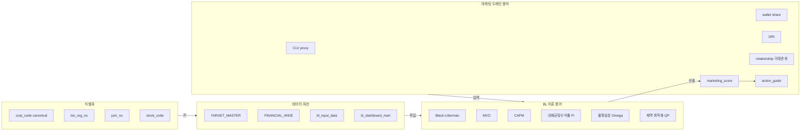
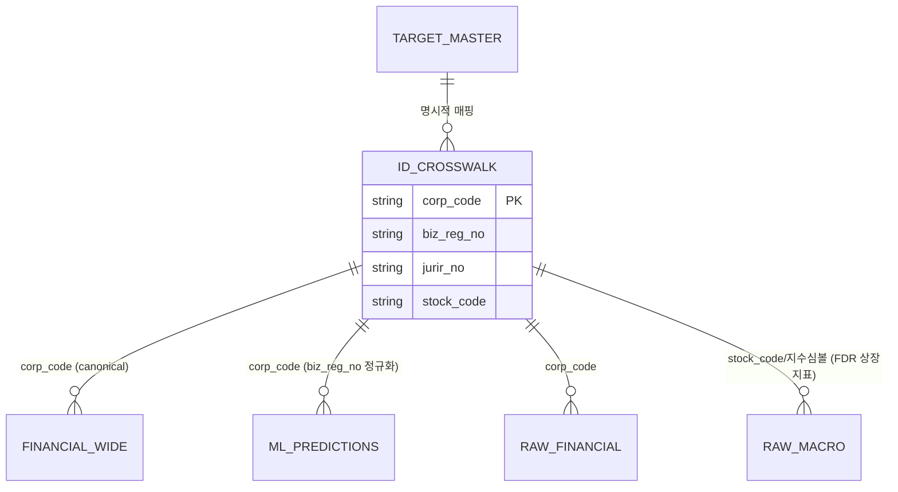
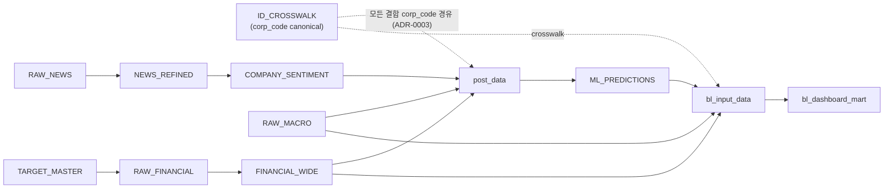

- 문서명: BL 용어집 (Glossary)
- 버전: v0.3
- 작성일: 2026-06-07
- 상태: Draft
- 작성주체: 수석 데이터 사이언티스트 (BL TF)
- 관련문서:
  - [01-project-overview.md](./01-project-overview.md)
  - [02-prd.md](./02-prd.md)
  - [03-roadmap.md](./03-roadmap.md)
  - [BL 모델 설계서](../design/03-bl-model-design.md)
  - [데이터 파이프라인 설계서](../design/02-data-pipeline.md)
  - [시스템 아키텍처](../design/01-system-architecture.md)
  - [대시보드 설계서](../design/05-dashboard-design.md)
  - [연산 백엔드 설계서](../design/04-compute-design.md)
  - [ADR-0003 식별자 매핑](../design/adr/ADR-0003-identifier-mapping.md)

# BL 용어집 (Glossary)

본 문서는 "AI 기반 BL(Black-Litterman) 법인 마케팅 최적화 시스템"에서 사용하는 모든 핵심 용어를 정의한다. 금융공학 이론 용어, 마케팅 도메인 용어, 데이터 식별자, 세분화 축(Tier/Track), 데이터 자산(테이블·마트), 핵심 파라미터, 기술 스택을 망라하며, 각 항목은 1~3문장으로 정의한다. 전문용어는 한글(영문)을 병기한다. 성능 수치는 아직 미검증이므로 본 문서에서 단정하지 않으며, 과거 토이 프로젝트에서 보고된 수치는 "추정/미검증"으로 표기한다.

> 참고: 이 시스템의 모든 정의는 다음 핵심 은유 매핑 위에 서 있다 — **자산(asset) = 법인 고객사**, **기대수익률 = 예금유치·유지 가치(CLV proxy)**, **시장 균형 가중치 = 고객 지갑(예금) 규모 비중**, **투자자 전망(View) = 뷰 3축 AI 앙상블(news/pattern/relationship)**, **전망 불확실성 = 데이터신뢰도(DRI) + 모델 confidence + 이상도(anomaly Ω 요인)**.

> 단위/표기 권위: 수식·기호·확정 파라미터의 단일 출처(single source of truth)는 [BL 모델 설계서](../design/03-bl-model-design.md)이며, 테이블·컬럼·식별자 스키마의 권위 소스는 [데이터 파이프라인 설계서](../design/02-data-pipeline.md)다. 본 용어집은 그 정의를 요약·연결한다.

---

## 1. 용어 분류 개요

---

## 2. BL(Black-Litterman) 이론 용어

핵심 BL 공식은 사후 기대수익률 추정식이다. 본 프로젝트는 과거 토이판이 공분산을 대각만 사용하던 결함을 **FULL 공분산 + Ledoit-Wolf 수축**으로 정상화하고, 앵커를 **시장가중 $w_{mkt}$(지갑규모)**로 교정한다. 사후 $E[R]$은 정밀도형(precision form) **정칙형 + Cholesky solve**로 계산한다(역행렬 직접 산출 금지). 상세 수식·검증 절차는 [BL 모델 설계서 §6](../design/03-bl-model-design.md)를 단일 출처로 한다.

$$
E[R] = \left[(\tau\Sigma)^{-1} + P^{\top}\Omega^{-1}P\right]^{-1}\left[(\tau\Sigma)^{-1}\Pi + P^{\top}\Omega^{-1}Q\right]
$$
$$
\Pi = \lambda \Sigma\, w_{mkt}
$$

> 최적가중 $w^{*}$는 위 사후 $E[R]$(및 사후공분산 $\Sigma_{post}$)을 입력으로 하는 **제약 최적화(convex QP / SLSQP)** 의 산출물이다. 무제약 닫힌형 $w^{*}=(\lambda\Sigma)^{-1}E[R]$은 등식제약만의 MVO 해로서, 본 시스템이 비판하는 코너 해·음수가중을 그대로 낳으므로 **사용하지 않는다**(§7 제약·목적함수 참조). 본 시스템의 최적화 제약은 $\mathbf{1}^{\top}w=1,\ 0\le w_i\le w_{\max},\ w_i=0\ \forall i\in\mathcal{E}$(제외집합)이며, 목적은 최대 Sharpe/최소 분산/IR/턴오버 패널티 중 설정으로 선택한다([BL 모델 설계서 §7](../design/03-bl-model-design.md)).

| 용어 (한글/영문) | 기호 | 정의 |
|---|---|---|
| 블랙-리터만 모형 (Black-Litterman) | BL | 시장 균형에서 도출한 사전분포(내재균형수익률 $\Pi$)와 투자자 전망(View)을 베이지안으로 결합해 안정적인 사후 기대수익률을 산출하는 자산배분 모형. 본 프로젝트에서는 자산=법인 고객사, 기대수익률=예금유치·유지 가치(CLV proxy)로 치환해 영업자원 배분에 적용한다. |
| 평균-분산 최적화 (Mean-Variance Optimization) | MVO | 마코위츠(Markowitz)의 포트폴리오 이론으로, 기대수익률과 공분산만으로 효율적 프론티어를 구하는 방법. 무제약/등식제약 해 $w^{*}=\frac{1}{\lambda}\Sigma^{-1}\mu$는 입력값(특히 기대수익률)에 극도로 민감해 코너 해(특정 자산 쏠림)·음수가중을 내는 결함이 있으며, BL은 이를 보완한다. |
| 자본자산가격결정모형 (Capital Asset Pricing Model) | CAPM | 시장 균형에서 자산의 기대수익률이 시장 베타에 선형 비례한다는 이론. BL의 "역최적화(reverse optimization)"로 시장가중에서 $\Pi$를 역산하는 사전분포의 이론적 근거를 제공한다. |
| 사전분포 (Prior distribution) | — | 투자자 전망을 반영하기 전, 시장 균형만으로 정의되는 기대수익률 분포 $\mathcal{N}(\Pi, \tau\Sigma)$. BL에서는 "AI 신호를 보기 전, 지갑규모 균형에서 본 고객 기본 가치". |
| 사후분포 (Posterior distribution) | — | 사전분포에 전망(View)을 결합한 후의 기대수익률 분포로, BL 공식의 산출물 $E[R]$과 사후공분산 $\Sigma_{post}=\Sigma+M$. BL에서는 "뷰 3축 AI 앙상블을 반영한 보정 고객 가치"이며, 제약 최적화의 입력이다. |
| 내재균형수익률 (Implied Equilibrium Returns) | $\Pi$ | 시장가중 $w_{mkt}$를 역최적화해 얻는 균형 기대수익률 벡터, $\Pi = \lambda\Sigma w_{mkt}$. 과거 토이판은 $\Pi$를 $w_{hybrid}(=0.7 w_{current}+0.3 w_{mkt})$에 앵커했으나, 격상판은 반드시 지갑규모 기반 $w_{mkt}$에 앵커한다($w_{hybrid}$는 최적화 초기값·턴오버 기준으로만 사용). |
| 시장가중 (Market weights) | $w_{mkt}$ | 균형 포트폴리오의 자산별 비중으로, BL에서는 각 법인의 **지갑(예금) 규모 / 전체 지갑 합** 비중. `FINANCIAL_WIDE.cash_amount`(현금성자산+단기예금 합산)를 지갑 프록시로 산정한다(매크로가 직접 보정하지 않음). |
| 전망 선택행렬 (Pick / Picking matrix) | $P$ | 어떤 자산(고객)에 대해 어떤 전망을 거는지를 나타내는 $K \times N$ 행렬($K$=뷰 개수). 절대뷰(특정 고객의 가치 상승)는 해당 열에 1, 상대뷰(고객/섹터 A가 B보다 우수)는 행 가중치 합=0으로 구성하며, 과거 토이판이 $P$를 미사용($P=I$ 암묵)한 결함을 명시적으로 해소한다. |
| 전망값 (View vector) | $Q$ | 각 전망의 기대 크기 벡터(예: "이 고객 가치가 +x% 높다"). BL에서는 **뷰 3축 AI 앙상블**($Q_{final}=a^{\top}\tilde s$, news/pattern/relationship)을 결합해 산출하며, $\Sigma$·$\tau\Sigma$와 **단위(수익률² 차원)를 통일**한다(과거 $Q\approx0.01$ vs $\Omega\approx17$ 부정합 교정). anomaly는 방향 뷰가 아니라 $\Omega$ 신뢰도 요인이다(아래 $\Omega$ 항·§5.4). |
| 축 가중 (Axis weights) | $a$ | 뷰 3축 AI 뷰를 $Q$로 결합하는 가중 벡터 $a=(0.412\ \text{news},\ 0.412\ \text{pattern},\ 0.176\ \text{relationship})$, 합=1. pattern·news를 주신호로 둔다(과거 4축 $(0.35,0.35,0.15,0.15)$에서 anomaly 제외 후 비율보존 재정규화 $(0.35,0.35,0.15)/0.85$; anomaly는 §5.4 $\Omega$ 요인으로 이전)([BL 모델 설계서 §5.2·§11](../design/03-bl-model-design.md)). |
| 전망 불확실성 (View uncertainty) | $\Omega$ | 각 전망의 신뢰도를 나타내는 **대각** 공분산 행렬로, 값이 클수록 해당 뷰를 덜 신뢰한다. 단위정합 기준항에 무차원 신뢰도 보정을 곱한 형태 $\Omega_{kk} = (P\,\tau\Sigma\,P^{\top})_{kk}\times \frac{1}{\text{DRI}_i^2}\times \frac{1-\text{conf}_i}{c_{cal}}\times (1+\gamma_{\text{anom}}\,a_i)$로 둔다($a_i=$`anomaly_score_raw`$\in[0,1]$, $\gamma_{\text{anom}}=2.0$). 단위정합 기준항 $(P\tau\Sigma P^{\top})_{kk}$(Idzorek식)이 $Q$·$\Omega$·$\tau\Sigma$를 같은 차원으로 맞춰 과거 부정합을 원천 해소하며, $\Omega\propto 1/\text{DRI}^2$ 의미론으로 데이터 빈약 고객의 뷰를 자동 불신한다. 이상도 인자 $(1+\gamma_{\text{anom}}\,a_i)$는 이상할수록 $\Omega$를 팽창시켜 그 뷰를 prior(앵커)로 후퇴시키는 신뢰도 변조다(방향 뷰 아님; §5.4 E2 교정)([BL 모델 설계서 §5.4](../design/03-bl-model-design.md)). |
| anomaly $\Omega$ 게인 (Anomaly Ω gain) | $\gamma_{\text{anom}}$ | $\Omega$의 이상도 신뢰 인자 $(1+\gamma_{\text{anom}}\,a_i)$의 게인 상수, **기본값 $\gamma_{\text{anom}}=2.0$**(가설; §9.3 reliability·`eval.calibrate.calibrate_gamma_anom`이 실현 적중률로 역산). $a_i=$IsolationForest `anomaly_score_raw`$\in[0,1]$가 클수록 곱수가 $[1,\,1+\gamma_{\text{anom}}]$로 유계 증가해 그 뷰를 prior로 후퇴시킨다(턴오버 패널티 $\gamma$와 별개 기호). 과거 anomaly를 4번째 방향 뷰로 쓰던 설계는 폐기(§5.1 E2 교정, [BL 모델 설계서 §5.4·§11](../design/03-bl-model-design.md)). |
| 스케일 파라미터 (Tau) | $\tau$ | 사전분포의 불확실성 척도로, 균형수익률을 얼마나 신뢰하는지를 조절하는 작은 상수. **기본값 $\tau=0.05$**, 민감도 분석은 격자 $\{0.025, 0.05, 0.1\}$로 점검한다. $\tau\Sigma$ 단위가 $Q$·$\Omega$와 정합되도록 설계한다. |
| 위험회피계수 (Risk aversion) | $\lambda$ | 역최적화($\Pi=\lambda\Sigma w_{mkt}$)와 제약 QP의 위험항에 등장하는 위험-수익 트레이드오프 상수. $\lambda=(E[r_{mkt}]-r_f)/\sigma_{mkt}^2$로 캘리브레이션하며(시작 기본값 2.5, 클립 $[1,5]$, $r_f$=ECOS 금리), 영업자원 집중도(공격적/보수적 배분)를 조절한다. |
| 공분산 행렬 (Covariance matrix) | $\Sigma$ | 자산(고객) 간 수익률 동조성을 담는 $N \times N$ 행렬. BL은 **잔액증가율(log-return) 공분산**으로 재정의하며(과거 "잔액 변동계수²" 오용 교정), 대각만 쓰던 토이판과 달리 **FULL 공분산**으로 분산효과를 복원한다. |
| 수축 추정 (Shrinkage) | — | 표본 공분산을 구조화된 목표 행렬로 끌어당겨 조건수를 안정화하는 정규화 기법. 자산 수($N$)가 표본 수($T$)에 비해 클 때($T<N$) 발생하는 공분산 추정 불안정을 완화한다(이때 수축 필수). |
| Ledoit-Wolf 수축 (Ledoit-Wolf shrinkage) | $\delta$ | 최적 수축강도를 해석적으로 결정하는 대표적 공분산 수축 기법. FULL $\Sigma$의 **조건수를 안정화**하는 역할을 맡는다. 사후수익 폭주(추정 $E[R]_{max}\approx1.29$, 미검증)의 1차 해소는 §5.4 $\Omega$ 단위정합 $(P\tau\Sigma P^{\top})_{kk}$과 §3.3 고유값 바닥/조건수 관리가 담당하며, Ledoit-Wolf는 그와 분리된 조건수 안정화 축이다(과거 `reg=1e-6` 하드 바닥은 폐기). |
| 고유값 바닥 (Eigenvalue floor) | $\lambda_{floor}$ | $\Sigma$의 최소 고유값을 끌어올려 PSD·역행렬 안정을 보장하는 데이터 기반 하한, $\lambda_{floor}=10^{-8}\cdot\text{tr}(\Sigma)/N$. 과거의 `reg=1e-6` 하드 바닥을 대체한다([BL 모델 설계서 §3.3·§11](../design/03-bl-model-design.md)). |
| 조건수 상한 (Condition number cap) | $\kappa_{\max}$ | $\kappa(\Sigma)=\lambda_{\max}/\lambda_{\min}$의 허용 상한 $\kappa_{\max}=10^{6}$. 초과 시 수축강도를 높여 역행렬 폭주를 차단한다. |
| 사후공분산 (Posterior covariance) | $\Sigma_{post}$ | 사후 추정 불확실성을 반영한 공분산 $\Sigma_{post}=\Sigma+M$, $M=[(\tau\Sigma)^{-1}+P^{\top}\Omega^{-1}P]^{-1}$. 최적화는 기본적으로 $\Sigma_{post}$(보수적)를 사용한다. |
| 자산 상한 (Asset cap) | $w_{\max}$ | 단일 자산(고객)에 부여 가능한 최대 가중 $w_{\max}=0.10$. 제약 QP의 부등식 제약 $0\le w_i\le w_{\max}$로 들어가며, 섹터 상한과 병행 가능(섹터 64121 은행 집중 완화). |
| 제약 최적화 (Constrained optimization / QP) | QP | 사후 $E[R]$·$\Sigma_{post}$를 입력으로 제약($\mathbf{1}^{\top}w=1,\ 0\le w_i\le w_{\max},\ w_i=0\ \forall i\in\mathcal{E}$) 하에서 $w^{*}$를 구하는 단계. 볼록 목적(최소분산·턴오버패널티)은 cvxpy(OSQP/ECOS), 비볼록 비율형(최대 Sharpe·IR)은 SciPy SLSQP를 사용한다([BL 모델 설계서 §7](../design/03-bl-model-design.md)). |
| 샤프 비율 (Sharpe Ratio) | — | 무위험 대비 초과수익을 변동성으로 나눈 위험조정 성과 지표. BL에서는 포트폴리오 수준 영업 효율성(투입 자원 대비 위험조정 유치가치)을 평가하는 데 사용한다. |
| 정보 비율 (Information Ratio) | IR | 벤치마크($w_b=w_{current}$) 대비 초과수익을 추적오차로 나눈 지표로, 액티브 전략(AI 뷰 반영 배분)이 기준(현행 배분)을 얼마나 일관되게 능가하는지를 측정한다. 워크-포워드 백테스트의 핵심 평가 지표 중 하나다. |

> 핵심 파라미터 미니표(확정 기본값, 출처 [BL 모델 설계서 §11](../design/03-bl-model-design.md)): $\tau=0.05$(민감도 {0.025,0.05,0.1}), $\lambda$=캘리브레이션(시작 2.5, 클립[1,5]), $\delta$=Ledoit-Wolf 자동, $\lambda_{floor}=10^{-8}\,\text{tr}\Sigma/N$, $\kappa_{\max}=10^{6}$, $a=(0.412,0.412,0.176)$(news/pattern/relationship), $\gamma_{\text{anom}}=2.0$(anomaly $\Omega$ 게인), $w_{\max}=0.10$, funding_gap 계수 $f$=0.10/0.05/0.02(PRIME/CORE/WATCH), 솔버=cvxpy(OSQP/ECOS)·SLSQP.

---

## 3. 마케팅 도메인 용어

| 용어 (한글/영문) | 정의 |
|---|---|
| 고객생애가치 (Customer Lifetime Value, CLV) | 한 법인 고객이 향후 거래 기간 동안 창출할 것으로 기대되는 순가치(예금유치·유지 가치)의 현재가 추정치. BL에서 BL의 "기대수익률"에 대응하는 핵심 목표 변수이며, 직접 라벨이 없으므로 **CLV proxy**(지갑·잔액 log-return 기반)로 근사한다. |
| 거래관계 강도 (Relationship score) | 고객 법인과 자사의 결속도를 계좌수·급여이체·주거래 여부 등으로 정량화한 신호. 뷰 3축 AI 앙상블의 **relationship 축**(축가중 0.176)을 구성하며, 출처는 `post_data` 기반 `relationship_score`다(부호 +결속). |
| 외감 법인 (외부감사 대상, External-audit company) | 자산·매출 등 일정 요건을 충족해 외부감사를 받고 DART에 재무제표를 공시하는 법인. 재무 데이터 가용성이 높아 Tier 1(T1)으로 분류된다. |
| 비외감 법인 (Non-external-audit company) | 외부감사 의무가 없어 재무 공시가 제한적인 중소·비상장 법인. 재무 데이터가 빈약해 대안 신호(뉴스·고용·수주)에 더 의존하며 Tier 2(T2)로 분류된다. |
| 주거래 (Main bank relationship) | 고객 법인이 결제·자금관리의 중심으로 삼는 주거래 금융기관 관계. 주거래화는 자금 이동의 점착성(stickiness)을 높여 이탈을 방어하는 핵심 마케팅 목표이며, relationship 축의 입력(`is_main_bank`)이다. |
| 급여이체 (Payroll) | 법인이 임직원 급여를 특정 계좌에서 정기 이체하는 거래. 강한 주거래·점착 신호이며(`has_payroll`), 확보 시 안정적 예금 유입과 교차판매 기반이 된다. relationship 축의 입력. |
| 지갑 점유율 (Wallet share) | 한 고객의 전체 금융 지갑(예금·운용자산) 중 자사가 차지하는 비중. 낮은 점유율은 상향 유치 여지를, 높은 점유율은 방어 우선순위를 시사한다. |
| 데이터신뢰도지수 (Data Reliability Index, DRI) | 특정 고객에 대해 수집된 데이터의 양·신선도·출처 품질을 종합한 지표로, 정의역은 대략 $[0.1, 1.0]$이다. 구성: $\text{DRI}=0.3\,\text{has\_financial}+0.25\,\text{has\_news}+0.15\,\text{is\_listed}+0.2\,\text{trx\_activity}+0.1$(base 0.1 포함). BL 전망 불확실성과 직접 연결되어 $\Omega \propto 1/\text{DRI}^2$로 매핑되며, **base 0.1은 DRI=0 시 $\Omega$ 발산을 막는 의도적 하한**이다. |
| 마케팅 점수 (marketing_score) | BL 사후수익 $E[R]$에서 도출한 $w^{*}$와 현행 비중의 차이(weight_diff)를 부호보존 퍼센타일 매핑으로 환산한 0~100 영업 우선순위 점수. 마케터가 한정된 자원을 어디에 먼저 투입할지 정렬하는 최종 의사결정 지표로, `bl_dashboard_mart.marketing_score` 컬럼에 담긴다. |
| 행동 가이드 (action_guide) | marketing_score와 weight_diff 부호가 **일관**되도록 변환한, 비기술직 마케터용 권고 라벨(적극 유치/유치 확대/유지/관망·방어). 라벨 문자열은 단일 상수 모듈에서 정의해 산출-집계 불일치를 차단한다(`bl_dashboard_mart.action_guide`). |
| 자금 격차 (funding gap) | 고객의 잠재 지갑 규모 대비 현재 자사 유치 잔액의 차이로, 상향 유치 가능 여력을 정량화한 값. $\text{funding\_gap}_i=\Delta_i\times\text{TOTAL\_AUM}\times f(\text{tier}_i)$로 산정하며 티어 계수 $f$=PRIME 0.10/CORE 0.05/WATCH 0.02. 0/극소 잔액 계좌에는 거액 gap 부여를 금지한다(`bl_dashboard_mart.funding_gap`). |

---

## 4. 식별자 (Identifiers) — 매핑 주의 강조

> **가장 중요한 교훈:** 과거 토이판은 `biz_reg_no`(사업자등록번호)를 `jurir_no`(법인등록번호)와 잘못 조인해 **추정 99.4% 데이터가 tier=UNKNOWN으로 소실**(미검증)되었다. 이 둘은 완전히 다른 식별 체계이므로 절대 직접 조인하지 말고, 격상판에서는 **명시적 ID crosswalk(매핑 테이블)** 를 통해 **canonical key = `corp_code`** 로 정규화한 뒤에만 연결한다. 상세는 [ADR-0003 식별자 매핑](../design/adr/ADR-0003-identifier-mapping.md) 참조.

| 식별자 (한글/영문) | 발급·소관 | 형식(예) | 정의 및 주의 |
|---|---|---|---|
| DART 고유번호 (corp_code, **canonical key**) | 금융감독원 DART | 8자리 숫자(예: 00126380) | 전자공시시스템 DART가 부여하는 기업 고유 코드로, **모든 결합의 기준이 되는 canonical key**. `TARGET_MASTER.TARGET_ID`(=corp_code)·`RAW_FINANCIAL.TARGET_ID`의 기본 조인 키이며, 재무·뉴스·ML 결과를 묶는 시스템의 1차 키다. |
| 사업자등록번호 (biz_reg_no, 사업자번호) | 국세청 | 10자리(XXX-XX-XXXXX) | 사업장 단위 세무 식별자. `TARGET_MASTER.bizr_no`, `ML_PREDICTIONS.biz_reg_no`에 등장하며 **추적·표시용으로만 보존**한다. **jurir_no와 다른 체계이므로 직접 조인 금지** — crosswalk로 `corp_code` 정규화 후 결합. |
| 법인등록번호 (jurir_no, 법인번호) | 법원(등기) | 13자리(XXXXXX-XXXXXXX) | 법인 등기 식별자로 `FINANCIAL_WIDE.jurir_no` 등에 사용. biz_reg_no와 1:1이 보장되지 않으며 절대 동일시할 수 없다. 결합은 crosswalk로 `corp_code` 정규화 후에만 한다. |
| 상장 종목코드 (stock_code) | 거래소(KRX) | 6자리(예: 005930) | 상장사(T1)에만 존재하는 거래소 종목 코드. FinanceDataReader(FDR) 지수·주가 연동 및 상장 여부 판별에 사용되며, 비상장사는 결측이다. |

> ER 다이어그램의 모든 결합 라벨은 [데이터 파이프라인 설계서 §3.3](../design/02-data-pipeline.md)·[시스템 아키텍처](../design/01-system-architecture.md)와 동일하게 **`corp_code` 기준**으로 표기한다(과거 99.4% 소실 패턴을 시각화 단계에서도 차단). `ID_CROSSWALK`가 모든 결합의 허브다.

---

## 5. 세분화 축 — Tier(고객축) / Track(수집축)

### 5.1 Tier (고객축)

| Tier | 명칭 | 정의 | 주력 신호·접근 |
|---|---|---|---|
| T1 | 상장·외감 법인 | DART 재무제표가 충실한 상장·외부감사 대상 법인. `stock_code` 보유, 데이터 가용성 최고. | 재무 피처·시장 금리 민감도 중심, 금리 우대·자금운용 컨설팅. |
| T2 | 비상장·중소 법인 | 외감 의무가 없거나 비상장으로 재무 공시가 제한적인 중소 법인. | 뉴스·대안 신호 의존, 단기 유동성 지원·주거래화. |
| T3 | 가상 섹터 노드 | 개별 기업이 아닌 업종/섹터를 대표하는 가상 노드(`IS_VIRTUAL=True`). 개별 데이터가 빈약한 영역을 섹터 단위로 보강·앵커하는 데 사용. | 섹터 전망·매크로 팩터 연동. |

### 5.2 Track (수집축)

| Track | 명칭 | 소스 | 정의 |
|---|---|---|---|
| A | 매크로 | 한국은행 ECOS(기준금리·BSI), FinanceDataReader(지수) | 금리 레짐·경기 국면 등 거시 외부조건을 수집해 `RAW_MACRO`에 적재. **$\lambda$ 캘리브레이션($r_f$=ECOS 금리), 금리레짐·팩터 공분산 구조, 매크로 상대뷰**에 활용한다(매크로는 $w_{mkt}$를 직접 보정하지 않음; $w_{mkt}$는 `FINANCIAL_WIDE.cash_amount`에서 산정). |
| B | Naver 뉴스 | Naver 뉴스 API | 기업별 뉴스를 수집해 `RAW_NEWS`(`SOURCE='naver'`)에 적재, refine·Gemini 감성의 입력. |

---

## 6. 데이터 자산 (테이블 · 마트)

저장은 DuckDB(수집/적재/OLAP) + Parquet(분석/교환)을 사용하며, **pickle은 폐기**한다(버전취약·임의코드실행 위험). 스키마의 권위 소스는 [데이터 파이프라인 설계서 §3](../design/02-data-pipeline.md)다.

| 자산명 | 종류 | 정의 및 주요 컬럼 |
|---|---|---|
| TARGET_MASTER | 마스터 테이블 | BL 유니버스의 메인 키 테이블. T1/T2/T3 전 타겟을 담으며 `TARGET_ID`(=corp_code), `TARGET_NAME`, `bizr_no`, `jurir_no`, `stock_code`, `IS_VIRTUAL`, `TIER`, `SECTOR_CODE` 등을 보유. |
| ID_CROSSWALK | 매핑 테이블 | 식별자 단일 진실원천. `corp_code`(PK, canonical), `biz_reg_no`, `jurir_no`, `stock_code`, `is_listed`, `tier`, `confidence` 등. 모든 결합은 이 테이블을 경유한다([ADR-0003](../design/adr/ADR-0003-identifier-mapping.md)). |
| RAW_FINANCIAL | 원천(RAW) | DART 계정 단위 원천 재무. `(TARGET_ID, ACCOUNT_ID, PERIOD)` PK, `AMOUNT`·`ACCOUNT_NM` 등. RAW+WIDE 이중적재 lineage의 RAW 측(보존 강점). |
| FINANCIAL_WIDE | 가공 테이블 | 기업·연도 단위 재무 요약 와이드 테이블. `corp_code`, `base_ym`, `jurir_no`, `revenue`, `total_assets`, `cash_amount`(현금성자산+단기예금 합산, **지갑 프록시**, $w_{mkt}$ 원천) 등. |
| RAW_MACRO | 원천(RAW) | 거시지표 시계열. `(METRIC_CODE, DATE)` PK, `VALUE`. Track A(ECOS·FDR 지수) 산출물로 금리·BSI·KOSPI 등 포함. |
| RAW_NEWS | 원천(RAW) | 수집 뉴스 원천. `NEWS_HASH` PK, `TARGET_ID`, `TITLE`, `PUB_DATE`, `SOURCE`(naver), `URL`. refine·감성의 입력. |
| NEWS_REFINED | 가공 테이블 | refine 단계 산출. 유사뉴스 dedup과 Kiwi 키워드 추출을 거친 정제 뉴스로, COMPANY_SENTIMENT(enrich)의 입력이다([데이터 파이프라인 §2.1](../design/02-data-pipeline.md)). |
| COMPANY_SENTIMENT | 가공 테이블 | 기업·기간 단위 뉴스 감성 집계. `TARGET_ID`, `base_ym`, `sentiment_score`(**감성 원천 컬럼**), `risk_score`, `event_cnt`, `confidence` 등. Gemini enrich 산출물. `sentiment_score`가 canonical 원천이며, 03 BL설계의 `gemini_score`·05 마트의 `news_sentiment`/`view_news`는 모두 그 별칭/파생이다. |
| ML_PREDICTIONS | 가공 테이블 | XGBoost(성장/이탈)·Isolation Forest(이상) 예측 결과. `corp_code`(키), `as_of_date`, `biz_reg_no`(추적용, 결합키 아님), `prob_growth_raw`, `prob_churn_raw`, `anomaly_score_if`, `confidence` 등. 시점 분리 검증을 거친 출력만 적재. |
| post_data | 분석 데이터셋 | 학습·전처리 통합 데이터셋(과거 07 대응). 재무·매크로·감성·거래관계(`relationship_score`, `account_count`, `has_payroll`, `is_main_bank`)·`bal`·`r_log`(log-return) 등을 시점 엄격 분리로 구성(look-ahead 차단). |
| bl_input_data | BL 입력셋 | BL 최적화 직전 입력 묶음(과거 09 대응). 자산별 $w_{mkt}$, $Q_{final}$(뷰 3축), `DRI`, `confidence`, $w_{current}$, $w_{hybrid}$, 뷰 3축 원천(`prob_growth_raw`/`prob_churn_raw`/`gemini_score`/`relationship_score`)과 $\Omega$ 이상도 요인(`anomaly_score_raw`) 등을 단위정합 상태로 보관. $\Sigma$(FULL+Ledoit-Wolf)·$P$·$\Omega$ 행렬은 사이드카 Parquet(`bl_sigma`/`bl_P`/`bl_omega`)에 저장. |
| bl_dashboard_mart | 서빙 마트 | 대시보드·영업용 최종 마트(과거 10/11 대응). 핵심 컬럼: `corp_code`/`target_id`, `bl_return`($E[R]$), `current_weight`/`market_weight`/`target_weight`/`weight_diff`, `marketing_score`, `funding_gap`, `action_guide`, 모델 의견 신호(`prob_growth_raw`/`prob_churn_raw`/`anomaly_score_raw`/`news_sentiment`/`sentiment_confidence`; `anomaly_score_raw`는 $\Omega$ 신뢰도 변조 표시), Tier·DRI 등. 컬럼 권위 스키마는 [데이터 파이프라인 §3.2.3](../design/02-data-pipeline.md). |
| dedup(중복 제거) | 처리 규약 | RAW_NEWS의 동일/유사 기사 병합 규칙. dedup 키는 `NEWS_HASH`(정규화 본문 해시) + 제목·발행일 유사도이며, **동일 기사 충돌 시 결정적 정렬키로 1건만 보존**한다. refine 단계에서 적용([데이터 파이프라인 §2.1](../design/02-data-pipeline.md)). |

> 흐름 주: 위 모든 자산 간 결합은 `corp_code` crosswalk를 경유한다(직접 ID 조인 금지, [ADR-0003](../design/adr/ADR-0003-identifier-mapping.md)). 뉴스 경로는 `RAW_NEWS → NEWS_REFINED → COMPANY_SENTIMENT`로, 01 아키텍처·02 파이프라인과 일치한다.

---

## 7. 기술 스택 용어

| 기술 (한글/영문) | 정의 |
|---|---|
| DuckDB | 임베디드 컬럼형 분석 DB. 수집·적재·OLAP에 사용하며 ASOF JOIN·멱등 upsert·로컬 파일 기반 처리(보존 강점)를 제공한다. 별도 서버 없이 헤드리스 실행이 가능하다. |
| Parquet | 컬럼 지향 파일 포맷. 분석·교환용 저장 표준으로, 스키마·압축·열 단위 스캔에 유리하며 pickle을 대체한다. |
| CuPy | NumPy 호환 GPU 배열 라이브러리. GPU가 있으면 `xp=cupy`, 없으면 `xp=numpy`로 디스패치해 **동일 로직·동일 수치, 속도만 차이**를 보장한다(CPU/GPU 상대오차 $<10^{-8}$ 회귀테스트, [연산 백엔드 설계서](../design/04-compute-design.md)). |
| cvxpy | 볼록 최적화 모델링 라이브러리(백엔드 OSQP/ECOS). 최소분산·턴오버패널티 등 볼록 QP의 권장 솔버다(전역최적·안정). |
| SLSQP | SciPy의 순차 2차계획 최적화기. 최대 Sharpe·IR 등 비볼록 비율형 목적에 사용하며, $w_{hybrid}$ 초기값+다중시작으로 안정화한다. |
| XGBoost | 그래디언트 부스팅 트리 라이브러리. 법인 고객의 성장/이탈을 분류해 **pattern 축**(`prob_growth_raw − prob_churn_raw`) 뷰를 생성하며, 시점 분리 검증과 학습기준 고정 스케일러를 전제로 사용한다. |
| Isolation Forest | scikit-learn의 트리 기반 이상탐지 알고리즘. 비정상적 거래·재무 패턴의 **이상 크기**(`anomaly_score_raw` ∈[0,1], 부호 없는 in-distribution 여부)를 산출해 BL의 **$\Omega$ 이상도 신뢰 인자** $(1+\gamma_{\text{anom}}\,a_i)$를 생성한다(방향 뷰 아님). 과거 `anomaly_score_raw × sign(trx_in−trx_out)`로 4번째 방향 뷰를 만들던 설계는 pattern 축과 자금흐름 부호를 공유해 **중복 계상**하고 일회성 급변(M&A 대금·세금환급)을 강한 +뷰로 오독하므로 폐기했다(§5.1·§5.4 E2 교정). |
| Gemini (2.5 Flash-Lite) | Google의 LLM. 수집 뉴스의 감성·리스크를 평가해 **news 축** 뷰(`sentiment_score`, 별칭 `gemini_score`)를 생성하며, confidence는 검증셋 기반으로 캘리브레이션한다(하드코딩 금지). |
| Ledoit-Wolf | scikit-learn `sklearn.covariance.LedoitWolf`(GPU는 동일 공식 CuPy 구현). FULL 표본공분산의 최적 수축강도 $\delta$를 해석적으로 산정해 조건수를 안정화한다(§2 참조). |
| Quarto | 파라미터화된 단일 소스 문서·대시보드 시스템. Plotly와 결합해 효율적 프론티어·기업 스코어카드를 렌더링하며, 데이터를 HTML에서 분리(외부 JSON/lazy-load)해 산출물 크기를 통제한다([대시보드 설계서](../design/05-dashboard-design.md)). |
| GitHub Pages | 정적 사이트 호스팅 서비스. 합성(샘플) 데이터 기반 대시보드 예시안을 정적 배포하는 채널로 사용하며, 운영 PII는 절대 배포하지 않는다. |

---

## 8. 약어 빠른 참조 (Quick Reference)

| 약어 | 전체 명칭 | 분류 |
|---|---|---|
| BL | Black-Litterman | 이론 |
| MVO | Mean-Variance Optimization | 이론 |
| CAPM | Capital Asset Pricing Model | 이론 |
| IR | Information Ratio | 이론 |
| QP | Quadratic Programming (제약 2차계획 최적화) | 이론 |
| PSD | Positive Semi-Definite (양의 준정부호 행렬) | 이론 |
| CLV | Customer Lifetime Value | 도메인 |
| DRI | Data Reliability Index | 도메인 |
| AUM | Assets Under Management (운용/보유 자산) | 도메인 |
| DART | Data Analysis, Retrieval and Transfer System (금감원 전자공시) | 데이터 |
| KRX | Korea Exchange (한국거래소) | 데이터 |
| ECOS | Economic Statistics System (한국은행 경제통계) | 데이터 |
| BSI | Business Survey Index (기업경기실사지수) | 데이터 |
| FDR | FinanceDataReader (지수·주가 라이브러리) | 데이터 |
| ID_CROSSWALK | 식별자 매핑 테이블(corp_code canonical) | 식별자 |
| 소매금융기관 | 소매금융기관 | 조직 |
| RM | Relationship Manager (법인 영업 마케터) | 사용자 |
| ADR | Architecture Decision Record | 문서 |

---

## 9. 표기 규약

- 수식 기호·확정 파라미터의 단일 출처(single source of truth)는 [BL 모델 설계서](../design/03-bl-model-design.md)이며, 본 용어집 2장은 그 요약이다: $\Pi$, $\Sigma$, $\Sigma_{post}$, $\Omega$, $\tau$, $\lambda$, $\lambda_{floor}$, $\kappa_{\max}$, $P$, $Q$, $a$, $\gamma_{\text{anom}}$, $w_{mkt}$, $w_{\max}$, $E[R]$, $w^*$.
- 사후 $E[R]$ 표기는 **정칙형(precision form)** 을 단일 표준으로 한다(구현=정칙형+Cholesky solve). 시장균형 등가형 $E[R]=\Pi+\tau\Sigma P^{\top}(P\tau\Sigma P^{\top}+\Omega)^{-1}(Q-P\Pi)$는 대수적으로 동등한 등가표현일 뿐, 본 시스템의 표준 표기·구현은 정칙형이다.
- 테이블·컬럼·식별자 스키마의 권위 소스는 [데이터 파이프라인 설계서 §3](../design/02-data-pipeline.md)다. 식별자는 영문 스네이크표기(`corp_code`, `biz_reg_no`, `jurir_no`, `stock_code`)로 통일하며 canonical key는 `corp_code`다.
- 테이블·마트명은 대문자 스네이크(원천/가공)와 소문자 스네이크(분석/서빙)를 원본 자산 명칭 그대로 따른다. 동일 감성값의 계보는 `COMPANY_SENTIMENT.sentiment_score`(원천) → `gemini_score`(03 별칭) → `news_sentiment`/`view_news`(05 별칭)로 단일화한다.
- 성능·정확도 수치는 검증 전까지 "추정/미검증"으로 명시하며 단정하지 않는다.